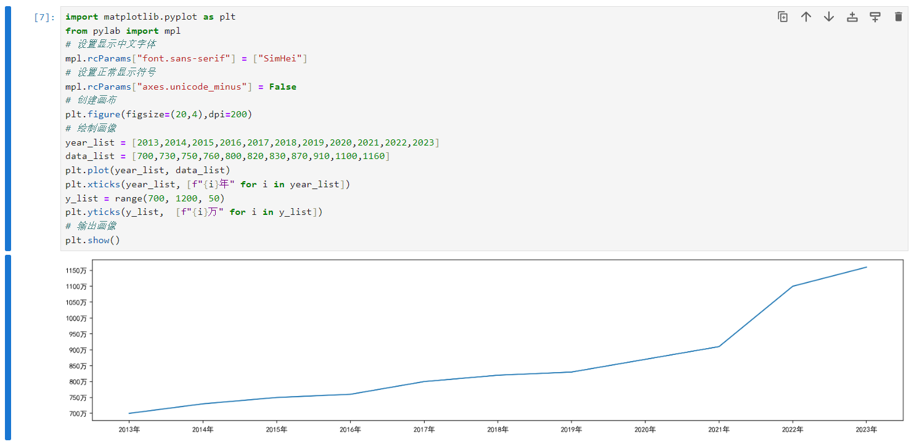

# Matplotlib

官网：https://matplotlib.org/

官方文档：https://matplotlib.org/stable/users/explain/quick_start.html

matplotlib是专门用于开发2D(3D)图表的包，

安装：

```python
pip install matplotlib -i https://pypi.tuna.tsinghua.edu.cn/simple
```

绘制图像的基本流程，代码：

```python
import matplotlib.pyplot as plt
# 1. 创建画布
plt.figure(figsize=(20,6),dpi=200)
# 2. 绘制画像
plt.plot([2013,2014,2015,2016,2017,2018,2019,2020,2021,2022,2023], [700,730,750,760,800,820,830,870,910,1100,1160])
# 3. 输出画像
plt.show()
```

效果：


数据来源：[国家统计局](https://data.stats.gov.cn/easyquery.htm)

自定义X轴和Y轴刻度值，代码：

```python
import matplotlib.pyplot as plt
# 创建画布
plt.figure(figsize=(20,6),dpi=200)
# 绘制画像
year_list = [2013,2014,2015,2016,2017,2018,2019,2020,2021,2022,2023]
data_list = [700,730,750,760,800,820,830,870,910,1100,1160]
plt.plot(year_list, data_list)
plt.xticks(year_list, [f"{i}年" for i in year_list])
y_list = range(700, 1200, 50)
plt.yticks(y_list)
# 输出画像
plt.show()
```

效果：


解決绘图过程中涉及到中文或其他语言文件不显示的问题，代码：

```python
import matplotlib.pyplot as plt
from pylab import mpl
# 设置显示中文字体
mpl.rcParams["font.sans-serif"] = ["SimHei"]
# 设置正常显示符号
mpl.rcParams["axes.unicode_minus"] = False
# 创建画布
plt.figure(figsize=(20,4),dpi=200)
# 绘制画像
year_list = [2013,2014,2015,2016,2017,2018,2019,2020,2021,2022,2023]
data_list = [700,730,750,760,800,820,830,870,910,1100,1160]
plt.plot(year_list, data_list)
# X轴刻度
plt.xticks(year_list, [f"{i}年" for i in year_list])
# Y轴刻度
y_list = range(700, 1200, 50)
plt.yticks(y_list,  [f"{i}万" for i in y_list])
# 输出画像
plt.show()
```

效果：



显示网格参考线，代码：

```python
import matplotlib.pyplot as plt
from pylab import mpl
# 设置显示中文字体
mpl.rcParams["font.sans-serif"] = ["SimHei"]
# 设置正常显示符号
mpl.rcParams["axes.unicode_minus"] = False
# 创建画布
plt.figure(figsize=(20,4),dpi=200)
# 绘制画像
year_list = [2013,2014,2015,2016,2017,2018,2019,2020,2021,2022,2023]
data_list = [700,730,750,760,800,820,830,870,910,1100,1160]
plt.plot(year_list, data_list)
# X轴刻度
plt.xticks(year_list, [f"{i}年" for i in year_list])
# Y轴刻度
y_list = range(700, 1200, 50)
plt.yticks(y_list,  [f"{i}万" for i in y_list])
# 网格参考线
plt.grid(True, linestyle="--", alpha=0.3)
# 输出画像
plt.show()
```

效果：


添加图标标题和XY轴描述，代码：

```python
import matplotlib.pyplot as plt
from pylab import mpl
# 设置显示中文字体
mpl.rcParams["font.sans-serif"] = ["SimHei"]
# 设置正常显示符号
mpl.rcParams["axes.unicode_minus"] = False
# 创建画布
plt.figure(figsize=(20,4),dpi=200)
# 标题
plt.title("2014-2023年国内毕业生人数增长图表", fontsize=24)
# X轴描述
plt.xlabel("年份")
# Y轴描述
plt.ylabel("人数")
# 绘制画像
year_list = [2013,2014,2015,2016,2017,2018,2019,2020,2021,2022,2023]
data_list = [700,730,750,760,800,820,830,870,910,1100,1160]
plt.plot(year_list, data_list)
# X轴刻度
plt.xticks(year_list, [f"{i}年" for i in year_list])
# Y轴刻度
y_list = range(700, 1200, 50)
plt.yticks(y_list,  [f"{i}万" for i in y_list])
# 网格参考线
plt.grid(True, linestyle="--", alpha=0.3)
# 输出画像
plt.show()
```

效果：


保存图片，代码：

```python
import matplotlib.pyplot as plt
from pylab import mpl
# 设置显示中文字体
mpl.rcParams["font.sans-serif"] = ["SimHei"]
# 设置正常显示符号
mpl.rcParams["axes.unicode_minus"] = False
# 创建画布
plt.figure(figsize=(20,4),dpi=200)
# 标题
plt.title("2014-2023年国内毕业生人数增长图表", fontsize=24)
# X轴描述
plt.xlabel("年份")
# Y轴描述
plt.ylabel("人数")
# 绘制画像
year_list = [2013,2014,2015,2016,2017,2018,2019,2020,2021,2022,2023]
data_list = [700,730,750,760,800,820,830,870,910,1100,1160]
plt.plot(year_list, data_list)
# X轴刻度
plt.xticks(year_list, [f"{i}年" for i in year_list])
# Y轴刻度
y_list = range(700, 1200, 50)
plt.yticks(y_list,  [f"{i}万" for i in y_list])
# 网格参考线
plt.grid(True, linestyle="--", alpha=0.3)

# 图像保存，savefig必须在show方法之前执行，否则show()会释放figure资源，导致savefig保存的是空图片。
plt.savefig("./2014-2023年国内毕业生人数增长图表.png")
# 输出画像
plt.show()
```

在当前文档的目录下直接可以找到上面代码执行以后，保存的图表图片。


一图多线，代码：

```python
import matplotlib.pyplot as plt
from pylab import mpl
# 设置显示中文字体
mpl.rcParams["font.sans-serif"] = ["SimHei"]
# 设置正常显示符号
mpl.rcParams["axes.unicode_minus"] = False
# 创建画布
plt.figure(figsize=(20,4),dpi=200)
# 标题
plt.title("2014-2023年国内大学毕业生人数和IT从业人数增长图表", fontsize=24)
# X轴描述
plt.xlabel("年份")
# Y轴描述
plt.ylabel("人数")
# 绘制画像
year_list = [2013,2014,2015,2016,2017,2018,2019,2020,2021,2022,2023]
student_list = [700,730,750,760,800,820,830,870,910,1100,1160]
plt.plot(year_list, student_list)
# 再次绘制图像
it_list = [280,300,310,330,370,400,430,460,490,500,520]
plt.plot(year_list, it_list, color='y')
# X轴刻度
plt.xticks(year_list, [f"{i}年" for i in year_list])
# Y轴刻度
y_list = range(700, 1200, 50)
plt.yticks(y_list,  [f"{i}万" for i in y_list])
# 网格参考线
plt.grid(True, linestyle="--", alpha=0.3)

# 图像保存
plt.savefig("./2014-2023年国内大学毕业生人数和IT从业人数增长图表.png")
# 输出画像
plt.show()
```

效果：


| color(颜色字符) | linestyle(风格字符) |
| :-------------: | :-----------------: |
|     r 红色      |       - 实线        |
|     g 绿色      |      - - 虚线       |
|     b 蓝色      |      -. 点划线      |
|     w 白色      |      : 点虚线       |
|     c 青色      |   ' ' 留空、空格    |
|     m 洋红      |                     |
|     y 黄色      |                     |
|     k 黑色      |                     |

显示图例，代码：

```python
import matplotlib.pyplot as plt
from pylab import mpl
# 设置显示中文字体
mpl.rcParams["font.sans-serif"] = ["SimHei"]
# 设置正常显示符号
mpl.rcParams["axes.unicode_minus"] = False
# 创建画布
plt.figure(figsize=(20,4),dpi=200)
# 标题
plt.title("2014-2023年国内大学毕业生人数和IT从业人数增长图表", fontsize=24)
# X轴描述
plt.xlabel("年份")
# Y轴描述
plt.ylabel("人数")
# 绘制画像
year_list = [2013,2014,2015,2016,2017,2018,2019,2020,2021,2022,2023]
student_list = [700,730,750,760,800,820,830,870,910,1100,1160]
plt.plot(year_list, student_list,label='国内大学毕业生人数')
# 再次绘制图像
it_list = [277,298,314,330,368,399,435,461,491,502,520]
plt.plot(year_list, it_list, linestyle="--",color='r',label='IT从业人数')
# X轴刻度
plt.xticks(year_list, [f"{i}年" for i in year_list])
# Y轴刻度
y_list = range(700, 1200, 50)
plt.yticks(y_list,  [f"{i}万" for i in y_list])
# 网格参考线
plt.grid(True, linestyle="--", alpha=0.3)
# 显示图例
plt.legend(loc="best")
# 图像保存
plt.savefig("./2014-2023年国内大学毕业生人数和IT从业人数增长图表.png")
# 输出画像
plt.show()
```

效果：


| Location String（位置字符串） | Location Code(位置标记数) |
| ----------------------------- | ------------------------- |
| 'best'                        | 0                         |
| 'upper right'                 | 1                         |
| 'upper left'                  | 2                         |
| 'lower left'                  | 3                         |
| 'lower right'                 | 4                         |
| 'right'                       | 5                         |
| 'center left'                 | 6                         |
| 'center right'                | 7                         |
| 'lower center'                | 8                         |
| 'upper center'                | 9                         |
| 'center'                      | 10                        |

一图多坐标，代码：

```python
import matplotlib.pyplot as plt
from pylab import mpl
# 设置显示中文字体
mpl.rcParams["font.sans-serif"] = ["SimHei"]
# 设置正常显示符号
mpl.rcParams["axes.unicode_minus"] = False
# 创建画布
# plt.figure(figsize=(20,4),dpi=200)
fig, axes = plt.subplots(nrows=1, ncols=2, figsize=(20,4),dpi=200)
# 标题
axes[0].set_title("2014-2023年国内大学毕业生人数增长图表", fontsize=24)
# X轴描述
axes[0].set_xlabel("年份")
# Y轴描述
axes[0].set_ylabel("人数")
# 标题
axes[1].set_title("2014-2023年国内IT从业人数增长图表", fontsize=24)
# X轴描述
axes[1].set_xlabel("年份")
# Y轴描述
axes[1].set_ylabel("人数")

# 绘制画像
year_list = [2013,2014,2015,2016,2017,2018,2019,2020,2021,2022,2023]
student_list = [700,730,750,760,800,820,830,870,910,1100,1160]
axes[0].plot(year_list, student_list,label='国内大学毕业生人数')

# 再次绘制图像
it_list = [277,298,314,330,368,399,435,461,491,502,520]
axes[1].plot(year_list, it_list, linestyle="--",color='r',label='IT从业人数')

# 显示图例
axes[0].legend(loc="best")
axes[1].legend(loc="best")

# X轴刻度
# plt.xticks(year_list, [f"{i}年" for i in year_list])
axes[0].set_xticks(year_list)
axes[0].set_xticklabels([f"{i}年" for i in year_list])
axes[1].set_xticks(year_list)
axes[1].set_xticklabels([f"{i}年" for i in year_list])

# Y轴刻度
y_list = range(700, 1200, 50)
# plt.yticks(y_list,  [f"{i}万" for i in y_list])
axes[0].set_yticks(y_list)
axes[0].set_yticklabels([f"{i}万" for i in y_list])
y_list = range(250, 550, 50)
axes[1].set_yticks(y_list)
axes[1].set_yticklabels([f"{i}万" for i in y_list])

# 网格参考线
# plt.grid(True, linestyle="--", alpha=0.3)
axes[0].grid(True, linestyle="--", alpha=0.3)
axes[1].grid(True, linestyle="--", alpha=0.3)
# 图像保存
plt.savefig("./2014-2023年国内大学毕业生人数和IT从业人数增长图表.png")
# 输出画像
plt.show()
```

效果：


## 折线图的应用场景

- 呈现公司产品(不同区域)每天活跃用户数
- 呈现app每天下载数量
- 呈现产品新功能上线后,用户点击次数随时间的变化
- 画各种数学函数图像

```python
import numpy as np
# 0.准备数据
x = np.linspace(-10, 10, 1000)
y = np.sin(x)

# 1.创建画布
plt.figure(figsize=(20, 8), dpi=100)

# 2.绘制函数图像
plt.plot(x, y)
# 2.1 添加网格显示
plt.grid()

# 3.显示图像
plt.show()
```

## 散点图绘制

**散点图：**用两组数据构成多个坐标点，考察坐标点的分布,判断两变量之间是否存在某种关联或总结坐标点的分布模式。

需求：探究房屋面积和房屋价格的关系

```python
# 0.准备数据
x = [225.98, 247.07, 253.14, 457.85, 241.58, 301.01,  20.67, 288.64,
       163.56, 120.06, 207.83, 342.75, 147.9 ,  53.06, 224.72,  29.51,
        21.61, 483.21, 245.25, 399.25, 343.35]
y = [196.63, 203.88, 210.75, 372.74, 202.41, 247.61,  24.9 , 239.34,
       140.32, 104.15, 176.84, 288.23, 128.79,  49.64, 191.74,  33.1 ,
        30.74, 400.02, 205.35, 330.64, 283.45]

# 1.创建画布
plt.figure(figsize=(20, 8), dpi=100)

# 2.绘制散点图
plt.scatter(x, y)

# 3.显示图像
plt.show()
```

## 柱状图绘制

**需求-对比每部电影的票房收入**

```python
# 0.准备数据
# 电影名字
movie_name = ['雷神3：诸神黄昏','正义联盟','东方快车谋杀案','寻梦环游记','全球风暴','降魔传','追捕','七十七天','密战','狂兽','其它']
# 横坐标
x = range(len(movie_name))
# 票房数据
y = [73853,57767,22354,15969,14839,8725,8716,8318,7916,6764,52222]

# 1.创建画布
plt.figure(figsize=(20, 8), dpi=100)

# 2.绘制柱状图
plt.bar(x, y, width=0.5, color=['b','r','g','y','c','m','y','k','c','g','b'])

# 2.1b修改x轴的刻度显示
plt.xticks(x, movie_name)

# 2.2 添加网格显示
plt.grid(linestyle="--", alpha=0.5)

# 2.3 添加标题
plt.title("电影票房收入对比")

# 3.显示图像
plt.show()
```


## 饼图绘制

```python
import matplotlib.pyplot as plt
from pylab import mpl
# 设置显示中文字体
mpl.rcParams["font.sans-serif"] = ["SimHei"]
# 设置正常显示符号
mpl.rcParams["axes.unicode_minus"] = False
# 创建画布
plt.figure(figsize=(20,4),dpi=200)
# 标题
plt.title("公司内部服务器种类占比图", fontsize=14)
# 绘制图形
data = {"数据库服务器": 20, "测试服务器": 12, "闲置服务器": 11, "web服务器": 17, "缓存服务器": 18}
plt.pie(
    [value for key,value in data.items()],
    labels=[f"{key}:{value}台" for key,value in data.items()], # 设置饼图标签
    autopct="%.2f%%", # 显示百分比
    colors=["#52df22", "#a24b4b", "#f2aa01", "#a8d419", "#a5b4c9"], # 设置饼图颜色
    explode=[0.05,0,0,0,0], # 设置饼图中各个板块之间的距离
)
plt.axis("equal")
# 图像保存
plt.savefig("./公司内部服务器种类占比图.png")
# 输出画像
plt.show()
```

效果：


## 直方图绘制

```python
from matplotlib import pyplot as plt
import random

y = [random.randint(90, 181) for i in range(250)]   #随机生成250个大小在90-180的数字列表
bin_width = 3   #列宽
num_bins = (max(y)-min(y))//bin_width
plt.figure(figsize=(20, 8), dpi=80)   #设置图形大小
plt.xticks(range(min(y), max(y)+bin_width,bin_width))   #x轴范围及步长
plt.grid()   #设置网格
plt.hist(y, num_bins)   #画图
plt.show()
```

效果：

