# 深度学习

## 基本介绍

> 学习目标
>
> - 知道什么是深度学习[知道]
> - 深度学习的应用领域[知道]
> - 深度学习的发展历史[了解]

深度学习（Deep Learning），也称为深度结构学习【Deep Structured Learning】、层次学习【Hierarchical Learning】或者是深度机器学习【Deep Machine Learning】）。


在介绍深度学习之前，我们先看下人工智能，机器学习和深度学习之间的关系：

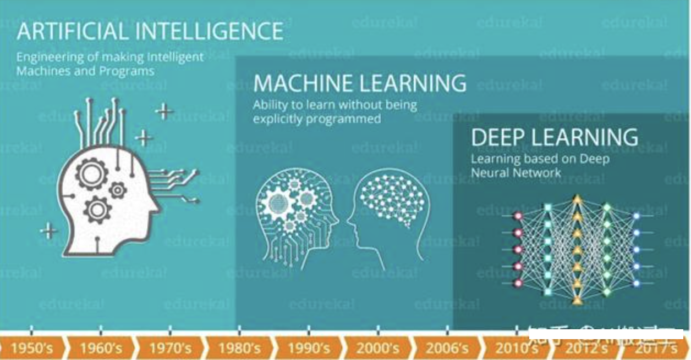

**机器学习是实现人工智能的一种途径（方法），深度学习是机器学习的一个算法子集(分支)，通过模拟人脑实现相应的功能。**

它与机器学习算法的主要区别如下图所示：

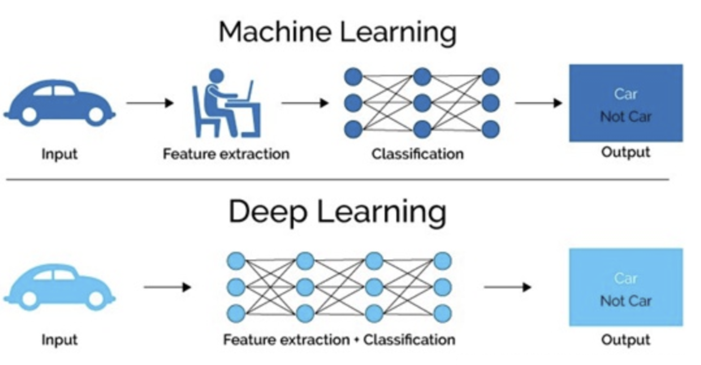

传统机器学习**依赖人工**设计特征，并进行**特征提取**，而深度学习方法是依赖算法自动提取特征，不需要人工设计特征。深度学习模仿人类大脑的运行方式，从经验中学习获取知识。这也是深度学习被看做**黑盒子**，**可解释性差**的原因。

古代方士-> 炼丹


### 应用领域

随着计算机软硬件的飞速发展，现阶段通过深度学习来模拟人脑来解释数据，包括图像，文本，音频等内容。目前深度学习的主要应用领域有：


#### 智能手机


#### 语音识别

比如苹果的智能语音助手siri，华为手机的小艺，百度的小度等等。


#### 机器翻译

谷歌将深度学习方法嵌入到谷歌翻译中，能够支持100多种语言的即时翻译。


#### 拍照翻译


#### 自动驾驶


当然在其他领域也能见到深度学习的身影，比如**银行风控，网络安防，智能零售，智能家居，智慧医疗，智能推荐**等等。

情绪分析（根据用户的各种操作，观察用户的购买欲望。。。。 目的，是深度挖掘潜在客户，提供更优质的服务）

智慧问答（基于知识图谱，在线医生、在线律师、在线健康管家、在线秘书）

AIGC（生成类AI，chatgpt）


### 发展历史

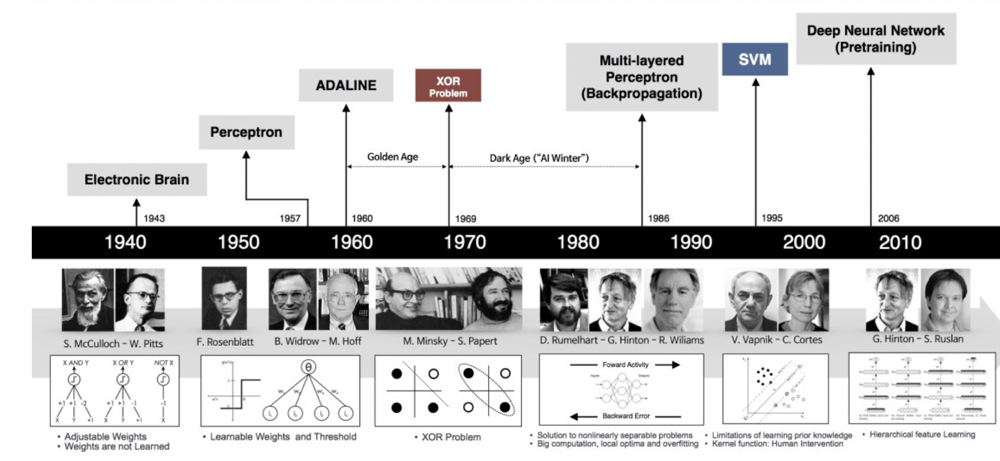

深度学习其实并不是新的事物，深度学习所需要的神经网络技术起源于20世纪50年代，叫做感知机。当时也通常使用单层感知机，尽管结构简单，但是能够解决复杂的问题。后来感知机被证明存在严重的问题，因为只能学习线性可分函数，连简单的异或(XOR)等线性不可分问题都无能为力，1969年马文·明斯基(Marvin Minsky)写了一本叫做《Perceptrons》的书，他提出了著名的两个观点

1. 单层感知机没用，我们需要多层感知机来解决复杂问题 
2. 没有有效的训练算法。


20世纪80年代末期，用于人工神经网络的反向传播算法（也叫Back Propagation算法或者BP算法）的发明，给机器学习带来了希望，掀起了基于统计模型的机器学习热潮。人们发现，利用BP算法可以让一个人工神经网络模型从大量训练样本中学习统计规律，从而对未知事件做预测。这种基于统计的机器学习方法比起过去基于人工规则的系统，在很多方面显出优越性。这个时候的人工神经网络，虽也被称作多层感知机（Multi-layer Perceptron），但实际是种只含有一层隐层节点的浅层模型。

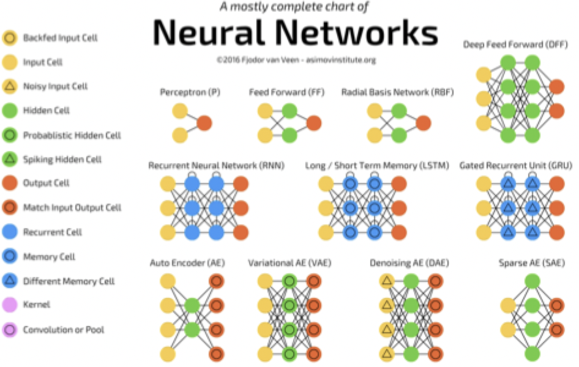

20世纪90年代，各种各样的浅层机器学习模型相继被提出，例如支撑向量机（SVM，Support Vector Machines）、 Boosting、最大熵方法（如LR，Logistic Regression）等。这些模型的结构基本上可以看成带有一层隐层节点（如SVM、Boosting），或没有隐层节点（如LR）。这些模型无论是在理论分析还是应用中都获得了巨大的成功。相比之下，由于理论分析的难度大，训练方法又需要很多经验和技巧，这个时期浅层人工神经网络反而相对沉寂。

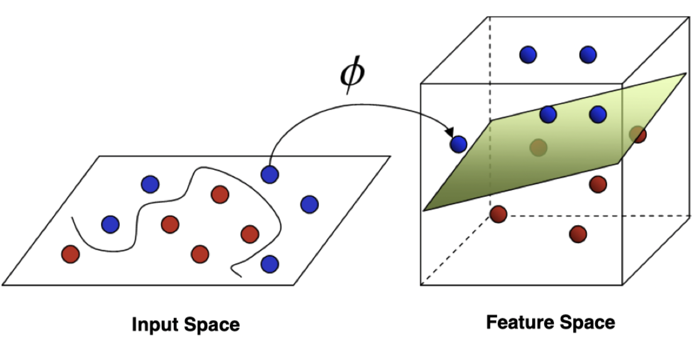

2006年，杰弗里·辛顿（Geoffrey Hinton）以及他的学生鲁斯兰·萨拉赫丁诺夫(Ruslan·Salakhutdinov)正式提出了深度学习的概念。他们在世界顶级学术期刊《科学》发表的一篇文章中详细的给出了“梯度消失”问题的解决方案——通过无监督的学习方法逐层训练算法，再使用有监督的反向传播算法进行调优。该深度学习方法的提出，立即在学术圈引起了巨大的反响，以斯坦福大学、多伦多大学为代表的众多世界知名高校纷纷投入巨大的人力、财力进行深度学习领域的相关研究。而后又迅速蔓延到工业界中。


2012年，在著名的ImageNet图像识别大赛中，杰弗里·辛顿领导的小组采用深度学习模型AlexNet一举夺冠。AlexNet采用ReLU激活函数，从根本上解决了梯度消失问题，并采用GPU极大的提高了模型的运算速度。同年，由斯坦福大学著名的吴恩达教授和世界顶尖计算机专家杰夫·迪恩(JeffDean)共同主导的深度神经网络——DNN技术在图像识别领域取得了惊人的成绩，在ImageNet评测中成功的把错误率从26％降低到了15％。深度学习算法在世界大赛的脱颖而出，也再一次吸引了学术界和工业界对于深度学习领域的关注。


2016年，随着谷歌公司基于深度学习开发的AlphaGo以4:1的比分战胜了国际顶尖围棋高手李世石，深度学习的热度一时无两。后来，AlphaGo又接连和众多世界级围棋高手过招，均取得了完胜。这也证明了在围棋界，基于深度学习技术的机器人已经超越了人类。


2017年，基于强化学习算法的AlphaGo升级版AlphaGo Zero横空出世。其采用“从零开始”、“无师自通”的学习模式，以100:0的比分轻而易举打败了之前的AlphaGo。除了围棋，它还精通国际象棋等其它棋类游戏，可以说是真正的棋类“天才”。此外在这一年，深度学习的相关算法在医疗、金融、艺术、无人驾驶等多个领域均取得了显著的成果。所以，也有专家把2017年看作是深度学习甚至是人工智能发展最为突飞猛进的一年。


2019年，基于Transformer 的自然语言模型的持续增长和扩散，这是一种语言建模神经网络模型，可以在几乎所有任务上提高NLP的质量。Google甚至将其用作相关性的主要信号之一，这是多年来最重要的更新。


2020年，深度学习扩展到更多的应用场景，比如积水识别，路面塌陷等，而且疫情期间，在智能外呼系统，人群测温系统，口罩人脸识别等都有深度学习的应用。


## TensorFlow

> **学习目标**
>
> - Tensorflow2.0框架的用途及流程[了解]
> - tf2.0的张量及其操作[知道]
> - tf.keras中的相关模块及常用方法[知道]

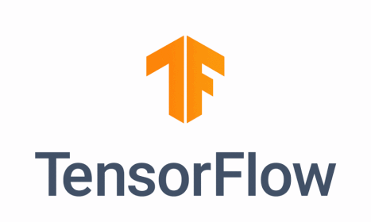


### 基本介绍

目前最主流的深度框架有 TensorFlow、Pytorch 以及 Keras。

框架：封装好的一个半成品，这个半成品距离成型的项目还有一段距离，但是框架的里面帮我们开发者封装好了一系列的工具模型，以API（属性、方法）的方式提供给开发者使用了。

深度学习框架TensorFlow一经发布，就受到了广泛的关注，并在计算机视觉、音频处理、推荐系统和自然语言处理等场景下都被大面积推广使用，现在已发布2.15.0版本，接下来先了解下Tensorflow的相关应用。

学习建议使用最新版本，开发/工作中不能使用使用版本，建议滞后2-4个版本。

官方网站：https://www.tensorflow.org/?hl=zh-cn

GitHub仓库：https://github.com/tensorflow/tensorflow

中文站点：https://tensorflow.google.cn/install?hl=zh-cn

> 版本号：
>
> 版本格式： 大版本号.小版本号.修订号
>
> 大版本号：一般不改动，除非内核（内部核心的类库代码）发生了重大改变。
>
> 小版本号：代码功能的增减，都会调整版本。
>
> 修订号：功能没有变动，出现bug了修复以后会增加修订号，所以修订号也叫bug版本号。

TensorFlow的依赖视图如下所示：

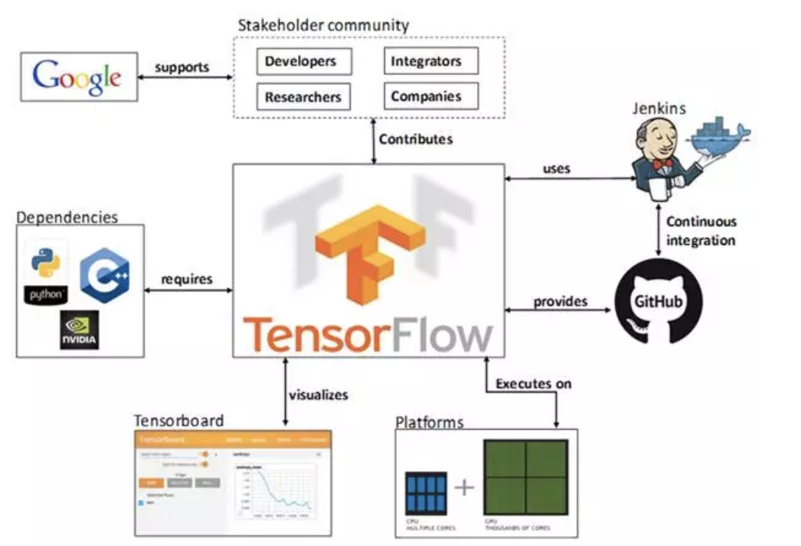

+ TF托管在github平台，有google groups和contributors共同维护。
+ TF提供了丰富的深度学习相关的API，支持Python和C/C++接口。
+ TF提供了可视化分析工具Tensorboard，方便分析和调整模型。
+ TF支持Linux平台，Windows平台，Mac平台，甚至手机移动设备等各种平台。


### 工作流程

TensorFlow专注于简单性和易用性，工作流程如下所示：

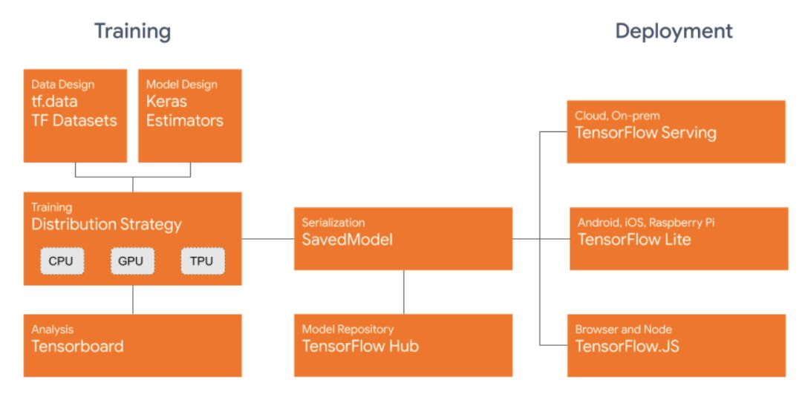


1. **使用tf.data加载数据**。使用tf.data实例化读取训练数据和测试数据。
2. **模型的建立与调试**。使用动态图模式 Eager Execution 和著名的神经网络高层API框架Keras，结合可视化工具 TensorBoard来观察整个训练过程中损失函数和准确率的变化过程，从而简易、快速地建立和调试模型。
3. **模型的训练**。支持 CPU（中央处理器） / 单GPU（图形处理器） / 单机多卡 GPU / 多机集群 / TPU（张量处理器） 训练模型，充分利用海量数据和计算资源进行高效训练。
4. **预训练模型调用**。通过TensorFlow Hub，可以方便地调用预训练完毕的已有成熟模型。
5. **模型的部署**。 通过 TensorFlow Serving、TensorFlow Lite、TensorFlow.js 等组件，可以将TensorFlow 模型部署到服务器、移动端、嵌入式端等多种使用场景。


### 框架安装

文档：https://tensorflow.google.cn/install/pip?hl=zh-cn

官方在以下 64 位系统上测试过 TensorFlow 并且这些系统支持 TensorFlow：

- Python 3.6+
- Ubuntu 16.04 或更高版本
- Windows 7 或更高版本（含 [C++ 可再发行软件包](https://support.microsoft.com/help/2977003/the-latest-supported-visual-c-downloads)）
- macOS 10.12.6 (Sierra) 或更高版本（不支持 GPU）

建议使用anaconda来创建虚拟环境去安装，安装命令如下：

```bash
pip install tensorflow -i https://pypi.tuna.tsinghua.edu.cn/simple
# 如果上面安装不成功，使用下面命令安装，如果你已经安装了anaconda的话。
# conda install  tensorflow
```

下面是操作记录，注意：路径可以是任意的目录下，但是尽量在开发时不要使用特殊符号或者中文的目录名。

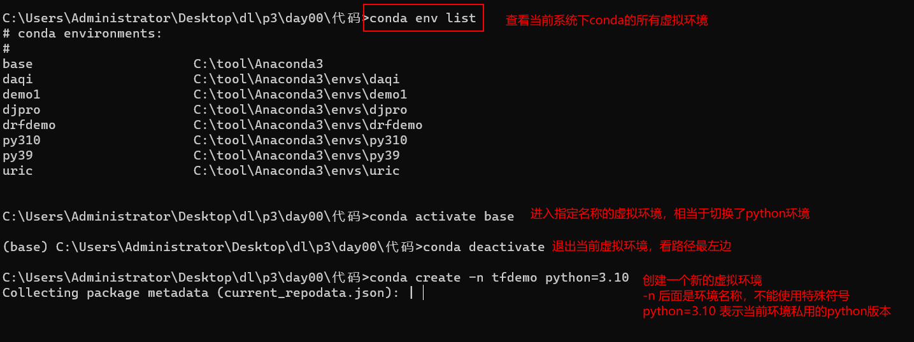

上面的命令创建虚拟环境成功以后，直接安装tensorflow即可。

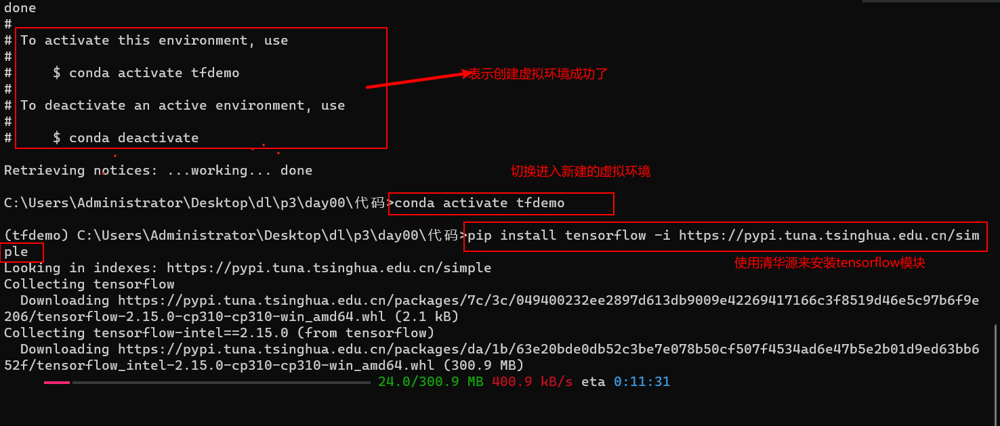

> Windows下切换终端下的操作目录：
>
> cd  表示 change diretory 的缩写，  切换工作目录的意思，
>
> D:   表示切换到D盘
>
> C:    表示切换到C盘，其他盘符名称以此类推。

接下来，如果大家使用了新的虚拟环境，那么安装的jupyter notebook ，就不会新的虚拟环境下。所以需要重新安装一遍即可。

终端下安装下以下几个模块即可。

```bash
conda activate tfdemo
pip install jupyter -i https://pypi.tuna.tsinghua.edu.cn/simple
pip install numpy -i https://pypi.tuna.tsinghua.edu.cn/simple
pip install pandas -i https://pypi.tuna.tsinghua.edu.cn/simple
```


### 张量及其操作

#### 张量Tensor

张量是一个多维数组。 与NumPy ndarray对象类似，tf.Tensor对象也具有数据类型(dtype)和形状(shape)，并且tf.Tensors可以保留在GPU中，Numpy中的ndarray是不能使用在GPU中的。


如下图所示：

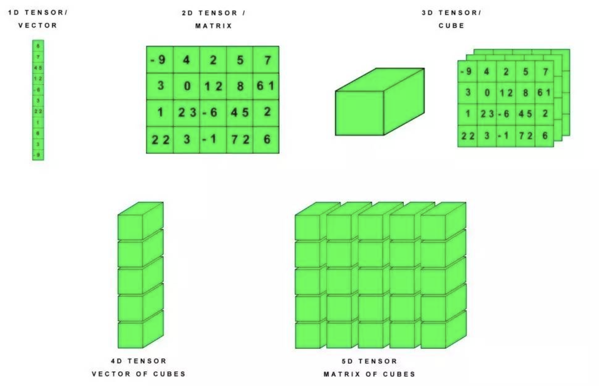


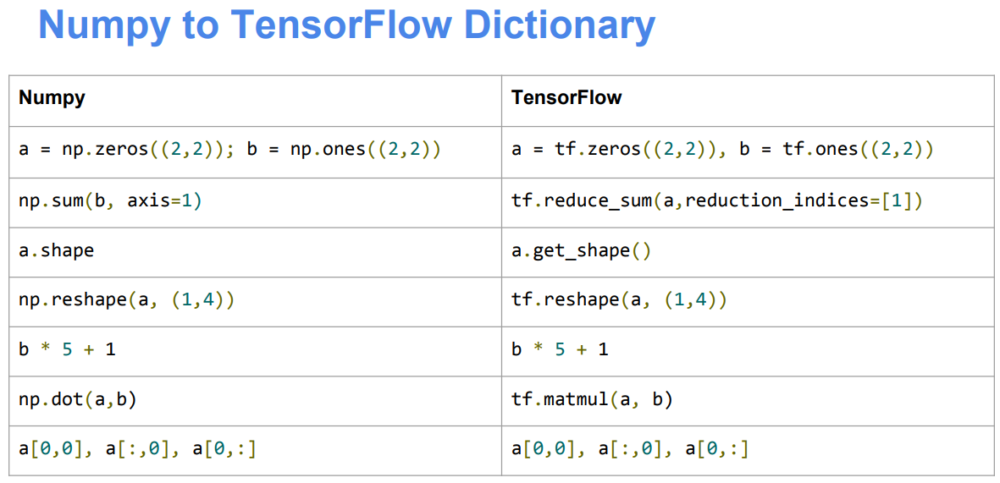


##### 基本方法

TensorFlow提供了丰富的操作库（tf.add，tf.matmul，tf.linalg.inv等），它们使用和生成tf.Tensor。在进行张量操作之前先导入相应的工具包。

```python
import tensorflow as tf
import numpy as np
```

接着，让我们创建基础的张量：

```python
# 创建int32类型的0维张量，即标量
rank_0_tensor = tf.constant(4)
print(rank_0_tensor)  # tf.Tensor(4, shape=(), dtype=int32)
# 创建float32类型的1维张量
rank_1_tensor = tf.constant([2.0, 3.0, 4.0])
print(rank_1_tensor)  # tf.Tensor([2. 3. 4.], shape=(3,), dtype=float32)
# 创建float16类型的二维张量
rank_2_tensor = tf.constant([[1, 2], [3, 4], [5, 6]], dtype=tf.float16)
print(rank_2_tensor)
"""
tf.Tensor(
[[1 2]
 [3 4]
 [5 6]], shape=(3, 2), dtype=int32)
"""
```

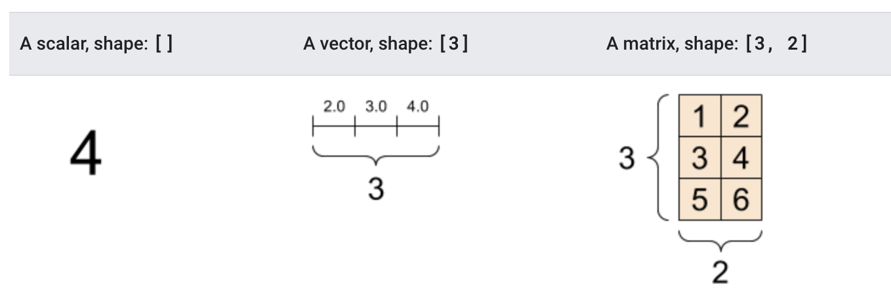

当然，与numpy一样，TensorFlow也可以创建更高维的张量：

```python
# 创建3维int32类型的张量
rank_3_tensor = tf.constant([
    [
        [0, 1, 2, 3, 4],
        [5, 6, 7, 8, 9]
    ],
    [
        [10, 11, 12, 13, 14],
        [15, 16, 17, 18, 19]
    ],
    [
        [20, 21, 22, 23, 24],
        [25, 26, 27, 28, 29]
    ],
])

print(rank_3_tensor)
"""
tf.Tensor(
[[[ 0  1  2  3  4]
  [ 5  6  7  8  9]]

 [[10 11 12 13 14]
  [15 16 17 18 19]]

 [[20 21 22 23 24]
  [25 26 27 28 29]]], shape=(3, 2, 5), dtype=int32)
"""
```

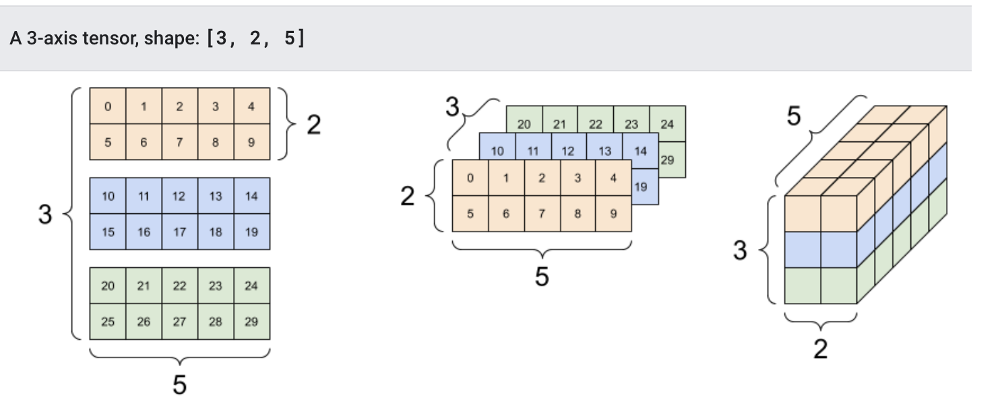


##### 转换成numpy

我们可将张量转换为numpy中的ndarray的形式，转换方法有两种，以张量rank_2_tensor为例：

###### np.array

```python
np.array(rank_2_tensor)  # rank_2_tensor 就是之前声明的张量
```

###### tensor.numpy()

```python
rank_2_tensor.numpy()
```


##### 常用函数

我们可以对张量做一些基本的数学运算，包括add（加法）、multiply（元素乘法）和matmul（矩阵乘法）等：

```python
# 定义张量a和b
a = tf.constant([
    [1, 2],
    [3, 4]
])
b = tf.constant([
    [1, 2],
    [3, 4]
])

print(tf.add(a, b), "\n")  # 计算张量的和
print(tf.multiply(a, b), "\n")  # 计算张量的元素乘法
print(tf.matmul(a, b), "\n")  # 计算张量的矩阵乘法

"""
tf.Tensor(
[[2 4]
 [6 8]], shape=(2, 2), dtype=int32) 

tf.Tensor(
[[ 1  4]
 [ 9 16]], shape=(2, 2), dtype=int32) 

tf.Tensor(
[[ 7 10]
 [15 22]], shape=(2, 2), dtype=int32) 
"""
```

另外，张量也可用于各种聚合运算：

| 聚合函数         | 描述               |
| ---------------- | ------------------ |
| tf.reduce_sum()  | 求和               |
| tf.reduce_mean() | 平均值             |
| tf.reduce_max()  | 最大值             |
| tf.reduce_min()  | 最小值             |
| tf.argmax()      | 最大值的索引(下标) |
| tf.argmin()      | 最小值的索引(下标) |

```python
c = tf.constant([[4.0, 5.0], [10.0, 1.0]])
# 最大值
print(tf.reduce_max(c))
# 最大值索引
print(tf.argmax(c))
# 计算均值
print(tf.reduce_mean(c))

"""
tf.Tensor(10.0, shape=(), dtype=float32)
tf.Tensor([1 0], shape=(2,), dtype=int64)
tf.Tensor(5.0, shape=(), dtype=float32)
"""

# 三维的张量的最大值：比较方式，从外到内，同列比较。
d = tf.constant([
    [
        [45,32,200], [30,100, 11]
    ],
    [
        [32,12, 5],  [22,10, 12]
    ],
])
# ret = tf.reduce_max(d)
# print(ret)
ret = tf.argmax(d)  # 0 0 2
print(ret)
```

三维获取最小值下标的获取方式，从外到内，同列找最小。

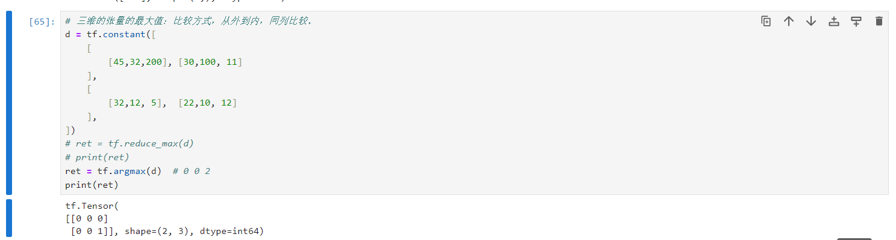


##### 变量

在前面学习过程中，我们的张量对象都是通过tensorflow提供的constant来声明的，这种张量是不能修改值的。开发中constant直译：就是常量，一经声明就不能修改的。


变量是一种特殊的张量，形状是不可变，但可以更改其中的成员。定义的方法是：

```python
my_variable = tf.Variable([[1.0, 2.0], [3.0, 4.0]])
```

我们也可以获取它的形状，类型及转换为ndarray:

```python
variable = tf.Variable([
    [1, 2], 
    [3, 4]
])

print("形状: ", variable.shape)
print("类型: ", variable.dtype)
print("转换: ", variable.numpy())

"""
形状:  (2, 2)
类型:  <dtype: 'int32'>
转换:  [[1 2]
 [3 4]]
"""
```

变量的值可以修改，但是形状不能修改。

```python
variable = variable.assign([[2, 3], [1, 5]])

print("形状: ", variable.shape)
print("类型: ", variable.dtype)
print("转换: ", variable.numpy())

"""
形状:  (2, 2)
类型:  <dtype: 'int32'>
转换:  [[2 3]
 [4 5]]
"""
```

操作代码：

```python
# 修改变量的值，是不能修改形状的
my_variable = tf.Variable([1,2,3])
print(my_variable)
print(id(my_variable)) # id查看变量保存在内存中的地址，原始的内存地址是一个16进制的地址，经过id函数的处理会变成十进制数值

# 使用assign方法修改变量的值
my_variable.assign([3,5,65])
print(my_variable) # 修改后的变量
print(id(my_variable))  # 修改后的变量的内存地址，发现是没有变化的。

# 这种修改，是不会影响到原来的内存地址，也就是说还是保存在原来的同一片内存中。

"""打印效果：
<tf.Variable 'Variable:0' shape=(3,) dtype=int32, numpy=array([1, 2, 3])>
2501464508544
<tf.Variable 'Variable:0' shape=(3,) dtype=int32, numpy=array([ 3,  5, 65])>
2501464508544
"""
```


### tf.keras

keras本身是一个由Python编写的开源人工神经网络库，也是基于TensorFlow编写的一个独立框架。TensorFlow1.9.x版本以后，官方把keras集成到了TensorFlow中。因此在TensorFlow2.0版本以后，新增了一个高阶API接口tf.keras，方便开发者调用keras进行高效的模型构建，为TensorFlow 的代码提供了新的风格和设计模式，大大提升了TensorFlow代码的简洁性和复用性，官方也推荐使用tf.keras来进行模型设计和开发。

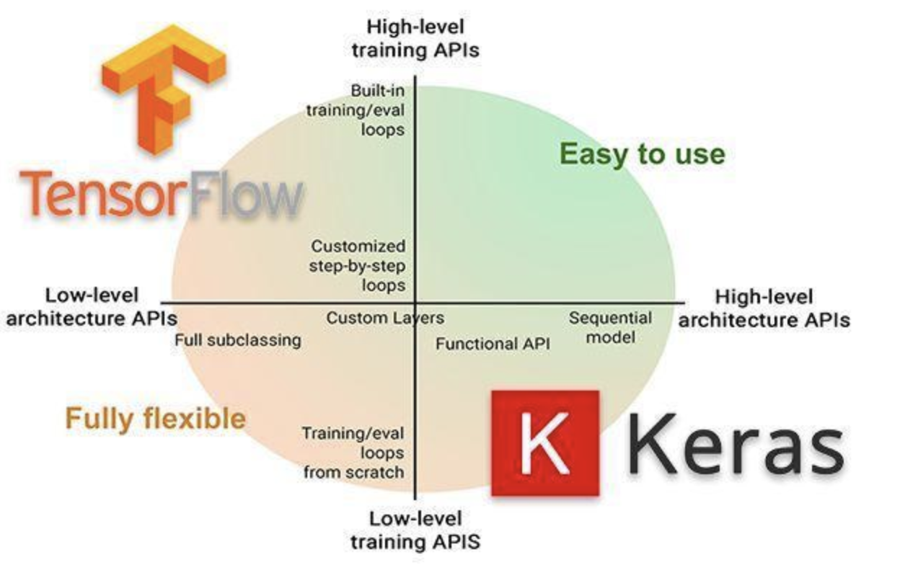


#### 常用模块

tf.keras中常用模块如下表所示：

| 模块              | 概述                                                         |
| ----------------- | ------------------------------------------------------------ |
| **activations**   | 激活函数                                                     |
| applications      | 预训练网络模块                                               |
| **Callbacks**     | 在模型训练期间被调用                                         |
| **datasets**      | tf.keras数据集模块，包括boston_housing，cifar10，fashion_mnist，imdb ，mnist |
| **layers**        | Keras层API，将近10个不同层级的layers让开发者应对不同需求的模型训练 |
| **losses**        | 各种损失函数                                                 |
| **metircs**       | 各种评价指标                                                 |
| **models**        | 模型创建模块，以及与模型相关的API                            |
| **optimizers**    | 优化方法                                                     |
| **preprocessing** | Keras数据的预处理模块                                        |
| **regularizers**  | 正则化，L1,L2等                                              |
| utils             | 辅助功能实现                                                 |


#### 常用方法

深度学习实现的主要流程：1.数据获取，2，数据处理，3.模型创建与训练，4.模型测试与评估，5.模型预测

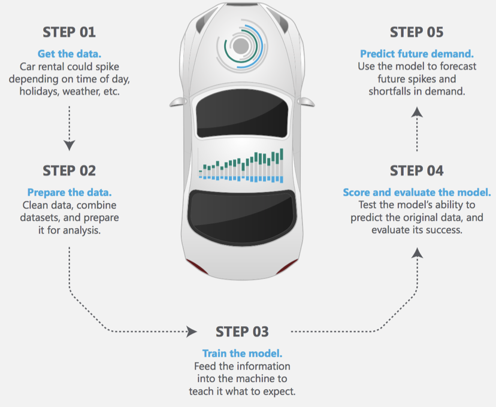


##### 导入tf.keras

使用 `tf.keras`，首先需要在代码开始时导入`tf.keras`

```python
import tensorflow as tf
from tensorflow import keras
```


##### 数据输入

对于小的数据集，可以直接使用numpy格式的数据进行训练、评估模型，对于大型数据集或者要进行跨设备训练时使用tf.data.datasets来进行数据输入。


##### 模型构建

- 简单模型使用Sequential进行构建
- 复杂模型使用函数式编程来构建 
- 自定义layers


##### 训练与评估

- 配置训练过程：

```python
# 配置优化方法，损失函数和评价指标
model.compile(
    optimizer=tf.train.AdamOptimizer(0.001),
    loss='categorical_crossentropy',
    metrics=['accuracy']
)
```

- 模型训练

```python
# 指明训练数据集，训练epoch,批次大小和验证集数据
model.fit/fit_generator(
    dataset, 
    epochs=10,   # 迭代的次数，
    batch_size=3,  # 训练集的批次
    validation_data=val_dataset,
)
```

> 概念：
>
> epochs，表示迭代。
>
> 迭代：在深度学习过程中，我们会把 一次完整的训练过程（前向计算+反向传播【PB算法】）称之为 1个epochs。也就是迭代一次。
>
> 也不会把所有的数据全部用于一次迭代（1个epochs）中，所以会分多批次（batch）来添加训练集

- 模型评估

```python
# 指明评估数据集和批次大小
model.evaluate(x, y, batch_size=32)
```

- 模型预测

```python
# 对新的样本进行预测
model.predict(x, batch_size=32)
```


##### 回调函数（callbacks）

回调函数用在模型训练过程中，来控制模型训练行为，可以自定义回调函数，也可使用tf.keras.callbacks 内置的回调函数：

| 常用的内置回调函数    | 函数的作用和使用场景                 |
| --------------------- | ------------------------------------ |
| ModelCheckpoint       | 定期保存 checkpoints                 |
| LearningRateScheduler | 动态改变学习速率                     |
| EarlyStopping         | 当验证集上的性能不再提高时，终止训练 |
| TensorBoard           | 使用 TensorBoard 监测模型的状态      |


##### 模型的保存和恢复

- 只保存参数

```python
# 只保存模型的权重【保存】
model.save_weights('./my_model')
# 加载模型的权重【恢复】
model.load_weights('my_model')
```

- 保存整个模型

```python
# 保存模型架构与权重在h5文件中【保存】
model.save('my_model.h5')
# 加载模型：包括架构和对应的权重【恢复】
model = keras.models.load_model('my_model.h5')
```


## 快速入门模型

> **学习目标**
>
> - 使用tf.keras的基本流程[知道]
> - tf.keras实现模型构建的方法[了解]
> - tf.keras中模型训练验证的相关方法[了解]

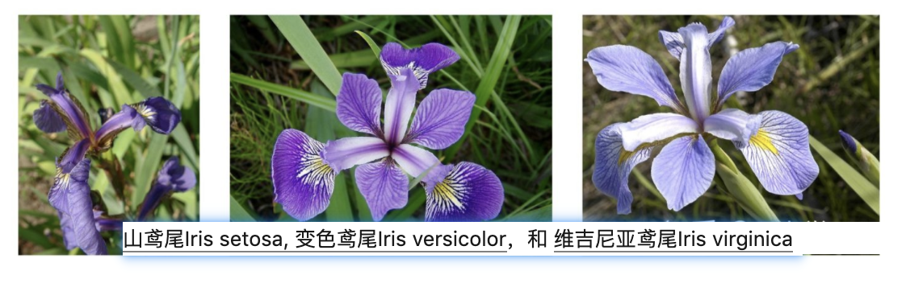

今天我们通过鸢尾花分类案例来学习tf.keras的基本使用流程。tf.keras使用tensorflow中的高级接口，我们调用它即可完成：

1. 导入和解析数据集
2. 构建模型
3. 使用样本数据训练该模型
4. 评估模型的效果

由于与scikit-learn的相似性，接下来我们将通过将Keras与scikit-learn进行比较，介绍tf.Keras的相关使用方法。


### 相关的库的导入

安装scikit-learn，终端命令如下：

```bash
pip install scikit-learn  -i https://pypi.tuna.tsinghua.edu.cn/simple
```

在这里使用sklearn和tf.keras完成鸢尾花分类，导入相关的工具包：

```python
# 绘图
import seaborn as sns
# 数值计算
import numpy as np
# sklearn中的相关工具
# 划分训练集和测试集
from sklearn.model_selection import train_test_split
# 逻辑回归
from sklearn.linear_model import LogisticRegressionCV
# tf.keras中使用的相关工具
# 用于模型搭建
from tensorflow.keras.models import Sequential
# 构建模型的层和激活方法
from tensorflow.keras.layers import Dense, Activation
# 数据处理的辅助工具
from tensorflow.keras import utils
```


### 数据展示和划分

利用seborn导入相关的数据，iris数据以dataFrame的方式在seaborn进行存储，我们读取后并进行展示：

```python
# 读取记载数据集，还是鸢尾花数据集，
iris = sns.load_dataset("iris")
# 展示数据的前五行
iris.head()
```

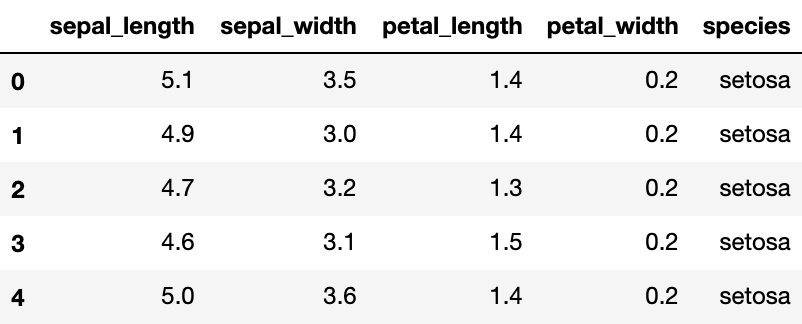

另外，利用seaborn中pairplot函数探索数据特征间的关系：

```python
# 将数据之间的关系进行可视化
sns.pairplot(iris, hue='species')
```

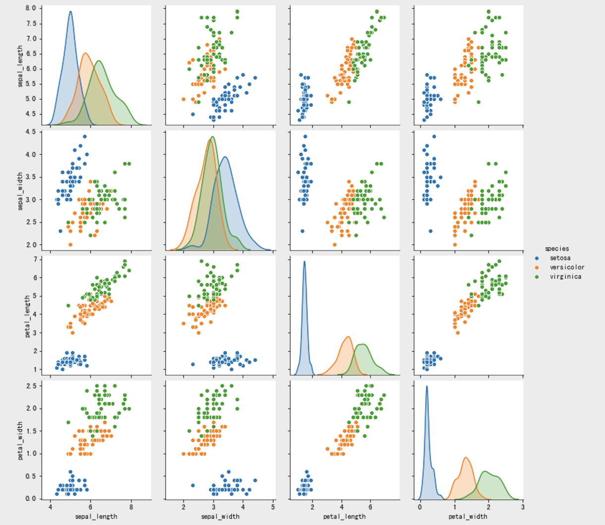

将数据划分为训练集和测试集：从iris dataframe中提取原始数据，将花瓣和萼片数据保存在数组X中，标签保存在相应的数组y中：

```python
# 花瓣和花萼的数据
X = iris.values[:, :4]
# 标签值
y = iris.values[:, 4]
```

利用train_test_split完成数据集划分：

```python
# 将数据集划分为训练集和测试集
train_X, test_X, train_y, test_y = train_test_split(X, y, train_size=0.5, test_size=0.5, random_state=0)
```

接下来，我们就可以使用sklearn和tf.keras来完成预测


### sklearn实现

利用逻辑回归的分类器，并使用交叉验证的方法来选择最优的超参数，实例化LogisticRegressionCV分类器，并使用fit方法进行训练：

```python
# 实例化分类器
lr = LogisticRegressionCV()
# 训练
lr.fit(train_X, train_y)
```

利用训练好的分类器进行预测，并计算准确率：

```python
# 计算准确率并进行打印
print(f"Accuracy = {lr.score(test_X, test_y):.2f}")

# print("Accuracy = {:.2f}".format(lr.score(test_X, test_y)))
```

打印逻辑回归的准确率，打印效果：

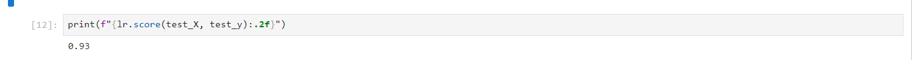


### tf.keras实现

在sklearn (scikit-learn) 中我们只要实例化分类器并利用fit方法进行训练，最后衡量它的性能就可以了，那在tf.keras中与在sklearn非常相似，不同的是：

+ 构建分类器时需要进行模型搭建

+ 数据采集时，sklearn可以接收字符串型的标签，如：“setosa”，但是在tf.keras中需要对标签值进行热编码（hot-code），如下所示：

  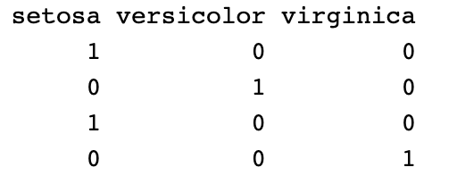

有很多方法可以实现热编码，比如pandas中的get_dummies()，在这里我们使用tf.keras中的方法进行热编码：

```python
# 进行热编码
def one_hot_encode_object_array(arr):
    # 去重获取全部的类别
    uniques, ids = np.unique(arr, return_inverse=True)
    # 返回热编码的结果
    return utils.to_categorical(ids, len(uniques))
```


#### 数据处理

接下来对标签值进行热编码：

```python
# 训练集热编码
train_y_ohe = one_hot_encode_object_array(train_y)
# 测试集热编码
test_y_ohe = one_hot_encode_object_array(test_y)
```


#### 模型搭建

在sklearn中，模型都是现成的。tf.Keras是一个人工神经网络库，我们需要根据数据和标签值构建神经网络。神经网络可以发现特征与标签之间的复杂关系。神经网络是一个高度结构化的图，其中包含一个或多个隐藏层。每个隐藏层都包含一个或多个神经元。神经网络有多种类别，该程序使用的是**密集型神经网络**，也称为**全连接神经网络**：一个层中的神经元将从上一层中的每个神经元获取输入连接。例如，下图显示了一个密集型神经网络，其中包含 1 个输入层、2 个隐藏层以及 1 个输出层，如下图所示：


上图中的模型经过训练并馈送未标记的样本时，它会产生 3 个预测结果：相应鸢尾花属于指定品种的可能性。对于该示例，输出预测结果的总和是 1.0。该预测结果分解如下：山鸢尾为 0.02，变色鸢尾为 0.95，维吉尼亚鸢尾为 0.03。这意味着该模型预测某个无标签鸢尾花样本是变色鸢尾的概率为 95％。

TensorFlow的`tf.keras` API 在创建模型和隐藏层处理是性能非常号的，所以是首选方式。通过该 API，我们可以轻松地构建模型并进行实验，而将所有部分连接在一起的复杂工作则由 Keras 处理。

`tf.keras.Sequential` 模型是层的线性堆叠。该模型的构造函数会采用一系列层实例；在本示例中，采用的是 2 个密集层（分别包含 10 个节点）以及 1 个输出层（包含 3 个代表标签预测的节点）。第一个层的 `input_shape` 参数对应该数据集中的特征数量：

```python
# 利用sequential方式构建模型
model = Sequential([
  # 隐藏层1，激活函数是relu，输入大小有input_shape指定
  Dense(10, activation="relu", input_shape=(4,)),
  # 隐藏层2，激活函数是relu
  Dense(10, activation="relu"),
  # 输出层
  Dense(3,activation="softmax")  # softmax 是激活函数，用于调到神经元，只用于输出层，可以保证概念总和必须是1，
])
```

通过model.summary()可以查看模型的架构：

```python
Model: "sequential_2"
_________________________________________________________________
 Layer (type)                Output Shape              Param #   
=================================================================
 dense_6 (Dense)             (None, 10)                50        
                                                                 
 dense_7 (Dense)             (None, 10)                110       
                                                                 
 dense_8 (Dense)             (None, 3)                 33        
                                                                 
=================================================================
Total params: 193 (772.00 Byte)
Trainable params: 193 (772.00 Byte)
Non-trainable params: 0 (0.00 Byte)
_________________________________________________________________
```

激活函数可决定层中每个节点的输出形状。这些非线性关系很重要，如果没有它们，模型将等同于单个层。激活函数有很多，但隐藏层通常使用 ReLU。

隐藏层和神经元的理想数量取决于问题和数据集。与机器学习的多个方面一样，选择最佳的神经网络形状需要一定的知识水平和实验基础。一般来说，增加隐藏层和神经元的数量通常会产生更强大的模型，而这需要更多数据才能有效地进行训练。


#### 模型训练和预测

在训练和评估阶段，我们都需要计算模型的损失。这样可以衡量模型的预测结果与预期标签有多大偏差，也就是说，模型的效果有多差。我们希望尽可能减小或优化这个值，所以我们设置优化策略和损失函数，以及模型精度的计算方法：

```python
# 设置模型的相关参数：优化器，损失函数和评价指标
model.compile(optimizer='adam', loss='categorical_crossentropy', metrics=["accuracy"])
```

接下来与在sklearn中相同，分别调用fit和predict方法进行预测即可。

```python
# 进行训练之前，把训练集的数据类型转换为正确的张量类型。
train_X = tf.constant(train_X, dtype="float32")

# 模型训练：epochs,训练样本送入到网络中的次数，batch_size:每次训练的送入到网络中的样本个数
model.fit(train_X, train_y_ohe, epochs=10, batch_size=1, verbose=1)
```

上述代码完成的是：

1. 迭代每个epoch。通过一次数据集即为一个epoch。
2. 在一个epoch中，遍历训练 Dataset 中的每个样本，并获取样本的特征 (x) 和标签 (y)。
3. 根据样本的特征进行预测，并比较预测结果和标签。衡量预测结果的不准确性，并使用所得的值计算模型的损失和梯度。
4. 使用 optimizer 更新模型的变量。
5. 对每个epoch重复执行以上步骤，直到模型训练完成。

训练过程展示如下：

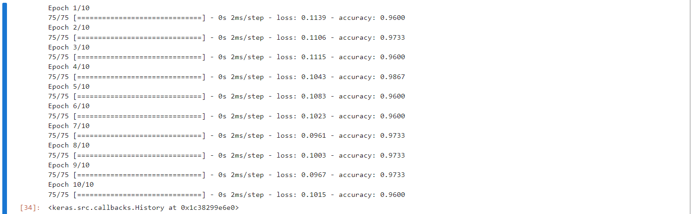

与sklearn中不同，对训练好的模型进行评估时，与sklearn.score方法对应的是tf.keras.evaluate()方法，返回的是损失函数和在compile模型时要求的指标:

```python
# 对测试集进行格式转换
test_X = tf.constant(test_X, dtype="float32")
# 计算模型的损失和准确率
loss, accuracy = model.evaluate(test_X, test_y_ohe, verbose=1)
print("Accuracy = {:.2f}".format(accuracy))
```

分类器的准确率为：

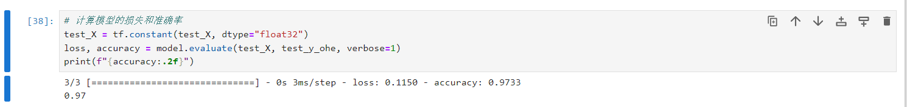


keras的训练流程：

- 数据处理
  - 需要使用 utils.to_categorical 对数据集（训练集和测试集）进行热编码处理 
- 模型搭建
  - Sequential
- 模型训练
  - 设置训练相关参数：model.compile
  - 训练方法 model.fit
- 评估模型
  - model.evaluate


