# 深度神经网络基础

> 学习目标
>
> - 神经网络是什么[知道]
> - 常⻅的激活函数[知道]
> - 参数初始化的常⻅方法[知道]
> - 能够利用tf.keras构建神经网络模型[知道]
> - 神经网络的优缺点[了解]

## 基本概念

### 神经网络

**人工神经网络**（英语：Artificial Neural Network，**ANN**），简称 **神经网络**（Neural Network，NN）或 **类神经网络**，是一种模仿生物神经网络（动物的中枢神经系统，特别是大脑）的结构和功能的**计算模型**。

常用的神经网络，包括：

+ 卷积神经网络**(Convolutional Neural Network，CNN)**
+ 循环神经网络**(Recurrent Neural Network，RNN)**
+ ⽣成对抗网络**(Generative Adversarial Networks，GAN )**
+ 深度强化学习**(Deep Reinforcement Learning，DRL )**

人脑可以看做是一个生物神经网络，由众多的神经元连接而成。每个神经元与其他神经元相连。各个神经元传递复杂的电信号，树突接收到输入信号，然后细胞核对信号进行处理，通过轴突输出信号。

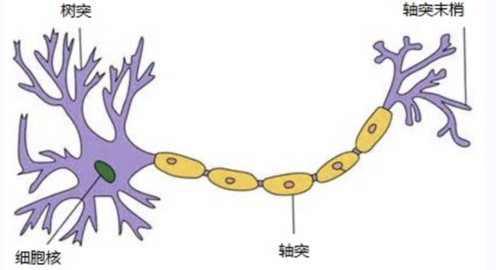


那怎么构建人工神经网络中的神经元呢？


### 神经元

1943 年，心理学家 Warren McCulloch（沃伦·麦卡洛克） 和逻辑学家 Walter Pitts（沃尔特·皮茨） 将上述情形抽象为一个简易数学模型，也就是一直沿用至今的 **M-P 神经元模型**。

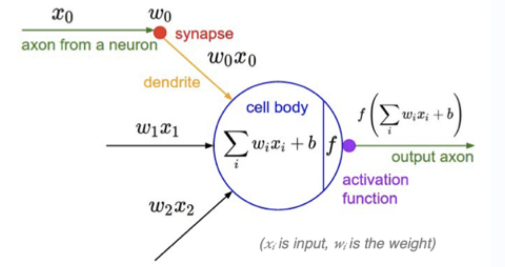

受生物神经元的启发，人工神经元接收来自其他神经元或外部源的输入（x<sub>i</sub>），每个输入都有一个相关的权值（w<sub>i</sub>），它是根据该输入对当前神经元的重要性来确定的，**对该输入加权并与其他输入求和后，经过一个激活函数 f处理后，计算得到该神经元的输出**。

>说明：
>
>+ x<sub>0</sub>,x<sub>1</sub>,x<sub>2</sub>,....x<sub>i</sub>为各项输入数据
>
>+ w<sub>0</sub>,w<sub>1</sub>,w<sub>2</sub>,...w<sub>i</sub>为各项输入数据的权重值
>
>+ b 为偏置（bias）
>
>+ f为**激活函数**，常见的激活函数有Sigmoid、tanh、**ReLU**、Leaky ReLU、**Softmax**等等
>
>  激活函数用于将非线性因素引入神经网络，使其能够学习更复杂的函数。如果没有激活函数，神经网络只能学习其输入数据的线性组合函数。
>
>  激活函数将输入转换为输出。激活函数负责决定神经元是否应该被激活。它通过计算加权和并进一步添加偏差来做出决策。激活函数的基本目的是将非线性引入神经元的输出。

那接下来我们就利用神经元来构建神经网络，相邻层之间的神经元相互连接，并给每⼀个连接分配⼀个强度，如下图所示：

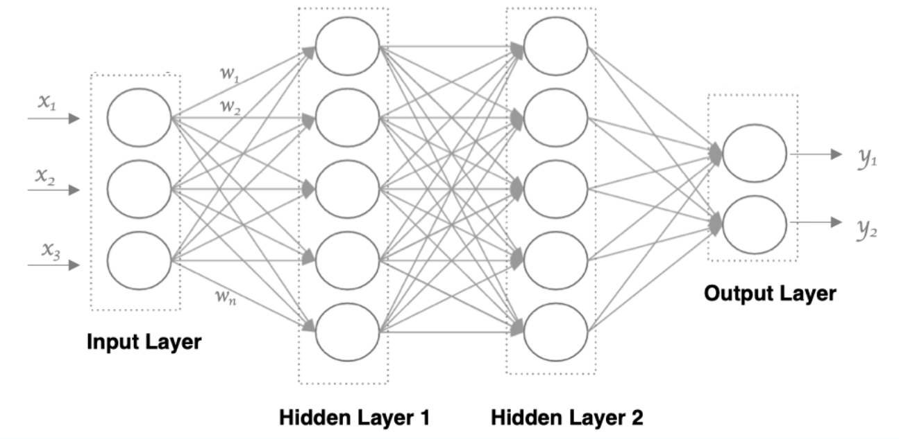


神经网络中信息只向⼀个方向移动，即从输⼊节点向前移动，通过隐藏节点，再向输出节点移动，网络中没有循环或者环。其中的基本构件是：

+ 输⼊层：即输入x的那⼀层
+ 输出层：即输出y的那⼀层
+ 隐藏层：输入层和输出层之间都是隐藏层

特点是：

+ 同⼀层的神经元之间没有连接。
+ 第N层的每个神经元和第N-1层的所有神经元相连(full connected，全连接)，每一层神经元的输出就是下一层神经元的输入。
+ 每个连接都有⼀个权值。

### 神经元的工作原理

神经元的工作原理：**接收到⼀个或多个输入，对他们进行加权并相加，总和通过⼀个非线性的激活函数产生输出**。

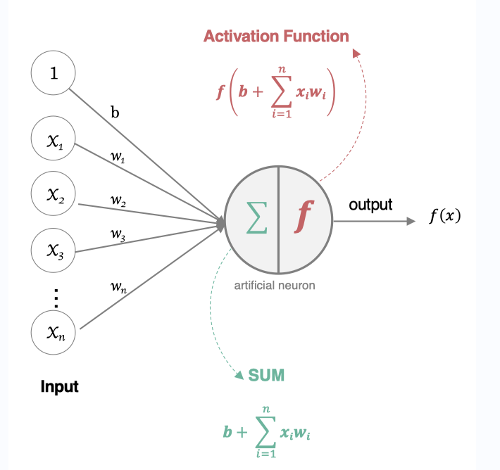

所有的输入x<sub>i</sub>，与相应的权重w<sub>i</sub>相乘并求和：
$$
SUM = b * 1 + x_1w_1+x_2w_2+...+x_iw_i = b + \sum\limits_{i=1}^nx_i-w_i
$$
将加权和结果送入到激活函数中，得到最终的输出结果：
$$
f(x) = f(b + \sum\limits_{i=1}^nx_i-w_i)
$$


接下来的深度学习中要构建神经网络就需要先构建神经元，而构建神经元则需要了解如何选择权重值w，偏置b和激活函数f。


## 激活函数

在神经元中引入了激活函数，它的本质是向神经网络中引入非线性因素的，通过激活函数，神经网络就可以拟合各种曲线。如果不用激活函数，每⼀层输出都是上层输入的线性函数，⽆论神经网络有多少层，输出都是输入的线性组合，引入非线性函数作为激活函数，那输出就不再是输入的线性组合，可以逼近任意函数。常用的激活函数有：sigmoid、**tanh**、**relu**、leaky_relu、**softmax**等等。

在人工神经网络中，一个节点的激活函数定义了该节点在给定的输入或输入集合下的输出，是确定神经网络输出的数学方程式。


### Sigmoid/logistics函数

Sigmoid 型函数是指一类 S 型曲线函数，为两端饱和函数。常用的 Sigmoid 型函数有logistic函数和tanh函数。

> 数学知识: 
>
> 对于函数 f(x) ，若 x→−∞ 时，其导数 f′→0 ，则称其为左饱和。若 x→+∞ 时，其导数 f′→0 ，则称其为右饱和。当同时满足左、右饱和时，就称为两端饱和。

数学表达式为：
$$
f(x) = \frac{1}{1+e^{-x}}
$$
曲线如下图所示：

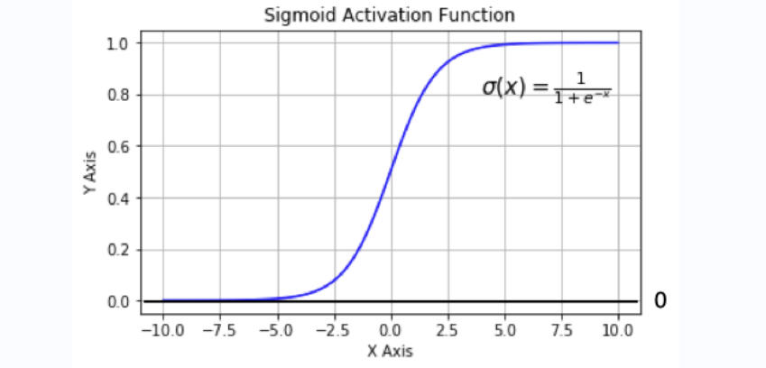

sigmoid在定义域内处处可导，且两侧导数逐渐趋近于0。如果X的值很大或者很小的时候，那么函数的梯度（函数的斜率）会非常小，在反向传播的过程中，导致了向低层传递的梯度也变得非常小。此时网络参数很难得到有效训练。这种现象被称为**梯度消失**。⼀般来说，sigmoid激活函数**在5层以上就会产生梯度消失现象。而且并不是以0为中心的，会降低权重更新的效率，执行指数运算，计算机运行得较慢。**所以在实践中这种激活函数使用的很少。sigmoid函数⼀般**只用于二分类的输出层**。代码如下：

```python
# 导⼊相应的工具包
import tensorflow as tf
import tensorflow.keras as keras
import matplotlib.pyplot as plt
import numpy as np

# 定义x的取值范围
x = np.linspace(-10, 10, 100)
# 直接使用tensorflow实现
# 所有的激活函数都在tf.nn 神经网络激活函数模块中，每一个激活函数都是一个方法，直接调用传递数据即可。
y = tf.nn.sigmoid(x)
# 绘图
plt.plot(x,y)
plt.grid()
```

执行效果：

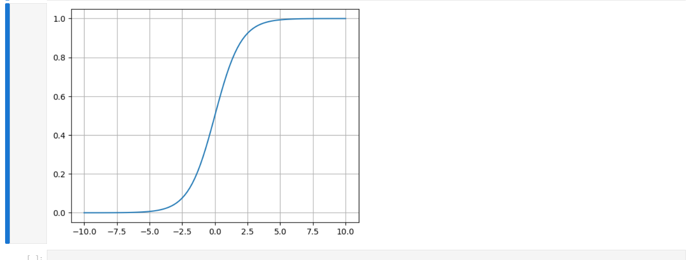


### tanh(双曲正切曲线)

双曲正切函数（hyperbolic tangent function）是双曲函数的一种。双曲正切函数在数学语言上一般写作tanh，也可简写成th。与三角函数一样，双曲函数也分为双曲正弦、双曲余弦、双曲正切、双曲余切、双曲正割、双曲余割6种，双曲正切函数便是其中之一。

数学表达式如下：


$$
f(x) = \frac{e^x-e^{-x}}{e^x+e^{-x}} = \frac{2}{1 + e^{-2x}} -1
$$
曲线如下图所示：

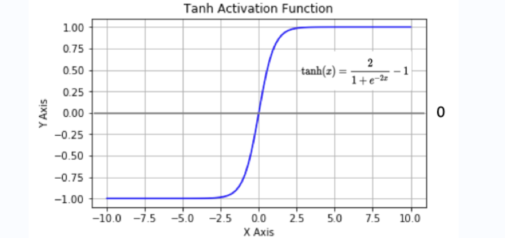

tanh也是⼀种非常常见的激活函数。与sigmoid相比，它**是以0为中心的，使得其收敛速度要比sigmoid快，减少迭代次数**。然而，从图中可以看出，tanh两侧的导数也为0，**同样会造成梯度消失**。所以**可在隐藏层使用tanh函数，在输出层使用sigmoid函数**。代码如下：

```python
# 导⼊相应的工具包
import tensorflow as tf
import tensorflow.keras as keras
import matplotlib.pyplot as plt
import numpy as np
# 定义x的取值范围
x = np.linspace(-10, 10, 100)
# 直接使用tensorflow实现
y = tf.nn.tanh(x)
# 绘图
plt.plot(x,y)
plt.grid()
```

执行效果：

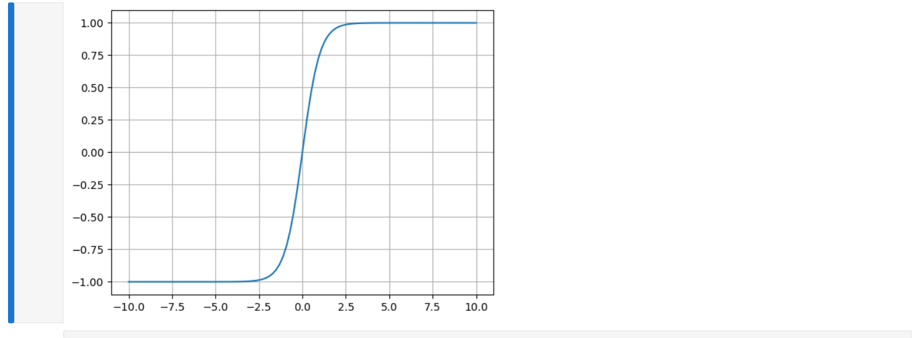


### ReLU

数学表达式如下：
$$
R(x) = max(0,x)
$$
曲线如下图所示：

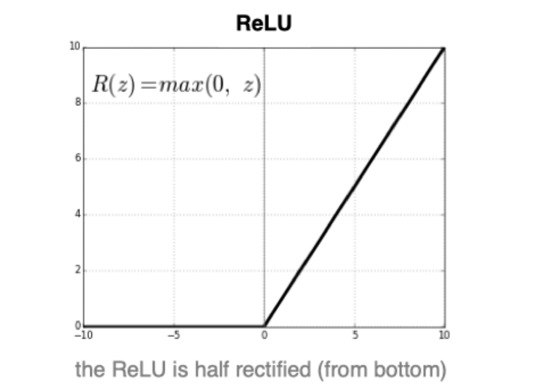

**ReLU是目前最优先最常用的激活函数。** 从图中可以看到，当x<0时，relu导数为0，而当x>0时，则不存在饱和问题。所以，ReLU 能够在x>0时保持梯度不衰减，从而缓解梯度消失问题。然而随着训练的推进，部分输入会落入小于0区域，导致对应权重无法更新。这种现象被称为“神经元死亡”（Dead ReLU Problem）。

与sigmoid相比，ReLU的优点：

+ 采用sigmoid函数，计算量大（指数运算），反向传播求误差梯度时，求导涉及除法，计算量相对大，而采用Relu激活函数，则整个过程的计算量节省很多。
+ sigmoid函数反向传播时，很容易就会出现梯度消失的情况，从而⽆法完成深层网络的训练。
+ ReLU会使⼀部分神经元的输出为0，这样就造成了网络的稀疏性，并且减少了参数的相互依存关系，缓解了过拟合问题的发⽣。神经元死亡如果能得到有效的使用，可以缓解过拟合现象的。

当然，ReLU也有缺点：

+ 当输入x为负时，ReLU完全失效，在正向传播过程中，这不是问题。有些区域很敏感，有些则不敏感。但是在反向传播过程中，如果输入x为负数，则梯度将完全为零，sigmoid 函数和 tanh 函数也具有相同的问题。
+ 不是以 0 为中心的函数。

代码如下：

```python
# 导⼊相应的工具包
import tensorflow as tf
import tensorflow.keras as keras
import matplotlib.pyplot as plt
import numpy as np
# 定义x的取值范围
x = np.linspace(-10, 10, 100)
# 直接使用tensorflow实现
y = tf.nn.relu(x)
# 绘图
plt.plot(x,y)
plt.grid()
```

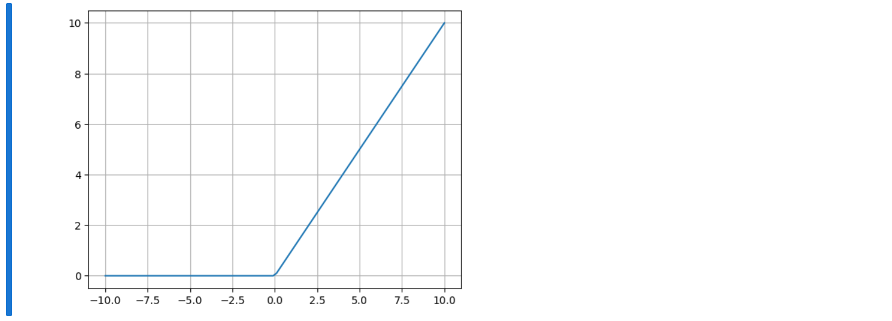


### Leaky_ReLU

该激活函数是对RELU的改进，也叫LReLU，数学表达式如下：
$$
R(x) = max(ax,x), a通常为[0.01,0.1]
$$
曲线如下图所示：

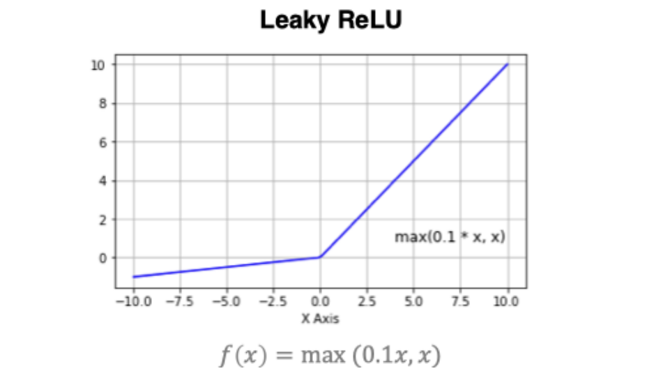

代码如下：

```python
# 导⼊相应的工具包
import tensorflow as tf
import tensorflow.keras as keras
import matplotlib.pyplot as plt
import numpy as np
# 定义x的取值范围
x = np.linspace(-10, 10, 100)
# 直接使用tensorflow实现
y = tf.nn.leaky_relu(x)
# 绘图
plt.plot(x,y)
plt.grid()
```

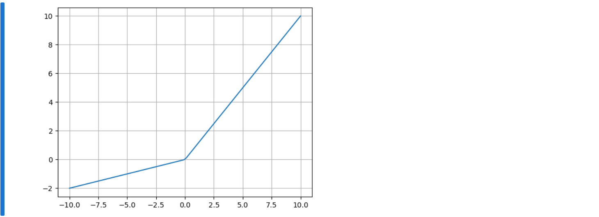


优点：

- 避免梯度消失问题
- 由于导数总是不为零，因此可减少死亡神经元的出现

缺点：

+ LReLU 表现并不一定比 ReLU 好，在实际操作中，尚未完全证明 Leaky ReLU 总是比 ReLU 更好。
+ 存在梯度爆炸问题

ReLU的改进版本函数除了leaky_relu以外，还有elu、swish、gelu等等，都是众多开发者在使用ReLU过程中针对其出现的问题而设计的改进函数，这里我们使用swish举例，代码如下：

```python
# 导⼊相应的工具包
import tensorflow as tf
import tensorflow.keras as keras
import matplotlib.pyplot as plt
import numpy as np
# 定义x的取值范围
x = np.linspace(-10, 10, 100)
# 直接使用tensorflow实现
y = tf.nn.swish(x)
# 绘图
plt.plot(x,y)
plt.grid()
```

执行效果：

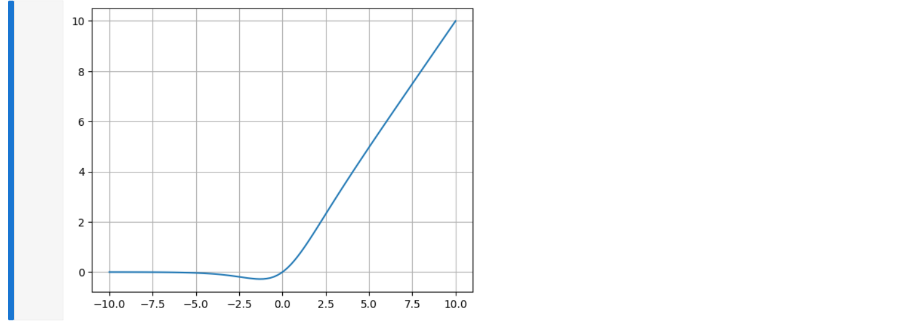


目前所有的relu的改进函数，都没有办法完全取代relu，所以在实际使用中，我们都是优先使用relu的。


### SoftMax

softmax用于多分类过程中，它是⼆分类函数sigmoid在多分类上的推广，⽬的是将多分类的结果以概率的形式展现出来。

数学表达式如下：
$$
softmax(z_i) = \frac{e^{z_i}}{\sum\limits_{i=1}^je^{z_j}}
$$
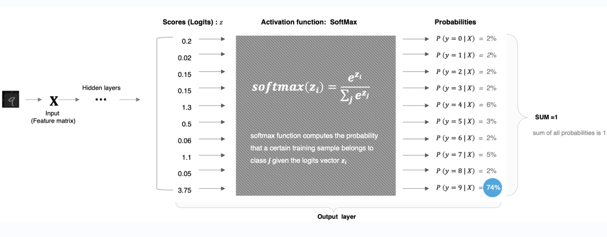

直白来说，softmax就是将网络输出的logits**通过softmax函数，就映射成为(0,1)的值，而这些值的累和为1（满足概率的性质）**，那么我们将它理解成概率，选取概率最大（也就是值对应最大的）节点，作为我们的预测目标类别。

以上图中数字9的分类结果为例，代码如下：

```python
# 导⼊相应的工具包
import tensorflow as tf
import tensorflow.keras as keras
import matplotlib.pyplot as plt
import numpy as np
# 数字中的score
x = tf.constant([0.2,0.02,0.15,1.3,0.5,0.06,1.1,0.05,3.75])
# 将其送⼊到softmax中计算分类结果
y = tf.nn.softmax(x)
# 将分类结果进⾏打印
print(y)
"""
tf.Tensor(
[0.02167152 0.01810157 0.02061459 0.06510484 0.02925349 0.01884031
 0.05330333 0.01865285 0.7544575 ], shape=(9,), dtype=float32)
"""
```


### 其他激活函数

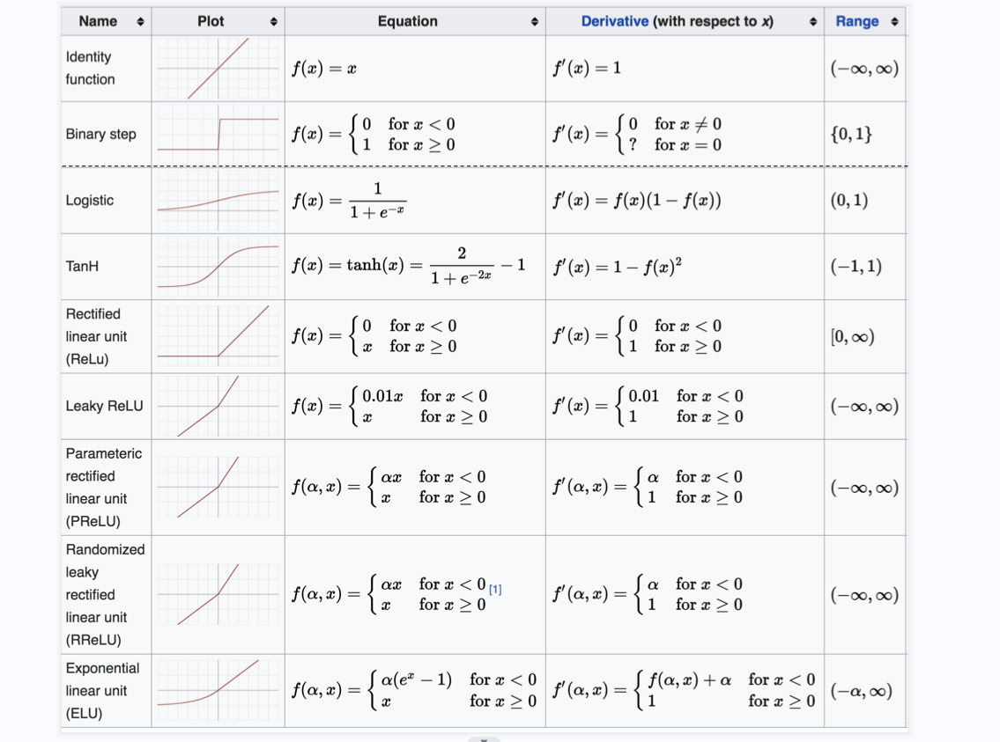


### 如何选择激活函数

隐藏层

+ 优先选择RELU激活函数
+ 如果ReLu效果不好，那么尝试其他激活，如Leaky ReLu等。
+ 如果你使用了Relu， 需要注意⼀下Dead Relu问题， 避免出现大的梯度从而导致过多的神经元死亡。
+ 不要使用sigmoid激活函数，可以尝试使用tanh激活函数

输出层

+ ⼆分类问题选择sigmoid激活函数
+ 多分类问题选择softmax激活函数
+ 回归问题选择identity激活函数


## 参数初始化

对于某⼀个神经元来说，需要初始化的参数有两类：⼀类是权重W，还有⼀类是偏置b，绝大多数情况下**偏置b初始化值设置为0即可**。而权重W的初始化比较重要，我们着重来学习权重的初始化(权重的初始化，就是使用4种不同的方式来生成这些权重，和输入的数据进行计算)。

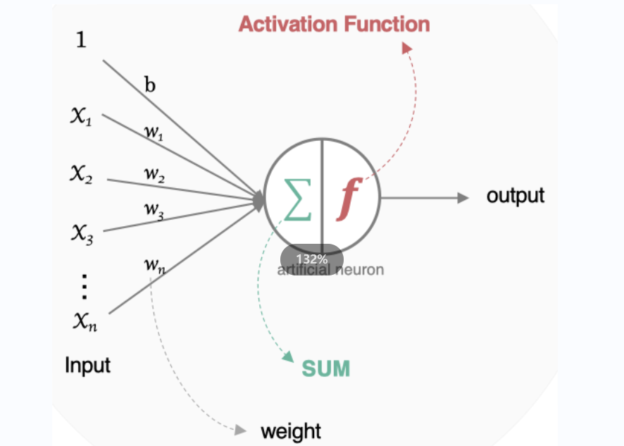


### 随机初始化

随机初始化从**均值为0，标准差是1的⾼斯分布**中取样，使⽤⼀些很⼩的值对参数W进⾏初始化。


### 标准初始化

权重参数初始化从**区间均匀随机取值**。即在**(-1/d,1/√d)均匀分布中**⽣成当前神经元的权重，其中d为每个神经元的输⼊数量。


### Xavier初始化

该方法的基本思想是各层的激活值和梯度的方差在传播过程中保持⼀致，也叫做**Glorot初始化**。在tf.keras中实现的方法有两种：


#### 正态化Xavier初始化

Glorot正态分布初始化器，也称为 Xavier 正态分布初始化器。它从**以 0为中⼼，标准差为 `stddev = sqrt(2 / (fan_in + fan_out)) `的正态分布中抽取样本， 其中 fan_in 是输⼊神经元的个数， fan_out是输出的神经元个数**。

这里的fan_in 就是当前隐藏层的神经元的个数。代码：

```python
# 导⼊模块
import tensorflow as tf
# 实例化Glorot正态分布初始化器
initializer = tf.keras.initializers.glorot_normal()   # 实际使用中，我们只需要在构建模型层的时候，设置使用哪一种初始化器，"glorot_normal"
# 采样得到权重值
values = initializer(shape=(9, 1))
# 打印结果
print(values)
"""
tf.Tensor(
[[-0.0910402 ]
 [ 0.5676437 ]
 [ 0.41880456]
 [ 0.12815711]
 [ 0.16183352]
 [-0.48440048]
 [ 0.33012873]
 [-0.22498159]
 [ 0.82291985]], shape=(9, 1), dtype=float32)
"""
```


#### 标准化Xavier初始化

Glorot均匀分布初始化器，也称为Xavier均匀分布初始化器。它从 `[-limit, limit]` 中的均匀分布中抽取样本，其中limit是 `sqrt(6/(fan_in+fan_out))` ， 其中 fan_in 是输⼊神经元的个数，fan_out 是输出的神经元个数。代码：

```python
# 导⼊模块
import tensorflow as tf
# 实例化Glorot均匀分布初始化器
initializer = tf.keras.initializers.glorot_uniform()
# 采样得到权重值，使用初始化器对象，不需要管 输入和输出的神经元个数的，初始化器会自己根据模型的设置自动获取输入和输出的神经元个数，自动进行计算。
values = initializer(shape=(9, 1))  # 形状(9,1)代表的当前训练集的数据形状，这里只是举例，实际使用要根据实际情况来填写。
# 打印结果
print(values)

"""
tf.Tensor(
[[ 0.71121776]
 [-0.5666647 ]
 [ 0.5502722 ]
 [ 0.14217031]
 [-0.13947731]
 [ 0.1752711 ]
 [-0.21025473]
 [-0.7040559 ]
 [ 0.17358422]], shape=(9, 1), dtype=float32)
"""
```


### He初始化

he初始化，也称为Kaiming初始化，出⾃大神何恺明之⼿，它的基本思想是正向传播时，激活值的方差保持不变；反向传播时，关于状态值的梯度的方差保持不变。在tf.keras中也有两种：


#### 正态化的he初始化[最常用]

He正态分布初始化是以 0 为中⼼，标准差为`stddev=sqrt(2/fan_in)`的截断正态分布中抽取样本， 其中 fan_in 是输⼊神经元的个数，在tf.keras中的实现方法为：

```python
# 导⼊模块
import tensorflow as tf
# 进⾏实例化
initializer = tf.keras.initializers.he_normal()   # he_normal 最常用的初始化器  "he_normal"
# 采样得到权重值
values = initializer(shape=(9, 1))
# 打印结果
print(values)

"""
tf.Tensor(
[[ 0.32295868]
 [-0.35276082]
 [ 0.32933092]
 [-0.2797647 ]
 [ 0.44927996]
 [ 0.28092375]
 [-0.49646404]
 [-0.26345563]
 [ 0.25342995]], shape=(9, 1), dtype=float32)
"""
```


#### 标准化的he初始化

He 均匀方差缩放初始化器。它从`[-limit, limit]`中的均匀分布中抽取样本， 其中limit 是`sqrt(6 / fan_in)`， 其中 fan_in 输⼊神经元的个数。代码：

```python
# 导⼊工具包
import tensorflow as tf
# 进⾏实例化
initializer = tf.keras.initializers.he_uniform()
# 采样得到权重值
values = initializer(shape=(9, 1))
# 打印结果
print(values)

"""
tf.Tensor(
[[-0.61961895]
 [ 0.2810694 ]
 [-0.12440199]
 [ 0.31319928]
 [-0.2750635 ]
 [-0.6813077 ]
 [-0.31078506]
 [ 0.6607288 ]
 [-0.69828486]], shape=(9, 1), dtype=float32)
"""
```


## 神经网络的搭建

接下来我们来构建如下图所示的神经网络模型：

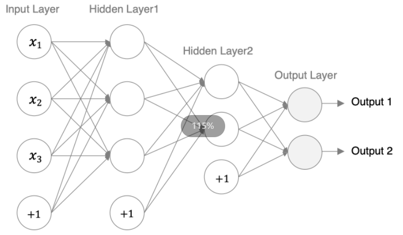

tf.Keras中构建模型有两种方式，⼀种是通过Sequential构建，⼀种是**通过Model类构建**。前者是按⼀定的顺序对层进⾏堆叠，⽽后者可以⽤来构建较复杂的网络模型。⾸先我们介绍下⽤来构建网络的全连接层：

```python
tf.keras.layers.Dense(units, activation=None, use_bias=True, kernel_initializer='glorot_uniform', bias_initializer='zeros')
```

主要参数：

+ units: 当前层中包含的神经元个数
+ Activation: 激活函数，relu,sigmoid等
+ use_bias: 是否使⽤偏置，默认使⽤偏置
+ Kernel_initializer: 权重的初始化方式，默认是Xavier初始化
+ bias_initializer: 偏置的初始化方式，默认为0

### 通过Sequential构建

Sequential(层列表, 模型名称) 提供⼀个层的列表，就能快速地建⽴⼀个神经网络模型，实现方法如下所示：

```python
# 导⼊相关的工具包
import tensorflow as tf
from tensorflow import keras
from tensorflow.keras import layers

# 定义⼀个Sequential模型，包含3层
model = keras.Sequential(
    # 层列表，层是有序的，所以第一层是需要设置输入数据的形状的。
    [
        # 第1层：激活函数为relu,权重初始化为he_normal，如果作为第一层对接输入层，需要声明input_shape参数设置当前数据的形状。name表示隐藏层的唯一标记，不能重复。
        layers.Dense(3, activation="relu", kernel_initializer="he_normal", name="layer1", input_shape=(3,)),
        # 第2层~第：激活函数为relu,权重初始化为he_normal
        layers.Dense(2, activation="relu", kernel_initializer="he_normal", name="layer2"),
         # 最后一层（输出层）：激活函数为sigmoid,权重初始化为he_norma
        layers.Dense(2, activation="relu", kernel_initializer="he_normal", name="layer3"),
    ],
    "my_Sequential"
)

# 展示模型结果
model.summary()
```

如下所示：

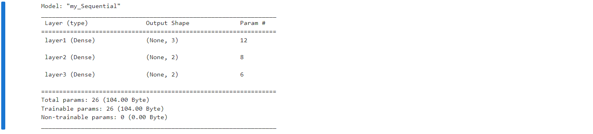

通过这种sequential的方式只能构建简单的序列模型，较复杂关系的模型没有办法实现。


### 利⽤function API构建

tf.keras 提供了 Functional API，建⽴更为复杂的模型，使⽤方法是将层作为可调⽤的对象并返回张量，并将输⼊向量和输出向量提供给tf.keras.Model 的 inputs 和 outputs 参数，代码：

```python
# 导⼊工具包
import tensorflow as tf
# 定义模型的输⼊
inputs = tf.keras.Input(shape=(3,),name = "input")
# 第⼀层：激活函数为relu，其他默认
x = tf.keras.layers.Dense(3, activation="relu",name = "layer1")(inputs)
# 第⼆层：激活函数为relu，其他默认
x = tf.keras.layers.Dense(2, activation="relu",name = "layer2")(x)
# 第三层（输出层）：激活函数为sigmoid
outputs = tf.keras.layers.Dense(2, activation="sigmoid",name = "layer3")(x)
# 使⽤Model来创建模型，指明输⼊和输出
model = tf.keras.Model(inputs=inputs, outputs=outputs,name="my_model")

# 展示模型结果
model.summary()
```

如下所示：

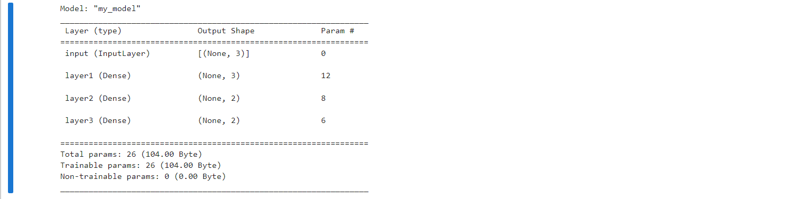


### 通过keras.Model的子类构建

通过model的⼦类构建模型，此时需要在`__init__()`中定义神经网络的层，在call()方法中定义网络的前向传播过程，代码：

```python
# 导⼊相关的工具包
import tensorflow as tf

class MyModel(tf.keras.Model):
    def __init__(self):  # 这里的__init__前后是2个英文的下划线的
        """定义层"""
        # 先完成父类的初始化，因为当前这个模型是我们自定义的，所以并没有实现模型的训练，评估等方法，所以我们使用前，先让当前类的父类进行初始化，
        # 因为父类已经声明了这些操作了。
        super(MyModel, self).__init__()
        # 定义模型层
        # 第一层：激活函数为relu,权重初始化为he_normal
        self.layer1 = tf.keras.layers.Dense(3, activation="relu", kernel_initializer="he_normal", name="layer1",input_shape=(3,))
        # 第二层：激活函数为relu,权重初始化为he_normal
        self.layer2 = tf.keras.layers.Dense(2, activation="relu", kernel_initializer="he_normal", name="layer2")
        # 第三层（输出层）：激活函数为sigmoid,权重初始化为he_normal
        self.layer3 =tf.keras.layers.Dense(2, activation="sigmoid", kernel_initializer="he_normal", name="layer3")

    def call(self, inputs):
        """
        这里的call方法，将来被会Model类中的__call__()方法进行调用，
        当前模型被当成函数来调用时，会自动执行这个Model类的__call__()方法。
        __call__()方法会直接调用我们定义call方法，所以这个方法名必须叫call
        """
        x1 = self.layer1(inputs)
        x2 = self.layer2(x1)
        return self.layer3(x2)
        

# 创建对象
model = MyModel() # 这里会自动执行__init__方法中所有的代码操作，
# 把对象当成函数来调用，就会自动执行这个对象的类的内部的__call__方法了。这是python的基础语法

# 需要设置一个输入对象[必须张量类型]，调用模型，否则无法使用model.summay()来查看模型
inputs = tf.ones((1, 3))

model(inputs)

print(model.summary())
```

如下所示：

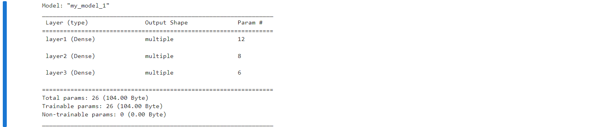


## 神经网络的优缺点

优点

+ 精度⾼，性能优于其他的机器学习方法，甚⾄在某些领域超过了人类
+ 可以近似任意的非线性函数
+ 随着计算机硬件的发展，近年来在学界和业界受到了热捧，有大量的框架和库可供调⽤

缺点

+ 黑箱，很难解释模型是怎么工作的
+ 训练时间长，需要大量的计算力
+ 网络结构复杂，需要调整超参数
+ ⼩数据集上表现不佳，容易发⽣过拟合

