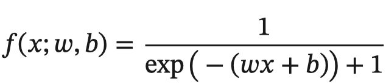
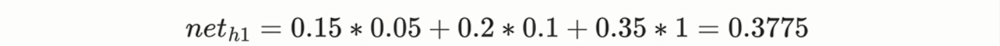
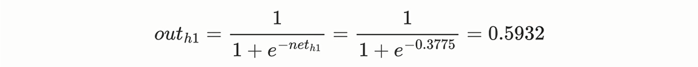
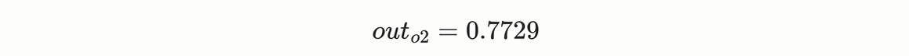
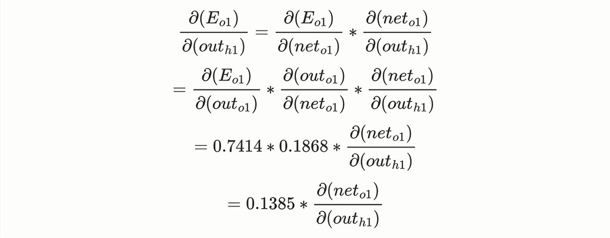

# 深度神经网络基础

> 学习⽬标
>
> 分类任务的损失函数[知道]
>
> 回归任务的损失函数[知道]
>
> 梯度下降算法[知道]
>
> 神经网络的链式法则[理解]
>
> 反向传播算法（BP算法）[掌握]
>
> 梯度下降算法的优化方法[知道]
>
> 学习率退⽕[了解]

## 常见的损失函数

**在深度学习中，损失函数是用来衡量模型参数的质量的函数，衡量的方式是⽐较网络输出和真实输出的差异。**


损失函数在不同的文献中名称是不⼀样的，主要有以下几种命名方式：


### 分类任务

在深度学习的分类任务中使用最多的是交叉熵损失函数。

交叉熵损失函数，也叫数似然损失(Log-likelihoodLoss)、对数损失在处理二分类时还可称之为逻辑斯谛回归损失(LogisticLoss)。


#### 多分类任务

在多分类任务通常使用softmax将logits转换为概率的形式，所以多分类的交叉熵损失也叫做softmax损失，它的计算方法是：


y是样本，x属于某⼀个类别的真实概率，而f(x)是样本属于某⼀类别的预测分数，S是softmax函数，L用来衡量p,q之间差异性的损失结果（机器学习中p表示真实分布（目标分布），q表示预测分布）。

例⼦：


上图中的交叉熵损失为：


$$
-(0log(0.10) ＋ 1log(0.7) ＋ 0log(0.2)) ＝ 1og0.7
$$
从概率⻆度理解，我们的⽬的是最小化正确类别所对应的预测概率的对数的负值，如下图所示：


在tf.keras中使用CategoricalCrossentropy实现，代码：

```python
#导入相应的包
importtensorflowastf
#设置真实值和预测值
y_true=[[0,1,0],[0,0,1]]
y_pred=[[0.05,0.95,0],[0.1,0.8,0.1]]
#实例化交叉熵损失
cce=tf.keras.losses.CategoricalCrossentropy()
#计算损失结果
cce(y_true,y_pred).numpy()#1.1769392
```

#### 二分类任务

在处理二分类任务时，我们不在使用softmax激活函数，而是使用sigmoid激活函数，那损失函数也相应的进行调整，使用二分类的交叉熵损失函数：


其中，y是样本x属于某⼀个类别的真实概率，而y^是样本属于某一类别的预测概率，L用来衡量真实值与预测值之间差异性的损失结果。在tf.keras中实现时使用BinaryCrossentropy()，代码：

```python
#导入相应的包
importtensorflowastf
#设置真实值和预测值
y_true=[[0],[1]]
y_pred=[[0.4],[0.6]]
#实例化⼆分类交叉熵损失
bce=tf.keras.losses.BinaryCrossentropy()
#计算损失结果
bce(y_true,y_pred).numpy() #0.5108254
```


### 回归任务

回归任务中常用的损失函数有：


#### MAE损失函数

MAE(Meanabsoluteloss，平均绝对误差)也被称为L1Loss，是以绝对误差作为距离：


曲线如下图所示：


特点是：由于L1loss具有稀疏性，为了惩罚较大的值，因此常常将其作为正则项添加到其他loss中作为约束。L1loss的最大问题是梯度在零点不平滑，导致会跳过极小值。

在tf.keras中使用MeanAbsoluteError实现，代码：

```python
#导入相应的包
importtensorflowastf
#设置真实值和预测值
y_true=[[0.],[0.]]
y_pred=[[1.],[1.]]
#实例化MAE损失
mae=tf.keras.losses.MeanAbsoluteError()
#计算损失结果
mae(y_true,y_pred).numpy()#1.0
```

#### MSE损失函数

MeanSquaredLoss/QuadraticLoss(MSEloss)也被称为L2loss，或欧⽒距离，它以误差的平方和作为距离：


曲线如下图所示：


特点是：L2loss也常常作为正则项。当预测值与⽬标值相差很大时,梯度容易爆炸。

在tf.keras中通过MeanSquaredError实现，代码：

```python
#导入相应的包
importtensorflowastf
#设置真实值和预测值
y_true=[[0.],[1.]]
y_pred=[[1.],[1.]]
#实例化MSE损失
mse=tf.keras.losses.MeanSquaredError()
#计算损失结果
mse(y_true,y_pred).numpy()#0.5
```

#### smoothL1损失

SmoothL1损失函数如下式所示：


其中：x=f(x)−y为真实值和预测值的差值。


从上图中可以看出，该函数实际上就是⼀个分段函数，在[-1,1]之间实际上就是L2损失，这样解决了L1的不光滑问题，在[-1,1]区间外，实际上就是L1损失，这样就解决了离群点梯度爆炸的问题。通常在⽬标检测中使用该损失函数。

在tf.keras中使用Huber计算该损失，如下所示：

```python
#导入相应的包
importtensorflowastf
#设置真实值和预测值
y_true=[[0],[1]]
y_pred=[[0.6],[0.4]]
#实例化smoothL1损失
h=tf.keras.losses.Huber()
#计算损失结果
h(y_true,y_pred).numpy()#0.18
```


## 深度学习的优化方法


### 梯度下降算法

梯度下降法简单来说就是⼀种**寻找使损失函数最小化**的方法。大家在机器学习阶段已经学过该算法，所以我们在这里就简单的回顾

下，从数学上的⻆度来看，梯度的方向是函数增⻓速度最快的方向，那么梯度的反方向就是函数减少最快的方向，所以有


其中，η是学习率，如果学习率太小，那么每次训练之后得到的效果都太小，增大训练的时间成本。如果学习率太大，那就有可能直接跳过最优解，进入无限的训练中。解决的方法就是，学习率也需要随着训练的进行而变化。


在上图中我们展示了一维和多维的损失函数，损失函数呈碗状。在训练过程中损失函数对权重的偏导数就是损失函数在该位置点的梯度。我们可以看到，沿着负梯度方向移动，就可以到达损失函数底部，从而使损失函数最小化。这种利用损失函数的梯度迭代地寻找局部最小值的过程就是梯度下降的过程。

**根据在进行迭代时使用的样本量，将梯度下降算法分为以下三类**：

| 梯度下降算法           | 定义                                                         | 缺点                               | 优点                                       |
| ---------------------- | ------------------------------------------------------------ | ---------------------------------- | ------------------------------------------ |
| BGD（批量梯度下降）    | 每次迭代时需要计算每个样本上损失函数的梯度并求和             | 计算量大，迭代速度慢               | 全局最优化                                 |
| SGD（随机梯度下降）    | 每次迭代时只随机采集一个样本，计算该样本损失函数的梯度并更新参数 | 准确率下降、存在噪音、非全局最优化 | 训练速度快、支持在线学习                   |
| MBGD（小批量梯度下降） | 每次迭代时，我们随机抽取一小部分训练样本来计算梯度并更新参数 | 准确率不如BGD、非全局最优化        | 计算小批量数据的梯度更加高效、支持在线学习 |

**实际中使用较多的是小批量的梯度下降算法（MBGD）**，在tf.keras中通过以下方法实现：

```python
tf.keras.optimizers.SGD(
learning_rate=0.01,momentum=0.0,nesterov=False,name='SGD',**kwargs
)
```

例子：

```python
#导入相应的工具包
importtensorflowastf
#实例化优化方法：SGD，学习率一般在0.1-0.01之间
opt=tf.keras.optimizers.SGD(learning_rate=0.1)
#定义要调整的参数
var=tf.Variable(1.0)
#定义损失函数：无参但有返回值
loss=lambda:(var**2)/2.0
#计算梯度，并对参数进行更新，步长为`-learning_rate*grad`
opt.minimize(loss,[var]).numpy()
#展示参数更新结果
var.numpy()   #0.9
```

在进行模型训练时，有三个基础的概念：


实际上，梯度下降的几种方式的根本区别就在于BatchSize不同,，如下表所示：


注：上表中Mini-Batch的Batch个数为N/B+1是针对未整除的情况。整除则是N/B。

假设数据集有50000个训练样本，现在选择BatchSize=256对模型进行训练。

+ 每个Epoch要训练的图片数量：50000
+ 训练集具有的Batch个数：50000/256+1=196
+ 每个Epoch具有的Iteration个数：196
+ 10个Epoch具有的Iteration个数：1960

### 反向传播算法（BP算法）

利用反向传播算法对神经网络进行训练。该方法与梯度下降算法相结合，对网络中所有权重计算损失函数的梯度，并利用梯度值来更新权值以最小化损失函数。在介绍BP算法前，我们先看下前向传播（前向计算）与链式法则的内容。


#### 前向传播

前向传播指的是**数据输入的神经网络中，逐层向前传输，一直到运算到输出层为止**。


在网络的训练过程中经过前向传播后得到的最终结果跟训练样本的真实值总是存在一定误差，这个误差便是损失函数。想要减小这个误差，就用损失函数ERROR，从后往前，依次求各个参数的偏导，这就是反向传播（BackPropagation）。


#### 链式法则

反向传播算法是**利用链式法则对神经网络中的各个节点的进行梯度求解及权重进行更新的**。对于复杂的复合函数，我们将其拆分为一系列的加减乘除或指数，对数，三角函数等初等函数，通过链式法则完成复合函数的求导。为简单起见，这里以一个神经网络中常见的复合函数的例子（sigmoid）来说明这个过程，令复合函数𝑓(𝑥;𝑤,𝑏)为：



链式法则：实际上就是**对运算公式进行从内到外，逐层求导的路线**。

其中x是输入数据，w是权重，b是偏置。我们可以将该复合函数分解为：


并进行图形化表示，如下所示：


整个复合函数𝑓(𝑥;𝑤,𝑏)关于参数𝑤和𝑏的导数可以通过𝑓(𝑥;𝑤,𝑏)与参数𝑤和𝑏之间路径上所有的导数连乘来得到，即：


以w为例，当𝑥=1,𝑤=0,𝑏=0时，可以得到：


注意，常用函数的导数：


#### 反向传播算法

反向传播算法**利用链式法则对神经网络中的各个节点的权重进行更新**。我们可以通过⼀个例⼦来了解整个流程。如下图是一个简单的神经网络（默认激活函数为sigmoid，输入层、隐藏层和输出层假设都为1）。

我们通过这个全连接的神经网络来了解整个传播的流程：


上图中，输入数据x1、x2和偏置b1为输入层神经元数据，h1、h2和偏置b2为隐藏层神经元数据，o1、o2为输出层神经元数据。所有的神经元隐藏函数都为sigmoid，层与层之间的连线上的w1~w8为权重。

假设输入样本数据x1=0.05，x2=0.1，目标值为o1=0.01，o2=0.99，随机生成的初始权重分别w1=0.15，w2=0.2，w3=0.25，w4=0.30，w5=0.40，w6=0.45，w7=0.50，w8=0.55，偏置b1=0.35，偏置b2=0.60，如下图所示：


根据上图，我们可以知道，当前网络的学习目标就是给出输入数据x1，x2，更新权重值使输出尽可能与目标值o1，o2接近。


##### 前向传播运算过程

###### 输入层到隐藏层

计算神经元h1的输入数据x<sub>i</sub>与权重w<sub>i</sub>进行乘法运算，加上偏置b<sub>i</sub>，得到加权和net<sub>h1</sub>，公式如下：


把权重w<sub>i</sub>与输入数据x<sub>i</sub>代入公式中得到加权和net<sub>h1</sub>，计算如下：



加权和net<sub>h1</sub>经过激活函数（此处我们默认为sigmoid）处理后的输出结果out<sub>h1</sub>，计算如下：



同理，也可以计算出神经元h2的输出结果out<sub>h2</sub>，计算如下：


###### 隐藏层到输出层

计算输出层神经元o1的加权和net<sub>o1</sub>，公式如下：


将权重w<sub>i</sub>和隐藏层的各个神经元hi输出结果out<sub>hi</sub>带入公式中进行计算得到加权和net<sub>o1</sub>，计算如下：


把上面计算得到的加权和net<sub>o1</sub>使用激活函数（此处我们默认为sigmoid）进行处理，得到神经元o1的输出结果out<sub>o1</sub>的如下：


同理，也可以计算出神经元o2的输出结果out<sub>o2</sub>：



到这一步，整个前向传播过程就结束了，经过计算得到的输出结果为[0.7514, 0.7729]，与实际目标值[0.01, 0.99]有一定差距，所以

接下来就要进行反向传播，更新参数（权重、偏置）后，重新进行新一轮的前向传播输出结果。


##### 反向传播运算过程

###### 计算总损失

我们直接使用MSE（均方误差）损失函数计算总损失，公式如下：


在当前的神经网络中有2个输出，所以分别对out<sub>o1</sub>与out<sub>o2</sub>的损失进行求和，计算出总损失E<sub>total</sub>，公式如下：


接下来，分别计算out<sub>o1</sub>与out<sub>o2</sub>的损失，计算如下：


总损失，计算如下：


求出总损失后就可以使用损失进行梯度计算和参数更新了。


接下来我们直接采用上面标红的一条线路来了解输出层参数的更新方式和隐藏层参数的更新方式，其他线路都是一样的原理。


###### 输出层参数更新

首先明确这是一个"链式法则"的求导过程，需要求误差E<sub>total</sub>对w5的导数（偏导）：

1. 求误差E<sub>total</sub>对out<sub>o1</sub>的导数（偏导）
2. 求out<sub>o1</sub>对net<sub>o1</sub>的导数（偏导）
3. 求net<sub>o1</sub>对w5的导数（偏导）

经过这个链式法则，我们就可以求出误差E<sub>total</sub>对w5的导数（偏导），公式如下：


下面的图可以更加直观的表示误差进行反向转播的流程：


使用MSE（均方误差）损失函数计算总损失E<sub>total</sub>，公式如下：


把目标值和输出值代入公式，求误差E<sub>total</sub>对out<sub>o1</sub>的导数（偏导），计算如下：


我们使用的激活函数是sigmoid，所以计算out<sub>o1</sub>的公式不变如下：


接下来，求out<sub>o1</sub>对net<sub>o1</sub>的导数（偏导），计算如下：


接下来，求net<sub>o1</sub>对w5的导数（偏导），计算如下：


最后，上面三段进行乘法运算，计算如下：


梯度计算出来后，接着就可以对w5进行参数更新了，下面就是**参数更新过程**了。假设学习率为0.5，则新的w5权重值，计算如下：


同理，新的w6，w7，w8权重值，计算如下：


至此，输出层的权重参数更新方式的整个流程就结束了。接下来我们可以看下隐藏层参数的更新方式。

​	

###### 隐藏层参数更新

在计算隐藏层参数时，依然是使用上面的方法来进行计算的，但是因为误差E<sub>total</sub>对w1的求导路径不止一条，所以相对输出层会稍微复杂一点，因为更新w5时直接使用E<sub>o1</sub>进行更新就可以了，但是在更新w1时是需要考虑总损失的响应的。


误差E<sub>total</sub>对w1的导数（偏导），公式如下：


其中上面公式中，误差E<sub>total</sub>对out<sub>h1</sub>的求导（偏导），可以拆分为

1. 误差E<sub>o1</sub>对out<sub>h1</sub>的求导（偏导）。
2. 误差E<sub>o2</sub>对out<sub>h1</sub>的求导和（偏导和）。

公式如下：


接下来，先计算梯度值，以out<sub>o1</sub>来举例，首先是：



其中，求加权和net<sub>o1</sub>的公式如下：


因此，误差net<sub>o1</sub>对out<sub>h1</sub>的求导（偏导），计算如下：


接下，误差E<sub>o1</sub>对out<sub>h1</sub>的求导（偏导），计算如下：


对误差E<sub>total</sub>对out<sub>h1</sub>的求导（偏导），两者相加，得到总和：


接下来，out<sub>h1</sub>对net<sub>h1</sub>的求导（偏导），计算如下：


最后，net<sub>h1</sub>对w1的求导（偏导），计算如下：


还是一样，将三个梯度相乘，进行误差E<sub>total</sub>对w1的求导（偏导），计算如下：


更新w1的权重值：


同理，新的w2，w3，w4权重值，计算如下：


至此，误差的反向传播就完成了一次迭代过程。最后我们再把更新后的权重值重新加入到前向传播中进行计算，不停地迭代，从而完成整个神经网络的训练过程。


### 梯度下降优化方法

梯度下降算法在进行网络训练时，会遇到鞍点，局部极小值这些问题，那如何改进SGD呢？在这里我们学习几个比较常用的。


#### 动量算法（Momentum）

动量算法主要解决鞍点问题。在介绍动量法之前，我们先来看下指数加权平均数的计算方法。


##### 指数加权平均数

假设给定一个序列，例如北京一年每天的气温值，图中蓝色的点代表真实数据，


这时温度值波动比较大，那我们就使用加权平均值来进行平滑，如下图红线就是平滑后的结果：


计算方法如下所示：


其中Y<sub>t</sub>为 t 时刻时的气温真实值，S<sub>t-1</sub>代表了上一个时刻的指数加权平均数，S<sub>t</sub>为t加权平均后的值，β为权重值。红线即是指数加权平均后的结果。

上图中β设为0.9，那么指数加权平均的计算结果为：


那么第100天的结果就可以表示为：


##### 动量梯度下降算法

动量（1阶矩估计）梯度下降（Gradient Descent with Momentum）计算梯度的指数加权平均数，并利用该值来更新参数值。动量梯度下降法的整个过程为，其中**β通常设置为0.9**：


与原始的梯度下降算法相比，它的下降趋势更平滑。


在tf.keras中使用Momentum算法仍使用功能SGD方法，但要设置momentum参数，实现过程如下：

```python
# 导入相应的工具包
import tensorflow as tf
# 实例化优化方法：SGD 指定参数 learning_rate 学习率为0.1，momentum 动量为0.9
opt = tf.keras.optimizers.SGD(learning_rate=0.1, momentum=0.9)
# 定义要调整的参数，初始值
var = tf.Variable(1.0)
val0 = var.value()
# 定义L2损失函数
loss = lambda: (var ** 2)/2.0
# 第一次更新：计算梯度，并对参数进行更新，步长为 `- learning_rate * grad`
opt.minimize(loss, [var])
val1 = var.value()
# 第二次更新：计算梯度，并对参数进行更新，因为加入了momentum,步长会增加
opt.minimize(loss, [var])
val2 = var.value()
# 打印两次更新的步长
print(f"第一次更新步长={(val0 - val1).numpy()}")
print(f"第二次更新步长={(val1 - val2).numpy()}")

"""
第一次更新步长=0.10000002384185791
第二次更新步长=0.18000000715255737
"""
```

**Momentum是基于上一次的梯度与权重值进行乘法计算，加上本次的梯度乘以（1-权重值）之后的平均值作为梯度调整**。

另外还有一种动量算法Nesterov accelerated gradient(NAG)，使用了根据动量项**预先估计**的参数，在Momentum的基础上进一步**加快收敛，提高响应性**，该算法实现依然使用SGD方法，要设置nesterov设置为true.


##### Nesterov加速梯度

Nesterov加速梯度（Nersterov Accelerated Gradient，NAG）也称为Nesterov动量优化。**nesterov选项在梯度更新时做一个校正，避免前进太快，同时提高灵敏度。**

```python
# 导入相应的工具包
import tensorflow as tf
# 实例化优化方法：NAG依然使用SGD对象，指定参数 momentum=0.9，nesterov=True
opt = tf.keras.optimizers.SGD(learning_rate=0.1, momentum=0.9, nesterov=True)

# 定义要调整的参数，初始值
var = tf.Variable(1.0)
val0 = var.value()
# 定义损失函数
loss = lambda: (var ** 2)/2.0         
#第一次更新：计算梯度，并对参数进行更新，步长为 `- learning_rate * grad`
opt.minimize(loss, [var])
val1 = var.value()
# 第二次更新：计算梯度，并对参数进行更新，因为加入了momentum,步长会增加
opt.minimize(loss, [var])
val2 = var.value()
# 打印两次更新的步长
print(f"第一次更新步长={(val0 - val1).numpy()}")
print(f"第二次更新步长={(val1 - val2).numpy()}")

"""
第一次更新步长=0.1899999976158142
第二次更新步长=0.23489999771118164
"""
```


#### AdaGrad

**AdaGrad通过改变学习率让梯度不断自适应的算法，**所以Adagrad也叫自适应（二阶矩估计）梯度优化算法。

AdaGrad算法会使用一个小批量随机梯度g<sub>t</sub>按元素平方的累加变量S<sub>t</sub>。在首次迭代时，AdaGrad将S<sub>0</sub>中每个元素初始化为0。在t次迭代，首先将小批量随机梯度g<sub>t</sub>按元素平方后累加到变量S<sub>t</sub>：


其中⊙是按元素相乘。接着我们将目标函数自变量中每个元素的**学习率**通过按元素运算重新调整一下：


其中α是学习率，ϵ是为了维持数值稳定性而添加的常数，如10<sup>-6</sup>。这里开方、除法和乘法的运算都是按元素运算的。这些按元素运算使得目标函数自变量中每个元素都分别拥有自己的学习率。在tf.keras中的实现方法是：

```python
tf.keras.optimizers.Adagrad(
    learning_rate=0.1, 
    initial_accumulator_value=0.1, 
    epsilon=1e-07
)
# learning_rate 初始化的学习率
# initial_accumulator_value 初始化目标值St
# epsilon 保持梯度的稳定，防止梯度震动的。
```

代码：

```python
# 导入相应的工具包
import tensorflow as tf
# 实例化优化方法：Adagrad
opt = tf.keras.optimizers.Adagrad(
    learning_rate=0.1, initial_accumulator_value=0.1, epsilon=1e-07
)
# 定义要调整的参数
var = tf.Variable(1.0)
# 定义损失函数：无参但有返回值
loss = lambda: (var ** 2)/2.0
"""
def loss():
    # L2损失函数
    return var**2/2.0
"""
# 计算梯度，并对参数进行更新，
opt.minimize(loss, [var])
# 展示参数更新结果
var.numpy()  # 0.9046537
```


#### RMSprop

**AdaGrad算法在迭代后期由于学习率过小，较难找到最优解。**

为了解决这一问题，RMSProp（Root Mean Square Prop）算法对AdaGrad算法做了一点小小的修改。不同于AdaGrad算法里状态变量S<sub>t</sub>是截至时间步t所有小批量随机梯度g<sub>t</sub>按元素平方和，RMSProp算法将这些梯度按元素平方做**指数加权移动平均**。


其中ϵ是一样为了维持数值稳定一个常数。最终自变量每个元素的学习率在迭代过程中就不再一直降低。RMSProp 有助于减少抵达最小值路径上的摆动，并允许使用一个更大的学习率 α，从而加快算法学习速度。

在tf.keras中实现时，使用的方法是：

```python
tf.keras.optimizers.RMSprop(learning_rate=0.1, rho=0.9, momentum=0.0, epsilon=1e-07, centered=False)
# learning_rate 学习率
# rho AdaGrad的初始化权重值β
# momentum 梯度下降的动量数值
# epsilon，保持梯度稳定性的常数，默认值就是1e-07
# centered 默认False即可
```

代码：

```python
opt = tf.keras.optimizers.RMSprop(learning_rate=0.1)
# 定义要进行梯度下降的参数初始值，将来可以是偏置，权重进行momentum动量处理
var = tf.Variable(1.0)
val0 = var.value() # 最初的参数值
# 定义一个损失函数 L2
loss = lambda: (var**2) / 2

opt.minimize(loss, [var]) # 第二个参数必须是列表，因为实际开发中，肯定数据集中多个数据传入
# 展示参数更新结果
val1 = var.numpy()
print(val1)
opt.minimize(loss, [var])
val2 = var.numpy()  # 
print(val2)
print(f"第一次更新步长={(val0 - val1).numpy()}")
print(f"第二次更新步长={(val1 - val2)}")
```


#### Adam【最常用】

Adam 优化算法（Adaptive Moment Estimation，自适应矩估计）将 Momentum 和 RMSProp 算法结合在一起。

Adam算法在RMSProp算法基础上对小批量随机梯度也做了指数加权移动平均处理。

假设用每一个 mini-batch 计算 dW（权重梯度）、db（偏置梯度），第t次迭代时：


其中l为某一层，t为移动平均第次的值。

Adam 算法的参数更新：


建议的参数设置的值：

- 学习率α：需要尝试一系列的值，来寻找比较合适的，0.1~0.001
- β1：常用的缺省值为 0.9
- β2：建议为 0.999
- ϵ：默认值1e-8。与上面的RMSProp等epsilon参数一样，在学习率减小的时候，让梯度动量增加，在学习率增大的时候，让梯度动量减小。

在tf.keras中实现的方法是：

```python
tf.keras.optimizers.Adam(
    learning_rate=0.001, beta_1=0.9, beta_2=0.999, epsilon=1e-07
)
```

代码：

```python
# 实例化Adam方法，设置学习率假设为0.1
opt = tf.keras.optimizers.Adam(learning_rate=0.1)
# 最初的参数值
var = tf.Variable(1.0)
val0 = var.value() 
# 定义一个损失函数 L2
loss = lambda: (var**2) / 2

opt.minimize(loss, [var]) # 第二个参数必须是列表，因为实际开发中，肯定数据集中多个数据传入
# 展示参数更新结果
val1 = var.numpy()
print(val1)
opt.minimize(loss, [var])
val2 = var.numpy()  # 
print(val2)
print(f"第一次更新步长={(val0 - val1).numpy()}")
print(f"第二次更新步长={(val1 - val2)}")
```


### 学习率退火

在训练神经网络时，一般情况下学习率都会随着训练而变化，这主要是由于在神经网络训练的后期，如果学习率过高，会造成loss的振荡，但是如果学习率减小的过快，又会造成收敛变慢的情况。


#### 分段常数衰减

分段常数衰减是在事先定义好的训练次数区间上，设置不同的学习率常数。刚开始学习率大一些，之后越来越小，区间的设置需要根据样本量调整，一般样本量越大区间间隔应该越小。


在tf.keras中对应的方法是：

```python
tf.keras.optimizers.schedules.PiecewiseConstantDecay(
    boundaries,  # 设置分段更新的step值 
    values   # 针对不用分段的学习率值
)
```

例如，对于前100000步，学习率为0.5，对于接下来的100000-110000步，学习率为0.1，之后的步骤学习率为0.05。

```python
# 设置的分段的step值
boundaries = [100000, 110000]
# 不同的step对应的学习率
values = [0.5, 0.1, 0.05]
# 实例化进行学习的更新，返回值是一个退火函数，将来作为参数项，进行调用。
learning_rate_fn = keras.optimizers.schedules.PiecewiseConstantDecay(boundaries, values)
```


#### 指数衰减

指数衰减可以用如下的数学公式表示：


其中，t表示迭代次数，α0,k是超参数。


在tf.keras中的实现是：

```python
tf.keras.optimizers.schedules.ExponentialDecay(
    initial_learning_rate,   # 初始学习率，α0
    decay_steps,  # k值
    decay_rate   # 指数的底
)

# 底层源码实现：
# def decayed_learning_rate(step):
#       return initial_learning_rate * decay_rate ^ (step / decay_steps)
```

假设k=0.1，初始学习率为0.1，底1e-07，则代码如下：

```python
tf.keras.optimizers.schedules.ExponentialDecay(
    initial_learning_rate=0.1,   # 初始学习率，α0
    decay_steps=0.1,  # k值
    decay_rate=1e-07   # 指数的底
)
```


#### 1/t衰减

1/t衰减，也叫按时间缩减，可以用如下的数学公式表示：


其中，t表示迭代次数，α0,k是超参数。


在tf.keras中的实现是：

```python
tf.keras.optimizers.schedules.InverseTimeDecay(
    initial_learning_rate,   # 初始学习率，α0
    decay_steps,  # k值
    decay_rate  # 指数的底
)

# 底层源码实现：
# def decayed_learning_rate(step):
#   return initial_learning_rate / (1 + decay_rate * step / decay_step)
```

假设k=0.1，初始学习率为0.1，底1e-07，则代码如下：

```python
tf.keras.optimizers.schedules.InverseTimeDecay(
    initial_learning_rate=0.1,   # 初始学习率，α0
    decay_steps=0.1,  # k值
    decay_rate=1e-07   # 指数的底
)
```


### 总结

+ 知道梯度下降算法（寻找使损失函数最小化的方法）

  按每次迭代时传入样本量分：批量梯度下降(BGD)、随机梯度下降(SGD)、小批量梯度下降(MBGD)

+ 理解神经网络的链式法则

  复合函数的求导方式：从内到外，逐层求导的过程

+ 掌握反向传播算法（BP算法）

  神经网络进行参数更新的方法

+ 知道梯度下降算法的优化方法
  **动量算法**、adaGrad、**RMSProp**、**Adam**

+ 了解学习率退火

  分段常数衰减PiecewiseConstantDecay、指数衰减ExponentialDecay、1/t衰减InverseTimeDecay


