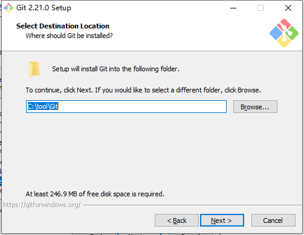
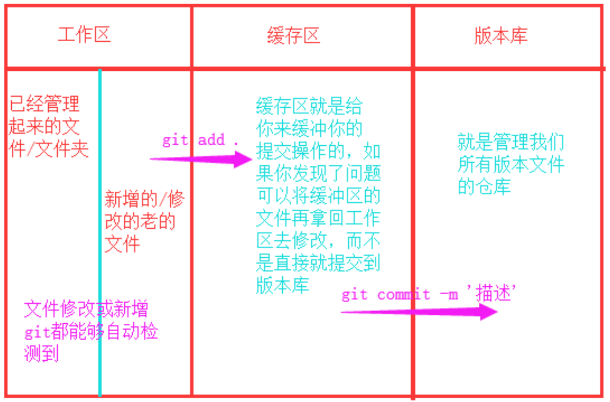
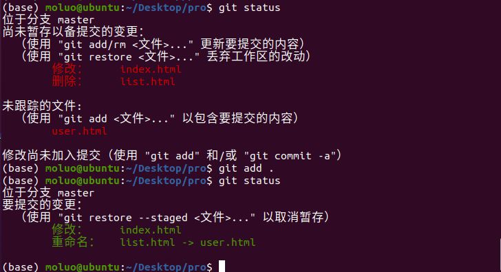
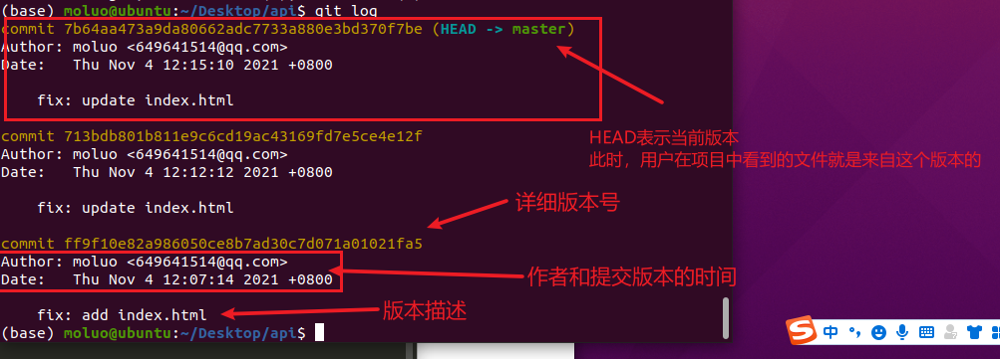
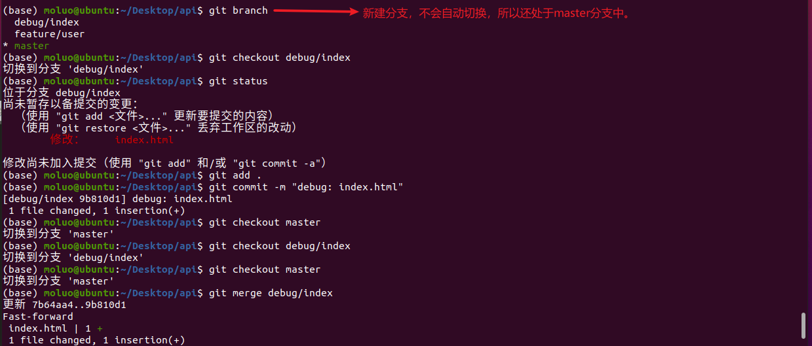
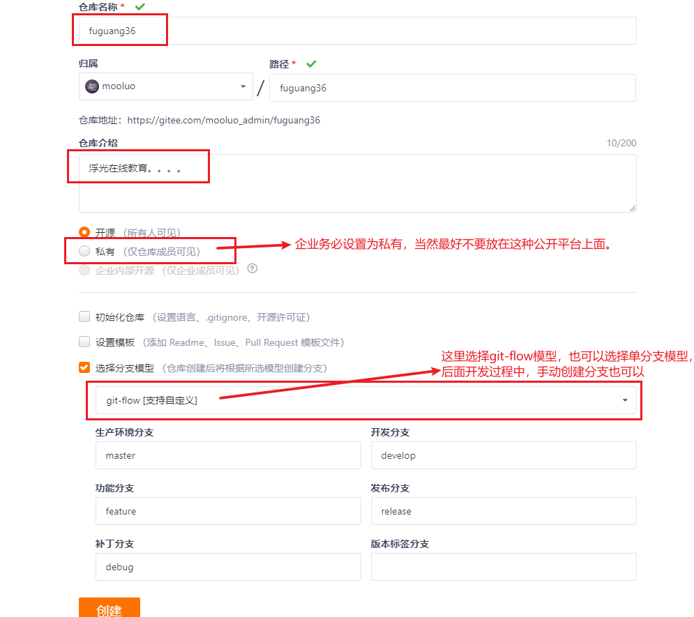
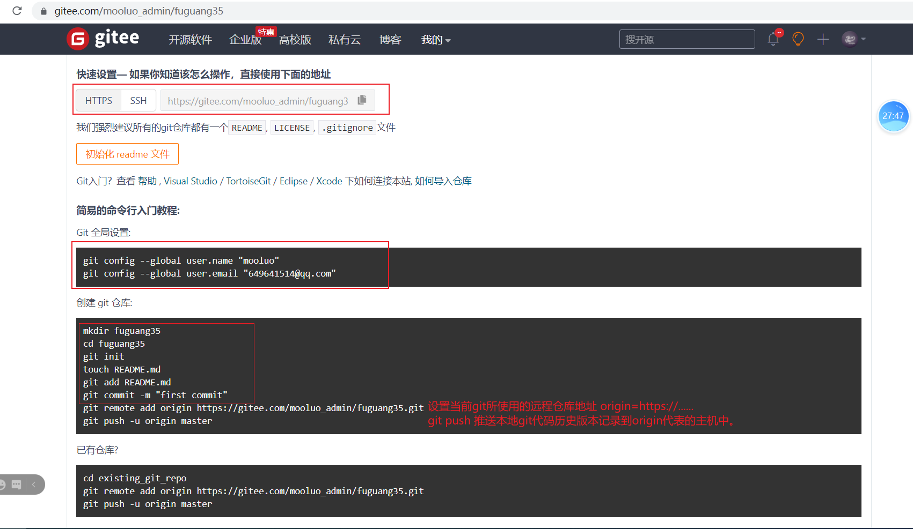
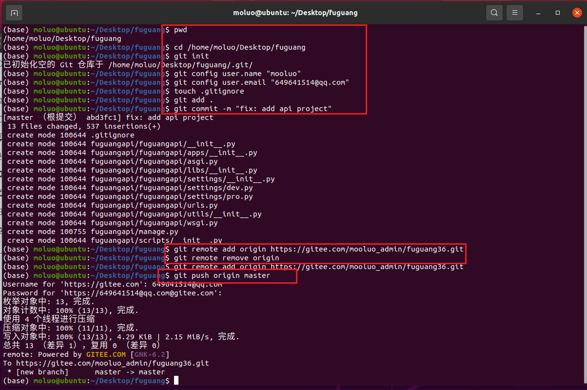
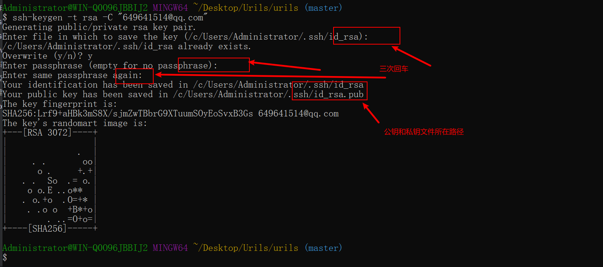
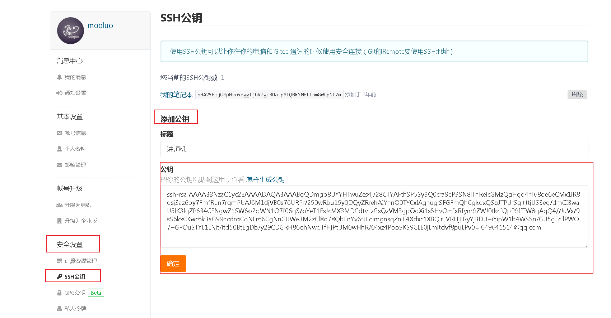

## 如何多人协同开发同一个项目？

防止因为各种不确定因素导致代码丢失。

防止出现多人开发过程中，因为修改同一文件而导致的文件覆盖情况。


使用代码版本控制[Version Control Syetem]软件

目前市面上比较流行的代码版本控制器有: git,svn

现在基本没什么人使用csv

git在苹果下很不友好的，使用mac的同学，需要基于brew来进行安装，git-svn


## 使用git管理代码版本

流行的源码托管平台：github，gitee(码云)，gitlab，coding

本项目使用git管理项目代码，代码库放在gitee码云平台。（注意，公司中通常放在gitlab私有服务器中）


## Git 的诞生

2005 年 4 月3 日，Git 是目前世界上最先进的**分布式**版本控制系统（没有之一）

作用：源代码管理

**为什么要进行源代码管理?**

- 方便多人协同开发[防止代码冲突，相互覆盖]
- 方便版本控制[利于以后的开发人员快速了解项目的开发过程，利于需求变更的时候进行代码回滚]

## Git的windows下安装

官网地址：

https://git-scm.com/download


下载到本地磁盘


安装


一路【next】就可以了




注意：**openssl  一定选它**

安装完成后，右击菜单栏，有如下菜单，表示安装完成


进入git bash选项


## Git的基本使用

## 工作区、暂存区和版本库





### 工作区介绍

就是在你本要电脑磁盘上能看到的目录。

### 暂存区介绍

一般存放在【.git】目录下的index文件(.git/index) 中，所以我们把暂存区有时也叫作索引。

### 版本库介绍

工作区有一个隐藏目录.git，这个不算工作区，而是Git的版本库。git中的head/master是分支，是版本库。


#### git项目仓库的本地搭建

```
cd进入到自己希望存储代码的目录路径，并创建本地仓库.git
新创建的本地仓库.git是个空仓库

  cd <开发工作目录>
  mkdir api
  cd api
  git init  # 如果没有声明目录,则自动把当前目录作为git仓库
```

初始化创建仓库


#### 在ubuntu界面下可以通过Ctrl+H快捷键或者windows下直观地显示隐藏目录.git，可以看到.git仓库目录的结构：

```bash
branches/   分支管理目录
config      当前项目代码仓库的配置信息[当前开发者配置的账户信息]
description 当前项目的描述
HEAD        当前项目仓库的当前版本信息
index       当前项目仓库中的add暂存库存储的索引版本信息
hooks/      当前项目仓库的钩子目录[可以利用这个目录下面的文件实现自己拉去代码到服务器，检测代码是否符合开发规范]
info        当前项目仓库的记录相关信息
logs/       当前项目仓库的日志相关信息[可以看版本历史]
objects     仓库版本存储信息[记录代码版本历史信息的]
refs        仓库版本引用信息[记录版本号信息的]
```

在api项目目录下创建index.html文件，并使用`git add .` 把修改状态保存到暂存区。

```bash
# 新增一个并写入内容
touch index.html
echo "index.html的第一行内容" > index.html

# 查看修改状态
git status

# 使用git记录修改状态到暂存区
git add .

```


修改了文件以后，如果没有执行`git add`，文件/目录的验证，在查看状态`git status`中是属于红色的


执行了`git add .`以后，则表示git对当前仓库中的文件进行了状态记录和跟踪，此时文件的颜色在`git status`查看状态，就成了绿色。


如果需要把`git add .` 中保存在暂存区中的状态取消暂存，可以采用以下命令取消暂存。

```bash
git rm -rf --cached .   # . 表示当前目录下所有文件和子目录
```

保存版本

```bash
# 如果上面恢复了git add . 的操作，则需要再次执行 
# git add .
git commit -m "fix: add index.html"
# git commit -m "debug: index.html"
```

当然，因为当前仓库是新仓库，我们的git也是新安装的。所以在提交的时候，如果之前没有录入账户信息，则会提示需要我们录入账户信息。


#### 第一次使用git需要配置git账户的用户名和邮箱。

```bash
# 针对当前目录所在仓库进行配置，直接采用如下命令：
# git config user.name '用户名'
# git config user.email '邮箱地址'


# 针对当前操作系统进行全局配置，将来在当前系统下所有git管理代码的仓库就会使用该身份。
# git config --global user.name '用户名'
# git config --global user.email '邮箱地址'
```

如果不设置，则无法提交代码版本到仓库中。 所以可以按以下命令添加账户信息。

```bash
git config user.name  "moluo"
git config user.email "649641514@qq.com"
```

 提交版本历史到git版本仓库中。

```bash
git commit -m "fix: add index.html"

# 当然，如果一开始就已经设置了账户信息，则 add 和 commit 这2个命令可以合并为：
# git commit -a -m "fix:add index.html"
```


#### 查看仓库状态

```bash
git status

# git status –s # 简约显示
```

- 红色表示新建文件或者新修改的文件,都在工作区，没有执行 git add之前的效果，表示git没有跟踪当前文件的状态
- 绿色表示文件的修改状态已经记录在了暂存区，是执行了git add 以后的效果，表示git已经跟踪了当前文件的状态




### 查看文件状态

**针对与文件所处的不同分区，文件所处的状态:**

(1)未追踪, 文件第一次出现在工作区, 版本库还没有存储该文件的状态(红色)

(2)已追踪, 只要第一次,git add了文件, 文件就是已追踪（绿色）

(3)未修改, 文件在工作区未被编辑（没有显示）

(4)已修改, 文件在工作区被修改（红色）

(5)未暂存, 文件已修改, 但是没有add到暂存区（红色）

(6)已暂存, 已经将修改的文件add到暂存区（绿色）

(7)未提交, 已暂存的文件, 没有commit提交. 处于暂存区（绿色）

(8)已提交, 提交到版本库的文件修改，只有commit以后才会有仓库的版本号生成


### 从暂存区中恢复文件/目录修改

```bash
git restore 文件   # 注意，只能回滚曾经被git跟踪过版本的文件
# 对于新增文件是没有办法回滚的，只能从暂存区中删除，执行删除操作[此处的删除不是删除文件，而是删除内存中的记录信息]
git rm -rf --cached .
```


### 查看历史版本[查看日志]

```bashgit log   
git log

也可以查看简单版本的日志信息：git reflog
```



#### 分页展示日志

```bash
git log –p 
# 退出按【q】键
# ctrl+f 下一页
# ctrl+b 上一页

# 该可以按时间范围，查看日志
# 显示指定日期之后的日志
git log --after  '2018-11-6'
# 显示指定日期之前的日志
git log --before '2018-11-6'

# 指定显示指定开发者的日志
git log --author 'moluo'
```


### 版本回滚

**方案一：**

- `HEAD`表示当前最新版本

- `HEAD^`表示当前最新版本的前一个版本

- `HEAD^^`表示当前最新版本的前两个版本，**以此类推...**

- `HEAD~1`表示当前最新版本的前一个版本

- `HEAD~10`表示当前最新版本的前10个版本，**以此类推...**

  ```
  git reset --hard HEAD^  # 目前在2.25.1版本中有问题，执行失败!!
  ```

**方案二：当版本非常多时可选择的方案**

- 通过每个版本的版本号回退到指定版本

  ```
  git reset --hard 版本号
  ```


## 分支管理

所谓的分支，表示通过git实现代码的复制版本管理。

在git中可以通过`git branch` 把原有的代码进行版本复制，每复制一个版本出来，就多出一个分支。


### 分支管理的常用命令

```bash
git branch                # 查看当前项目的所有分支[本地分支]
git branch <分支名称>      # 在当前所在分支中，新建一个分支，新分支的代码来自于当前分支
git checkout <分支名称>    # 切换分支，如果分支不存在，则报错
git checkout -b <分支名称> # 切换分支，如果分支不存在，则新建一个分支
git branch -d <分支名称>   # 删除指定分支，注意：必须先退出当前分支
git merge <分支名称>       # 把指定分支下的代码合并当前所在分支，[注意：必须先切换到当前分支，要保留的分支]
```

### 分支的创建和切换

```bash
# 查看当前仓库下所有分支
git branch
# 新建一个分支，名为feature/user，表示新开发一个功能或者研发一个新特性
git branch feature/user
# 查看当前仓库下所有分支
git branch

# 切换分支[检出分支代码]
git checkout feature/user
# 查看当前仓库下所有分支
git branch

# 新建一个文件，名为user.html
touch user.html
# 往user.html文件中写入内容
echo "用户相关的功能" > user.html
# 把当前仓库下修改的所有内容添加到暂存区
git add .
# 提交代码版本
git commit -m "fix: add user.html"
# 查看当前仓库下所有分支
git branch
```


如果在新分支中，有内容修改但是没有进行状态跟踪，没保存到暂存区，则切换分支，就会出现以下提示：


此时，我们可以取消本次操作也可以保存修改内容。

```bash
# 取消修改
git restore .

# 保存修改
# git add .
# git commit -m "描述信息"
```


### 分支合并

```bash
# 此处拿修改debug为例子。
# 切换到master主分支
git checkout master
# 新建分支，debug/index，表示修改bug
git branch debug/index
# 查看当前仓库下所有分支
git branch

# 切换分支
git checkout debug/index
# 模拟修改debug的过程
echo "修改一个重大的bug" >> index.html
# 把当前仓库下修改的所有内容添加到暂存区
git add .
# 提交代码版本
git commit -m "debug: index.html"

# 合并代码前，必须先切换回到要合并的主分支
git checkout master
# 进行分支代码合并
git merge debug/index   # 这里表示把debug/index分支的内容合并到master分支中
# 删除子分支
git branch -d debug/index
```





#### 分支合并过程/不同的代码版本中的代码冲突解决

合并代码过程中如果出现针对同一个文件出现不同版本的修改，就会出现版本冲突。


我们就需要根据git的提示或使用`git diff`查看冲突，打开冲突的所有文件，逐个文件进行代码的冲突解决。

```
解决冲突的原则就是：
	保留先提交的，后提交的代码让步，
	如果后提交的代码要保留则写在冲突位置的下方，如果后提交的代码不保留则删除掉即可。
```

根据上面的解决冲突原则，对冲突的代码文件进行调整。调整完成以后，再次记录状态、提交代码版本

```bash
git add .
git commit -m "fix: merge"
# 这样就合并的冲突代码了。
```


## 在gitee平台创建工程

注意：公司一般使用git管理项目, 往往会搭建一个gitlab自己内部平台管理代码, 也极有少部分的公司选择使用码云的企业版仓库来进行代码版本管理。

1） 创建git项目代码库



选择git-flow自定义分支模型。

上面的设置没有勾选初始化仓库，和没有设置模板，这个操作就表示创建空白仓库，后面的界面:



根据上面的命令提示，我们采用HTTPS协议连接gitee码云仓库

```bash
# 打开fuguang工程项目，并根据上面浏览器中的新仓库的提示，设置开发者身份
cd C:\Users\Administrator\Desktop\Urils  # 也可以在你保存项目目录的下面鼠标右键---> git bash进入终端
# 初始化本地仓库
mkdir urils
cd urils
git init
git config user.name "mooluo"
git config user.email "649641514@qq.com"
# 开发中总会有类似.idea/exe这样没有任何用处的文件或目录，对于这些东西我们可以设置让git上传下载的时候忽略它们。
touch .gitignore  # 在素材目录中自己根据实际情况情况调整.gitignore文件中需要忽略的内容
touch README.md
echo "# Urils" > README.md
git add .
git commit -m "fix: init git"
# 表示接下来的操作中，git通过https协议与远程的git仓库上传下载代码版本[每次上传代码必须填写账号密码]
git remote add origin https://gitee.com/mooluo_admin/urils.git
# 表示接下来的操作中，git通过ssh协议与远程的git仓库上传下载代码版本[可以设置免密登录操作，不需要填写账号密码]
# git remote add origin git@gitee.com:mooluo_admin/fuguang36.git
git push origin master
```




### ssh连接git仓库实现免密操作

**1. 生成ssh秘钥**

https://gitee.com/help/articles/4181#article-header0

```bash
# 生成ssh私钥
# ssh-keygen -t rsa -C "git账号"
# 查看公钥
# cat 秘钥地址.pub

# 例如我的码云是 649641514@qq.com
ssh-keygen -t rsa -C "649641514@qq.com"
cat /home/moluo/.ssh/id_rsa.pub # 把公钥进行复制到码云平台上 https://gitee.com/profile/sshkeys

# 更换git仓库的连接地址
git remote remove origin # 删除仓库地址
git remote add origin git@gitee.com:mooluo_admin/fuguang36.git  # 新仓库地址
```


 

私钥文件： /c/Users/Administrator/.ssh/id_rsa

公钥文件：/c/Users/Administrator/.ssh/id_rsa.pub

例子：



查看公钥信息，并把公钥的内容保存到gitee服务器（将来在公司里面则是你公司搭建的gitlab平台上）。


```bash
cat /c/Users/Administrator/.ssh/id_rsa.pub
```


gitee平台上保存SSH公钥的地址：https://gitee.com/profile/sshkeys




```bash
# 删除项目中原来的origin指向的远程主机仓库[这个时候的仓库协议是https]
git remote remove origin
# 换成SSH协议
git remote add origin git@gitee.com:mooluo_admin/urils.git
```


SSH首次远程连接服务端时，都会提示是否记录主机的指纹信息，输入yes即可。


### 拉取项目版本到本地

如果远程的git仓库在本地没有任何的备份，属于第一次拉取代码，需要不仅拉取代码信息，还要拉取git历史版本.git。

```bash
# git clone <仓库地址>
git clone https://gitee.com/mooluo_admin/urils.git
```

如果远程的git仓库在本地已经有了一个备份，属于非第一次拉取代码，则使用`git pull`进行拉取即可。

```bash
# 一般需要指定远程git仓库地址 和 分支名称
# git pull origin <分支名称>
# git pull origin master

# 如果远程主机的变量为origin，如果本次所在的分支和远程git仓库中的分支名称有对应，则可以简写
cd <项目根目录>
git pull
# git pull origin master
```

