# 深度神经网络基础

## 深度学习的正则化

> 学习⽬标
>
> - L2正则化与L1正则化的方法[知道]
> - 随机失活droupout的应用[知道]
> - 提前停止的使用方法[知道]
> - BN层的使用方法[知道]

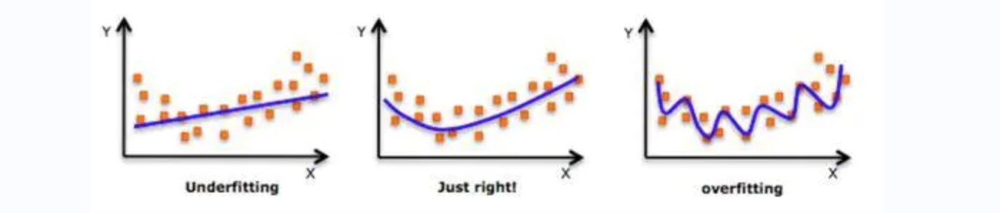

在设计机器学习算法时不仅要求在训练集上误差小，而且希望在新样本上的泛化能力强。许多机器学习算法都采用相关的策略来减小测试误差，这些策略被统称为正则化。因为神经网络强大的表示能力会经常遇到过拟合，所以也需要使用不同形式的正则化策略。

正则化通过对算法的修改来**减少泛化误差**，目前在深度学习中使用较多的策略有**参数范数惩罚**，**提前停止**，**Dropout**，**BN层（批标准化）**等，接下来我们对其进行详细学习。


### L1与L2正则化

L1和L2是最常见的正则化方法。它们在损失函数（cost function）中增加一个正则项，由于添加了这个正则化项，权重矩阵的值减小，因为它假定具有更小权重矩阵的神经网络导致更简单的模型。 因此它也会在**一定程度上减少过拟合**。然而，这个正则化项在L1和L2中是不同的。


**L2正则化**


这里的λ是正则化参数，它是一个需要优化的超参数，因为其会导致权重**趋向于0（但不全是0）**，所以L2正则化又称为权重衰减。


**L1正则化**


这里我们惩罚权重矩阵的绝对值。其中，λ 为正则化参数，是超参数。不同于L2，**L1的权重值可能被减少到0**。因此**L1具有稀疏性，所以对于压缩模型很有用**。其它情况下，一般选择优先选择L2正则化。

在tf.keras中实现使用的方法是：

L1正则化

```python
tf.keras.regularizers.L1(l1=0.01)
```

L2正则化

```python
tf.keras.regularizers.L2(l2=0.01)
```

L1L2正则化

```python
tf.keras.regularizers.L1L2(l1=0.1, l2=0.1)
```

我们直接在某一层的layers中指明正则化类型和超参数即可：

```python
# 导入相应的工具包
import tensorflow as tf
from tensorflow.keras import regularizers
# 创建空模型
model = tf.keras.models.Sequential()
# L2正则化，lambda为0.001，这里的数值是举例数值
model.add(tf.keras.layers.Dense(16, kernel_regularizer=regularizers.l2(l2=0.001), activation='relu', input_shape=(10,)))
# L1正则化，lambda为0.001，这里的数值是举例数值
model.add(tf.keras.layers.Dense(16, kernel_regularizer=regularizers.l1(l1=0.001), activation='relu'))
# L1L2正则化，lambda1为0.001,lambda2为0.01，这里的数值是举例数值
model.add(tf.keras.layers.Dense(16, kernel_regularizer=regularizers.L1L2(l1=0.001, l2=0.01), activation='relu'))

"""
model = tf.keras.models.Sequential([
    tf.keras.layers.Dense(16, kernel_regularizer=regularizers.l2(0.001), activation='relu', input_shape=(10,)),
    tf.keras.layers.Dense(16, kernel_regularizer=regularizers.l1(0.001), activation='relu'),
    tf.keras.layers.Dense(16, kernel_regularizer=regularizers.L1L2(0.001, 0.01), activation='relu')
])
"""
```


### Dropout正则化

**dropout，叫随机失活正则化，是在深度学习领域最常用的正则化技术。**Dropout的原理很简单：假设我们的神经网络结构如下所示，**在每个迭代过程中，随机选择某些节点，并且删除当前节点的前向和后向连接。**

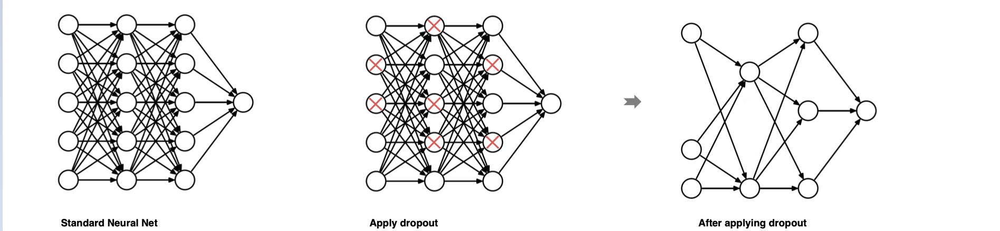

因此，每个迭代过程都会有不同的节点组合，从而导致不同的输出，这可以看成机器学习中的集成方法（ensemble technique）。集成模型一般优于单一模型，因为它们可以捕获更多的随机性。相似地，dropout使得神经网络模型优于正常的模型。

在tf.keras中实现使用的方法是dropout：

```python
tf.keras.layers.Dropout(rate) # 也叫失活层，跟着网络层后面。
```

参数：

+ rate： 每一个神经元被丢弃的概率，不能太大。一般0.01-0.5之间。

代码：

```python
# 导入相应的库
import numpy as np
import tensorflow as tf
# 定义dropout层,每一个神经元有0.2的概率被失活，未被失活的输入将按1 /（1-rate）放大
layer = tf.keras.layers.Dropout(0.2, input_shape=(2,))
# 定义五个批次的数据
data = np.arange(1,11).reshape(5, 2).astype(np.float32)
# 原始数据进行打印
print(data)
# 进行随机失活：在training模式中，返回应用dropout后的输出；或者在非training模式下，正常返回输出（没有dropout）
outputs = layer(data,training=True)
# 打印失活后的结果
print(outputs)
```

输出结果如下：

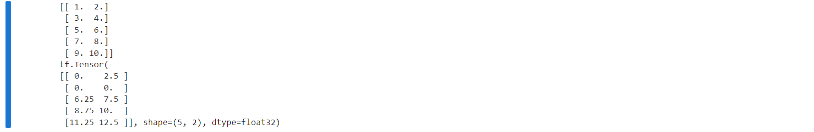


### 提前停止

提前停止（early stopping）是将一部分训练集作为验证集（validation set）。 **当验证集的性能越来越差时或者性能不再提升，则立即停止对该模型的训练。这被称为提前停止。**

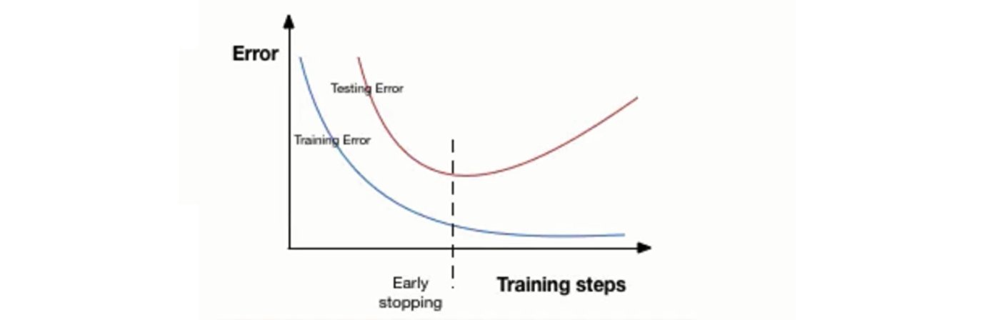

在上图中，在虚线处停止模型的训练，此时模型开始在训练数据上过拟合。

在tf.keras中，我们可以使用callbacks函数实现早期停止：

```python
tf.keras.callbacks.EarlyStopping(
    monitor='val_loss',  # 训练过程中监控的变量名  
    patience=5   # 观察的迭代次数
)
```

上面，monitor参数表示监测的变量名，这里val_loss表示验证集损失。而patience参数为epochs数量，当在这个过程性能无提升时会停止训练。为了更好地理解，让我们再看看上面的图片。 在虚线之后，每个epoch都会导致更高的验证集误差。 因此，虚线后patience个epoch，模型将停止训练，因为没有进一步的改善。

```python
# 导入相应的工具包
import tensorflow as tf
import numpy as np

# 模拟训练集的数据
x_train = np.arange(100).reshape(5, 20)
y_train = np.array([0,1,2,1,2])
# 定义提前停止的回调函数，监控的是loss，连续5次迭代训练没有更优解则自动停止训练
callback = tf.keras.callbacks.EarlyStopping(monitor="loss", patience=5)

# 定义只有一层的神经网络
model = tf.keras.models.Sequential([
    tf.keras.layers.Dense(10)
])

# 设置损失函数和梯度下降算法
model.compile(tf.keras.optimizers.SGD(), loss='mse')
model.fit(x_train, y_train, epochs=10, batch_size=1, callbacks=[callback], verbose=1)
```

打印效果如下：

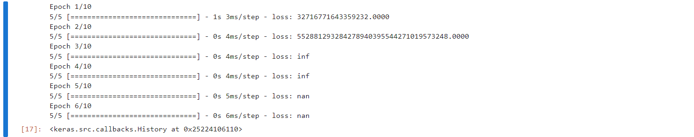


### 批标准化

批标准化(BN层，Batch Normalization)是2015年提出的一种方法，在进行深度网络训练时，大多会采取这种算法，与全连接层一样，**BN层也是属于神经网络中的一层，通常使用在卷积神经网络（CNN）中**。

BN层是**针对单个神经元进行，利用网络训练时一个 mini-batch 的数据来计算该神经元xi 的均值和方差，归一化后并重构**，因而称为 批标准化（Batch Normalization）。在每一层输入之前将数据进行BN，然后再送入后续网络中进行学习：

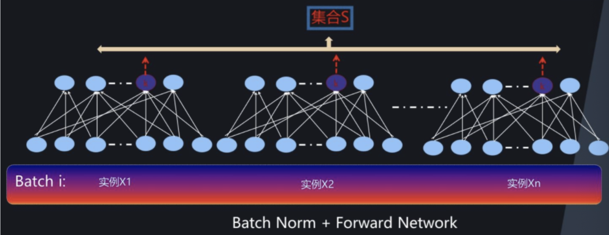

首先我们对某一批次（mini-batch）的数据的神经元的输出进行标准化：

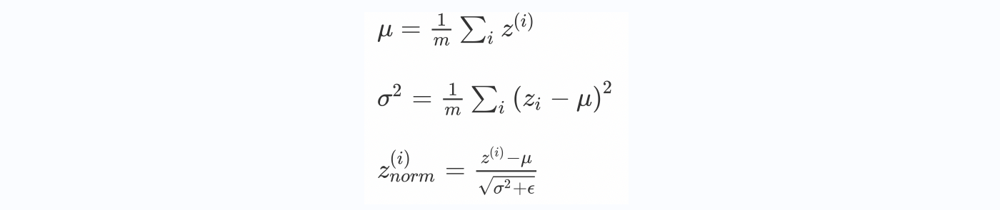

然后在使用变换重构，引入了可学习参数γ、β，如果各隐藏层的输入均值在靠近0的区域，即处于激活函数的线性区域，不利于训练非线性神经网络，从而得到效果较差的模型。因此需要用 γ 和 β 对标准化后的结果做进一步处理：

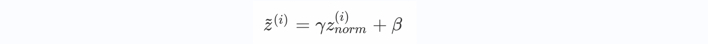

这就是BN层最后的结果。整体流程如下图所示：

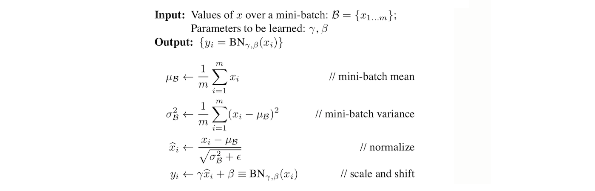


在tf.keras中实现使用：

```python
# 直接将其放入构建神经网络的结构中即可
tf.keras.layers.BatchNormalization(
    epsilon=0.001, center=True, scale=True,
    beta_initializer='zeros', gamma_initializer='ones',
)

# BN层是神经网络的正则化项，不是一个隐藏层这样的网络层概念，仅仅是对输出结果进行归一化处理。BN层经常使用在卷积神经网络（CNN）中的卷积层中。
model = tf.keras.models.Sequential()

model.add(keras.layers.Dense(128, activation="relu"), input_shape=(28,28))
model.add(keras.layers.Dropout(0.1)) # 失活层，仅仅是正则化项，不是网络层。让部分的神经元失活，去掉前向和后向的连接
model.add(keras.layers.BatchNormalization())  # BN层，对批量数据进行归一化处理，不是网络层。让输出数据处于同分布状态

model.add(keras.layers.Dense(128))
model.add(keras.layers.BatchNormalization()) # BN层也可以写在激活函数的前面
model.add(keras.layers.Aactivation("relu")) # 激活函数层，也不是一个网络层， 而是对前面的网络层数据进行加工处理而已。
model.add(keras.layers.Dense(128, activation="softmax"))
```

参数：

+ epsilon，防止分母为0
+ center，如果为True，则将偏移量beta添加到标准化张量。如果为False，则将beta忽略。
+ scale，如果为True，则乘以gamma，如果为False，gamma则不使用。
+ beta_initializer，beta权重的初始化方法。
+ gamma_initializer，gamma权重的初始化方法。

### 总结

+ 知道L2正则化与L1正则化的方法
  在损失函数（cost function）中增加一个正则化项，由于添加了这个正则化项，权重矩阵的值减小，因为它假定具有更小权重矩阵的神经网络导致更简单的模型
+ 知道随机失活droupout的应用
  在每个迭代过程中，随机选择某些神经元节点，并且删除该节点前向和后向的连接，让该神经元节点处于失活状态。
+ 知道提前停止的使用方法
  当看到验证集的性能越来越差时或者性能不再提升，立即停止对该模型的训练。
+ 知道BN层的使用方法
  利用网络训练时一个 mini-batch 的数据来计算该神经元xi 的均值和方差，归一化后并重构，因而称为 Batch Normalization。


## 案例-识别手写数字图片

> **学习目标**
>
> - 能够利用tf.keras获取数据集
> - 能够网络多层神经网络的构建
> - 能够完成网络的训练和评估

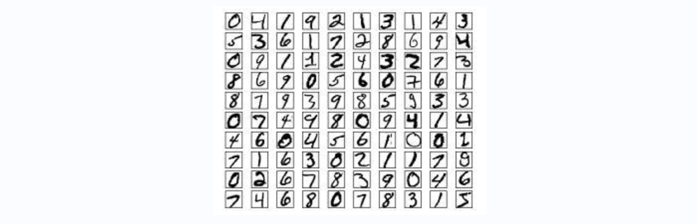


使用手写数字的MNIST数据集，如上图所示，该数据集包含60,000个用于训练的样本和10,000个用于测试的样本，图像是固定大小(28x28像素)，其值为0到255。整个案例的实现流程是：

- 数据加载
- 数据处理
- 模型构建
- 模型训练
- 模型测试
- 模型保存

首先要导入所需的工具包：

```python
# 导入相应的工具包
import numpy as np
import matplotlib.pyplot as plt
plt.rcParams['figure.figsize'] = (7,7) # Make the figures a bit bigger
import tensorflow as tf
# 数据集
from tensorflow.keras.datasets import mnist
# 构建序列模型
from tensorflow.keras.models import Sequential
# 导入需要的层
from tensorflow.keras.layers import Dense, Dropout, Activation, BatchNormalization
# 正则化
from tensorflow.keras import regularizers

# 修正matplotlib中文无法显示问题
from pylab import mpl
# 设置显示中文字体
mpl.rcParams["font.sans-serif"] = ["SimHei"]
# 设置正常显示符号
mpl.rcParams["axes.unicode_minus"] = False
```

### 数据加载

首先加载手写数字图像。

```python
# 加载数据集
(x_train, y_train), (x_test, y_test) = mnist.load_data()
# 打印输出数据集的维度
print("训练样本初始维度", x_train.shape)
print("目标值的初始维度", y_train.shape)

"""
训练样本初始维度 (60000, 28, 28)
目标值的初始维度 (60000,)
"""
```

数据展示：

```python
# 数据展示：将数据集的前九个数据集进行展示
for i in range(9):
    plt.subplot(3,3,i+1)
    # 以灰度图显示，不进行插值
    plt.imshow(x_train[i], cmap='gray', interpolation='none')
    # 设置图片的标题：对应的类别
    plt.title("数字{}".format(y_train[i]))
```

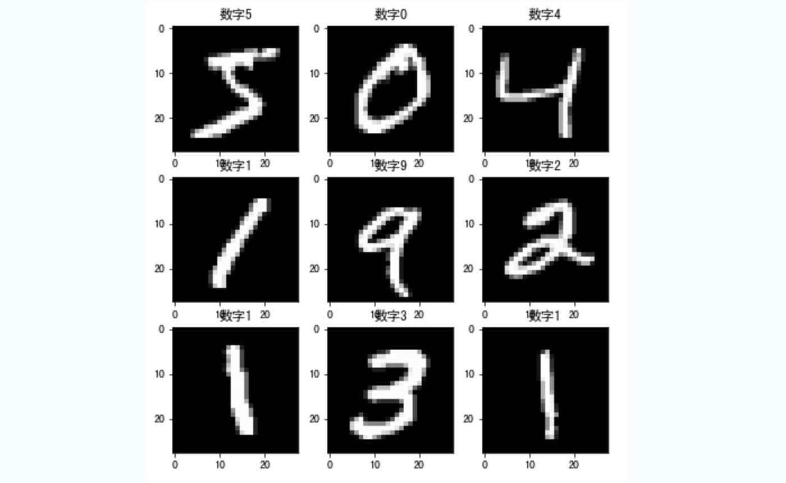


### 数据处理

神经网络中的每个训练样本是一个向量，因此需要对输入进行重塑，使每个28x28的图像成为一个的一维向量。另外将输入数据进行归一化处理，从0-255调整到0-1。

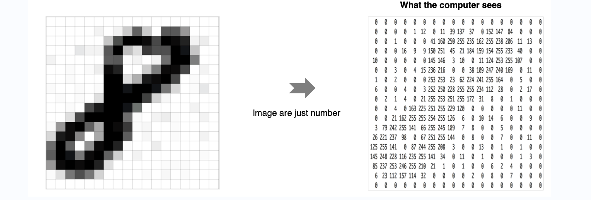

```python
# 调整数据维度：每一个数字转换成一个向量   28*28 = 784
x_train = x_train.reshape(60000, 784)
x_test = x_test.reshape(10000, 784)
# 格式转换
x_train = x_train.astype('float32')
x_test = x_test.astype('float32')
# 归一化
x_train /= 255
x_test /= 255
# 维度调整后的结果
print("训练集：", x_train.shape)
print("测试集：", x_test.shape)

"""
训练集： (60000, 784)
测试集： (10000, 784)
"""
```

另外对于目标值我们也需要进行处理，将其转换为热编码的形式：

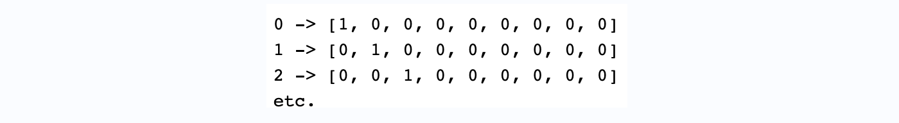

实现方法如下所示：

```python
# 进行独热编码
def one_hot_encode_object_array(arr):
    # 去重获取全部的类别
    uniques, ids = np.unique(arr, return_inverse=True)
    # 返回热编码的结果
    return tf.keras.utils.to_categorical(ids, len(uniques))

# 将训练集和测试集标签都进行独热码转化
y_train = one_hot_encode_object_array(y_train)
y_test = one_hot_encode_object_array(y_test)
```

### 模型构建

在这里我们构建只有3层全连接的神经网络来进行处理：

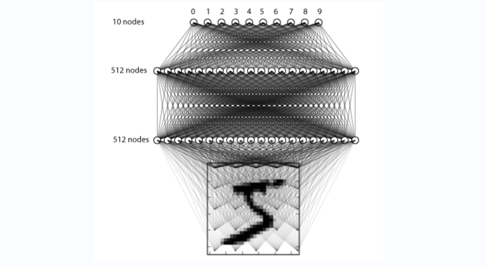

构建方法如下所示：

```python
# 利用序列模型来构建模型
model = Sequential()
# 全连接层，共512个神经元，输入维度大小为784
model.add(Dense(512, input_shape=(784,)))
# 激活函数使用relu
model.add(Activation('relu'))
# 使用正则化方法drouout                           
model.add(Dropout(0.2))  
# 全连接层，共512个神经元,并加入L2正则化
model.add(Dense(512, kernel_regularizer=regularizers.l2(0.001)))
# BN层
model.add(BatchNormalization())
# 激活函数
model.add(Activation('relu'))
model.add(Dropout(0.2))
# 全连接层，输出层共10个神经元
model.add(Dense(10))
# softmax将神经网络输出的score转换为概率值
model.add(Activation('softmax')) 

# 打印模型
model.summary()
```

我们通过model.summary() 来看下结果：

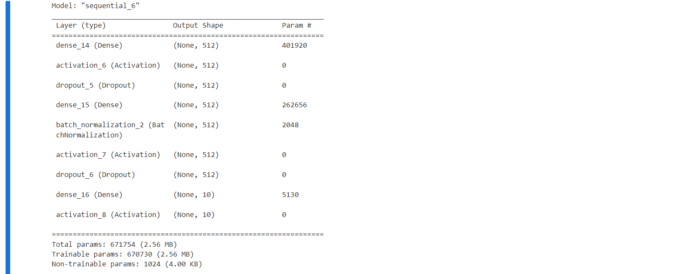


### 模型编译

设置模型训练使用的损失函数交叉熵损失和优化方法adam，损失函数用来衡量预测值与真实值之间的差异，优化器用来使用损失函数达到最优：

```python
# 模型编译，指明损失函数和优化器，评估指标
model.compile(loss='categorical_crossentropy', optimizer='adam', metrics=['accuracy'])
```

### 模型训练

```python
# batch_size是每次送入模型中样本个数，epochs是所有样本的迭代次数，并指明验证数据集
train_history = model.fit(x_train, y_train, batch_size=128, epochs=4, verbose=1, validation_data=(x_test, y_test))
```

训练过程如下所示：

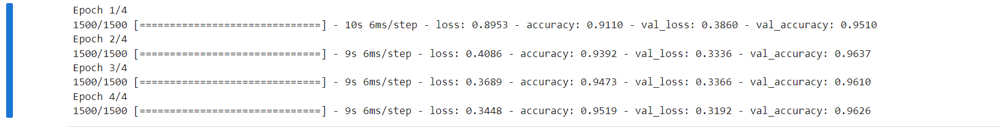

将损失绘制成曲线：

```python
# 绘制损失函数的变化曲线
plt.figure()
# 训练集损失函数变换
plt.plot(train_history.history["loss"], label="train_loss")
# 验证集损失函数变化
plt.plot(train_history.history["val_loss"], label="val_loss")
plt.legend()
plt.grid()
```

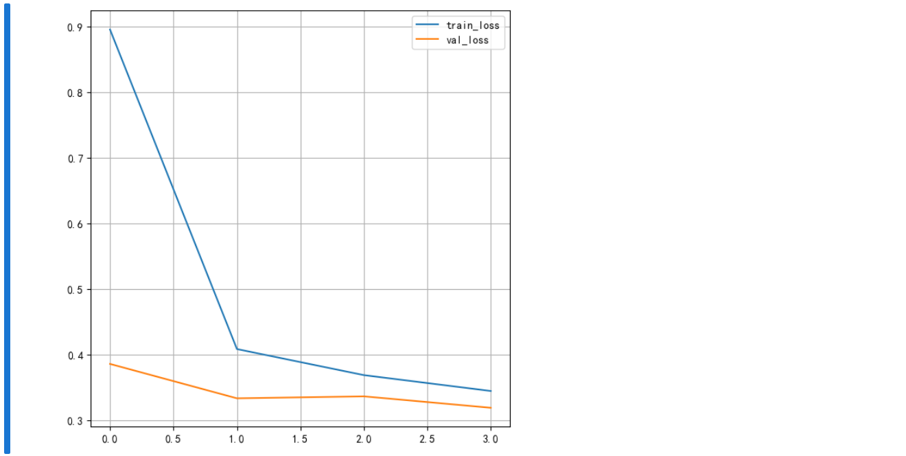


将训练的准确率绘制为曲线：

```python
# 绘制准确率的变化曲线
plt.figure()
# 训练集准确率
plt.plot(train_history.history["accuracy"], label="train_acc")
# 验证集准确率
plt.plot(train_history.history["val_accuracy"], label="val_acc")
plt.legend()
plt.grid()
```

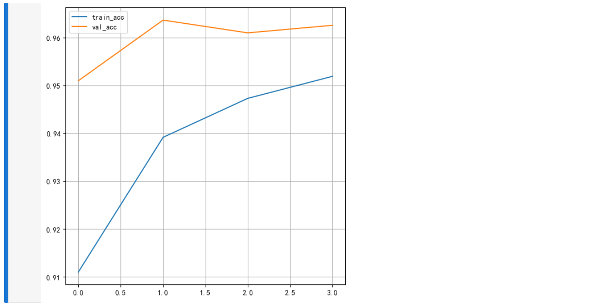

另外可通过tensorboard可视化监控训练过程，这时我们指定回调函数：

```python
# 添加tensoboard观察
tensorboard = tf.keras.callbacks.TensorBoard(log_dir='./graph', histogram_freq=1, write_graph=True, write_images=True)
```

再进行训练：

```python
# 训练
history = model.fit(x_train, y_train, batch_size=128, epochs=4,verbose=1,callbacks=[tensorboard], validation_data=(x_test, y_test))
```

打开CMD终端：

```python
# 如果是在anaconda的虚拟环境中，则需要先进入虚拟环境中，假设虚拟环境是tfdemo
# conda activate tfdemo
# 指定存在文件的目录，打开下面命令
tensorboard --logdir="./graph"
```

在浏览器中打开指定网址http://localhost:6006/，可查看损失函数和准确率的变化，图结构等。

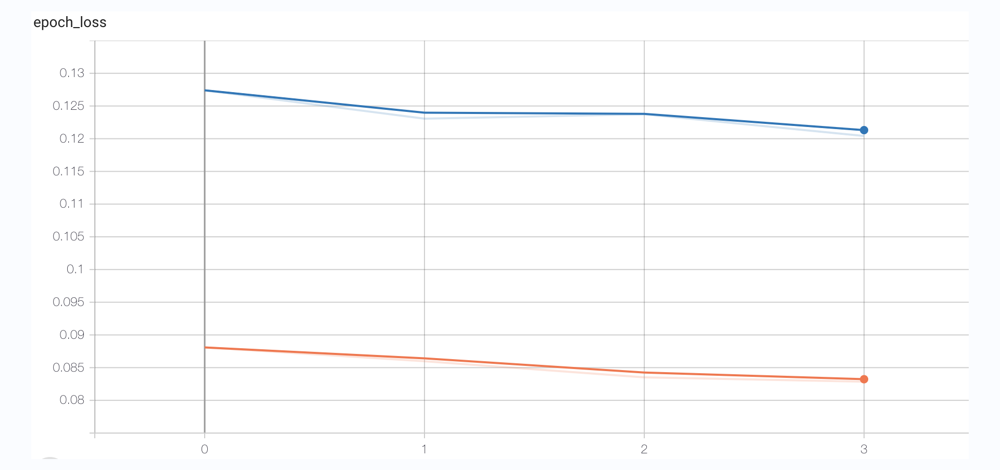

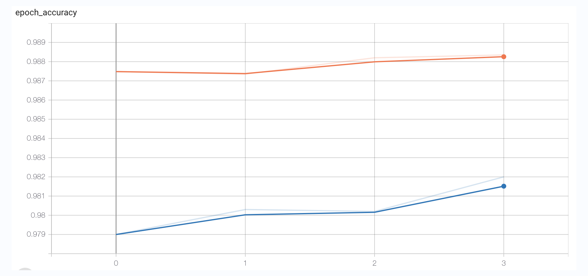


### 模型测试

```python
# 模型测试
score = model.evaluate(x_test, y_test, verbose=1)
# 打印结果
print('测试集准确率:', score)
```

打印结果：


### 模型保存

把训练完成的模型保存到本地，这里我们选择保存到当前目录下，模型名为：mnist_model.h5

```python
# 保存模型架构与权重在h5文件中
model.save('mnist_model.h5')
```

加载模型

```python
# 加载模型：包括架构和对应的权重
model = tf.keras.models.load_model('mnist_model.h5')
```

### 总结

- 能够利用tf.keras获取数据集

  load_data()

- 能够进行多层神经网络的构建

  dense，激活函数，dropout,BN层等

- 能够完成网络的训练和评估

  fit，回调函数，evaluate, 保存模型