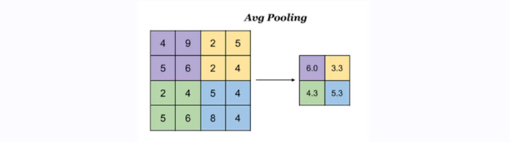

# 卷积神经网络基础

## 卷积神经网络(CNN) 

>**学习目标**
>
>- 卷积神经网络的构成[了解]
>- 卷积的原理以及计算过程[知道]
>- 池化的作用以及计算过程[了解]
>- 构建卷积神经网络[知道]


利用全连接神经网络对图像进行处理存在以下2个问题：

**1.需要处理的数据量大，效率低**

假如我们处理一张1000×1000像素的彩色图片，参数量如下：

1000×1000×3=3,000,000

在深度学习中处理图像一般用三维矩阵代表一张图片（长，宽，深度）。三维矩阵的长和宽代表了图像的大小，而三维矩阵的深度代表了图像的色彩通道。比如黑白图片的深度为1，而在RGB色彩模式下，图像的深度为3。

在全连接层模型中，这么大量的数据处理起来是非常消耗资源的。


**2.图像在维度调整的过程中很难保留原有的特征，导致图像处理的准确率不高**


假如有圆形是1，没有圆形是0，那么圆形的位置不同就会产生完全不同的数据表达。但是从图像的角度来看，**图像的内容（本质）并没有发生变化，只是位置发生了变化**。所以当我们移动图像中的物体，用全连接升降得到的结果会差异很大，这是不符合图像处理的要求的。


### CNN网络的构成

卷积神经网络（Convolutional Neural Networks, CNN）网络是一种受人类视觉神经系统的启发而设计出来的人工神经网络。人类的视觉原理：从原始信号摄入开始（瞳孔摄入像素Pixels），接着做初步处理（大脑皮层某些细胞发现边缘和方向），然后抽象（大脑判定，眼前的物体的形状，是圆形的），然后进一步抽象（大脑进一步判定该物体是只人脸）。下面是人脑进行人脸识别的一个示例：


**CNN网络主要有三部分构成：卷积层（convolution layer）、池化层（pooling layer）和全连接层（full-connection layer）构成，其中卷积层负责提取图像中的局部特征；池化层用来大幅降低参数量级(降维)；全连接层类似人工神经网络的部分，用来输出想要的结果。**


整个CNN网络结构如下图所示：


### 卷积层

卷积层（Convolutional Layer）是卷积神经网络中的核心模块之一，包含了多个可学习的滤波器（filter，也称为卷积核，感受野），卷积层的核心部分是卷积操作，**卷积层的目的是提取输入数据的特征图（Feature Map）**。

**对图像**（不同的数据窗口数据）**和滤波矩阵**（一组固定的权重：因为每个神经元的多个固定权重，所以又可以看做一个恒定的滤波器filter）**做内积**（逐个元素相乘再求和）**的操作就是卷积操作，也叫卷积运算，其目的是提取输入数据的不同特征**。

如下图中，在CNN网络训练过程中，滤波器filter（中间）不断地在输入数据（左边）上滑动做卷积操作输出新的二维数据，也就是特征图（右边）。


每个滤波器专注于检测输入数据的不同特征，如边缘、纹理等。通过堆叠多个卷积层，网络能够学习到更加复杂和抽象的特征。

如下图所示，卷积核可以提取图像中的边缘信息。


#### 卷积的计算方法

那卷积是怎么进行计算的呢？

假设下图中的左边橙色的矩阵就是经过了数据处理的输入数据，使用中间灰色滤波器进行卷积操作，右边特征图的长宽是多少？

具体的特征结果是多少？


卷积运算本质上就是在滤波器和输入数据的局部区域间做点积。


#### 单通道卷积

把上图进行逐步拆解，效果如下：


左上角的点计算方法：


同理可以计算其他各点，得到最终的卷积结果，


最后一点的计算方法是：


##### padding（填充）

填充的作用：

1. 让边缘的特征和中心的特征，在参与卷积操作的频率是相同的，避免出现过拟合。
2. 保证在卷积过程中保证输出的特征图与原来输出数据的大小一致。

在上述卷积过程中，特征图比原始图减小了很多，我们可以在原图像的周围进行padding，来保证在卷积过程中特征图大小不变。


##### stride（步长）

按照步长为1来移动卷积核，计算特征图如下所示：


如果我们把stride增大，比如设为2，也是可以提取特征图的，如下图所示：


#### 多通道卷积

实际中的图像都是多个通道组成的彩色图像，我们怎么进行卷积操作呢？


计算方法如下：当输入数据有多个通道（channel）时(例如图片可以有RGB三个通道)，滤波器需要拥有相同的通道（channel），每个滤波器的通道（channel）与输入数据的对应通道（channel）进行卷积，将每个通道（channel）的卷积结果按位相加得到最终的特征图。


```python
红色上左卷积操作：35*-1+19*-1+25*-1+13*0+22*1+61*-1+0*0+4*1+36*1 = -78
绿色上左卷积操作：9*1+7*0+3*0+26*1+34*-1+61*-1+15*1+4*0+36*-1=-81
蓝色上左卷积操作：4*0+6*1+3*1+0*0+44*1+61*0+3*1+4*-1+36*1 = 88
特征图上左：(-78)+(-81)+88=-71
```


#### 多滤波器卷积

如果有多个滤波器时怎么计算呢？

当有多个滤波器时，每个滤波器学习到不同的特征，对应产生包含多个channel的FeatureMap,例如下图有两个filter，所以output有两个channel。


#### 特征图大小

输出特征图的大小与以下参数息息相关：

| 参数    | 描述                | 举例                                        |
| ------- | ------------------- | ------------------------------------------- |
| size    | 卷积核/过滤器的大小 | 一般会选择为奇数，比如有`1*1`，`3*3`，`5*5` |
| padding | 零填充的方式        |                                             |
| stride  | 步长                | 一般是1                                     |

知道这几个参数以后，那计算方法，如下图所示：


假设输入数据（inputs）为5x5，滤波器（filter）为3x3，外加填充（padding）为1，步长（stride）为1，则其输出尺寸为：


如下图所示：


在tf.keras中卷积层的实现使用：

```python
tf.keras.layers.Conv2D(
    filters,
    kernel_size,
    strides=(1,1),
    padding='valid',
    activation=None
)
```

往模型中添加卷积层的代码，示例：

```python
model = tf.keras.models.Sequential()
model.add(tf.keras.layers.Conv2D(
    filters,
    kernel_size,
    strides=(1,1),
    padding='same',
    activation=None
))
```

主要参数说明如下：

| 参数        | 描述                                                         |
| ----------- | ------------------------------------------------------------ |
| filters     | 卷积过滤器的数量，对应输出特征图的通道数                     |
| kernel_size | 过滤器filter的大小                                           |
| strides     | 步长，默认是(1,1)                                            |
| padding     | 填充<br>valid：在输入数据的周围不使用填充。<br>same：使用填充，使输入数据和输出特征图的数据形状相同。 |
| activation  | 激活函数，依然可以使用之前的激活函数的。                     |


### 池化层(Pooling)

池化层是模仿人的视觉系统对数据进行降维，用更高层次的特征表示图像。实施池化的目的：降低信息冗余，提升模型的尺度不变性、旋转不变性，防止过拟合。有效降低了后续网络层的输入维度，缩减模型大小，提高计算速度，并提高了特征图的鲁棒性（健壮性、高可用性、可靠性）。它主要对卷积层学习到的特征图进行下采样（subsampling）处理，主要由两种：


#### 最大池化

**MaxPooling，取窗口内的最大值作为输出**，这种方式使用较广泛。

在tf.keras中实现的方法是：

```python
tf.keras.layers.MaxPool2D(
    pool_size=(2,2), # 池化窗口的大小
    strides=1, # 窗口移动的步长，默认为1
    padding='valid' # 是否进行填充，默认是不进行填充的
)
```


#### 平均池化

**AvgPooling，取窗口内的所有值的均值作为输出。**




在tf.keras中实现池化的方法是：

```python
tf.keras.layers.AveragePooling2D(
    pool_size=(2,2), # 池化窗口的大小
    strides=1, # 窗口移动的步长，默认为1
    padding='valid' # 是否进行填充，默认是不进行填充的
)
```


### 全连接层

全连接层位于CNN网络的末端，经过卷积层的特征提取与池化层的降维后，将特征图转换成一维向量送入到全连接层中进行分类或回归的操作。


在tf.keras中全连接层使用tf.keras.Dense实现。


> 常用的卷积神经网络的模型：
>
> LeNet、AlexNet、VGG net、GoogLeNet、Resnet和MobileNet。

### 卷积神经网络的构建

我们构建卷积神经网络在mnist数据集上进行处理，如下图所示：

LeNet-5是一个较简单的卷积神经网络，**输入的二维图像，先经过两次卷积层，池化层，再经过全连接层，最后使用softmax分类作为输出层。**


#### 导入模块

```python
import tensorflow as tf
from PIL import Image
import numpy as np
import matplotlib.pyplot as plt
```

#### 数据加载 load_data()

这里我们训练之前的手写数字图片的案，首先加载数据集：

```python
(x_train,y_train), (x_test,y_test) = tf.keras.datasets.mnist.load_data()

print(x_train.shape)
print(y_train.shape)
print(x_test.shape)
print(y_test.shape)

"""
(60000, 28, 28)
(60000,)
(10000, 28, 28)
(10000,)
"""
```


#### 数据处理 归一化

卷积神经网络的输入要求是：NHWC，分别是图片数量，图片高度，图片宽度和图片的颜色通道，因为手写数字图片是灰度图，通道为1.

```python
#数据处理：图片数量Num, 图片高度Height, 图片宽度Width, 图片的颜色通道Channel
#训练集数据转换形状，加上通道的1
x_train = tf.reshape(x_train, (x_train.shape[0], x_train.shape[1],x_train.shape[2], 1))
# x_train=tf.reshape(x_train, (60000, 28, 28, 1))
print(x_train.shape)
#测试集数据
x_test =tf.reshape(x_test,(x_test.shape[0],x_test.shape[1],x_test.shape[2],1))
# x_test=tf.reshape(x_test, (10000, 28, 28, 1))
print(x_test.shape)

"""
(60000, 28, 28, 1)
(10000, 28, 28, 1)
"""
```


#### 网络模型搭建

**Yann LeCun**于上世纪90年代提出了LeNet，他**首次采用了卷积层、池化层**这两个全新的神经网络组件。

LeNet-5模型输入的二维图像，先经过两次卷积层,池化层，再经过全连接层，最后使用softmax分类作为输出层。

模型构建如下：

```python
# 空模型
net = tf.keras.models.Sequential()
# C1，卷积层，6个5x5的滤波器
net.add(tf.keras.layers.Conv2D(filters=6, kernel_size=5, activation="sigmoid", kernel_initializer="he_normal", input_shape=(28, 28, 1)))
# P2，池化层，最大池化，窗口为2x2，步长为1
net.add(tf.keras.layers.MaxPool2D(pool_size=2, strides=1))
# C3，卷积层 16个5x5的滤波器
net.add(tf.keras.layers.Conv2D(filters=16, kernel_size=5, activation='sigmoid', kernel_initializer="he_normal",))
# P4 池化层，最大池化，窗口为2x2，步长为1
net.add(tf.keras.layers.MaxPool2D(pool_size=2,strides=1))

# F5，压平层，如果后面没有更多的卷积层和池化层了，在使用全连接成之前，可以使用压平层。
net.add(tf.keras.layers.Flatten())

# D6，全连接层，激活sigmoid
net.add(tf.keras.layers.Dense(120,activation='sigmoid', kernel_initializer="he_normal",))
# D7，全连接层，激活sigmoid
net.add(tf.keras.layers.Dense(84,activation='sigmoid', kernel_initializer="he_normal",))
net.add(tf.keras.layers.Dropout(0.2))
# D8，全连接层，激活softmax
net.add(tf.keras.layers.Dense(10,activation='softmax'))

# 通过net.summary()查看网络结构
net.summary()

```

通过net.summary()查看网络结构：


##### 卷积层的参数量计算

conv1中的滤波器为5x5x1，滤波器个数为6，每个滤波器有一个bias，所以参数量为：5x5x1x6+6=156。

conv2中的滤波器为5x5x6，滤波器个数为16，每个滤波器有一个bias，所以参数量为：5x5x6x16+16=2416。

目前除了全连接层Dense和卷积层是网络层以外，其他的都属于特殊层，不会计算参数。


#### 模型编译 compile

设置优化器和损失函数：

```python
# 优化器，SGD 随机梯度下降
optimizer=tf.keras.optimizers.SGD(learning_rate=0.9)
#模型编译：损失函数，优化器和评价指标
net.compile(optimizer=optimizer, loss='sparse_categorical_crossentropy', metrics=['accuracy'])
```

#### 模型训练 fit

模型训练：

```python
#模型训练
train_history = net.fit(x_train,y_train, epochs=10, validation_split=0.2)
```

训练流程：


##### 绘制准确率的变化曲线

```python
plt.figure()
# 训练集准确率
plt.plot(train_history.history["accuracy"], label="train_acc")
# 验证集准确率
plt.plot(train_history.history["val_accuracy"], label="val_acc")
plt.legend()
plt.grid()
```


#### 模型评估 evaluate

```python
#模型评估
score=net.evaluate(x_test,y_test, verbose=1)
print('Testaccuracy:',score[1])
"""
313/313 [==============================] - 1s 4ms/step - loss: 0.0524 - accuracy: 0.9861
Testaccuracy: 0.9861000180244446
"""
```

与使用全连接网络模型相比，卷积神经网络的准确度提高了很多。


#### 模型保存

```python
net.save("conv2d_mnist_model.h5")
```

重新加载模型，再次评估，是否正确保存了。

```python
# 重新加载模型
model = tf.keras.models.load_model("conv2d_mnist_model.h5")
# 再次评估模型
score=model.evaluate(x_test,y_test, verbose=1)
print('Testaccuracy:',score[1])
```


### 测试模型

读取图片数据进行预处理

```python
def get_local_image(image_path):
    """
    加载本地图片
    image_path: 本地图片地址，如 C:/images/3.png 或者  3.png
    """
    # 读取图片
    img = Image.open(image_path)
    img = img.convert('L').resize((28, 28))
    img_array = np.array(img)
    # 将像素值转换为0-1之间的浮点数
    img_array = img_array.astype('float32') / 255.0
    img_array_result = np.reshape(img_array, (1, 28,28,1))
    return img_array_result
```

加载上面训练完成保存的模型`conv2d_mnist_model.h5`，进行预测。

```python
def recognition_number_image(image_path, model_path):
    model = tf.keras.models.load_model(model_path)
    img = get_local_image(image_path)
    prediction = model.predict(img)
    prediction_result = np.argmax(prediction)
    return prediction_result

# 注意，3.png，是自己本地保存的灰底或者黑底的图片，与当前模型文件在同一个目录下
recognition_number_image("image/4.png", "conv2d_mnist_model.h5")
```

其他测试图片如下，当然也可以自己手写保存。


### 总结

- 卷积神经网路的组成

  卷积层，池化层，全连接层

- 卷积层

  卷积的计算过程

  ​	滤波器，也叫卷积核，感受野。

  ​	单通道卷积、多通道卷积、多滤波器卷积（多卷积核卷积）

  stride 步长

  padding  填充，让输入数据和特征图的形状保持一致。

- 池化层

  ​	最大池化 MaxPooling，池化窗口的最大值

  ​	平均池化  AvgPooling，池化窗口中所有数据的平均值

- CNN结构的实现和构建实现

  LeNet-5：2层卷积层和池化层，全连接层。

