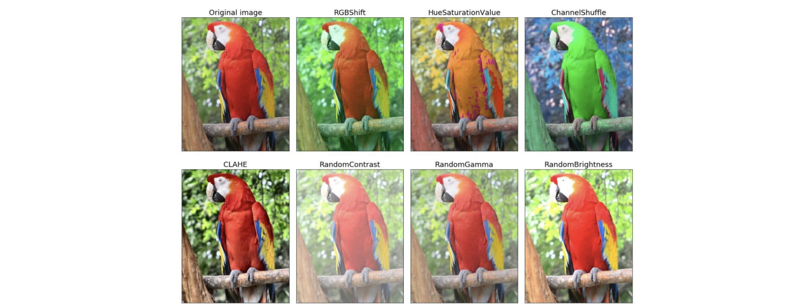

# 图像分类处理

> 学习目标
>
> 图像分类的目的[知道]
>
> imageNet数据集[知道]
>
> LeNet-5网络结构[了解]
>
> AlexNet网络结构的特点[了解]
>
> 利用AlexNet完成图像分类[知道]
>
> VGG网络结构的特点[了解]
>
> 利用VGG完成图像分类[知道]
>
> GoogLeNet网络结构的特点[了解]
>
> 利用GoogLeNet完成图像分类[知道]
>
> ResNet网络结构的特点[了解]
>
> 利用ResNet完成图像分类[知道]
>
> 图像增强的常用方法[了解]
>
> 利用tf.keras来完成图像增强[知道]
>
> 微调的原理[了解]
>
> 利用微调模型来完成图像的分类任务[知道]

观察模型训练过程中的损失率曲线，进行模型的调优：

1. 当目标损失率loss下降，但是实际测试损失率val_loss稳定，表示当前网络处于过拟合状态，添加失活层和最大池化。
2. 当目标损失率loss稳定，但是实际测试损失率val_loss下降，表示当前训练集数据有问题，需要查看数据的结构，或者是否存在多余注释，或者是提供的训练集数据质量太差了，更换训练数据集。
3. 当目标损失率loss稳定的同时，实际测试损失率val_loss也处于稳定，表示训练遇到瓶颈了，没有办法继续提升性能了，需要减小学习率，或者对训练集的批次（batch）数量上的调整。
4. 当目标损失率loss上升的同时，实际测试损失率val_loss也处于上升，表示网络模型设计有问题，或者超参数设计不合理，数据集没有得到有效的清洗，这是几种情况里最差的了。

## 简介

图像分类实质上就是从给定的类别集合中为图像分配对应标签的任务。也就是说我们的任务是分析一个输入图像并返回一个该图像类别的标签。假定类别集为`categories={dog, cat, panda}`，之后我们提供一张图⽚给分类模型，如下图所示：


分类模型给图像分配多个标签，每个标签的概率值不同，如dog: 95%，cat: 4%，panda: 1%，根据概率值的大小将该图⽚分类dog，那就完成了图像分类处理的任务。


## 常用数据集

### mnist

该数据集是手写数字0-9的集合，共有60k训练图像、10k测试图像、10个类别、图像大小28×28×1。我们可以通过tf.keras直接加载该数据集：

```python
from tensorflow.keras.datasets import mnist
#加载mnist数据集
(train_images,train_labels),(test_images,test_labels)=mnist.load_data()
```

随机选择图像展示结果如下所示：


### FashionMnist

Fashion-MNIST是Zalando的研究论文中提出的一个数据集，由包含60000个实例的训练集和包含10000个实例的测试集组成。每个实例包含一张28x28的灰度服饰图像和对应的类别标记（共有10类服饰，分别是：t-shirt（T恤），trouser（牛仔裤），pullover（套衫），dress（裙子），coat（外套），sandal（凉鞋），shirt（衬衫），sneaker（运动鞋），bag（包），ankleboot（短靴））。


### CIFAR-10和CIFAR-100

CIFAR-10数据集5万张训练图像、1万张测试图像、10个类别、每个类别有6k个图像，图像大小32×32×3。下图列举了10个类，每一类随机展示了10张图片：


CIFAR-100数据集也是有5万张训练图像、1万张测试图像、包含100个类别、图像大小32×32×3。在tf.keras中加载数据集时：

```python
import tensorflowastf
from tensorflow.keras.datasets import cifar10,cifar100
#加载Cifar10数据集
(train_images,train_labels),(test_images,test_labels)=cifar10.load_data()
#加载Cifar100数据集
(train_images,train_labels),(test_images,test_labels)=cifar100.load_data()
```


### ImageNet

ImageNet数据集是ImageNet是一个超过15million的图像数据集，大约有22,000类，是ILSVRC（大规模视觉识别）竞赛使用的数据集，由斯坦福大学李飞飞教授主导，包含了超过1400万张全尺寸的有标记图片，大约有22000个类别的数据。ILSVRC全称Image Net Large-Scale Visual Recognition Challenge，是视觉领域最受追捧也是最具权威的学术竞赛之一，代表了图像领域的最高水平。从2010年开始举办到2017年最后一届，使用ImageNet数据集的一个子集，总共有1000类。


该比赛的获胜者从2012年开始都是使用的深度学习的方法，2017是ImageNet的最后一届竞赛，2018年起由WebVision竞赛（ChallengeonVisualUnderstandingbyLearningfromWebData）来接棒。


+ 2012年冠军是AlexNet模型，由Geoffrey Hinton（杰弗里·辛顿）和他2个学生Ilya Sutskever（伊尔亚·苏茨克维）与Alex Kwiatkowski（亚历克斯·克里泽夫斯基）开发，由于准确率远超传统方法的第二名（top5错误率为15.3%，第二名为26.2%），引起了很大的轰动。自此之后，CNN成为在图像识别分类的核心算法模型，带来了深度学习的大爆发。
+ 2013年冠军是ZFNet，结构和AlexNet区别不大，分类效果也差不多。
+ 2014年亚军是VGG网络，网络结构十分简单，因此至今VGG-16仍在广泛使用。
+ 2014年的冠军网络是GooLeNet，核心模块是Inception Module。Inception历经了V1、V2、V3、V4等多个版本的发展，不断趋于完善。GoogLeNet取名中L大写是为了向LeNet致敬，而Inception的名字来源于盗梦空间中的"we need to go deeper"梗。
+ 2015年冠军网络是ResNet。核心是带短连接的残差模块，其中主路径有两层卷积核（Res34），短连接把模块的输入信息直接和经过两次卷积之后的信息融合，相当于加了一个恒等变换。短连接是深度学习又一重要思想，除计算机视觉外，短连接思想也被用到了机器翻译、语音识别/合成领域。
+ 2017年冠军SENet是一个模块，可以和其他的网络架构结合，比如GoogLeNet、ResNet等。

上述图像分类模型都比较经典，特别是VGG-16、GoogLeNet和ResNet，现在仍然在广泛使用。所以在后续课程中我们对这些网络进行逐一学习和了解。


## LeNet-5

LeNet-5架构也许是最广为人知的CNN架构，是由YannLeCun（杨立昆，法国人，卷积神经网络之父）于1998年创建的，广泛用于手写数字识别（MNIST就是杨立昆开源的）。


LeNet-5的网络结构比较完整，包括卷积层、池化层、全连接层，这些都是现代CNN网络的基本组件，其被认为是CNN的开端，因此杨立昆也被称之为"卷积神经网络之父"。网络结构如下：


我们可以发现，LeNet网络模型的主要结构是由：输入层、卷积层、池化层、全连接层、输出层这五个经典部分，网络的主要流程是：卷积->池化->卷积->池化。（现在的网络基本流程是会在池化层之后加一个激活层，如Relu、LeakyRelu；有的的网络通过1x1的卷积替换了全连接层，实现了全卷积的操作。需要注意的是：

+ MNIST图像是28×28像素，但是它们被零填充到32×32像素，并且在被输入到网络之前被归一化。网络的其余部分不使用任何填充，这就是为什么随着图像在网络中的进展，大小不断缩小。
+ 平均池化层比平常稍微复杂一些：每个神经元计算输入的平均值，然后将结果乘以一个可学习的系数（学习率，每个特征映射一个），并添加一个可学习的偏差项（偏置，每个特征映射一个），然后最后应用激活函数（使用的是tanh）。
+ C3图中的大多数神经元仅在三个或四个S2图（而不是全部六个S2图）中连接到神经元。
+ 输出层有点特殊：每个神经元不是计算输入和权向量的点积，而是输出其输入向量和其权向量之间的欧几里德距离的平方。每输出测量图像属于特定数字类别的多少。交叉熵损失函数现在是首选，因为它更多地惩罚不好的预测，产生更大的梯度，从而更快地收敛。

下图是LeNet-5的模型层结构：


### 代码实现

对cifar10数据集进行训练

#### 导入模块

```python
import tensorflow as tf
import matplotlib.pyplot as plt
import numpy as np
```

#### 加载数据

```python
(x_train, y_train), (x_test, y_test) = tf.keras.datasets.cifar10.load_data()
print(x_train.shape)
print(y_train.shape)
print(x_test.shape)
print(y_test.shape)
```

#### 数据处理

```python
# 归一化
x_train,x_test=tf.cast( x_train/255.0, tf.float32 ), tf.cast( x_test/255.0, tf.float32 )  # 归一化
```

#### 构建模型-LeNet-5

```python
model=tf.keras.Sequential()
# C1卷积层，6个卷积核，大小（5，5），使用填充保持原图像大小，激活函数：sigmoid，输入形状（32,32,3）
model.add(tf.keras.layers.Conv2D(filters=6, kernel_size=(5, 5), padding='same', activation="tanh", input_shape=(32, 32, 3)))
# S2池化层，大小（2，2），步长为2
model.add(tf.keras.layers.MaxPooling2D(pool_size=2, strides=2))
# C3卷积层，16个卷积核，大小（5，5），激活函数：sigmoid
model.add(tf.keras.layers.Conv2D(filters=16, kernel_size=(3,3), activation="tanh"))
model.add(tf.keras.layers.Conv2D(filters=16, kernel_size=(3,3), activation="tanh"))
# S4池化层，大小（2，2），步长为2
model.add(tf.keras.layers.MaxPooling2D(pool_size=2, strides=2))
model.add(tf.keras.layers.Conv2D(filters=120, kernel_size=(5,5), activation="tanh"))
# F6全连接层，84个神经元，激活函数：sigmoid
model.add(tf.keras.layers.Flatten())
model.add(tf.keras.layers.Dense(84, activation='tanh'))
# 输出层
model.add(tf.keras.layers.Dense(10, activation='softmax'))
model.summary()
```


#### 模型构建

```python
#优化器，adam优化器
model.compile(optimizer="adam", loss=tf.losses.sparse_categorical_crossentropy, metrics=['accuracy'])
#设置监控训练损失率val_loss，连续7代没有提升或性能下降，则提前停止
callback=tf.keras.callbacks.EarlyStopping(monitor='val_loss', patience=7)
```

#### 模型训练

```python
train_history=model.fit(x_train, y_train, validation_split=0.2, epochs=10, callbacks=[callback])
```

#### 模型评估

```python
# 指定测试数据
model.evaluate(x_test, y_test, verbose=1)
```


## AlexNet

2012年，Geoffrey Hinton（杰弗里·辛顿，杨立昆的导师）和他2个学生Ilya Sutskever（伊尔亚·苏茨克维）与Alex Kwiatkowski（亚历克斯·克里泽夫斯基）以很大的优势赢得了ImageNet图像识别挑战赛，刷新了image classification的记录，首次证明了**模型学习到的特征可以超越手工设计的特征**，从而一举打破计算机视觉研究的方向，一举奠定了深度学习在计算机视觉中的地位。

AlexNet模型针对的是1000类的分类问题，AlexNet模型的名字源于《ImageNet Classification with Deep Convolutional Neural Networks》这篇论文的第一作者Alex Krishevsky的名字。


AlexNet与LeNet-5非常相似，只是更大更深，它是由5个卷积层和3个全连接层组成的，使用了8层卷积神经网络，是第一个将卷积层直接堆叠在一起，而不是在每个卷积层堆叠一个池化层。网络架构如下：


Input输入的图像规格：224x224x3（RGB图像），实际上会经过预处理变为227x227x3。因为(224-11)/4+1≠55，所以这里是做了填充再做卷积的，即先填充图像至227×227，再做卷积(227-11)/4+1=55。

AlexNet模型的特点：

+ AlexNet模型包含8层网络层，有5层卷积层和2层全连接层组成隐藏层，以及1个全连接输出层。
+ AlexNet模型的第一层中的卷积核形状是11x11。第⼆层中的卷积核形状减小到5x5，之后全采用3x3。所有的池化层窗口大小为3x3、步幅为2的最大池化。
+ AlexNet将sigmoid激活函数改成了ReLU激活函数（杰弗里·辛顿的设计），使计算更简单，网络更容易训练。
+ AlexNet通过DropOut失活层（杰弗里·辛顿的设计）来控制全连接层的模型复杂度。
+ AlexNet引入了大量的**图像增强**，如翻转、裁剪和颜⾊变化，从而进一步扩大数据集来缓解过拟合。

下图是AlexNet的模型层结构：


### 代码实现

AlexNet使用ImageNet数据集进行了模型训练，但因为ImageNet数据集较大训练时间较长，我们用前面的MNIST数据集来使用AlexNet。keras实现代码如下：

```python
# 构建AlexNet模型
net = tf.keras.models.Sequential([
    # 卷积层：96个滤波器，滤波器为11*11，步长为4，激活函数relu
    tf.keras.layers.Conv2D(filters=96, kernel_size=11, strides=4, activation='relu', input_shape=(227,227,1)),
    # 池化:窗口大小为3*3、步幅为2
    tf.keras.layers.MaxPool2D(pool_size=3, strides=2),
    # 卷积层：256个滤波器，滤波器为5*5，步长为1，padding为same，激活函数relu
    tf.keras.layers.Conv2D(filters=256, kernel_size=5, padding='same', activation='relu'),
    # 池化:窗口大小为3*3、步幅为2
    tf.keras.layers.MaxPool2D(pool_size=3, strides=2),
    # 卷积层：384个滤波器，滤波器为3*3，步幅为1，padding为same，激活函数relu
    tf.keras.layers.Conv2D(filters=384, kernel_size=3, padding='same', activation='relu'),
    # 卷积层：384个滤波器，滤波器为3*3，步幅为1，padding为same，激活函数relu
    tf.keras.layers.Conv2D(filters=384, kernel_size=3, padding='same', activation='relu'),
    # 卷积层：256个滤波器，滤波器为3*3，步幅为1，padding为same，激活函数relu
    tf.keras.layers.Conv2D(filters=256, kernel_size=3, padding='same', activation='relu'),
    # 池化:窗口大小为3*3、步幅为2
    tf.keras.layers.MaxPool2D(pool_size=3, strides=2),
    # 伸展为1维向量
    tf.keras.layers.Flatten(),
    # 全连接层:4096个神经元，激活函数relu
    tf.keras.layers.Dense(4096, activation='relu'),
    # 随机失活
    tf.keras.layers.Dropout(0.5),
    # 全链接层：4096个神经元，激活函数relu
    tf.keras.layers.Dense(4096, activation='relu'),
    # 随机失活
    tf.keras.layers.Dropout(0.5),
    # 输出层：10个神经元，激活函数softmax
    tf.keras.layers.Dense(10, activation='softmax')
])

net.summary()
```


#### 数据读取

```python
import numpy as np
# 获取手写数字数据集
(train_images, train_labels), (test_images, test_labels) = mnist.load_data()
# 训练集数据维度的调整：NHWC
train_images = np.reshape(train_images, (train_images.shape[0], train_images.shape[1], train_images.shape[2], 1))
# 测试集数据维度的调整：NHWC
test_images = np.reshape(test_images, (test_images.shape[0], test_images.shape[1], test_images.shape[2], 1))
```

读取数据时将图像高和宽扩大到AlexNet使用的图像高和宽为227x227。这个通过`tf.image.resize_with_pad`可以实现图片的填充。

由于使用全部数据训练时间较长，我们定义个方法获取部分数据，并将图像调整为227*227大小，进行模型训练：

```python
# 把图片填充到227
def get_resize_data(datas, labels, size, w, h):
    """
    从数据集中获取调整形状够的指定数量的样本
    @param datas  特征数据
    @param labels 目标数据
    @param size   随机取样的数量
    @param w      调整后的图片宽度
    @param h      调整后的图片高度
    """
    # 随机生成要抽样的样本的索引
    index = np.random.randint(0, np.shape(datas)[0], size)
    # 将这些数据resize成227*227大小
    resized_images = tf.image.resize_with_pad(datas[index], w, h)
    return resized_images.numpy(), labels[index]
```

调用上述两个方法，获取参与模型训练和测试的数据集：

```python
# 获取训练样本和测试样本
train_images, train_labels=get_resize_data(train_images, train_labels, 256,224,224)
test_images, test_labels=get_resize_data(test_images, test_labels, 128,224,224)
```

为了让大家更好的理解，我们将数据展示出来：

```python
# 数据展示：将数据集的前九个数据集进行展示
for i in range(9):
    plt.subplot(3,3,i+1)
    # 以灰度图显示，不进行插值
    plt.imshow(train_images[i].astype(np.int8).squeeze(), cmap='gray', interpolation='none')
    # 设置图片的标题：对应的类别
    plt.title("数字{}".format(train_labels[i]))
```

结果为：


#### 模型构建

使用上述创建的模型进行训练和评估。


#### 模型编译

```python
# 指定优化器，损失函数和评价指标
net.compile(optimizer="adam", loss='sparse_categorical_crossentropy', metrics=['accuracy'])
```

#### 模型训练

```python
# 模型训练：指定训练数据，batchsize,epoch,验证集
net.fit(train_images, train_labels, batch_size=128, epochs=3, verbose=1, validation_split=0.1)
```

#### 模型评估

```python
# 指定测试数据
net.evaluate(test_images, test_labels, verbose=1)
```

#### 模型保存

```python
net.save("alexnet_mnist_model.h5")
```


## VGG


VGGNet是2014年牛津大学计算机视觉组（Visual Geometry Group）和Google DeepMind公司的研究员一起研发出了深度卷积神经网络模型，该模型在那一年ImageNet比赛中取得在分类任务第二，定位任务第一的优异成绩。VGGNet突出的贡献是证明了很小的卷积核(3×3)，通过增加网络深度可以有效提高模型的识别准确率。VGG很好的继承了AlexNet的衣钵同时拥有着鲜明的特点。相比AlexNet ，VGG使用了更深的网络结构，**证明了增加网络深度能够在一定程度上影响网络性能**。

VGG有两种结构，分别是VGG16和VGG19，两者并没有本质上的区别，只是网络深度不一样。在训练实验过程中，作者当初做了六组实验，对应6个不同的网络模型，这六个网络深度逐渐递增的同时也有各自的特点。实验表明最后两组，即**深度最深的两组16和19层的VGGNet网络模型在分类和定位任务上的效果最好**。VGG16包含了16个隐藏层（13个卷积层和3个全连接层），而VGG19包含了19个隐藏层（16个卷积层和3个全连接层），这6种模型结构如下：


> 各组模型结构如下：
>
> A：11层，起始。
> A-LRN：11层，加了LRN，这是AlexNet里提出来的。
> B：13层，在A模型的基础上加了两个卷积层。64个3x3滤波器，128个3x3滤波器
> C:  16层，在B模型的基础上再进一步叠加了3个卷积层，但是加的是1 x1的滤波器。
> D：将C模型中1 x 1的滤波器替换成了3  x 3的滤波器，这就是今天流行的VGG16网络模型。
> E：在D模型的基础上进一步叠加了3个3x3的卷积层，这就是今天流行的VGG19网络模型。

VGG16与VGG19的模型结构如下：


VGG可以看成是加深版的AlexNet，整个网络由卷积层和全连接层叠加而成，和AlexNet不同的是，VGG中使用的都是小尺寸的卷积核(3×3)。VGG19的网络结构：


从结构图可以看出，VGG19模型是在AlexNet网络上每一层进行了改造，5个stage对应AlexNet中的5层卷积，3层全连接仍然不变，共19层（不包括Max pooling层和softmax层），最开始的图片输入的大小还是沿用了224x224x3，然后整个模型所有卷积层的卷积核个数依次为64，128，256，512，512。所有卷积层有**相同的配置**，即卷积核大小为3x3，步长为1，填充为1；共有5个最大池化层，大小都为2x2，步长为2；共有三个全连接层，前两层都有4096通道，第三层共1000路及代表1000个标签类别；最后一层为softmax层；所有隐藏层后都带有ReLU非线性激活函数；


总的来说，VGGNet使用的全部都是3x3的小卷积核和2x2的池化核，通过不断加深网络来提升性能。VGG可以通过重复使用简单的基础块来构建深度模型。


### VGG改进点总结  

+ **小卷积核。**

  通过堆叠多个`3*3`的卷积核(少数使用`1*1`）来替代大的卷积核，**让模型拥有更多的非线性变换，增加了CNN对特征的学习能力。小卷积核可以有效减少所需参数**，3个堆叠的`3*3`结构只有`7*7`结构参数数量的`(3*3*3)/(7*7)=55% )`。

+ **小池化核。**

  相比较于AlexNet使用的`3*3`的池化核，VGG全部为`2*2`的池化核。

+ **网络更深，特征图更宽（更大的感受野）。**

  卷积核专注于扩大通道数（深度），池化专注于缩小高和宽，使得模型更深更宽的同时，计算量的增加不断放缓。

+ **将卷积核替代全连接。**

  **使得到的模型结构可以接收任意高度或宽度的输入。**

+ **多尺度。**

  作者从多尺度训练可以提升性能受到启发，训练和测试时使用整张图片的不同尺度的图像**（图像增强技术），以提高模型的性能。**

+ **去掉了AlexNet的LRN层。**作者发现深度网络中LRN（Local Response Normalization，局部响应归一化）层作用不明显。

+ **采用Pre-training的方式，先训练级别简单（层数较浅）的VGGNet的A级网络，然后使用A网络的权重来初始化后面的复杂模型，加快训练的收敛速度。** 

+ **采用了Multi-Scale的方法来训练和预测。**可以增加训练的数据量，防止模型过拟合，提升预测准确率。

VGG的缺点，耗费更多计算资源，并且使用了更多的参数（这里不是3x3卷积核的锅），导致更多的内存占用（140M）。


### 代码实现

在tf.keras中实现VGG模型，首先来实现**VGG块**，它的**组成规律**是：**连续使用多个相同的填充为1、卷积核大小为3x3的卷积层后接上一个步幅为2、窗口形状为2x2的最大池化层**。卷积层保持输入的高和宽不变，而池化层则对其减半。我们使用 vgg_block 函数来实现这个基础的VGG块，它可以指定卷积层的数量 num_convs 和每层的卷积核个数num_filters：

```python
# 定义VGG网络中的卷积块：卷积层的个数，卷积层中卷积核的个数
def vgg_block(num_convs, num_filters):
    """
    num_filters: 卷积层的个数
    num_filters: 卷积层中卷积核的个数
    """
    # 构建序列模型
    blk = tf.keras.models.Sequential()
    # 遍历所有的卷积层
    for _ in range(num_convs):
        # 每个卷积层：num_filter个卷积核，卷积核大小为3*3，padding是same，激活函数是relu
        blk.add(tf.keras.layers.Conv2D(num_filters,kernel_size=3, padding='same',activation='relu'))
    # 卷积块最后是一个最大池化，窗口大小为2*2，步长为2
    blk.add(tf.keras.layers.MaxPool2D(pool_size=2, strides=2))
    return blk
```

VGG16网络有5个卷积块，前2块使用2个卷积层，而后3块使用3个卷积层。第一块的输出通道是64，之后每次对输出通道数翻倍，直到变为512。

```python
conv_arch = ((2, 64), (2, 128), (3, 256), (3, 512), (3, 512))
```

因为这个网络使用了13个卷积层和3个全连接层，所以经常被称为VGG-16,通过制定conv_arch得到模型架构后构建VGG16：

```python
def vgg(conv_arch):
    # 定义VGG网络
    # 构建序列模型
    net = tf.keras.models.Sequential()
    # 根据conv_arch生成卷积部分
    for num_convs, num_filters in conv_arch:
        net.add(vgg_block(num_convs, num_filters))
    # 卷积块序列后添加全连接层
    net.add(tf.keras.models.Sequential([
        # 压平层，将特征图展成一维向量
        tf.keras.layers.Flatten(),
        # 全连接层：4096个神经元，激活函数是relu
        tf.keras.layers.Dense(4096, activation='relu'),
        # 随机失活减半
        tf.keras.layers.Dropout(0.5),
        # 全连接层：4096个神经元，激活函数是relu
        tf.keras.layers.Dense(4096, activation='relu'),
        # 随机失活减半
        tf.keras.layers.Dropout(0.5),
        # 全连接层：10个神经元，激活函数是softmax
        tf.keras.layers.Dense(10, activation='softmax')
    ]))
    return net


# vgg网络实例化
net = vgg(conv_arch)
# 构造输入X，并将其送入到net网络中
X = tf.random.uniform((1,224,224,1))
y = net(X)
net.summary()
```

当然，除了上面封装函数的方式构建模型以外，也可以不使用函数而是直接编写网络层：

```python
model = tf.keras.models.Sequential()
# 卷积层1，输入输出同大小
model.add(tf.keras.layers.Conv2D(64, (3, 3), padding='same', activation="relu", input_shape=(224, 224, 1)))
# 卷积层2
model.add(tf.keras.layers.Conv2D(64, (3, 3), padding='same', activation="relu"))
# 池化层1，高宽减半
model.add(tf.keras.layers.MaxPooling2D(pool_size=2, strides=2))
# 卷积层3
model.add(tf.keras.layers.Conv2D(128, (3, 3), padding='same', activation="relu"))
# 卷积层4
model.add(tf.keras.layers.Conv2D(128, (3, 3), padding='same', activation="relu"))
# 池化层2
model.add(tf.keras.layers.MaxPooling2D(pool_size=2, strides=2))
# 卷积层5
model.add(tf.keras.layers.Conv2D(256, (3, 3), padding='same', activation="relu"))
# 卷积层6
model.add(tf.keras.layers.Conv2D(256, (3, 3), padding='same', activation="relu"))
# 卷积层7
model.add(tf.keras.layers.Conv2D(256, (3, 3), padding='same', activation="relu"))
# 池化层3
model.add(tf.keras.layers.MaxPooling2D(pool_size=2, strides=2))

# 卷积层8
model.add(tf.keras.layers.Conv2D(512, (3, 3), padding='same', activation="relu"))
# 卷积层9
model.add(tf.keras.layers.Conv2D(512, (3, 3), padding='same', activation="relu"))
# 卷积层10
model.add(tf.keras.layers.Conv2D(512, (3, 3), padding='same', activation="relu"))
# 池化层4
model.add(tf.keras.layers.MaxPooling2D(pool_size=2, strides=2))

# 卷积层11
model.add(tf.keras.layers.Conv2D(512, (3, 3), padding='same', activation="relu"))
# 卷积层12
model.add(tf.keras.layers.Conv2D(512, (3, 3), padding='same', activation="relu"))
# 卷积层13
model.add(tf.keras.layers.Conv2D(512, (3, 3), padding='same', activation="relu"))
# 池化层5
model.add(tf.keras.layers.MaxPooling2D(pool_size=2, strides=2))

# 打平，压缩至1维
model.add(tf.keras.layers.Flatten())
# 全连接层1
model.add(tf.keras.layers.Dense(4096, activation="relu"))
model.add(tf.keras.layers.Dropout(0.5))

# 全连接层2
model.add(tf.keras.layers.Dense(4096, activation="relu"))
model.add(tf.keras.layers.Dropout(0.5))

model.add(tf.keras.layers.Dense(10, activation="softmax"))
model.summary()
```

#### 数据读取

```python
# 导入模块
import tensorflow as tf
import numpy as np
```

```python
# 获取手写数字数据集
(train_images, train_labels), (test_images, test_labels) = tf.keras.datasets.mnist.load_data()
print(train_images.shape)
print(train_labels.shape)
print(test_images.shape)
print(test_labels.shape)
# 训练集数据维度的调整：NHWC
train_images = np.reshape(train_images, (train_images.shape[0], train_images.shape[1], train_images.shape[2], 1))
# 测试集数据维度的调整：NHWC
test_images = np.reshape(test_images, (test_images.shape[0], test_images.shape[1], test_images.shape[2], 1))

print(train_images.shape)
print(train_labels.shape)
print(test_images.shape)
print(test_labels.shape)
```

由于使用全部数据训练时间较长，我们定义个方法获取部分数据，并将图像调整为224*224大小，进行模型训练：

```python
# 把图片填充到224
def get_resize_data(datas, labels, size, w, h):
    """
    从数据集中获取调整形状够的指定数量的样本
    @param datas  特征数据
    @param labels 目标数据
    @param size   随机取样的数量
    @param w      调整后的图片宽度
    @param h      调整后的图片高度
    """
    # 随机生成要抽样的样本的索引
    index = np.random.randint(0, np.shape(datas)[0], size)
    # 将这些数据resize成227*227大小
    resized_images = tf.image.resize_with_pad(datas[index], w, h)
    return resized_images.numpy(), labels[index]
```

调用上述方法，获取参与模型训练和测试的数据集：

```python
# 获取训练样本和测试样本
train_images,train_labels = get_resize_data(train_images, train_labels, 256, 224, 224)
test_images, test_labels = get_resize_data(test_images, test_labels, 128, 224, 224)

print(train_images.shape)
print(train_labels.shape)
print(test_images.shape)
print(test_labels.shape)
```

#### 模型构建

使用上述创建的模型进行训练和评估。


#### 模型编译

```python
# 指定优化器，损失函数和评价指标
model.compile(optimizer="adam", loss='sparse_categorical_crossentropy', metrics=['accuracy'])
```

#### 模型训练

```python
# 模型训练：指定训练数据，batchsize,epoch,验证集
model.fit(train_images, train_labels, batch_size=128, epochs=5, verbose=1, validation_split=0.1)
```

#### 模型评估

```python
# 指定测试数据
model.evaluate(test_images, test_labels, verbose=1)
```

#### 保存模型

```python
# 保存模型
model.save("vgg_mnist_model.h5")
```


## GoogLeNet


GoogLeNet架构是由Christian Szegedy（克里斯蒂安·塞格迪）等人开发的，来自Google Research，通过低于7%的top-5错误率，赢得了ILSVRC2014的挑战赛。GoogLeNet的名字不是GoogleNet，而是GoogLeNet，这是为了致敬LeNet。GoogLeNet和AlexNet/VGGNet这类依靠加深网络结构来提升网络性能的思想不完全一样。**GoogLeNet在加深度的同时做了结构上的创新，引入了一个叫做Inception的结构来代替之前的卷积加激活的经典组件**。GoogLeNet在ImageNet分类比赛上的Top-5错误率降低到了6.7%。


### Inception块

GoogLeNet中的基础卷积块叫作Inception块，得名于同名电影《盗梦空间》（Inception）。Inception块在结构比较复杂，如下图所示：


Inception块里有4条并行的线路。前3条线路使用窗口大小分别是1x1，3x3和5x5的卷积层来抽取不同空间尺寸下的信息，其中中间2个线路（3x3和5x5）会先对输入数据做1x1卷积来减少输入通道数，以降低模型复杂度。第4条线路则使用3x3最大池化层，后接1x1卷积层来改变通道数。4条线路都使用了合适的填充来使输入与输出的高和宽一致。最后我们将每条线路的输出在通道维上连结,并向后进行传输。


#### 1x1卷积

在上面的Inception空间块，大量使用到了1x1卷积层。所以我们先了解下这个1x1卷积层。


它的计算方法和其他卷积核一样，唯一不同的是它的大小是1x1，没有考虑在特征图局部信息之间的关系。其作用主要是：

+ 实现对特征在跨通道的交互和特征信息的整合统一，有效保留特征。
+ 卷积核通道数的降维和升维，减少网络参数。

GoogLeNet主要由Inception模块构成，如下图所示：


在tf.keras中实现Inception模块，各个卷积层卷积核的个数通过输入参数来控制，如下所示：

```python
# 定义Inception空间块
class Inception(tf.keras.layers.Layer):
    # 输入参数为各个卷积的卷积核个数，__init__必须左右2边使用2条英文下划线
    def __init__(self, c1, c2, c3, c4):
        """
        c1 整型，线路1卷积层的滤波器的数量（实际上还是神经元的数量）
        c2 列表，线路2卷积层的滤波器的数量（实际上还是神经元的数量）
        c3 列表，线路3卷积层的滤波器的数量（实际上还是神经元的数量）
        c4 整型，线路4卷积层的滤波器的数量（实际上还是神经元的数量）
        """
        super().__init__()
        # 线路1：1 x 1卷积层，激活函数是RELU，padding是same，保证输入和输出形状一致
        self.p1_1 = tf.keras.layers.Conv2D( c1, kernel_size=1, activation='relu', padding='same')
        # 线路2，1 x 1卷积层后接3 x 3卷积层,激活函数是RELU，padding是same
        self.p2_1 = tf.keras.layers.Conv2D( c2[0], kernel_size=1, activation='relu', padding='same')
        self.p2_2 = tf.keras.layers.Conv2D(c2[1], kernel_size=3, activation='relu', padding='same')
        # 线路3，1 x 1卷积层后接5 x 5卷积层,激活函数是RELU，padding是same
        self.p3_1 = tf.keras.layers.Conv2D(c3[0], kernel_size=1, activation='relu', padding='same')
        self.p3_2 = tf.keras.layers.Conv2D(c3[1], kernel_size=5, activation='relu', padding='same')
        # 线路4，3 x 3最大池化层后接1 x 1卷积层,激活函数是RELU，padding是same
        self.p4_1 = tf.keras.layers.MaxPool2D( pool_size=3, strides=1, padding='same')
        self.p4_2 = tf.keras.layers.Conv2D( c4, kernel_size=1, activation='relu', padding='same')
    # 完成前向传播过程
    def call(self, x):
        """
        x  上一个inception传递下来的特征数据，也就是输入数据
        """
        # 线路1
        p1 = self.p1_1(x)
        # 线路2
        p2 = self.p2_2(self.p2_1(x))
        # 线路3
        p3 = self.p3_2(self.p3_1(x))
        # 线路4
        p4 = self.p4_2(self.p4_1(x))
        # 在通道维上concat输出，通道合并，也就是特征图降维，使用tfconcat可以实现，参数1是一个列表，就要合并的特征图，参数axis固定为-1即可。
        outputs = tf.concat([p1, p2, p3, p4], axis=-1)
        return outputs
```

指定通道数，对Inception模块进行实例化：

```python
Inception(64, (96, 128), (16, 32), 32)
```

### GoogLeNet模型

整个网络架构我们分为五个Inception模块，每个模块之间使用步长（步幅）为2的3×3最大池化层来减小输出高宽。


模型架构：


#### B1模块

第一模块使用一个64通道的7×7卷积层。

```python
# 定义模型的输入
inputs = tf.keras.Input(shape=(224, 224, 1),name = "input")

# 卷积层7*7的卷积核，步长为2，pad是same，激活函数RELU
x = tf.keras.layers.Conv2D(64, kernel_size=7, strides=2, padding='same', activation='relu')(inputs)

# 最大池化：窗口大小为3*3，步长为2，pad是same
x = tf.keras.layers.MaxPool2D(pool_size=3, strides=2, padding='same')(x)
```

#### B2模块

第二模块使用2个卷积层：首先是64通道的1×1卷积层，然后是将通道增大3倍的3×3卷积层。

```python
# 卷积层1*1的卷积核，步长为2，pad是same，激活函数RELU
x = tf.keras.layers.Conv2D(64, kernel_size=1, padding='same', activation='relu')(x)
# 卷积层3*3的卷积核，步长为2，pad是same，激活函数RELU
x = tf.keras.layers.Conv2D(192, kernel_size=3, padding='same', activation='relu')(x)
# 最大池化：窗口大小为3*3，步长为2，pad是same
x = tf.keras.layers.MaxPool2D(pool_size=3, strides=2, padding='same')(x)
```

#### B3模块

第三模块串联2个完整的Inception块。第一个Inception块的输出通道数为64+128+32+32=256。第二个Inception块输出通道数增至128+192+96+64=480。

```python
# b3a Inception 模块
x = Inception(64, (96, 128), (16, 32), 32)(x)
# b3b Inception
x = Inception(128, (128, 192), (32, 96), 64)(x)
# 最大池化：窗口大小为3*3，步长为2，pad是same
x = tf.keras.layers.MaxPool2D(pool_size=3, strides=2, padding='same')(x)
```

#### B4模块

第四模块更加复杂。它串联了5个Inception块，其输出通道数分别是：

192+208+48+64=512、

160+224+64+64=512、

128+256+64+64=512、

112+288+64+64=528

256+320+128+128=832

并且增加了辅助分类器，根据实验发现网络的中间层具有很强的识别能力，为了利用中间层抽象的特征，在某些中间层中添加含有多层的分类器，如下图所示：


实现如下所示：

```python
def aux_classifier(x, filter_size):
    """
    辅助分类函数
    x：上一层网络的输出数据，特征图
    filter_size：滤波器数量，也是全连接层的神经元个数
    """
    #x:输入数据，filter_size:卷积层卷积核个数，全连接层神经元个数
    # 平均池化层
    x = tf.keras.layers.AveragePooling2D( pool_size=5, strides=3, padding='same')(x)
    # 1x1 卷积层
    x = tf.keras.layers.Conv2D(filters=filter_size[0], kernel_size=1, strides=1,  padding='valid', activation='relu')(x)
    # 展平
    x = tf.keras.layers.Flatten()(x)
    # 全连接层1
    x = tf.keras.layers.Dense(units=filter_size[1], activation='relu')(x)
    # softmax输出层
    x = tf.keras.layers.Dense(units=10, activation='softmax')(x)
    return x
```

b4模块的实现：

```python
# b4a Inception
x = Inception(192, (96, 208), (16, 48), 64)(x)
# 辅助输出1
aux_output_1 = aux_classifier(x, [128, 1024])
# b4b Inception
x = Inception(160, (112, 224), (24, 64), 64)(x)
# b4c Inception
x = Inception(128, (128, 256), (24, 64), 64)(x)
# b4d Inception
x = Inception(112, (144, 288), (32, 64), 64)(x)
# 辅助输出2
aux_output_2 = aux_classifier(x, [128, 1024])
# b4e Inception
x = Inception(256, (160, 320), (32, 128), 128)(x)
# 最大池化
x = tf.keras.layers.MaxPool2D(pool_size=3, strides=2, padding='same')(x)
```

#### B5模块

第五模块由两个Inception空间块组成，分别输出通道数为：

256+320+128+128=832、

384+384+128+128=1024

后面紧跟输出层，该模块使用全局平均池化层（GAP）来将每个通道的高和宽变成1。最后输出降维变成二维数组后接输出个数为标签类别数的全连接层。


##### 全局平均池化层（GAP）

用来替代全连接层，将特征图每一通道中所有像素值相加后求平均，得到就是GAP的结果，在将其送入后续网络中进行计算。


实现过程是：

```python
# b5a Inception
x = Inception(256, (160, 320), (32, 128), 128)(x)
# b5b Inception
x = Inception(384, (192, 384), (48, 128), 128)(x)
# GAP 全局平均池化层，实际上还是平均池化层的原理
x = tf.keras.layers.GlobalAvgPool2D()(x)
# 输出层
main_outputs = tf.keras.layers.Dense(10, activation='softmax')(x)
```

构建GoogLeNet模型并通过summary()来看下模型的结构：

```python
# 使用Model来创建模型，指明输入和输出
model = tf.keras.Model(inputs=inputs, outputs=[main_outputs, aux_output_1, aux_output_2]) 
model.summary()
"""
Model: "functional_3"
_________________________________________________________________
Layer (type)                 Output Shape              Param #   
=================================================================
input (InputLayer)           [(None, 224, 224, 3)]     0         
_________________________________________________________________
conv2d_122 (Conv2D)          (None, 112, 112, 64)      9472      
_________________________________________________________________
max_pooling2d_27 (MaxPooling (None, 56, 56, 64)        0         
_________________________________________________________________
conv2d_123 (Conv2D)          (None, 56, 56, 64)        4160      
_________________________________________________________________
conv2d_124 (Conv2D)          (None, 56, 56, 192)       110784    
_________________________________________________________________
max_pooling2d_28 (MaxPooling (None, 28, 28, 192)       0         
_________________________________________________________________
inception_19 (Inception)     (None, 28, 28, 256)       163696    
_________________________________________________________________
inception_20 (Inception)     (None, 28, 28, 480)       388736    
_________________________________________________________________
max_pooling2d_31 (MaxPooling (None, 14, 14, 480)       0         
_________________________________________________________________
inception_21 (Inception)     (None, 14, 14, 512)       376176    
_________________________________________________________________
inception_22 (Inception)     (None, 14, 14, 512)       449160    
_________________________________________________________________
inception_23 (Inception)     (None, 14, 14, 512)       510104    
_________________________________________________________________
inception_24 (Inception)     (None, 14, 14, 528)       605376    
_________________________________________________________________
inception_25 (Inception)     (None, 14, 14, 832)       868352    
_________________________________________________________________
max_pooling2d_37 (MaxPooling (None, 7, 7, 832)         0         
_________________________________________________________________
inception_26 (Inception)     (None, 7, 7, 832)         1043456   
_________________________________________________________________
inception_27 (Inception)     (None, 7, 7, 1024)        1444080   
_________________________________________________________________
global_average_pooling2d_2 ( (None, 1024)              0         
_________________________________________________________________
dense_10 (Dense)             (None, 10)                10250     
=================================================================
Total params: 5,983,802
Trainable params: 5,983,802
Non-trainable params: 0
___________________________________________________________
"""
```

### 代码实现

与VGG中是一样的，只是模型换了而已。


#### 数据读取

我们还是使用之前的手写数字图片来进行训练。

```python
# 获取手写数字数据集
(train_images, train_labels), (test_images, test_labels) = tf.keras.datasets.mnist.load_data()
print(train_images.shape)
print(train_labels.shape)
print(test_images.shape)
print(test_labels.shape)
# 训练集数据维度的调整：NHWC
train_images = np.reshape(train_images, (train_images.shape[0], train_images.shape[1], train_images.shape[2], 1))
# 测试集数据维度的调整：NHWC
test_images = np.reshape(test_images, (test_images.shape[0], test_images.shape[1], test_images.shape[2], 1))

print(train_images.shape)
print(train_labels.shape)
print(test_images.shape)
print(test_labels.shape)
```

由于使用全部数据训练时间较长，我们定义个方法获取部分数据，并将图像调整为224*224大小，进行模型训练：

```python
# 把图片填充到224
def get_resize_data(datas, labels, size, w, h):
    """
    从数据集中获取调整形状够的指定数量的样本
    @param datas  特征数据
    @param labels 目标数据
    @param size   随机取样的数量
    @param w      调整后的图片宽度
    @param h      调整后的图片高度
    """
    # 随机生成要抽样的样本的索引
    index = np.random.randint(0, np.shape(datas)[0], size)
    # 将这些数据resize成224*224大小
    resized_images = tf.image.resize_with_pad(datas[index], w, h)
    return resized_images.numpy(), labels[index]
```

调用上述两个方法，获取参与模型训练和测试的数据集：

```python
# 获取训练样本和测试样本
train_images,train_labels = get_resize_data(train_images, train_labels, 256, 224, 224)
test_images, test_labels = get_resize_data(test_images, test_labels, 128, 224, 224)

print(train_images.shape)
print(train_labels.shape)
print(test_images.shape)
print(test_labels.shape)
```

#### 模型构建

使用上述创建的模型进行训练和评估。


#### 模型编译

```python
# 指定优化器，损失函数和评价指标
model.compile(optimizer="adam", loss='sparse_categorical_crossentropy', metrics=['accuracy'])
```

#### 模型训练

```python
# 模型训练：指定训练数据，batchsize,epoch,验证集
model.fit(train_images, train_labels, batch_size=128, epochs=3, verbose=1, validation_split=0.1)
```

#### 模型评估

```python
# 指定测试数据
model.evaluate(test_images, test_labels, verbose=1)
```

#### 模型保存

```python
# 保存模型
model.save("googlenet_mnist_model.h5")
```


### 延伸版本

GoogLeNet是以Inception V1为基础进行构建的，所以GoogLeNet也叫做Inception Net，在随后的几年里，研究人员对GoogLeNet进行了数次改进， 就又产生了Inception V2，Inception  V3，Inception  V4等版本。


#### Inception V2

在Inception V2中将大卷积核拆分为小卷积核，将**V1中的5×5的卷积用两个3×3的卷积替代**，从而增加网络的深度，减少了参数。


#### Inception V3

**将n×n卷积分割为1×n和n×1两个卷积**，例如，一个的3×3卷积首先执行一个1×3的卷积，然后执行一个3×1的卷积，这种方法的**参数量和计算量都比原来降低**。


## ResNet

2015年ILSVRC挑战赛的赢家KaimingHe(何恺明)等人开发的ResNet（全称：Residual Network，残差卷积神经网络），该网络的top-5错误率低到惊人的3.6%，它使用了一个非常深的CNN，由152层组成（论文提出了好几种结构）。


ResNet同样也根据网络层数不同分为了ResNet18，**ResNet34**，ResNet50，ResNet101，**ResNet152**。其中ResNet152是效果最好的模型，当然也是计算代价最大的模型。


在何恺明提出ResNet之前，人们发现在实践中当网络模型的层数达到一定程度以后，优化效果反而越差，测试数据和训练数据的准确率反而降低了。如下图可以看到，56层的网络比20层的网络在训练集和测试集上的表现效果都要差一些，这其实是出现了**网络退化问题**。网络层数堆叠过多还会导致出现梯度消失或者梯度爆炸的情况。

网络退化：在增加网络层数的过程中，精确率会逐渐趋向于饱和状态，继续增加层数就会导致精确度下降的现象。这种现象就是网络退化。而这种精确度下降**并非是由过拟合造成的**，**而是神经网络在反向传播过程中需要不断传递梯度，当网络层数加深，梯度在传播过程中会逐渐消失，导致无法对前面网络层数的权重进行有效调整**。而这种梯度消失**就是网络退化的重要原因之一**。


针对这一问题，何恺明等人提出了ResNet（残差卷积神经网络模型）在2015年的ImageNet图像识别挑战赛夺魁，并深刻影响了后来的深度神经网络的设计。


### 残差块

也叫残差边或残差单元，假设 F(x) 代表某个只包含有两层的映射函数， x 是输入， F(x)是输出。假设他们具有相同的维度，在训练的过程中我们希望能够通过修改网络中的w和b去拟合一个理想的 H(x)(从输入到输出的一个理想的映射函数)，也就是我们的目标是修改F(x) 中的 w和b逼近 H(x) 。如果我们改变思路，用F(x) 来逼近 H(x)-x ，那么我们最终得到的输出就变为 F(x)+x（这里的加指的是对应位置上的元素相加，也就是element-wise addition矩阵元素和），这里将直接从输入连接到输出的结构也称为shortcut(短连接)，那整个结构就是残差块，是组成ResNet模型的基础模块，相当于VGG中的vgg块、GoogLeNet的Inception块。


ResNet沿用了VGG全3x3卷积层的设计。残差块里首先有2个有相同输出通道数的3x3卷积层。每个卷积层后接BN层和ReLU激活函数，然后将输入直接加在最后的ReLU激活函数前，这种结构用于层数较少的神经网络中，比如ResNet34。若输入通道数比较多，就需要引入1x1卷积层来调整输入的通道数，这种结构也叫作**瓶颈模块**，通常用于网络层数较多的结构中，比如ResNet101和ResNet152。如下图所示：


上图左中的残差块的实现如下，可以设定输出通道数，是否使用1*1的卷积及卷积层的步幅。


> 注意：
>
> 1x1卷积用来调整通道数。

```python
# 导入相关的工具包
import tensorflow as tf

# 定义ResNet的残差块
class Residual(tf.keras.Model):
    # 指明残差块的通道数，是否使用1*1卷积，步长
    def __init__(self, num_channels, use_1x1conv=False, strides=1):
        super().__init__()
        # 卷积层1：指明卷积核个数，padding,卷积核大小，步长
        self.conv1 = tf.keras.layers.Conv2D(num_channels, kernel_size=3, strides=strides,  padding='same')
        # 卷积层2：指明卷积核个数，padding,卷积核大小，步长
        self.conv2 = tf.keras.layers.Conv2D(num_channels, kernel_size=3, padding='same')
        if use_1x1conv: # 如果有指定要使用1x1的卷积层，则新建1个1x1的卷积层
            self.conv3 = tf.keras.layers.Conv2D(num_channels, kernel_size=1, strides=strides)
        else: # 否则不创建1x1的卷积层
            self.conv3 = None
        # 指明BN层
        self.bn1 = tf.keras.layers.BatchNormalization()
        self.bn2 = tf.keras.layers.BatchNormalization()

    # 定义前向传播过程
    def call(self, X):
        # 卷积，BN，激活
        Y = tf.keras.activations.relu(self.bn1(self.conv1(X)))
        # 卷积，BN
        Y = self.bn2(self.conv2(Y))
        # 对输入数据进行1*1卷积保证通道数相同
        if self.conv3:
            X = self.conv3(X)
        # 返回与输入相加后激活的结果
        return tf.keras.activations.relu(Y + X)
```

### ResNet模型

ResNet34模型的构成如下图所示：


ResNet网络中按照残差块的通道数分为不同的模块。第一个模块前使用了步幅为2的最大池化层，所以无须减小高和宽。之后的每个模块在第一个残差块里将上一个模块的通道数翻倍，并将高和宽减半。

下⾯我们来实现这些模块。注意：这里对第一个模块做了特别处理。

```python
# ResNet网络中模块的构成
class ResnetBlock(tf.keras.layers.Layer):
    # 网络层的定义：输出通道数（卷积核个数），模块中包含的残差块个数，是否为第一个模块
    def __init__(self,num_channels, num_residuals, first_block=False):
        super().__init__()
        # 模块中的网络层[listLayers是自定义列表，主要的作用是方便我们批量操作残差快，对残差快进行循环处理而已]
        self.listLayers=[]
        # 遍历模块中所有的层
        for i in range(num_residuals):
            # 若为第一个残差块并且不是第一个模块，则使用1*1卷积，步长为2（目的是减小特征图，并增大通道数）
            if i == 0 and not first_block:
                self.listLayers.append(Residual(num_channels, use_1x1conv=True, strides=2))
            # 否则不使用1*1卷积，步长为1 
            else:
                self.listLayers.append(Residual(num_channels))
    # 定义前向传播过程
    def call(self, X):
        # 所有层依次向前传播即可
        for layer in self.listLayers.layers:
            X = layer(X)
        return X
```

ResNet的前两层跟之前学习的GoogLeNet中的一样：在输出通道数为64、步幅为2的7x7卷积层后接步幅为2的3x3的最大池化层。不同之处在于ResNet每个卷积层后增加了BN层，接着是所有残差模块，最后与GoogLeNet一样，加入全局平均池化层（GAP）后接上全连接层输出。

```python
# 构建ResNet网络
class ResNet(tf.keras.Model):
    # 初始化：指定每个模块中的残差快的个数
    def __init__(self, num_blocks):
        super().__init__()
        # 输入层：7*7卷积，步长为2
        self.conv=tf.keras.layers.Conv2D(64, kernel_size=7, strides=2, padding='same')
        # BN层
        self.bn=tf.keras.layers.BatchNormalization()
        # 激活层
        self.relu=tf.keras.layers.Activation('relu')
        # 最大池化层
        self.mp=tf.keras.layers.MaxPool2D(pool_size=3, strides=2, padding='same')
        # 第一个block，通道数为64
        self.resnet_block1=ResnetBlock(64, num_blocks[0], first_block=True)
        # 第二个block，通道数为128
        self.resnet_block2=ResnetBlock(128,num_blocks[1])
        # 第三个block，通道数为256
        self.resnet_block3=ResnetBlock(256,num_blocks[2])
        # 第四个block，通道数为512
        self.resnet_block4=ResnetBlock(512,num_blocks[3])
        # 全局平均池化
        self.gap=tf.keras.layers.GlobalAvgPool2D()
        # 全连接层：分类
        self.fc=tf.keras.layers.Dense(units=10,activation=tf.keras.activations.softmax)
    # 前向传播过程
    def call(self, x):
        # 卷积
        x=self.conv(x)
        # BN
        x=self.bn(x)
        # 激活
        x=self.relu(x)
        # 最大池化
        x=self.mp(x)
        # 残差模块
        x=self.resnet_block1(x)
        x=self.resnet_block2(x)
        x=self.resnet_block3(x)
        x=self.resnet_block4(x)
        # 全局平均池化
        x=self.gap(x)
        # 全链接层
        x=self.fc(x)
        return x
# ResNet34 模型实例化：指定每个block中的残差块个数 
model=ResNet([3,4,6,3])
```

这里每个模块里有4个卷积层（不计算 1×1卷积层），加上最开始的卷积层和最后的全连接层，共计18层。这个模型被称为ResNet-18。通过配置不同的通道数和模块里的残差块数可以得到不同的ResNet模型，例如更深的含152层的ResNet-152。虽然ResNet的主体架构跟GoogLeNet的类似，但ResNet结构更简单，修改也更方便。这些因素都导致了ResNet迅速被广泛使用。 在训练ResNet之前，我们来观察一下输入形状在ResNet的架构：

```python
X = tf.random.uniform(shape=(1,  224, 224 , 1))
y = model(X)
model.summary()

"""
Model: "res_net"
_________________________________________________________________
Layer (type)                 Output Shape              Param #   
=================================================================
conv2d_2 (Conv2D)            multiple                  3200      
_________________________________________________________________
batch_normalization_2 (Batch multiple                  256       
_________________________________________________________________
activation (Activation)      multiple                  0         
_________________________________________________________________
max_pooling2d (MaxPooling2D) multiple                  0         
_________________________________________________________________
resnet_block (ResnetBlock)   multiple                  148736    
_________________________________________________________________
resnet_block_1 (ResnetBlock) multiple                  526976    
_________________________________________________________________
resnet_block_2 (ResnetBlock) multiple                  2102528   
_________________________________________________________________
resnet_block_3 (ResnetBlock) multiple                  8399360   
_________________________________________________________________
global_average_pooling2d (Gl multiple                  0         
_________________________________________________________________
dense (Dense)                multiple                  5130      
=================================================================
Total params: 11,186,186
Trainable params: 11,178,378
Non-trainable params: 7,808
_________________________________________________________________
"""
```

### 代码实现

与GooLeNet中是一样的，只是模型换了而已。

#### 数据读取

```python
import tensorflow as tf
import numpy as np
```

```python
# 获取手写数字数据集
(train_images, train_labels), (test_images, test_labels) = tf.keras.datasets.mnist.load_data()
print(train_images.shape)
print(train_labels.shape)
print(test_images.shape)
print(test_labels.shape)
# 训练集数据维度的调整：NHWC
train_images = np.reshape(train_images, (train_images.shape[0], train_images.shape[1], train_images.shape[2], 1))
# 测试集数据维度的调整：NHWC
test_images = np.reshape(test_images, (test_images.shape[0], test_images.shape[1], test_images.shape[2], 1))

print(train_images.shape)
print(train_labels.shape)
print(test_images.shape)
print(test_labels.shape)
```

由于使用全部数据训练时间较长，我们定义个方法获取部分数据，并将图像调整为224*224大小，进行模型训练：

```python
# 把图片填充到224
def get_resize_data(datas, labels, size, w, h):
    """
    从数据集中获取调整形状够的指定数量的样本
    @param datas  特征数据
    @param labels 目标数据
    @param size   随机取样的数量
    @param w      调整后的图片宽度
    @param h      调整后的图片高度
    """
    # 随机生成要抽样的样本的索引
    index = np.random.randint(0, np.shape(datas)[0], size)
    # 将这些数据resize成224*224大小
    resized_images = tf.image.resize_with_pad(datas[index], w, h)
    return resized_images.numpy(), labels[index]
```

调用上述方法，获取参与模型训练和测试的数据集：

```python
# 获取训练样本和测试样本
train_images,train_labels = get_resize_data(train_images, train_labels, 256, 224, 224)
test_images, test_labels = get_resize_data(test_images, test_labels, 128, 224, 224)

print(train_images.shape)
print(train_labels.shape)
print(test_images.shape)
print(test_labels.shape)
```

#### 模型构建

使用上述创建的模型进行训练和评估。

```python
## 定义残差块【由卷积层x2+BNx2组成】
# 定义ResNet的残差块
class Residual(tf.keras.Model):
    # 指明残差块的通道数，是否使用1*1卷积，步长
    def __init__(self, num_channels, use_1x1conv=False, strides=1):
        super().__init__()  # 等价于super(Residual, self).__init__() 让当前类的父类进行初始化
        # 卷积层1：指明卷积核个数，padding,卷积核大小，步长
        self.conv1 = tf.keras.layers.Conv2D(num_channels, kernel_size=3, strides=strides,  padding='same')
        # 卷积层2：指明卷积核个数，padding,卷积核大小，步长
        self.conv2 = tf.keras.layers.Conv2D(num_channels, kernel_size=3, padding='same')
        if use_1x1conv: # 如果有指定要使用1x1的卷积层，则新建1个1x1的卷积层
            self.conv3 = tf.keras.layers.Conv2D(num_channels, kernel_size=1, strides=strides)
        else: # 否则不创建1x1的卷积层
            self.conv3 = None
        # 指明BN层
        self.bn1 = tf.keras.layers.BatchNormalization()
        self.bn2 = tf.keras.layers.BatchNormalization()

    # 定义前向传播过程
    def call(self, X):
        # 卷积，BN，激活
        Y = tf.keras.activations.relu(self.bn1(self.conv1(X)))
        # 卷积，BN
        Y = self.bn2(self.conv2(Y))
        # 对输入数据进行1*1卷积保证通道数相同
        if self.conv3:
            X = self.conv3(X)
        # 返回与输入相加后激活的结果
        return tf.keras.activations.relu(Y + X)
```

```python
# 残差网络模块【由残差块组成】
class ResnetBlock(tf.keras.layers.Layer):
    # 网络层的定义：输出通道数（卷积核个数），模块中包含的残差块个数，是否为第一个模块
    def __init__(self,num_channels, num_residuals, first_block=False):
        super().__init__()
        # 模块中的网络层[listLayers是自定义列表，主要的作用是方便我们批量操作残差快，对残差快进行循环处理而已]
        self.listLayers=[]
        # 遍历模块中所有的层
        for i in range(num_residuals):
            # 若为第一个残差块并且不是第一个模块，则使用1*1卷积，步长为2（目的是减小特征图，并增大通道数）
            if i == 0 and not first_block:
                self.listLayers.append(Residual(num_channels, use_1x1conv=True, strides=2))
            # 否则不使用1*1卷积，步长为1 
            else:
                self.listLayers.append(Residual(num_channels))
    # 定义前向传播过程
    def call(self, X):
        # 所有层依次向前传播即可
        for layer in self.listLayers.layers:
            X = layer(X)
        return X
```

```python
## 残差网络模型【由残差网络模块组成】
# 构建ResNet网络
class ResNet(tf.keras.Model):
    # 初始化：指定每个模块中的残差快的个数
    def __init__(self, num_blocks):
        super().__init__()
        # 输入层：7*7卷积，步长为2
        self.conv=tf.keras.layers.Conv2D(64, kernel_size=7, strides=2, padding='same')
        # BN层
        self.bn=tf.keras.layers.BatchNormalization()
        # 激活层
        self.relu=tf.keras.layers.Activation('relu')
        # 最大池化层
        self.mp=tf.keras.layers.MaxPool2D(pool_size=3, strides=2, padding='same')
        # 第一个block，通道数为64
        self.resnet_block1=ResnetBlock(64, num_blocks[0], first_block=True)
        # 第二个block，通道数为128
        self.resnet_block2=ResnetBlock(128,num_blocks[1])
        # 第三个block，通道数为256
        self.resnet_block3=ResnetBlock(256,num_blocks[2])
        # 第四个block，通道数为512
        self.resnet_block4=ResnetBlock(512,num_blocks[3])
        # 全局平均池化
        self.gap=tf.keras.layers.GlobalAvgPool2D()
        # 全连接层：分类
        self.fc=tf.keras.layers.Dense(units=10,activation=tf.keras.activations.softmax)
    # 前向传播过程
    def call(self, x):
        # 卷积
        x=self.conv(x)
        # BN
        x=self.bn(x)
        # 激活
        x=self.relu(x)
        # 最大池化
        x=self.mp(x)
        # 残差模块
        x=self.resnet_block1(x)
        x=self.resnet_block2(x)
        x=self.resnet_block3(x)
        x=self.resnet_block4(x)
        # 全局平均池化
        x=self.gap(x)
        # 全链接层
        x=self.fc(x)
        return x
# ResNet34 模型实例化：指定每个block中的残差块个数 
model=ResNet([3,4,6,3])
```


#### 模型编译

```python
# 指定优化器，损失函数和评价指标
model.compile(optimizer="adam", loss='sparse_categorical_crossentropy', metrics=['accuracy'])
```

#### 模型训练

```python
# 模型训练：指定训练数据，batchsize,epoch,验证集
model.fit(train_images, train_labels, batch_size=128, epochs=3, verbose=1, validation_split=0.1)
```

#### 模型评估

```python
# 指定测试数据
model.evaluate(test_images, test_labels, verbose=1)
```

#### 模型保存

```python
# 保存模型
model.save("resnet_mnist_model.h5")
```


## 图像增强

图像增强（image augmentation，IMG AUG）也叫图像增广，指**通过剪切、旋转、反射、翻转、缩放、平移、尺度变换、对比度变换、噪声扰动、颜色变换等一种或多种组合数据增强变换的方式来增加数据集的大小**。**图像增强的意义是通过对训练图像做一系列随机改变，来产生相似但又不同的训练样本，从而扩大训练数据集的规模，而且随机改变训练样本可以降低模型对某些属性的依赖，从而提高模型的泛化能力**。

大规模数据集是成功应用深度神经网络的前提。例如我们可以对图像进行不同方式的裁剪，使感兴趣的物体出现在不同位置，从而减轻模型对物体出现位置的依赖性。我们也可以调整亮度、色彩等因素来降低模型对色彩的敏感度。可以说在当年AlexNet的成功中，图像增强技术功不可没。



**常见的图像增强方式可以分为两类：几何变换类和颜色变换类。**

+ 几何变换类，主要是对图像进行几何变换操作，包括翻转，旋转，裁剪，变形，缩放等。

  

+ 颜色变换类，指通过模糊、颜色变换、擦除、填充等方式对图像进行处理。

  

实现图像增强可以通过离线实现（tf.image）或者在线实现（tf.keras.imageGenerator）来完成。


### 离线实现

使用tf.image进行图像增强。

官方文档：https://tensorflow.google.cn/api_docs/python/tf/image

导入所需的工具包并读取要处理的图像：

```python
# 导入工具包
import tensorflow as tf
import matplotlib.pyplot as plt
import numpy as np
# 读取图像并显示
cat=plt.imread('./cat.jpg')
plt.imshow(cat)
```


#### 翻转和裁剪

**左右翻转图像是最早也是最广泛使用的一种图像增强方法。可以通过tf.image.random_flip_left_right来实现图像左右翻转。**

```python
# 左右翻转并显示
cat1 = tf.image.random_flip_left_right(cat) # 随机左右翻转
# cat1 = tf.image.flip_left_right(cat) # 固定左右翻转
plt.imshow(cat1)
```


创建tf.image.random_flip_up_down实例来实现图像的上下翻转，上下翻转使用的较少。

```python
# 上下翻转
cat2 = tf.image.random_flip_up_down(cat) # 随机上下翻转
# cat2 = tf.image.flip_up_down(cat) # 固定上下翻转
plt.imshow(cat2)
```


随机裁剪出一块⾯积为原⾯积`10%~100%`的区域，且该区域的宽和高之比随机取⾃`0.5~2`，然后再将该区域的宽和高分别缩放到200像素。

```python
# 随机裁剪
cat3=tf.image.random_crop(cat, (200, 200, 3)) # 200, 200 是自定义的，也可以按照ImageNet的要求，224x224。
plt.imshow(cat3)
```


#### 颜色变换

另一类增强方法是颜色变换。我们可以从4个方⾯改变图像的颜色：**亮度、对比度、饱和度和色调**。接下来将图像的亮度随机变化为原图亮度的50%（即1-0.5）~150%（即1+0.5）。

```python
cat4=tf.image.random_brightness(cat, 0.5)  # 默认图片的响度为100%，也就是1，参数就是亮度上下浮动的阈值，1-0.5~1+0.5
plt.imshow(cat4)
```


类似地，我们也可以随机变化图像的色调

```python
cat5=tf.image.random_hue(cat, 0.5) # 默认图片的色调为100%，也就是1，参数就是色调上下浮动的阈值，1-0.5~1+0.5
plt.imshow(cat5)
```


还可以对于图片的清晰度进行设置操作。

```python
cat6 = tf.image.random_jpeg_quality(
    cat, 10, 100  # 参数2和参数3的取值范围是：[0, 100]
)
plt.imshow(cat6)
```


### 在线实现（常用）

使用ImageDataGenerator()进行图像增强。

官方文档：https://tensorflow.google.cn/api_docs/python/tf/keras/preprocessing/image/ImageDataGenerator

ImageDataGenerator()是keras.preprocessing.image模块中的图片生成器，可以在batch中对数据进行增强，扩充数据集大小，增强模型的泛化能力。比如旋转，变形等，如下所示：

```python
tf.keras.preprocessing.image.ImageDataGenerator(
    rotation_range=0, # 整数。随机旋转的度数范围。
    width_shift_range=0.0, #浮点数、宽度平移
    height_shift_range=0.0, #浮点数、高度平移
    brightness_range=None, # 亮度调整
    shear_range=0.0, # 裁剪
    zoom_range=0.0, #浮点数 或 [lower, upper]。随机缩放范围
    horizontal_flip=False, # 水平翻转
    vertical_flip=False, # 垂直翻转
    rescale=None # 尺度调整
)
```

来看下水平翻转的结果：

```python
# 获取数据集
(x_train_origin, y_train_origin), (x_test_origin, y_test_origin) = tf.keras.datasets.mnist.load_data()
# 将数据转换为4维的形式[NHWC]
x_train = x_train_origin.reshape(x_train_origin.shape[0],28,28,1)
x_test = x_test_origin.reshape(x_test_origin.shape[0],28,28,1)
print(x_train.shape)
print(x_test.shape)

# 创建图像生成器对象，horizontal_flip=True表示水平翻转，vertical_flip=True表示垂直翻转
# 多种增强方式可以通过参数来进行组合使用。
image_gen = tf.keras.preprocessing.image.ImageDataGenerator(vertical_flip=True, horizontal_flip=True)

# 在for遍历中对图片进行翻转，并显示效果
for (x_batch, y_batch) in image_gen.flow(x_train, y_train_origin, batch_size=9):
    plt.figure(figsize=(8,8)) # 设定每个图像显示的大小
    # 产生一个3*3网格的图像
    for i in range(0,9):
        plt.subplot(330+1+i) 
        plt.title(y_batch[i])
        plt.axis('off')
        plt.imshow(x_batch[i].reshape(28,28), cmap='gray')
    plt.show()
    break # 退出循环，没必要显示后面的数据了
```


> 练习：
>
> 使用图像增强，采用在线实现的方式，导入cifar10的数据集，对图片进行旋转和平移处理（自己决定使用高度平移还是宽度平移都可以）。
>
> 代码：
>
> ```python
> # 获取数据集
> (x_train_origin, y_train_origin), (x_test_origin, y_test_origin) = tf.keras.datasets.cifar10.load_data()
> 
> # 创建图像生成器对象，horizontal_flip=True表示水平翻转，vertical_flip=True表示垂直翻转
> # 多种增强方式可以通过参数来进行组合使用。
> image_gen = tf.keras.preprocessing.image.ImageDataGenerator(rotation_range=180, width_shift_range=20)
> 
> # 在for遍历中对图片进行处理，并显示效果
> for (x_batch, y_batch) in image_gen.flow(x_train_origin, y_train_origin, batch_size=9):
>     plt.figure(figsize=(8,8)) # 设定每个图像显示的大小
>     # 产生一个3*3网格的图像
>     for i in range(0,9):
>         plt.subplot(330+1+i) 
>         plt.title(y_batch[i])
>         plt.axis('off')
>         plt.imshow(x_batch[i].astype(np.int32), cmap='gray')
>     plt.show()
>     break # 退出循环，没必要显示后面的数据了
> ```


## 模型微调

也叫**迁移学习**（Transfer Learning）。所谓的迁移学习，实际上使用预训练模型进行参数微调，应用到新的数据集中进行训练使用，预训练得到的模型，只需要调整输出层或者输入数据集即可。


如何在只有6万张图像的MNIST训练数据集上训练模型。学术界使用最广泛的大规模图像数据集ImageNet，它有超过1,400万的图像和1,000类的物体。然而我们平常接触到数据集的规模通常在这两者之间。假设我们想从图像中识别出不同种类的椅子，然后将购买链接推荐给用户。一种可能的方法是先找出100种常见的椅子，为每种椅子拍摄1,000张不同角度的图像，然后在收集到的图像数据集上训练一个分类模型。另外一种解决办法是使用迁移学习（transfer learning），将从源数据集学到的知识迁移到目标数据集上。例如虽然ImageNet数据集的图像大多跟椅子无关，但在该数据集上训练的模型可以抽取较通用的图像特征，从而能够帮助识别边缘、纹理、形状和物体组成等。这些类似的特征对于识别椅子也可能同样有效。

模型微调主要由以下4步构成：

1. 在源数据集（如ImageNet数据集）上预训练一个神经网络模型，即源模型。
2. 创建一个新的神经网络模型，即目标模型。它复制了源模型上除了输出层外的所有模型设计及其参数。我们假设这些模型参数包含了源数据集上学习到的知识，且这些知识同样适用于目标数据集。我们还假设源模型的输出层跟源数据集的标签紧密相关，因此在目标模型中不予采用。
3. 为目标模型添加一个输出大小为目标数据集类别个数的输出层，并随机初始化该层的模型参数。
4. 在目标数据集（如椅子数据集）上训练目标模型。我们将从头训练输出层，而其余层的参数都是基于源模型的参数微调得到的。


当目标数据集远小于源数据集时，只需要微调输出层的相关初始化参数或激活函数即可，

当目标数据集与源数据集相差不大时，则需要微调中间的隐藏层，让模型具有更高的泛化能力。


### 案例-热狗识别

接下来我们来实践一个具体的例子：热狗识别。将基于一个hotdog小数据集对在ImageNet数据集上训练好的ResNet模型进行微调。hotdog小数据集含有1400张包含热狗的正类图像，和1400张包含其他食品的负类图像。各类的1000张图像被用于训练，其余400张则用于测试。我们将使用微调得到的模型来识别一张图像中是否包含热狗。

首先，导入实验所需的工具包。

```python
import tensorflow as tf
import numpy as np
```


#### 数据读取

首先将压缩后的数据集下载到路径 `data_dir` 之下，然后在该路径将下载好的数据集解压，得到两个文件夹 `hotdog/train` 和 `hotdog/test` 。这两个文件夹下⾯均有 `hotdog` 和 `not-hotdog` 两个类别文件夹，每个类别文件夹里⾯是图像文件。

```
└─hotdog/
    ├─test/
    │  ├─hotdog/
    │  └─not-hotdog/
    └─train/
        ├─hotdog/
        └─not-hotdog/
```

在前面我们学习了ImageDataGenerator进行图像增强，可以通过`ImageDataGenerator.flow_from_directory`方法读取指定目录下的划分正确（如何划分，看上面的目录结构）的图像文件，该方法以文件夹路径为参数，生成经过图像增强后的结果，并产生batch数据。flow_from_directory的底层源码调用参数如下：

```python
flow_from_directory(self, directory, target_size=(256, 256), color_mode='rgb', classes=None, class_mode='categorical', batch_size=32, shuffle=True, seed=None, save_to_dir=None)
```

文件夹名称会被自动识别为类别名称，主要参数：

+ directory: 目标文件夹路径，对于每一个类对应一个子文件夹，该子文件夹中任何JPG、PNG、BNP、PPM的图片都可以读取。
+ target_size: 默认为(256, 256)，图像将被resize成该尺寸。ImageNet数据集默认提供的尺寸是224x224
+ batch_size: batch数据的大小，默认32。
+ shuffle: 是否打乱数据，默认为True。

我们创建两个`tf.keras.preprocessing.image.ImageDataGenerator`实例来分别读取训练数据集和测试数据集中的所有图像文件。将训练集图片全部处理为高和宽均为224像素的输入。此外，我们对RGB（红、绿、蓝）三个颜色通道的数值做标准化。

```python
# 获取数据集
import pathlib
train_dir = 'hotdog/train'
test_dir = 'hotdog/test'
# 获取训练集数据
train_dir = pathlib.Path(train_dir)
train_count = len(list(train_dir.glob('*/*.jpg')))
# 获取测试集数据
test_dir = pathlib.Path(test_dir)
test_count = len(list(test_dir.glob('*/*.jpg')))
# 创建imageDataGenerator进行图像处理
image_generator = tf.keras.preprocessing.image.ImageDataGenerator(rescale=1./255)
# 设置参数
BATCH_SIZE = 32
IMG_HEIGHT = 224
IMG_WIDTH = 224
# 获取训练数据
train_data_gen = image_generator.flow_from_directory(directory=str(train_dir),  batch_size=BATCH_SIZE,  target_size=(IMG_HEIGHT, IMG_WIDTH),  shuffle=True)
# 获取测试数据
test_data_gen = image_generator.flow_from_directory(directory=str(test_dir),  batch_size=BATCH_SIZE, target_size=(IMG_HEIGHT, IMG_WIDTH),  shuffle=True)
```

下面我们随机取1个batch的图片然后绘制出来。

```python
import matplotlib.pyplot as plt
# 显示图像
def show_batch(image_batch, label_batch):
    plt.figure(figsize=(10,10))
    for n in range(15):
        ax = plt.subplot(5,5,n+1)
        plt.imshow(image_batch[n])
        plt.axis('off')
# 随机选择一个batch的图像        
image_batch, label_batch = next(train_data_gen)
# 图像显示
show_batch(image_batch, label_batch)
```


#### 模型构建

##### Keras提供的预训练模型

keras.applications提供了很多常用的预训练模型给开发者使用：

https://tensorflow.google.cn/api_docs/python/tf/keras/applications

我们现在可以使用在ImageNet数据集上预训练的ResNet-50作为源模型，在第一次使用时需要联网下载模型参数。下载回来的模型I自动保存与之前的datasets数据集放一块：


Keras应用程序（keras.applications）是具有预先训练权值的固定架构，该类封装了很多重量级的网络架构，如下图所示：


实例化模型架构：

```python
tf.keras.applications.resnet50.ResNet50(
    include_top=True, weights='imagenet', input_tensor=None, input_shape=None,
    pooling=None, classes=1000
)
```

这里指定weights="'imagenet"来自动下载并加载预训练的模型参数。

主要参数：

+ include_top: 是否包括顶层的全连接层（是否使用输出层），一般为False。
+ weights: `None`代表随机初始化，`imagenet`代表加载在 ImageNet 上预训练的权值。
+ input_shape: 可选，输入尺寸元组。
  + 当 include_top=True，表示本次使用预训练模型的输出层，因为预训练模型使用了ImageNet来训练的，所以input_shape的参数必须是 (224, 224, 3)（channels_last 格式）或 (3, 224, 224)（channels_first 格式）。
  + 当 include_top=False 时input_shape可以设置其他输入形状，否则它必须为 3 个输入通道，且宽高必须不小于 32，比如 (200, 200, 3) 是一个合法的输入尺寸。

##### 使用resNet50预训练模型构建识别热狗的网络模型

使用resNet50（当然，也可以使用其他的模型构架）预训练模型构建模型：

```python
# applications保存的都是预训练模型，这些模型如果没有下载，则自动保存远程官方仓库红，首次使用预训练模型，keras会自动到官网下载。
# include_top=False 表示不使用当前模型的输出层。
ResNet50 = tf.keras.applications.resnet50.ResNet50(weights='imagenet', input_shape=(224,224,3),include_top=False)

# 设置所有层不可训练，当网络层处于不可训练状态时，则网络层在训练过程中不会参与反向传播的参数调整，也就是参数会被固化。
for layer in ResNet50.layers:
    layer.trainable = False

# 新建一个用于训练热狗的网络模型
model = tf.keras.models.Sequential()  # 设置模型
# 把预训练模型添加到新的网络模型中，作为内部堆叠的网络层。
model.add(ResNet50)
# 压平层
model.add(tf.keras.layers.Flatten())
# 补上输出鄫，二分类的全连接层
model.add(tf.keras.layers.Dense(2, activation='softmax'))

model.summary()
```

接下来我们使用之前定义好的ImageGenerator将训练集图片送入ResNet50进行训练。

```python
# 模型编译：指定优化器，损失函数和评价指标
model.compile(optimizer='adam', loss='binary_crossentropy', metrics=['accuracy'])
```

#### 模型训练

```python
# 模型训练：指定数据，每一个epoch中只运行10个迭代，指定验证数据集
history = model.fit(
    train_data_gen,   # 同时包含训练集的特征值和目标值，无需分开指定。直接写即可。
    steps_per_epoch=10,
    epochs=3,
    validation_data=test_data_gen,
    validation_steps=10
)
```

#### 模型评估

```python
# 指定测试数据
model.evaluate(test_data_gen, verbose=1)
```


#### 模型预测

```python
# 测试图片的路径
image_url = "hdog1.jpeg"
# keras对图片进行数据预处理
image = tf.keras.preprocessing.image.load_img(image_url, target_size=(224, 224))
# 转换成 Numpy 阵列
image = tf.keras.preprocessing.image.img_to_array(image)
# 对图片进行数据格式转换
image = image.reshape(1, 224, 224, 3)
# 归一化
image = image.astype('float32') / 255.0
# 模型预测
image = tf.keras.preprocessing.image.load_img("image/05.webp", target_size=(224, 224))
# 转换成 Numpy 阵列
image = tf.keras.preprocessing.image.img_to_array(image)

# 对图片进行数据格式转换
image = image.reshape(1, 224, 224, 3)
# 归一化
image = image.astype('float32') / 255.0
predictions = model.predict(image)
print(predictions[0])
```


## 扩展-预训练模型

> 预训练模型
>
> Keras 的应用模块（keras.applications）提供了带有预训练权值的深度学习模型，这些模型可以用来进行预测、特征提取和微调（fine-tuning）。当你初始化一个预训练模型时，会自动下载权值到 `~/.keras/models/` 目录下。官方提供的可使用的模型(Available models) 如下：
>
> | Model             | Size (MB) | Top-1 Accuracy | Top-5 Accuracy | Parameters | Depth | Time (ms) per inference step (CPU) | Time (ms) per inference step (GPU) |
> | ----------------- | --------- | -------------- | -------------- | ---------- | ----- | ---------------------------------- | ---------------------------------- |
> | Xception          | 88        | 79.0%          | 94.5%          | 22.9M      | 81    | 109.4                              | 8.1                                |
> | **VGG16**         | 528       | 71.3%          | 90.1%          | 138.4M     | 16    | 69.5                               | 4.2                                |
> | **VGG19**         | 549       | 71.3%          | 90.0%          | 143.7M     | 19    | 84.8                               | 4.4                                |
> | ResNet50          | 98        | 74.9%          | 92.1%          | 25.6M      | 107   | 58.2                               | 4.6                                |
> | ResNet50V2        | 98        | 76.0%          | 93.0%          | 25.6M      | 103   | 45.6                               | 4.4                                |
> | **ResNet101**     | 171       | 76.4%          | 92.8%          | 44.7M      | 209   | 89.6                               | 5.2                                |
> | ResNet101V2       | 171       | 77.2%          | 93.8%          | 44.7M      | 205   | 72.7                               | 5.4                                |
> | **ResNet152**     | 232       | 76.6%          | 93.1%          | 60.4M      | 311   | 127.4                              | 6.5                                |
> | ResNet152V2       | 232       | 78.0%          | 94.2%          | 60.4M      | 307   | 107.5                              | 6.6                                |
> | **InceptionV3**   | 92        | 77.9%          | 93.7%          | 23.9M      | 189   | 42.2                               | 6.9                                |
> | InceptionResNetV2 | 215       | 80.3%          | 95.3%          | 55.9M      | 449   | 130.2                              | 10.0                               |
> | **MobileNet**     | 16        | 70.4%          | 89.5%          | 4.3M       | 55    | 22.6                               | 3.4                                |
> | MobileNetV2       | 14        | 71.3%          | 90.1%          | 3.5M       | 105   | 25.9                               | 3.8                                |
> | DenseNet121       | 33        | 75.0%          | 92.3%          | 8.1M       | 242   | 77.1                               | 5.4                                |
> | DenseNet169       | 57        | 76.2%          | 93.2%          | 14.3M      | 338   | 96.4                               | 6.3                                |
> | **DenseNet201**   | 80        | 77.3%          | 93.6%          | 20.2M      | 402   | 127.2                              | 6.7                                |
> | NASNetMobile      | 23        | 74.4%          | 91.9%          | 5.3M       | 389   | 27.0                               | 6.7                                |
> | NASNetLarge       | 343       | 82.5%          | 96.0%          | 88.9M      | 533   | 344.5                              | 20.0                               |
> | EfficientNetB0    | 29        | 77.1%          | 93.3%          | 5.3M       | 132   | 46.0                               | 4.9                                |
> | EfficientNetB1    | 31        | 79.1%          | 94.4%          | 7.9M       | 186   | 60.2                               | 5.6                                |
> | EfficientNetB2    | 36        | 80.1%          | 94.9%          | 9.2M       | 186   | 80.8                               | 6.5                                |
> | EfficientNetB3    | 48        | 81.6%          | 95.7%          | 12.3M      | 210   | 140.0                              | 8.8                                |
> | EfficientNetB4    | 75        | 82.9%          | 96.4%          | 19.5M      | 258   | 308.3                              | 15.1                               |
> | EfficientNetB5    | 118       | 83.6%          | 96.7%          | 30.6M      | 312   | 579.2                              | 25.3                               |
> | EfficientNetB6    | 166       | 84.0%          | 96.8%          | 43.3M      | 360   | 958.1                              | 40.4                               |
> | EfficientNetB7    | 256       | 84.3%          | 97.0%          | 66.7M      | 438   | 1578.9                             | 61.6                               |
> | EfficientNetV2B0  | 29        | 78.7%          | 94.3%          | 7.2M       | -     | -                                  | -                                  |
> | EfficientNetV2B1  | 34        | 79.8%          | 95.0%          | 8.2M       | -     | -                                  | -                                  |
> | EfficientNetV2B2  | 42        | 80.5%          | 95.1%          | 10.2M      | -     | -                                  | -                                  |
> | EfficientNetV2B3  | 59        | 82.0%          | 95.8%          | 14.5M      | -     | -                                  | -                                  |
> | EfficientNetV2S   | 88        | 83.9%          | 96.7%          | 21.6M      | -     | -                                  | -                                  |
> | EfficientNetV2M   | 220       | 85.3%          | 97.4%          | 54.4M      | -     | -                                  | -                                  |
> | EfficientNetV2L   | 479       | 85.7%          | 97.5%          | 119.0M     | -     | -                                  | -                                  |
> | ConvNeXtTiny      | 109.42    | 81.3%          | -              | 28.6M      | -     | -                                  | -                                  |
> | ConvNeXtSmall     | 192.29    | 82.3%          | -              | 50.2M      | -     | -                                  | -                                  |
> | ConvNeXtBase      | 338.58    | 85.3%          | -              | 88.5M      | -     | -                                  | -                                  |
> | ConvNeXtLarge     | 755.07    | 86.3%          | -              | 197.7M     | -     | -                                  | -                                  |
> | ConvNeXtXLarge    | 1310      | 86.7%          | -              | 350.1M     | -     | -                                  | -                                  |
>
> 
>
> Top-1和Top-5的精度是指模型在ImageNet验证数据集上的性能。
>
> 深度是指模型网络的深度。这包括激活层、批处理规范化层等。