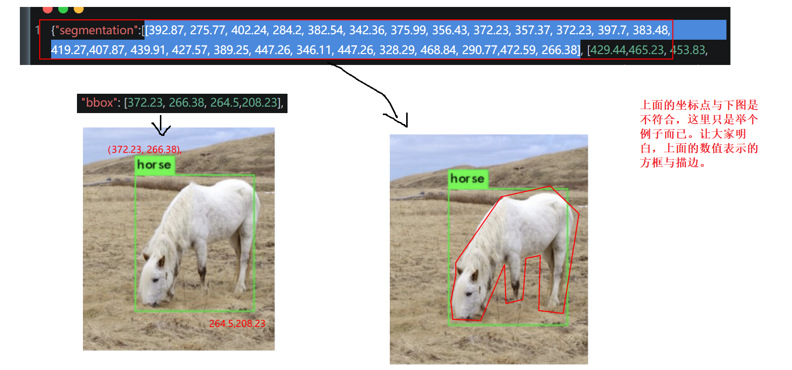

# 目标检测

> 学习目标
>
> 目标检测的任务[了解]
>
> 目标检测的常用数据集[知道]
>
> 目标检测算法的评价指标[知道]
>
> 非极大值NMS算法的应用[知道]
>
> 常用的目标检测算法分类[了解]

## 基本概述

目标检测（ Object Detection） 的任务是找出图像中所有感兴趣的目标， 并确定它们的类别和位置。


目标检测中能检测出来的物体取决于当前任务（数据集）需要检测的物体有哪些。假设我们的目标检测模型定位是检测动物（牛、羊、猪、狗、猫五种结果），那么模型对任何一张图片输出结果不会输出鸭子、书籍等其它类型结果。

目标检测的位置信息一般由两种格式（ 以图片左上角为原点(0,0)）：

1. 极坐标表示：(xmin, ymin, xmax, ymax)
   + xmin,ymin：x,y坐标的最小值
   + xmin,ymin：x,y坐标的最大值
2. 中心点坐标：(x_center, y_center, w, h)
   + x_center, y_center：目标检测框的中心点坐标
   +  w,h：目标检测框的宽 、高

假设在下面的图像中进行检测：


那目标检测结果的**极坐标表示**形式如下所示：

| Class  | X min | Y min | X Max | Y Max |
| ------ | ----- | ----- | ----- | ----- |
| Dog    | 100   | 465   | 350   | 620   |
| Horse  | 705   | 220   | 1050  | 620   |
| Person | 325   | 165   | 475   | 670   |

那目标检测结果的**中心点表示**形式如下所示：

| Class  | x_center | y_center | w    | h    |
| ------ | -------- | -------- | ---- | ---- |
| Dog    | 225      | 542      | 250  | 155  |
| Horse  | 877      | 420      | 345  | 400  |
| Person | 400      | 417      | 150  | 505  |


## 常用的开源数据集

经典的目标检测/目标分割的数据集有两种，PASCAL VOC数据集 和 MS COCO数据集。


### PASCAL VOC数据集

PASCAL VOC是目标检测领域的经典数据集，包含约10,000张带有边界框的图片用于训练和验证。

下载地址：https://pjreddie.com/projects/pascal-voc-dataset-mirror/

也可以去百度飞桨学习平台上下载：https://aistudio.baidu.com/

PASCAL VOC数据集是目标检测问题的一个基准数据集，很多模型都是在此数据集上训练得到的，常用的是VOC2007和VOC2012两个版本数据，相互不交叉，共20个类别，分别是：


1.人: 人

2.动物: 鸟 ，猫 ，牛 ，狗， 马， 羊

3.交通工具: 飞机， 自行车 ，船 ，公共汽车 ，汽车 ，摩托车， 火车

4.室内: 瓶子 ，椅子 ，餐桌， 盆栽 ，沙发， 电视/显示器


整个数据的目录结构如下所示：


其中：

1. JPEGImages存放图片文件

2. Annotations下存放的是xml文件，描述了图片信息，如下图所示，需要关注的就是节点下的数据，尤其是bndbox下的数据.xmin,ymin构成了boundingbox的左上角，xmax,ymax构成了boundingbox的右下角，也就是图像中的目标位置信息。

   
   
   Annotations下xml文档的内容数据说明：
   
   ```xml
   <annotation>
   	<folder>VOC2007</folder><!-- 数据集目录名  -->
   	<filename>000001.jpg</filename>  <!-- 图片名 -->
   	<source> <!-- 数据来源 -->
   		<database>The VOC2007 Database</database>
   		<annotation>PASCAL VOC2007</annotation>
   		<image>flickr</image>
   		<flickrid>341012865</flickrid>
   	</source>
   	<owner> <!-- 数据是谁提供的 -->
   		<flickrid>Fried Camels</flickrid>
   		<name>Jinky the Fruit Bat</name>
   	</owner>
   	<size> <!-- 图片的宽width高height，颜色通道depth -->
   		<width>353</width>
   		<height>500</height>
   		<depth>3</depth>
   	</size>
   	<segmented>0</segmented> <!-- 当前图片上会否适用于图像分割，0表示不适用，1表示适用 -->
   	<object> <!-- 被检测目标的信息 -->
   		<name>dog</name>  <!-- 目标类名名称 -->
   		<pose>Left</pose> <!-- 拍摄方向 Left表示左方向，还有其他的方位都有，例如右边，正面，侧面，等等-->
   		<truncated>1</truncated>  <!-- 是否是完整全貌的个体，1表示不完整全貌，0表示完整全貌 -->
   		<difficult>0</difficult>  <!-- 是否识别困难，0表示不困难，意思是当前检测目标与环境容易区分，1表示困难，意思是当前检测目标与环境相融，不容易区分 -->
   		<bndbox> <!-- 检测目标的真实位置的极坐标表示值 -->
   			<xmin>48</xmin>
   			<ymin>240</ymin>
   			<xmax>195</xmax>
   			<ymax>371</ymax>
   		</bndbox>
   	</object>
   	<object>  <!-- 一个xml标注文件可以有多个检测目标 -->
   		<name>person</name>
   		<pose>Left</pose>
   		<truncated>1</truncated>
   		<difficult>0</difficult>
   		<bndbox>
   			<xmin>8</xmin>
   			<ymin>12</ymin>
   			<xmax>352</xmax>
   			<ymax>498</ymax>
   		</bndbox>
   	</object>
   </annotation>
   ```

3. ImageSets包含以下4个文件夹：

+ Action下存放的是人的动作（例如running、jumping等等），voc2007没有这个目录

+ Layout下存放的是具有人体部位的数据（人的head、hand、feet等等）

+ Segmentation下存放的是可用于分割的数据。

+ Main下存放的是图像物体识别的数据，总共分为20类，这是进行目标检测的重点。

  该文件夹中的数据对负样本文件进行了描述。

  


### MS COCO数据集

MS COCO的全称是Microsoft Common Objects in Context，是微软于2014年出资标注的一个大型的、丰富的物体检测，分割和字幕数据集，与ImageNet竞赛一样，被视为是计算机视觉领域最受关注和最权威的比赛之一。

MS COCO数据集以场景理解为目标，主要从复杂的日常场景中截取，图像中的目标通过精确的分割进行位置的标定。图像包括**91类目标，328,000影像和2,500,000个label**。COCO 2017是目前为止目标检测的最大数据集，提供的类别有91 类，有超过33 万张图片，其中20 万张有标注，整个数据集中个体的数目超过150 万个。图像示例：


coco数据集的标签文件是json格式的，文件中标记了每个检测目标的segmentation+bounding box的精确坐标，其精度均为小数点后两位一个目标的标签示意如下：

```json
{"segmentation":[[392.87, 275.77, 402.24, 284.2, 382.54, 342.36, 375.99, 356.43, 372.23, 357.37, 372.23, 397.7, 383.48, 419.27,407.87, 439.91, 427.57, 389.25, 447.26, 346.11, 447.26, 328.29, 468.84, 290.77,472.59, 266.38], [429.44,465.23, 453.83, 473.67, 636.73, 474.61, 636.73, 392.07, 571.07, 364.88, 546.69,363.0]], "area": 28458.996150000003, "iscrowd": 0,"image_id": 503837, "bbox": [372.23, 266.38, 264.5,208.23], "category_id": 4, "id": 151109},
```

segmentation表示目标分割的坐标点，实际上就是通过一串的坐标点来对检测目标进行轮廓描点。

bbox，全称：bounding box，表示目标检测的极大值坐标位置，实际上就是左上角xy和右下角xy的坐标。




## 常用的评价指标

### IoU（Intersection Over Union）

在目标检测算法中，IoU（intersection over union，交并比）是目标检测算法中用来评价2个矩形框之间相似度的指标：
$$
IoU = 两个矩形框相交的面积 / 两个矩形框相并的面积
$$
如下图所示：


通过一个例子看下在目标检测中的应用：


其中上图蓝色框框为检测结果，红色框框为真实标注。

那我们就可以通过预测结果与真实结果之间的交并比来衡量两者之间的相似度。一般情况下对于检测框的判定都会存在一个IoU阈值，一般可以设置**当IoU阈值大于0.5（门槛值）的时候，则可认为检测到目标物体**。实现方法：

```python
import numpy as np

# 定义方法计算IoU
def IoU(box1, box2, wh=False):
    """
    box1 检测目标的预测结果的位置参数
    box2 检测目标的真实结果的位置参数
    wh   判断检测目标的位置参数的表示方式，默认值是False，表示当前位置参数使用极坐标，wh=True则表示当前检测目标使用了中心点坐标
    极坐标：(xmin,ymin,xmax,ymax)
    中心点：(xcenter,ycenter, w,h)
    """
    # 统一坐标
    if wh:
        # 如果 wh 为真，则表示当前检测目标使用了中心点坐标，把位置参数转换成极坐标
        # 第一个框左上角坐标
        xmin1, ymin1 = int(box1[0]-box1[2]/2.0), int(box1[1]-box1[3]/2.0)
        # 第一个框右下角坐标
        xmax1, ymax1 = int(box1[0]+box1[2]/2.0), int(box1[1]+box1[3]/2.0)
        # 第二个框左上角坐标
        xmin2, ymin2 = int(box2[0]-box2[2]/2.0), int(box2[1]-box2[3]/2.0)
        # 第二个框右下角坐标
        xmax2, ymax2 = int(box2[0]+box2[2]/2.0), int(box2[1]+box2[3]/2.0)
    else:
        # 使用极坐标形式表示：直接获取两个bbox的坐标
        xmin1, ymin1, xmax1, ymax1 = box1
        xmin2, ymin2, xmax2, ymax2 = box2

    # 获取矩形框交集对应的左上角和右下角的坐标（intersection）
    xx1 = np.max([xmin1, xmin2])
    yy1 = np.max([ymin1, ymin2])
    xx2 = np.min([xmax1, xmax2])
    yy2 = np.min([ymax1, ymax2])

    # 计算两个矩形框面积
    # 长度 = X轴最大值-X轴最小值
    # 高度 = Y轴最大值-Y轴最小值
    # 矩形面积 = 长度 * 高度
    #         = (X轴最大值-X轴最小值) * (Y轴最大值-Y轴最小值) 
    area1 = (xmax1-xmin1) * (ymax1-ymin1) 
    area2 = (xmax2-xmin2) * (ymax2-ymin2)
    #计算交集面积
    inter_area = (np.max([0, xx2-xx1])) * (np.max([0, yy2-yy1]))
    # 计算交并比   iou = 交集 / 并集
    iou = inter_area / (area1+area2-inter_area+1e-6)
    return iou
```

假设我们检测结果如下所示，并展示在图像上：

```python
import matplotlib.pyplot as plt
import matplotlib.patches as patches
# 真实框与预测框【假设的值】
True_bbox, predict_bbox = [100, 35, 398, 384], [60, 150, 370, 390]

# 显示小狗
img = plt.imread('dog.jpg')
fig = plt.imshow(img)

# 将边界框(左上x, 左上y, 右下x, 右下y)格式转换成matplotlib格式：((左上x, 左上y), 宽, 高)
# 真实框绘制
fig.axes.add_patch(plt.Rectangle(
    xy=(True_bbox[0], True_bbox[1]), width=True_bbox[2]-True_bbox[0], height=True_bbox[3]-True_bbox[1],
    fill=False, edgecolor="red", linewidth=2))

# 预测框绘制[假设值，后面根据实际训练得到结果]
fig.axes.add_patch(plt.Rectangle(
    xy=(predict_bbox[0], predict_bbox[1]), width=predict_bbox[2]-predict_bbox[0], height=predict_bbox[3]-predict_bbox[1],
    fill=False, edgecolor="blue", linewidth=2))
```


计算IoU：

```python
iou = IoU(True_bbox, predict_bbox)
print(iou)
```

结果为：

```python
0.5483327836650264
```


### mAP（Mean Average Precision）

目标检测问题中的每个图片都可能包含一些不同类别的物体，需要评估模型的物体分类和定位性能。因此用于图像分类问题的标准指标precision不能直接应用于此。 在目标检测中，mAP是主要的衡量指标。

mAP是多个分类任务的AP的平均值，而AP（Average Precision）是计算某一类任务的 P-R 曲线下的面积，而mAP 则是计算所有类别 P-R 曲线下面积的平均值。所以在了解mAP之前我们要知道P-R曲线。

> 相关概念
>
> 一般对于常见的二分类问题，可以根据样例和其对应的模型输出的组合，划分为真正例（True Positive）、假正例（False Positive）、真反例（True Negative）、假反例（False Negative）四类。分类结果的混淆矩阵为：
>
> 
>
> **TP：**True Positive，分类器预测结果为正样本，实际也为正样本，即正样本被正确识别的数量。IoU>IoU<sub>threshold</sub>的检测框数量，**同一真实值(同一GT（Ground Truth）)只计算一次**。
>
> **FP：**False Positive，分类器预测结果为正样本，实际为负样本，即**误报**的负样本数量。IoU<=IoU<sub>threshold</sub>的检测框数量
>
> **TN：**True Negative，分类器预测结果为负样本，实际为负样本，即负样本被正确识别的数量。没有检测到的GT的数量。
>
> **FN：**False Negative，分类器预测结果为负样本，实际为正样本，即**漏报**的正样本数量。在mAP评价指标中用不上FN标记位。
>
> 
>
> **TP+FN：**真实正样本的总和，正确分类的正样本数量+漏报的正样本数量。
>
> **FP+TN：**真实负样本的总和，负样本被误识别为正样本数量+正确分类的负样本数量。
>
> **TP+TN：**正确分类的样本总和，正确分类的正样本数量+正确分类的负样本数量。
>
> 
>
> **Acc**uracy：准确率。表征的是预测正确的样本比例。Accuracy = (TP+TN) / 样本数量 = 正确分类的样本总和 / 样本数量。
>
> **Precision**：查准率。表征的是预测正确的正样本的准确度。Precision=TP/(TP+FP) = 准确预测的正样本 / 所有预测为正样本。
>
> **Recall**：查全率（召回率）。表征的是预测正确的正样本的覆盖率。Recall=TP/(TP+FN) = 准确预测的正样本 / 真实正样本的总和。

Precision和Recall二者绘制的曲线，被称为 P-R 曲线。

同一个模型，在不同阈值（threadhold）条件下，对应的recall和precision是不一样的，一般随着一个的升高另一个会降低。那么遍历所有的阈值，就会有若干的准召率数据对（就是查准率与查全率数据对）。把这些数据对分别设置成横坐标与纵坐标，画出的曲线就是P-R曲线。


P-R 曲线直观地显示了模型在查准率和查全率上的表现。通常情况下，我们认为P-R曲线下的面积越大，模型性能越好：即图中曲线A和B都完全包住了曲线C，所以曲线A和B一定优于C。

优点

+ 适用于不平衡数据集：P-R曲线更能反映在不平衡数据中模型性能的表现，更关注正类别的性能。
+ 易于解释：P-R曲线的含义直观，精确度和查全率都是直接可理解的指标。

缺点

+ 对阈值敏感：P-R曲线的性能受阈值选择的影响，不同阈值下曲线会有不同的形状。
+ 不适用于多类别分类：**P-R曲线主要用于二分类问题**，对于多类别问题通常需要其他评估方法。
+ 无法比较不同模型：P-R曲线通常**用于单个模型的性能评估**，而无法用于比较不同模型之间的性能。

那么，我们如何求得Precision和Recall的分布呢？

先定义两个公式，一个是 Precision，一个是 Recall，与上面的公式相同，扩展开来，用另外一种形式进行展示，其中 all detctions 代表所有预测框的数量， all ground truths 代表所有 GT （真实值）的数量。


假设，我们有 7 张图片（Images1~Image7），这些图片有 15 个目标（绿色的框，GT真实值的数量，上文提及的 all ground truths）以及 24 个预测边框（红色的框，A-Y 编号表示，并且有一个置信度值）：

> 置信度值
>
> 是一个随机的浮点期望数值，这个数值是表示当前预测框选中目标的可信度有多少。置信度值的越高，而又命中，则表示当前模型的准确率比较好。


根据上图以及说明，我们可以列出以下表格，其中 Images 代表图片的编号，Detections 代表预测边框的编号，Confidences 代表预测边框的置信度，TP or FP 代表预测的边框是标记为 TP 还是 FP（认为预测边框与 GT 的 IOU 值大于等于 0.3 就标记为 TP；若一个 GT 有多个预测边框，则认为 IoU 最大且大于等于 0.3 的预测框标记为 TP，其他的标记为 FP，即一个 GT 只能有一个预测框标记为 TP），这里的 0.3 是随机取的一个值。


通过上表，我们可以绘制出 P-R 曲线（因为 AP 就是 P-R 曲线下面的面积），但是在此之前我们需要计算出 P-R 曲线上各个点的坐标，根据置信度从大到小排序所有的预测框，然后就可以计算 Precision 和 Recall 的值，见下表。


+ 标号为 1 的 Precision 和 Recall 的计算方式：Precision=TP/(TP+FP)=1/(1+0)=1，Recall=TP/(TP+FN)=TP/(all ground truths)=1/15=0.0666 （all ground truths 上面有定义过了）
+ 标号 2：Precision=TP/(TP+FP)=1/(1+1)=0.5，Recall=TP/(TP+FN)=TP/(all ground truths)=1/15=0.0666
+ 标号 3：Precision=TP/(TP+FP)=2/(2+1)=0.6666，Recall=TP/(TP+FN)=TP/(all ground truths)=2/15=0.1333
+ 其他的依次类推。

然后就可以绘制出 P-R 曲线


得到 P-R 曲线就可以计算 AP（P-R 曲线下的面积），要计算 P-R 下方的面积，有两种方法：

+ **在VOC2010以前**，只需要选取当Recall >= 0, 0.1, 0.2, ..., 1共11个点时的Precision最大值，然后AP就是这11个Precision的平均值，取 11 个点 [0, 0.1, 0.2, 0.3, 0.4, 0.5, 0.6, 0.7, 0.8, 0.9, 1] 的插值所得

  

  得到一个类别的 AP 结果如下：

  

  要计算 mAP，就把所有类别的 AP 计算出来，然后求取平均即可。

+ 在VOC2010及以后，需要针对每一个不同的Recall值（包括0和1），选取其大于等于这些Recall值时的Precision最大值，如下图所示：

  

  然后计算PR曲线下面积作为AP值：

  

  计算方法如下所示：

  


### NMS（Non-Maximum Suppression，非极大值抑制算法）

非极大值抑制（Non-Maximum Suppression，NMS），顾名思义就是抑制不是极大值的元素。例如在行人检测中，滑动窗口经提取特征，经分类器分类识别后，每个窗口都会得到一个分数。但是滑动窗口会导致很多窗口与其他窗口存在包含或者大部分交叉的情况。这时就需要用到NMS来选取那些邻域里分数最高（是行人的概率最大），并且抑制那些分数低的窗口。 NMS在计算机视觉领域有着非常重要的应用，如视频目标跟踪、数据挖掘、3D重建、目标识别以及纹理分析等 。


在目标检测中，NMS的目的就是要去除冗余的检测框,保留最好的一个，如下图所示：


NMS的原理是对于预测框的列表B及其对应的置信度S,选择具有最大score的检测框M,将其从B集合中移除并加入到最终的检测结果D中.通常将B中剩余检测框中与M的IoU大于阈值Nt的框从B中移除.重复这个过程,直到B为空。

使用流程如下图所示：

+ 首先是检测出一系列的检测框
+ 将检测框按照类别进行分类
+ 对同一类别的检测框应用NMS获取最终的检测结果


通过一个例子看些NMS的使用方法，假设定位车辆，算法就找出了一系列的矩形框，我们需要判别哪些矩形框是没用的，需要使用NMS的方法来实现。


假设现在检测窗口有：A、B、C、D、E 5个候选框，接下来进行迭代计算：

+ 第一轮：因为B是得分最高的，与B的IoU＞0.5删除。A，CDE中现在与B计算IoU，DE结果＞0.5，剔除DE，B作为一个预测结果，有个检测框留下B，放入集合
+ 第二轮：A的得分最高，与A计算IoU，C的结果＞0.5，剔除C，A作为一个结果

最终结果为在这个5个中检测出了两个目标为A和B。

单类别的NMS的实现方法如下所示：

```python
import numpy as np
def nms(bboxes, confidence_score, threshold):
    """非极大抑制过程
    :param bboxes: 同类别候选框坐标
    :param confidence: 同类别候选框分数
    :param threshold: iou阈值
    :return:
    """
    # 1、传入无候选框返回空
    if len(bboxes) == 0:
        return [], []
    # 强转数组
    bboxes = np.array(bboxes)
    score = np.array(confidence_score)

    # 取出n个的极坐标点
    x1 = bboxes[:, 0]
    y1 = bboxes[:, 1]
    x2 = bboxes[:, 2]
    y2 = bboxes[:, 3]

    # 2、对候选框进行NMS筛选
    # 返回的框坐标和分数
    picked_boxes = []
    picked_score = []
    # 对置信度进行排序, 获取排序后的下标序号, argsort默认从小到大排序
    order = np.argsort(score)
    areas = (x2 - x1) * (y2 - y1)
    while order.size > 0:
        # 将当前置信度最大的框加入返回值列表中
        index = order[-1]
        #保留该类剩余box中得分最高的一个
        picked_boxes.append(bboxes[index])
        picked_score.append(confidence_score[index])

        # 获取当前置信度最大的候选框与其他任意候选框的相交面积
        x11 = np.maximum(x1[index], x1[order[:-1]])
        y11 = np.maximum(y1[index], y1[order[:-1]])
        x22 = np.minimum(x2[index], x2[order[:-1]])
        y22 = np.minimum(y2[index], y2[order[:-1]])
        # 计算相交的面积,不重叠时面积为0
        w = np.maximum(0.0, x22 - x11)
        h = np.maximum(0.0, y22 - y11)
        intersection = w * h

        # 利用相交的面积和两个框自身的面积计算框的交并比
        ratio = intersection / (areas[index] + areas[order[:-1]] - intersection)
        # 保留IoU小于阈值的box
        keep_boxes_indics = np.where(ratio < threshold)
        # 保留剩余的框
        order = order[keep_boxes_indics]
    # 返回NMS后的框及分类结果   
    return picked_boxes, picked_score
```

假设有检测结果如下：

```python
bounding = [(187, 82, 337, 317), (150, 67, 305, 282), (246, 121, 368, 304)]
confidence_score = [0.9, 0.65, 0.8]
threshold = 0.3
picked_boxes, picked_score = nms(bounding, confidence_score, threshold)
print('阈值threshold为:', threshold)
print('NMS后得到的bbox是：', picked_boxes)
print('NMS后得到的bbox的confidences是：', picked_score)
```

返回结果：

```python
阈值threshold为: 0.3
NMS后得到的bbox是： [array([187,  82, 337, 317])]
NMS后得到的bbox的confidences是： [0.9]
```


## 目标检测方法分类

目标检测算法主要分为two-stage（两阶段）和one-stage（单阶段）两类：


### Two-stage的算法

先由算法生成一系列作为样本的候选框，再通过卷积神经网络进行样本分类。如下图所示，主要通过一个卷积神经网络来完成目标检测过程，其提取的是CNN卷积特征，进行候选区域的筛选和目标检测两部分。网络的准确度高、速度相对较慢。


two-stages算法的代表是R-CNN系列：`R-CNN`到`Fast R-CNN`到`Faster R-CNN`网络。


### One-stage的算法

直接通过主干网络给出目标的类别和位置信息，没有使用候选区域的筛选网路，这种算法速度快，但是精度相对Two-stage目标检测网络降低了很多。


one-stage算法的代表是： YOLO系列：YOLOv1、YOLOv2、YOLOv3、 SSD等。


## 总结

+ 目标检测的任务：找出图像中所有感兴趣的目标，并确定它们的类别和位置
+ 目标检测的常用数据集：PASCAL VOC数据集 和 MS COCO**数据集
+ 目标检测算法的评价指标：IOU和mAP
+ 非极大值NMS算法的应用：要去除冗余的检测框,保留最好的一个
+ 常用的目标检测算法分类：two-stage（两阶段）和one-stage（单阶段）
