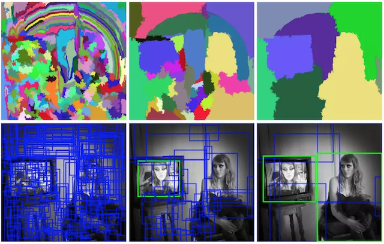
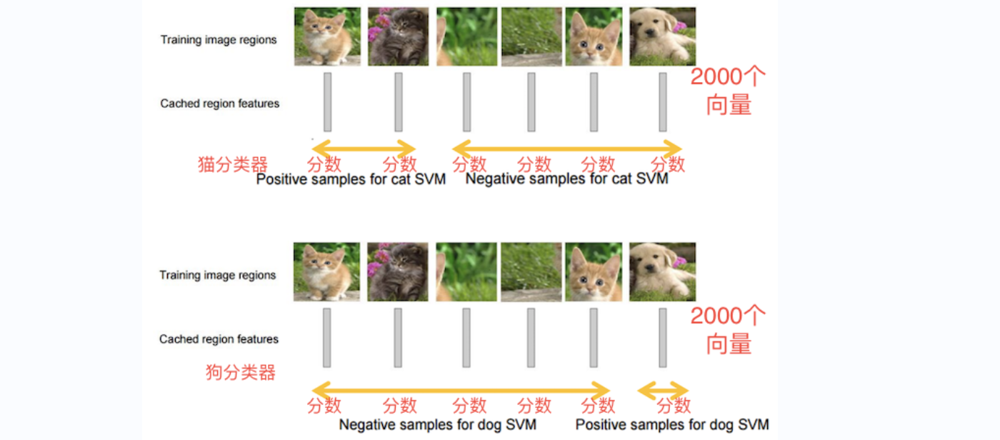
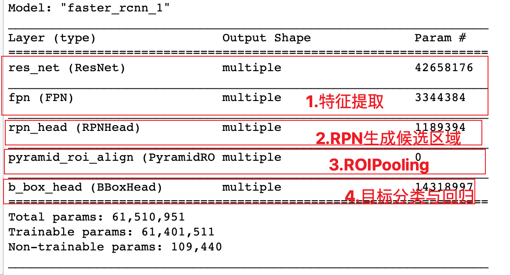
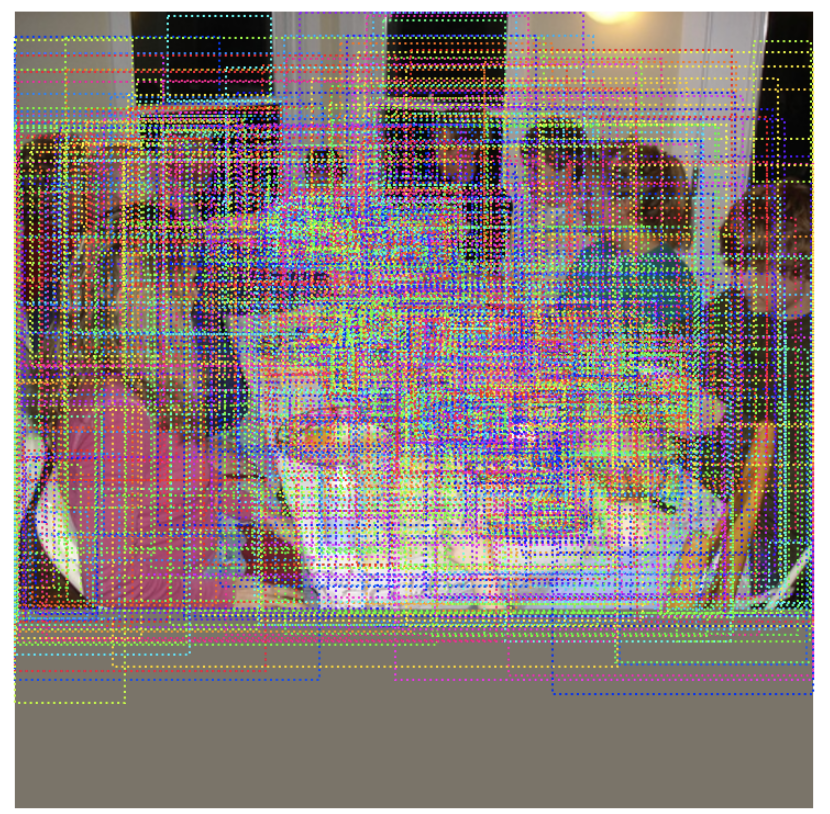
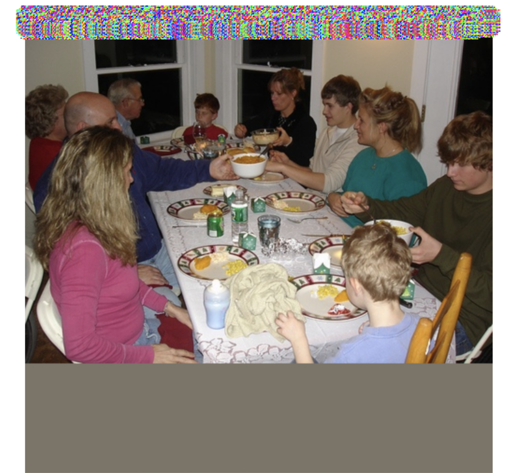
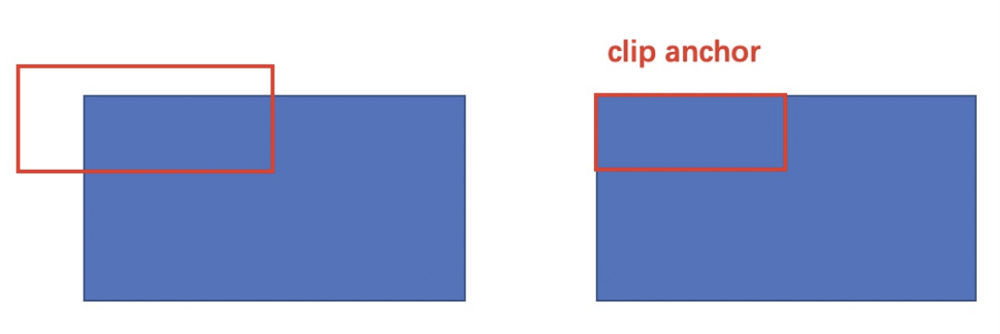

# R-CNN网络

> 学习⽬标
>
> Overfeat模型的移动窗口方法[了解]
>
> R-CNN目标检测的思想[了解]
>
> fast R-CNN目标检测的思想[了解]
>
> FasterR-CNN目标检测的思想[知道]
>
> 多任务损失[知道]
>
> FasterRCNN⽬标检测的思想[了解]
>
> anchor（锚框）的思想[知道]
>
> RPN网络是如何进⾏候选区域的生成的[知道]
>
> ROIPooling的使⽤⽅法[知道]
>
> fasterRCNN的训练⽅法[知道]

在卷积神经网络被成功应用于图像分类后，Ross Girshick教授在CVPR 2014中提出了R-CNN网络模型（Region CNN，区域卷积神经网络），R-CNN基于卷积神经网络(CNN)，线性回归，和支持向量机(SVM)等算法，实现目标检测技术，是第一个成功将深度学习应用到目标检测上的算法。


## Overfeat模型

在R-CNN出现之前，目标检测通常使用Overfeat方法使用滑动窗口进行目标检测，也就是使用滑动窗口和神经网络来检测目标。滑动窗口使用固定宽度和高度的矩形区域，在图像上“滑动”，并将扫描结果送入到神经网络中进行分类和回归。例如要检测汽车，就使用下图中红色滑动窗口进行扫描，将所有的扫描结果送入网络中进行分类和回归，得到最终的汽车的检测结果。


这种方法类似一种暴力穷举的方式，会消耗大量的计算力，并且由于窗口大小问题可能会造成效果不准确。


## R-CNN模型

R-CNN网络模型不再使用暴力穷举的方法，而是使用**候选区域方法（region proposal method）**，创建目标检测的区域来完成目标检测的任务，R-CNN是以深度神经网络为基础的目标检测的模型 ，以R-CNN为基点，后续的Fast R-CNN、Faster R-CNN模型都延续了这种目标检测思路。


### 算法流程

R-CNN的检测流程如下图所示：


步骤是：

1. **候选区域**：使用**选择性搜索算法**找出图片中可能存在目标的侯选区域(region proposal)
2. **网络选择**：选取预训练卷积神经网网络（AlexNet）用于进行特征提取。
3. **目标分类**：训练支持向量机（SVM）来辨别目标物体和背景。对每个类别，都要训练一个二元SVM。
4. **目标定位**：训练一个线性回归模型，为每个辨识到的物体生成更精确的边界框。

#### 候选区域生成

**选择性搜索（SelectiveSearch，SS）中**，使用**语义分割**的方法，它通过在像素级的标注，把颜色、边界、纹理等信息作为合并条件，多尺度的综合采样方法，划分出一系列的区域，这些区域要远远少于传统overfeat模型的滑动窗口的穷举法产生的候选区域。



SelectiveSearch在一张图片上提取出来约2000个侯选区域，**需要注意的是这些候选区域的长宽不固定**。 而使用CNN提取候选区域的特征向量，需要接受固定长度的输入，所以需要对候选区域做一些尺寸上的修改。

**选择搜索流程**

- step0：生成区域集R
- step1：计算区域集R里每个相邻区域的相似度S={s1, s2,…}
- step2：找出相似度最高的两个区域，将其合并为新集，添加进R
- step3：从S中移除所有与step2中有关的子集
- step4：计算新集与所有子集的相似度
- step5：跳至step2，直至S为空

**选择搜索优点**

- 计算效率优于滑动窗口的穷举法
- 由于采用子区域合并策略，所以可以包含各种大小的疑似物体框
- 合并区域相似的指标多样性，提高了检测物体的概率


####  CNN网络提取特征

采用预训练模型(AlexNet或VGG)在生成的候选区域上进行特征提取，将提取好的特征保存在磁盘中，用于后续步骤的分类和回归。


1. 全连接层的输入数据的尺寸是固定的，因此在将候选区域送入CNN网络中时，需进行裁剪或变形为固定的尺寸，在进行特征提取。

2. 预训练模型在ImageNet数据集上获得，最后的全连接层是1000，在这里我们需要将其改为N+1(N为目标类别的数目，例如pascal voc数据集中N=20，coco数据集中N=80，1是加一个背景)后，进行微调即可。之所以要添加背景作为一个分类是为了更好的区分目标与背景，让目标可以更容易被模型预测出来。

   

3. 利用微调后的CNN网络，提取每一个候选区域的特征，获取一个4096维的特征，一幅图像就是2000x4096维特征存储到磁盘中。

#### 目标分类（SVM）

假设我们要检测猫狗两个类别，那我们需要训练猫和狗两个不同类别的SVM分类器，然后使用训练好的分类器对一幅图像中2000个候选区域的特征向量分别判断一次，这样得出[2000, 2]的得分矩阵，如下图所示：



对于N个类别的检测任务，需要训练N（目标类别数目）个SVM分类器，对候选区域的特征向量（4096维）进行二分类，判断其是某一类别的目标，还是背景来完成目标分类。


#### 目标定位

通过选择性搜索获取的目标位置不是非常的准确，实验证明，训练一个线性回归模型在给定的候选区域的结果上去预测一个新的检测窗口，能够获得更精确的位置。修正过程如下图所示：


通过训练一个回归器来对候选区域的范围进行一个调整，这些候选区域最开始只是用选择性搜索的方法粗略得到的，通过调整之后得到更精确的位置，如下所示：


#### 预测过程

使用选择性搜索的方法从一张图片中提取2000个候选区域，将每个区域送入CNN网络中进行特征提取，然后送入到SVM中进行分类，并使用候选框回归器，计算出每个候选区域的位置。 候选区域较多，有2000个，需要剔除掉部分检测结果。 针对每个类，通过计算IoU,采取非最大值抑制NMS的方法，保留比较好的检测结果。


### 算法总结

1. **训练阶段多**：步骤繁琐: 微调网络+训练SVM+训练边框回归器。
2. **训练耗时**：占用磁盘空间大：5000张图像产生几百G的特征文件。
3. **处理速度慢**: 在GPU模式下, 使用VGG16模型处理一张图像需要47s。
4. **图片形状变化**：候选区域要经过crop/warp进行固定大小，无法保证图片不变形。


## Fast R-CNN模型

考虑到R-CNN存在的问题，Ross Girshick教授又在2015年提出了一个改善模型：Fast R-CNN。相比于R-CNN, Fast R-CNN主要在以下三个方面进行了改进：

1. **提高训练和预测的速度**

   R-CNN首先从测试图中提取2000个候选区域，然后将这2000个候选区域分别输入到预训练好的CNN中提取特征。由于候选区域有大量的重叠，这种提取特征的方法，就会重复的计算重叠区域的特征。在Fast R-CNN中，将整张图输入到CNN中提取特征，将候选区域映射到特征图上，这样就避免了对图像区域进行重复处理，提高效率减少时间。

2. **不需要额外的空间保存CNN网络提取的特征向量**

   R-CNN中需要将提取到的特征保存下来，用于为每个类训练单独的SVM分类器和边框回归器。在Fast-R-CNN中，将类别判断和边框回归统一使用CNN实现，不需要在额外的空间存储特征。

3. **不再直接对候选区域进行缩放**

   R-CNN中需要对候选区域进行缩放送入CNN中进行特征提取，在Fast R-CNN中使用ROIpooling的方法进行尺寸的调整。

### 算法流程

Fast R-CNN的流程如下图所示：


步骤是：

1. **候选区域生成**：使用选择性搜索（Selective Search）的方法找出图片中可能存在目标的侯选区域，只需要候选区域的位置信息。
2. **CNN网络特征提取**：将整张图像输入到CNN网络中，得到整副图的特征图，并将上一步获取的候选区域位置从原图映射到该特征图上。
3. **ROIPooling**：对于每个特征图上候选框，RoI pooling层从特征图中提取固定长度的特征向量每个特征向量被送入一系列全连接（fc）层中。
4. **目标检测**：分两部分完成，一个输出各类别加上1个背景类别的Softmax概率估计，另一个为各类别的每一个类别输出四个系数，来确定目标的位置信息。

#### 候选区域生成

与R-CNN中一样，不再赘述。


#### CNN网络特征提取

与R-CNN中一样，使用预训练模型进行特征提取。


#### ROI Pooling

候选区域从原图映射到特征图中后，进行ROIpooling的计算，如下图所示：


ROI Pooling层使用最大池化将输入的特征图中的任意区域（候选区域对应的区域）内的特征转化为固定的𝐻×𝑊的特征图，其中𝐻和𝑊是超参数。 对于任意输入的ℎ×𝑤的候选区域，将其分割为𝐻×𝑊的子网格，每个子网格的大小为：(h/H) x (w/W)，取每个子网格中的最大值，送入后续网络中进行处理。


使用ROI Pooling层替换预训练网络中最后的池化层，并将并将超参𝐻,𝑊设置为和网络第一个全连接兼容的值，例如VGG16，设𝐻=𝑊=7。


#### 目标分类和回归

原网络的最后一个全连接层替换为两个同级层：K+1个类别的SoftMax分类层和边框的回归层，替代了SVM分类器+线性回归模型。


#### 模型训练

R-CNN中的特征提取和检测部分是分开进行的，Fast R-CNN提出一个高效的训练方法：多任务训练。

Fast R-CNN有两种输出：

1. 一部分输出在K+1个类别上的离散概率分布（每个候选区域），P = (p<sub>0</sub>, p<sub>1</sub>,...,p<sub>k</sub>)。通常，通过全连接层的K+1个输出上的Softmax来计算概率值。
2. 另一部分输出对于由K个类别中的每一个检测框回归偏移，t<sup>k</sup> = (t<sub>x</sub><sup>k</sup>, t<sub>y</sub><sup>k</sup>, t<sub>w</sub><sup>k</sup>, t<sub>h</sub><sup>k</sup>)。其中t<sub>k</sub>指定相对于候选框的尺度不变转换和对数空间高度/宽度移位。

将上面的两个任务的损失函数放在一起，联合训练fast R-CNN网络，这就是Fast-RCNN中提出的多任务损失。

Fast-RCNN的多任务损失函数表示为：


u表示真实分类，v表示真实目标位置，λ是一个超参数，用于平衡两个分支的损失。其中第一部分的表示的是分类的损失，第二部分的是回归框的损失。

第一部分的分类损失函数表示为：


其中分类的损失用的是softmax的log loss，将目标类别分为k+1类，k为目标的类别个数，1位背景类别。
第二部分的位置损失函数表示为：


其中：


#### 模型预测

fast R-CNN的工作流程描述如下：

- 输入图像：
  
- 图像被送入到卷积网络进行特征提取，将通过选择性搜索获取的候选区域映射到特征图中：
  
- 在特征图上Rol中应用RoIPooling，获取尺寸相同的特征向量
  
- 将这些区域传递到全连接的网络中进行分类和回归，得到目标检测的结果。
  

### 模型总结

Fast R-CNN是对R-CNN模型的一种改进：

1. CNN网络不再对每个候选区域进行特征提取，而是直接对整张图像进行处理，这样减少了很多重复计算。
2. 用ROI pooling进行特征的尺寸变换，来满足FC全连接层对输入数据尺度的要求。
3. 将目标的分类和回归统一在一个网络中，使用FC+softmax进行目标分类，使用FC Layer进行目标框的回归。

在Fast R-CNN中使用的目标检测识别网络，在速度和精度上都有了不错的结果。不足的是，其候选区域提取方法耗时较长，而且和目标检测网络是分离的，并不是端到端的，在2016年又提出了Faster_R-CNN模型用于目标检测，所以接下来我们着重了解Faster-R-CNN网络的原理与实现。


## Faster-RCNN模型

在R-CNN和Fast RCNN的基础上，在2016年提出了Faster R-CNN网络模型，在结构上Faster R-CNN已经将候选区域的生成，特征提取，目标分类及目标框的回归都整合在了一个网络中，综合性能有较大提高，在检测速度方面尤为明显。网络基本结构如下图所示：


Faster R-CNN可以看成是区域生成网络(RPN)与Fast R-CNN的组合，其中区域生成网络(RPN)替代选择性搜索来生成候选区域，Fast RCNN用来进行目标检测。


### 网络工作流程

FasterRCNN的工作流程是：


1. 特征提取：将整个图像缩放至固定的大小输入到CNN网络中进行特征提取，得到特征图。

2. 候选区域提取：输入特征图，使用区域生成网络RPN，产生一系列的候选区域。

   RPN网络用于生成候选区域。该层通过softmax判断勾选框（anchors）属于正样本（positive）或者负样本（negative），再利用bounding box regression修正anchors获得精确的proposals。

3. ROIPooling: 与Fast RCNN网络中一样，使用最大池化固定候选区域的尺寸，送入后续网络中进行处理

4. 目标分类和回归：与Fast RCNN网络中一样，使用两个同级层:K+1个类别的SoftMax分类层和边框的回归层，来完成目标的分类和回归。

Faster R-CNN的流程与Fast R-CNN的区别不是很大，**重要的改进是使用RPN网络来替代选择性搜索获取候选区域**，所以我们可以将Faster R-CNN网络看做RPN和Fast R-CNN网络的结合。

接下来我们来看下该网络预训练模型的使用过程，模型源码位置，如下图所示：


detection文件夹中是模型，数据的实现，weights中包含网络的预训练模型。接下来我们按照以下步骤进行目标检测：

1. 获取数据和加载预训练网络
2. 获取RPN网络生成的候选区域
3. 获取网络的目标检测结果

首先导入相应的工具包：

```python
import numpy as np
import tensorflow as tf
import matplotlib.pyplot as plt
# 获取VOC数据使用
from detection.datasets import pascal_voc
# 模型构建
from detection.models.detectors import faster_rcnn
# 绘图，图像展示
from detection.utils import visualize
# 修正matplotlib中文无法显示问题
from pylab import mpl
# 设置显示中文字体
mpl.rcParams["font.sans-serif"] = ["SimHei"]
```

#### 数据加载

加载voc数据集中的一张图片进行网络预测：

```python
# 实例化voc数据集的类，获取送入网络中的一张图片
pascal = pascal_voc.pascal_voc("train")
# image：送入网络中的数据，imagemeta:图像的元信息
image,imagemeta,bbox,label = pascal[218]

# imagemeta 就是 图像的元信息[共有11个数据点]
# 1-3就是图像原始形状, 
# 4-6就是维持宽高比进行缩放的图像形状，
# 7-9就是经过填充处理后得到的图像形状
# 10就是图像缩放的倍数
# 11就是图像是否旋转了，0表示没有旋转
```

缩放上限实际上是读取数据的代码决定的：


在将图像送入网络之前，我们对其进行了尺度的调整，标准化等处理，获取可展示的图像：

```python
# 图像的均值和标准差
img_mean = (122.7717, 115.9465, 102.9801)
img_std = (1., 1., 1.)
# RGB图像
rgb_image= np.round(image+img_mean).astype(np.uint8)
```

获取原始图像，进行比较：

```python
# 获取原始图像
from detection.datasets.utils import get_original_image
ori_img = get_original_image(image[0], imagemeta[0], img_mean)
```

将图像进行对比显示：

```python
# 展示原图像和送入网络中图像
rgb_image= np.round(image+img_mean).astype(np.uint8)
fig,axes=plt.subplots(nrows=1,ncols=2,figsize=(10,8),dpi=100)
axes[0].imshow(ori_img.astype('uint8'))
axes[0].set_title("原图像")
axes[1].imshow(rgb_image[0])
axes[1].set_title("送入网络中的图像")
plt.show()
```


将原图像的长边缩放为1024，短边按相应比例进行调整后，并按照均值进行填充

```python
# 原图像的大小
print(ori_img.shape)
# (375, 500, 3)

# 送入网络中图像的大小
print(image.shape)
# (1, 1024, 1024, 3)
```

imagemeta中的信息是：原图像大小，图像缩放后的大小，送入网络中图像的大小，图像缩放比例，图像是否翻转（未使用）。

```python
# 原始图像和送入网络中图像的信息
print(imagemeta)
"""
array([[ 375.   ,  500.   ,    3.   ,  768.   , 1024.   ,    3.   ,
        1024.   , 1024.   ,    3.   ,    2.048,    0.   ]], dtype=float32)
"""
```

#### 模型加载

加载使用coco数据集预训练的模型，对图像进行预测。

```python
# coco数据集的class，共80个类别：人，自行车，火车，。。。
classes = ['bg', 'person', 'bicycle', 'car', 'motorcycle', 'airplane', 'bus', 'train', 'truck', 'boat', 'traffic light', 'fire hydrant', 'stop sign', 'parking meter', 'bench', 'bird', 'cat', 'dog', 'horse', 'sheep', 'cow', 'elephant', 'bear', 'zebra', 'giraffe', 'backpack', 'umbrella', 'handbag', 'tie', 'suitcase', 'frisbee', 'skis', 'snowboard', 'sports ball', 'kite', 'baseball bat', 'baseball glove', 'skateboard', 'surfboard',
           'tennis racket', 'bottle', 'wine glass', 'cup', 'fork', 'knife', 'spoon', 'bowl', 'banana', 'apple', 'sandwich', 'orange', 'broccoli', 'carrot', 'hot dog', 'pizza', 'donut', 'cake', 'chair', 'couch', 'potted plant', 'bed', 'dining table', 'toilet', 'tv', 'laptop', 'mouse', 'remote', 'keyboard', 'cell phone', 'microwave', 'oven', 'toaster', 'sink', 'refrigerator', 'book', 'clock', 'vase', 'scissors', 'teddy bear', 'hair drier', 'toothbrush']
# 'bg' 下标为0，不是分类，而是背景。
```

实例化faster-RCNN模型：

```python
# 实例化模型
model = faster_rcnn.FasterRCNN(num_classes=len(classes))
```

加载预训练模型，由于fasterRCNN不是按照model的子类构建，所以无法通过h5文件直接加载模型结构，我们将结构实例化后，在加载权重获取整个预训练模型。

```python
model((image,imagemeta,bbox,label),training=True)
# 加载训练好的weights
model.load_weights("weights/faster_rcnn.h5")

model.summary()
```

查看网络架构，如下：




#### 模型预测过程

Faster RCNN模型的预测分为两部分：RPN（候选区域生成网络）生成候选区域和Fast RCNN进行目标的分类与回归


##### RPN获取候选区域

```python
# RPN获取候选区域：输入图像和对应的元信息，输出是候选的位置信息
proposals = model.simple_test_rpn(image[0],imagemeta)
```

候选区域的结果如下所示，对于上述图像共产生1633个候选区域，每个候选区域使用相对于输入网络中图像归一化后的左上角坐标和右下角坐标。

```python
<tf.Tensor: shape=(1633, 4), dtype=float32, numpy=
array([[0.19010934, 0.01915464, 0.74517167, 0.47454908],
       [0.16544136, 0.00404023, 0.40117866, 0.09342359],
       [0.15257548, 0.6431139 , 0.41323906, 0.8656624 ],
       ...,
       [0.2639263 , 0.43806934, 0.28392366, 0.45525536],
       [0.2843679 , 0.50144887, 0.32823753, 0.5286148 ],
       [0.27367938, 0.4899711 , 0.3138613 , 0.5294208 ]], dtype=float32)>
```

我们将这些候选区域绘制在图像上，需要获取绝对位置：

```python
# 绘制在图像上(将proposal绘制在图像上)
visualize.draw_boxes(rgb_image[0],boxes=proposals[:,:4]*1024)
plt.show()
```

如下图所示：




##### Fast R-CNN进行目标检测

我们将获取的候选区域送入到Fast RCNN网络中进行检测：

```python
# rcnn进行预测,得到的是原图像的检测结果：
# 输入：要检测的送入网络中的图像，图像的元信息，RPN产生的候选区域
# 输出：目标检测结果：检测框(相对于原图像)，类别，置信度
res = model.simple_test_bboxes(image[0],imagemeta[0],proposals)
```

res是一个字典，其结果如下所示：rois是目标框，class_ids是所属的类别，scores是置信度。

```python
{'rois': array([[ 90.47499  ,  10.503865 , 368.2676   , 232.25482  ],
        [ 57.161762 , 224.94748  , 160.659    , 311.25284  ],
        [ 87.07432  , 325.65515  , 360.31967  , 498.48114  ],
        [223.50363  , 308.6496   , 371.64804  , 434.2382   ],
        [ 63.163055 , 259.1326   , 191.69266  , 365.746    ],
        [ 73.41322  , 324.53177  , 206.88676  , 428.3592   ],
        [ 84.51209  , 166.48334  , 137.57199  , 219.303    ],
        [ 81.857445 ,  39.645454 , 134.84526  ,  98.36131  ],
        [ 71.76492  ,   1.3635885, 212.91583  ,  48.03363  ],
        [147.64299  , 218.71765  , 177.23846  , 259.93857  ],
        [256.31937  , 408.13516  , 372.17496  , 481.37378  ],
        [ 67.50757  ,  87.711525 , 132.65045  , 134.14081  ],
        [215.61322  , 248.64531  , 253.78104  , 272.77692  ],
        [158.77853  , 129.06291  , 374.79846  , 413.32776  ],
        [122.14337  , 239.4738   , 142.35901  , 272.6233   ],
        [  1.7824917, 230.85121  ,  56.71009  , 306.47534  ],
        [196.36023  , 219.28836  , 245.27621  , 239.56624  ]],
       dtype=float32),
 'class_ids': array([ 1,  1,  1,  1,  1,  1,  1,  1,  1, 46, 57,  1, 42, 61, 46, 63, 42]),
 'scores': array([0.9986047 , 0.9920563 , 0.988891  , 0.98812044, 0.9864847 ,
        0.98626035, 0.9812418 , 0.98071474, 0.9804079 , 0.9786349 ,
        0.9673651 , 0.9513375 , 0.9212216 , 0.9064541 , 0.80596244,
        0.76398784, 0.7305113 ], dtype=float32)}
```

将检测结果展示在图像上：

```python
# 将检测结果绘制在图像上
visualize.display_instances(ori_img,res['rois'],res['class_ids'],classes,res['scores'])
plt.show()
```


上述我们介绍了Faster RCNN的工作流程并且给大家展示了网络的检测结果。那接下来我们解决以下几个问题：

1. 网络中的每一部分是怎么构建，怎么完成相应的功能的？
2. 怎么训练fastrcnn网络去完成我们自己的任务？

### 模型结构详解

Faster RCNN的网络结构如下图所示：


Faster R-CNN模型将网络结构分为四部分：

+ Backbone：**Backbone由CNN卷积神经网络构成，常用的是VGG和resnet, 用来提取图像中的特征，获取图像的特征图**。该特征图被共享用于后续RPN层生成候选区域和ROIPooling层中。
+ RPN网络：RPN网络取代了原来的选择性搜索算法（ss算法），生成候选区域，用于后续的目标检测。
+ ROI Pooling: 该部分收集图像的**特征图**和RPN网络提取的**候选区域位置**，综合信息后**获取固定尺寸的特征**，送入后续全连接层判定目标类别和确定目标位置。
+ 目标分类与回归: 该部分利用ROIpooling输出特征向量计算候选区域的类别，并通过回归获得检测框最终的精确位置。

接下来就从这四个方面来详细分析fasterRCNN网络的构成，并结合源码理解每一部分实现的功能。


#### backbone

> Ross 博士在设计R-CNN系列算法时的模型构建的分布式设计概念。
>
> Backbone，是模型的主干（躯干）模型，负责提取特征，所以一般使用ResNet，VGG等网络构成，使用VGG或者ResNet模型，是这几种模型不仅可以保留浅层特征，还可以保留深层特征。
>
> Neck，模型的颈部模型，对来自Backbone的特征进行降维和调整，让输出更便于后续任务的执行。一般使用池化层，卷积层，全连接层来实现。
>
> Head，模型的头部模型，是最后一层，用于输出结果。一般就是分类器或者回归器，对于图像分类一般使用softmax来完成，对于目标边框一般使用边界框回归器来完成。

backbone一般为ResNet，VGG等网络构成，主要进行特征提取，将最后的全连接层舍弃，得到特征图送入后续网络中进行处理。


在当前使用Faster R-CNN的源码中使用ResNet + FPN 卷积网络结构来提取特征。与普通的 Fast-RCNN 只需要将一个特征图输入到后续网络中不同，由于加入 FPN结构，需要将多个特征图逐个送入到后续网络中，如下图所示：


> 上采样与下采样
>
> 上采样（**Upsampling**）和下采样（**Downsampling**）是信号处理和图像处理中常用的技术，用于改变信号或图像的分辨率。
>
> **上采样（Upsampling）**：
>
> - 上采样是指增加信号或图像的采样率或分辨率，从而使其变得更大。它通过插值或填充新的数据点来增加采样点的数量。
> - 在图像处理中，上采样可以用于**放大图像(resize)**，增加图像的尺寸或分辨率。一种常见的上采样方法是使用**填充**、**插值**技术（如双线性插值、三次样条插值等）来估算新像素的值。
> - 在神经网络中，上采样也经常用于进行反卷积操作，例如转置卷积（Transposed Convolution），以便从低分辨率特征图中恢复高分辨率特征图，用于图像分割、超分辨率重建等任务。
>
> **下采样（Downsampling）**：
>
> - 下采样是指减少信号或图像的采样率或分辨率，从而使其变得更小。它通过跳过或合并数据点来减少采样点的数量。
> - 在图像处理中，下采样可以用于**缩小图像(resize)**，减少图像的尺寸或分辨率。常见的下采样方法包括**平均池化（Average Pooling）和最大池化（Max Pooling）**，它们通过在图像区域上取平均值或最大值来降低分辨率。
> - 在神经网络中，下采样也经常用于卷积层中的步幅（stride）操作，或者池化层（Pooling Layer），用于缩小特征图的尺寸并提取更高级别的特征。

ResNet进行特征提取，**FPN结构作用是当前层的特征图会融合未来层的特征进行上采样**，并加以利用。因为有了这样一个结构，当前的特征图就可以获取未来层的信息，也就**将低阶特征（浅层特征）与高阶特征（深层特征）进行融合**起来了，提升检测精度。如下图所示：


在这里ResNet和FPN的完整结构如下图所示:Resnet进行特征提取，FPN网络进行特征融合获取多个特征图后，**输入到RPN网络中的特征图是[p2,p3,p4,p5,p6] ，而作为后续目标检测网络FastRCNN的输入则是 [p2,p3,p4,p5]** 。


我们看下源码实现的内容：

1、ResNet特征提取的结果

```python
# 使用backbone获取特征图
C2,C3,C4,C5 = model.backbone(image,training=False)
```

C2,C3,C4,C5是resnet进行特征提取的结果，送入网络中图像大小为（1024, 1024, 3），经过特征提取后特征图的大小为：

```python
C2.shape 
# 1024/4 
# TensorShape([1, 256, 256, 256])
C3.shape
# 1024/8
# TensorShape([1, 128, 128, 512])
C4.shape
# 1024/16
# TensorShape([1, 64, 64, 1024])
C5.shape
# 1024/32
# TensorShape([1, 32, 32, 2048])
```

2、FPN特征融合的结果

```python
# FPN网络融合：C2,C3,C4,C5是resnet提取的特征结果
P2,P3,P4,P5,P6 = model.neck([C2,C3,C4,C5],training=False)
```

P2,P3,P4,P5,P6是特征融合之后的结果，送入后续网络中，其特征图的大小：

```python
P2.shape
# 1024/4 
# TensorShape([1, 256, 256, 256])
P3.shape
# 1024/8
# TensorShape([1, 128, 128, 512])
P4.shape
# 1024/16
# TensorShape([1, 64, 64, 1024])
P5.shape
# 1024/32
# TensorShape([1, 32, 32, 2048])
P6.shape
# 1024/64
# TensorShape([1, 16, 16, 256])
```

那网络的整体架构表示成：


#### RPN网络

经典的检测方法生成检测框都非常耗时，如overfeat中使用滑动窗口生成检测框；或如R-CNN使用选择性搜索方法生成检测框。而Faster RCNN则**抛弃了传统的滑动窗口和选择性搜索的方法，直接使用RPN生成候选区域，能极大提升检测速度**。


RPN网络的主要流程是：

1. 生成一系列的固定参考框anchors（也叫锚点框），覆盖图像的任意位置，然后送入后续网络中进行分类和回归
2. 分类分支：通过softmax分类判断anchor中是否包含目标
3. 回归分支：计算目标框对于anchors的偏移量，以获得精确的候选区域
4. 最后的Proposal层则负责综合含有目标的anchors和对应bbox回归偏移量获取候选区域，同时剔除太小和超出边界的候选区域。

##### anchors

anchor在目标检测中表示 固定的参考框 ，首先预设一组不同尺度不同长宽比的固定参考框，覆盖几乎所有位置， 每个参考框负责检测与其交并比大于阈值 (训练预设值，常用0.5或0.7) 的目标 ，anchor技术将候选区域生成问题转换为 “这个固定参考框中有没有目标，目标框偏离参考框多远” ，不再需要多尺度遍历滑窗，真正实现了又好又快。

在FastRCNN中框出多尺度、多种长宽比的anchors,如下图所示：下图中分别是自定义尺度为**32，64，128**，固定长宽比为**1：1，1:2，2：1**的**一组anchors,** 我们利用这组anchor在特征图上进行滑动，并对应到原图上即可获取一系列的固定参考框。

**注意：anchor（锚点框）是基于特征图来生成的，每一个特征点（特征图上的像素点）上就会固定生成9个anchor框。**


由于有 FPN 网络，所以会在多个不同尺度特征图中生成anchor，假设某一个特征图大小为`h*w`，首先会计算这个特征相对于输入图像的下采样倍数 stride：


stride用于把author映射到原图上的步幅（也叫步长、步进值）。如下图所示：


每一个尺度特征图上生成不同比列的anchor：


得到一系列的anchors后就可送入后续网络中进行分类和回归。

在源码中我们可生成一幅图像对应的anchors：

```python
# 产生anchor：输入图像元信息即可，输出anchor对应于原图的坐标值
anchors,valid_flags = model.rpn_head.generator.generate_pyramid_anchors(imagemeta)
```

对于1024x1024的图像生成的anchor的数量为：

```python
anchors.shape
# 256*256*3+128*128*3+64*64*3+32*32*3+16*16*3= 261888
TensorShape([261888, 4])
```

anchor的取值为：

```python
<tf.Tensor: shape=(261888, 4), dtype=float32, numpy=
array([[ -22.627417,  -11.313708,   22.627417,   11.313708],
       [ -16.      ,  -16.      ,   16.      ,   16.      ],
       [ -11.313708,  -22.627417,   11.313708,   22.627417],
       ...,
       [ 597.9613  ,  778.98065 , 1322.0387  , 1141.0193  ],
       [ 704.      ,  704.      , 1216.      , 1216.      ],
       [ 778.98065 ,  597.9613  , 1141.0193  , 1322.0387  ]],
      dtype=float32)>
```

我们将前10000个anchor绘制在图像上：

```python
# 绘制在图像上(将anchor绘制在图像上)
visualize.draw_boxes(rgb_image[0],boxes=anchors[:10000,:4])
plt.show()
```




##### RPN分类

一副MxN大小的矩阵送入Faster RCNN网络后，经过backbone特征提取到RPN网络变为HxW大小的特征图。如下图所示，是RPN进行分类的网络结构：(k=9)


先做一个1x1的卷积，得到[batchsize,H,W,18]的特征图，然后进行变形,将特征图转换为[batchsize,9xH,W,2]的特征图后，送入softmax中进行分类，得到分类结果后，再进行reshape最终得到[batchsize,H,W,18]大小的结果,18表示k=9个anchor是否包含目标的概率值。


##### RPN回归

RPN回归的结构如下图所示：(k=9)


经过该卷积输出特征图为为[1, H, W,4x9]，这里相当于feature maps每个点都有9个anchors，每个anchors又都有4个用于回归的变换量：


该变换量预测的是anchor与真实值之间的**平移量（t<sub>x</sub>与t<sub>y</sub>）和尺度因子（t<sub>w</sub>与t<sub>h</sub>）**：


x，y，w，h就是真实目标框的中心点坐标。x<sub>a</sub>，y<sub>a</sub>，w<sub>a</sub>，h<sub>a</sub>就是anthors的中心点坐标。

利用源码我们可以获得对anchors的分类和回归结果：

```python
# RPN网络的输入 -> FPN网络获取的特征图
rpn_feature_maps = [P2,P3,P4,P5,P6]
# RPN网络预测，返回：logits送入softmax之前的分数，包含目标的概率，对框的修正结果
rpn_class_logits,rpn_probs,rpn_deltas = model.rpn_head(rpn_feature_maps,training = False)
```

结果分析：

```python
rpn_class_logits.shape
# 每一个anchor都进行了分类分析
# TensorShape([1, 261888, 2])
rpn_probs.shape
# softmax输出的概率值
# TensorShape([1, 261888, 2])
rpn_deltas.shape
# 回归结果
# TensorShape([1, 261888, 4])
```

其中 rpn_probs的取值为：

```python
<tf.Tensor: shape=(1, 261888, 2), dtype=float32, numpy=
array([[[9.94552910e-01, 5.44707105e-03],
        [9.97310877e-01, 2.68914248e-03],
        [9.95540321e-01, 4.45961533e-03],
        ...,
        [9.99888301e-01, 1.11637215e-04],
        [9.99961257e-01, 3.87872169e-05],
        [9.99820888e-01, 1.79159630e-04]]], dtype=float32)>
```

我们获取一些分类置信度较高的结果，将这些anchor绘制在图像上：

```python
# 获取分类结果中包含目标的概率值
rpn_probs_tmp = rpn_probs[0,:,1]
# 获取前100个较高的anchor
limit = 100
ix = tf.nn.top_k(rpn_probs_tmp,k=limit).indices[::-1]
# 获取对应的anchor绘制图像上，那这些anchor就有很大概率生成候选区域
visualize.draw_boxes(rgb_image[0],tf.gather(anchors,ix).numpy())
```


##### Proposal层

Proposal(候选区域)层负责综合RPN网络对anchors分类和回归的结果，利用回归的结果对包含目标的anchors进行修正，计算出候选区域，送入后续RoI Pooling层中。

Proposal层处理流程如下：

1. 利用RPN网络回归的结果[公式]**对所有的anchors进行修正**，得到修正后的检测框
2. 根据RPN网络分类的softmax输出的概率值**由大到小对检测框进行排序，提取前6000个结果**，即提取修正位置后的检测框
3. **限定超出图像边界的检测框为图像边界**，防止后续roi pooling时候选区域超出图像边界。



4. 对剩余的检测框进行**非极大值抑制NMS**
5. Proposal层的输出是对应输入网络图像尺度的**归一化**后的坐标值[x1, y1, x2, y2]。

到此RPN网络的工作就结束了。

Proposal层有3个输入：RPN分类和回归结果，以及图像的元信息。

```python
# 获取候选区域
proposals_list = model.rpn_head.get_proposals(rpn_probs,rpn_deltas,imagemeta)
```

结果为：

```python
[<tf.Tensor: shape=(1633, 4), dtype=float32, numpy=
 array([[0.20729761, 0.00852748, 0.748096  , 0.46975034],
        [0.42213044, 0.5887971 , 0.7810232 , 0.9806169 ],
        [0.40125194, 0.4384725 , 0.48458642, 0.47913405],
        ...,
        [0.25977597, 0.435113  , 0.27290097, 0.4483906 ],
        [0.38884488, 0.41798416, 0.41393432, 0.4339822 ],
        [0.5885266 , 0.65331775, 0.62330776, 0.6913476 ]], dtype=float32)>]
```

将其绘制在图像上

```python
# 绘制在图像上(将proposal绘制在图像上)
visualize.draw_boxes(rgb_image[0],boxes=proposals_list[0].numpy()[:,:4]*1024)
plt.show()
```


#### ROIPooling

RoI Pooling层则负责收集RPN网络生成的候选区域，并将其映射到特征图中并固定维度（7x7），送入后续网络中进行分类和回归。


RoI Pooling 的作用过程，如下图所示：


RoIpooling使用**最大池化**将任何有效的RoI区域内的特征转换成具有pool<sub>H</sub>×pool<sub>W</sub>的固定空间范围的小的特征图，其中pool<sub>H</sub>和pool<sub>W</sub>是超参数，比如设置为7x7, 它们独立于任何特定的RoI，如下图所示：


在实现过程中，FPN网络产生了多个尺度特征图，那候选区域要映射到哪个特征图中呢？


在这里，不同尺度的ROI使用不同特征层作为ROI pooling层的输入，大尺度ROI就用后面一些的金字塔层，比如P5；小尺度ROI就用前面一点的特征层，比如P3，我们使用下面的公式确定ROI所在的特征层：112/224 = log<sub>2</sub>0.5 = -1


其中，224是ImageNet的标准输入，k0是基准值，设置为4，w和h是ROI区域的长和宽，假设ROI是112x112的大小，那么k = k<sub>0</sub>-1 = 4-1 = 3，意味着该ROI应该使用P3的特征层。k值会做向下取整处理，防止结果不是整数，而且为了保证k值在p2-p5之间，还会做截断处理。

```python
# ROI Pooling层实现:输入是候选区域，特征图，图像的元信息
rcnn_feature_maps = [P2, P3, P4, P5]
pool_region_list = model.roi_align((proposals_list,rcnn_feature_maps,imagemeta), training = False)
```

输出结果为：每一个候选区域都被固定为7x7大小

```python
[<tf.Tensor: shape=(1633, 7, 7, 256), dtype=float32, numpy=
 array([[[[-6.77128839e+00,  2.36608577e+00,  3.89997339e+00, ...,
            6.58963490e+00,  2.11002898e+00, -8.05975318e-01],
          [-9.35785389e+00,  1.17029810e+00,  5.22192574e+00, ...,
            7.11429405e+00,  1.91505003e+00,  2.05808043e+00],
          [-6.96950674e+00,  3.82789731e-01,  3.38559699e+00, ...,
            6.17461967e+00, -9.11613703e-02,  3.16938233e+00],
          ...,
          ....
          ...,
          [-2.78833556e+00, -1.10306287e+00,  6.18453550e+00, ...,
           -7.16835976e+00,  7.29063416e+00, -1.21674836e+00],
          [-3.43070197e+00,  1.95128009e-01,  2.34084988e+00, ...,
           -8.69613743e+00,  8.50459576e+00, -8.72786880e-01],
          [-2.04221058e+00,  3.53697515e+00,  2.23248672e+00, ...,
           -7.53100920e+00,  6.75679159e+00,  1.72660053e+00]]]],
       dtype=float32)>]
```


#### 目标分类与回归

该部分利用获得的候选区域的特征图，通过全连接层与softmax计算每个候选区域具体属于的类别（如人，车，电视等），输出概率值；同时再次利用回归方法获得每个候选区域的位置偏移量，用于回归更加精确的目标检测框。该部分网络结构如下所示：


从RoI Pooling层获取到固定大小的特征图后，送入后续网络，可以看到做了如下2件事：

1. 通过全连接和softmax对候选区域进行分类
2. 再次对候选区域进行回归修正，获取更高精度的检测框

实现流程如下：

首先获取网络分类和回归的结果：

```python
# RCNN网络的预测:输入是ROIPooling层的特征，输出：类别的score,类别的概率值，回归结果
rcnn_class_logits,rcnn_class_probs,rcnn_deltas_list = model.bbox_head(pool_region_list,training=False)
```

利用结果对候选区域进行修正：

```python
# 获取预测结果:输入：rcnn返回的分类和回归结果，候选区域，图像元信息，输出：目标检测结果
detection_list = model.bbox_head.get_bboxes(rcnn_class_probs,rcnn_deltas_list,proposals_list,imagemeta)
```

结果为：一共检测出17个目标，每个目标由目标位置，目标类别id，目标类别置信度等6个值构成。

```python
[<tf.Tensor: shape=(17, 6), dtype=float32, numpy=
 array([[2.3262584e+02, 2.1799168e+01, 9.0194098e+02, 5.4503723e+02,
         1.0000000e+00, 9.9917287e-01],
        [1.4013255e+02, 5.5109363e+02, 3.8764392e+02, 7.5518970e+02,
         1.0000000e+00, 9.9226898e-01],
        [2.0952664e+02, 7.8792090e+02, 8.9771838e+02, 1.2104146e+03,
         1.0000000e+00, 9.9193186e-01],
        [2.0348978e+02, 4.1579453e+02, 3.3001547e+02, 5.3761450e+02,
         1.0000000e+00, 9.8929125e-01],
        [1.8087936e+02, 7.9734338e+02, 5.1281873e+02, 1.0274907e+03,
         1.0000000e+00, 9.8689401e-01],
        [1.7813437e+02, 2.3680782e+00, 5.0309012e+02, 1.1671781e+02,
         1.0000000e+00, 9.8671734e-01],
        [1.5557167e+02, 6.2398212e+02, 4.6821997e+02, 8.8862134e+02,
         1.0000000e+00, 9.8594207e-01],
        [1.6307811e+02, 2.1531593e+02, 3.3396735e+02, 3.1797446e+02,
         1.0000000e+00, 9.7716457e-01],
        [5.5404950e+02, 7.0997412e+02, 9.0215717e+02, 1.0564817e+03,
         1.0000000e+00, 9.7271395e-01],
        [3.5928052e+02, 5.3055298e+02, 4.3132263e+02, 6.3369983e+02,
         4.6000000e+01, 9.7136974e-01],
        [2.0050583e+02, 9.7621101e+01, 3.2383597e+02, 2.6199030e+02,
         1.0000000e+00, 9.6375221e-01],
        [2.9822769e+02, 5.8259045e+02, 3.4338364e+02, 6.6165851e+02,
         4.6000000e+01, 9.5854193e-01],
        [3.7460797e+02, 2.8190384e+02, 9.0596057e+02, 1.0374227e+03,
         6.1000000e+01, 9.2184818e-01],
        [5.3237848e+02, 8.8739655e+02, 6.0120386e+02, 1.0191014e+03,
         4.6000000e+01, 8.9205891e-01],
        [6.0350385e+02, 9.9131537e+02, 9.0866974e+02, 1.1663280e+03,
         5.7000000e+01, 8.5597926e-01],
        [3.3973947e+02, 6.0475940e+02, 3.7579034e+02, 6.4243842e+02,
         4.5000000e+01, 8.1343234e-01],
        [5.1774200e+02, 4.7480432e+02, 5.7942987e+02, 5.0882794e+02,
         4.0000000e+01, 7.8660023e-01]], dtype=float32)>]

```

可以将其绘制在图像上：

```python
# 绘制在图像上
visualize.draw_boxes(rgb_image[0],boxes=detection_list[0][:,:4])
plt.show()
```


到这我们就完成了整个网络的介绍。


### FasterRCNN的训练

Faster R-CNN的训练分为两部分，即RPN网络和检测网络fastRCNN的训练：


整个训练过程分为四步：

+ 第一步：RPN网络的训练，使用ImageNet预训练的模型初始化，并端到端微调用于区域生成任务。
+ 第二步：利用第一步的RPN生成的候选区域框，由Fast R-CNN训练一个单独的检测网络，这个检测网络同样是由ImageNet预训练的模型初始化的，这时候两个网络还没有**共享卷积层**。
+ 第三步：用检测网络初始化RPN训练，但是固定共享的卷积层，并且只微调RPN独有的层，现在两个网络共享卷积层了。
+ 第四步：保持共享的卷积层固定，微调Fast R-CNN的FC层。这样，两个网络共享相同的卷积层，构成一个统一的网络。


接下来我们分别介绍各个训练步骤：


#### RPN网络的训练

RPN网络的作用从众多的anchors中提取包含目标的，并且经过回归调整的候选区域。为了训练RPN，给每个anchor分配是否包含目标的标签，也就是正负样本的标记，然后进行训练。


##### 正负样本标记

+ 与真实框ground truth（GT）交并比IOU大于0.7的anchor是正样本，即anchor中包含目标，目标值设为1
+ 与真实框ground truth（GT）交并比IOU小于0.3的anchor是负样本，即anchor中不包含目标，目标值设为-1
+ 其他的anchor舍弃，不参与网络的训练，目标值设为0。

##### RPN网络的损失函数

RPN网络的损失函数是：


其中

- i 表示anchor的索引

- p<sub>i</sub>是第i个anchor 预测为目标的可能性，p<sub>i</sub><sup>*</sup>为ground-truth标签。如果这个anchor是positive的，则ground-truth标签为1，否则为0。（**即当第i个anchor与GT间IoU>0.7，认为是该anchor是positive，标签为1；反之IoU<0.3时，认为是该anchor是negative，标签为0**）

- t<sub>i</sub>表示正样本anchor到预测区域bounding box的4个参数化预测结果，t<sub>i</sub><sup>*</sup>是这个正样本anchor对应的ground-truth box的偏移，如下所示：

  预测值：

  

  真实值：

  

  其中，x，y，w，h表示窗口中心坐标和窗口的宽度和高度，变量x，x<sub>a</sub>和x<sup>*</sup> 分别表示预测窗口、anchor窗口和Ground Truth的坐标（y，w，h同理）

整个Loss分为两部分：分类和回归的损失

+ L<sub>cls</sub>分类的损失（classification loss），是一个二分类器的softmax loss。

  

+ L<sub>reg</sub>是回归损失，为smooth L 1(x)损失，并且只有正样本才参与回归损失计算

  

+ N<sub>cls</sub>和N<sub>reg</sub>分别用来标准化分类损失项L<sub>cls</sub>和回归损失项L<sub>reg</sub>，默认使用batch size 设置N<sub>cls</sub>，用anchor位置数目~2000初始化N<sub>reg</sub>。

+ N<sub>cls</sub>和N<sub>reg</sub>相差过大，用参数λ来平衡两者，一般取值为N<sub>cls</sub>和N<sub>reg</sub>的比值x10即可。

##### 训练过程

在训练时每次迭代的正负样本是由一幅图像的正负样本组成的：

+ 随机采样256个anchor，计算损失函数，其中采样的正负anchor的比例是1:1。
+ 通过从零均值，标准差为0.01的高斯分布中获取的权重来随机初始化所有新层（最后一个卷积层其后的层），所有其他层（即共享的卷积层）是通过对ImageNet分类预训练的模型来初始化的
+ 采用带动量的SGD随机梯度下降算法对网络进行训练

##### 实现

###### 正负样本设置

将产生的261888个anchor与目标真实值的计算交并比设置正负样本：

```python
# 获取对应的目标值：输入：要设置正负样本的anchors，anchor在有效区域的标识，样本标记的bbox及类别label；输出：rpn的分类目标值，RPN的回归目标值
rpn_target_matchs,rpn_target_deltas = model.rpn_head.anchor_target.build_targets(anchors,valid_flags,bbox,label)
```

所有的anchor都设置了分类的目标值，回归的目标值只有正负样本设置了目标值，一共有261888个Anchor，参与训练的有256个anchor。

```python
rpn_target_matchs.shape
# TensorShape([1, 261888])
rpn_target_deltas.shape
# TensorShape([1, 256, 4])
```

获取正样本：正样本是包含目标的anchor，其目标值设为1，正样本的个数是29个

```python
# 属于正样本的anchors，与GT交并比较大的anchor,目标值设为1
positive_anchors = tf.gather(anchors,tf.where(tf.equal(rpn_target_matchs,1))[:,1])
positive_anchors
# 正样本的个数：一共使用29个属于正样本的anchor
# TensorShape([29, 4])
```

我们将这些正样本绘制在图像上：可以看出这些anchor与目标还是非常接近的


接下来，我们看下负样本的结果，负样本的目标值是-1，负样本的个数是227，与29个正样本一共是256个anchor参与网络训练，其余的不参与网络训练。

```python
# 负样本
negtivate_anchors = tf.gather(anchors,tf.where(tf.equal(rpn_target_matchs,-1))[:,1])
negtivate_anchors.shape
# TensorShape([227, 4])
```

同样我们也将负样本展示在图像上，从图像可以看出这些负样本的anchor与目标差距还是很大的。


###### 损失函数

损失函数计算是将网络预测结果和真实值进行比较，获取两者之间的差别。损失函数由两部分组成：分类和回归

```python
# RPN网络的损失函数
# 输入：rpn的分类结果rpn_class_logits，rpn的回归结果，bbox标注框，label是目标类别，imagemera图像元信息
# 输出：分类损失和回归损失
rpn_class_loss, rpn_bbox_loss = model.rpn_head.loss( rpn_class_logits, rpn_deltas, bbox, label, imagemeta)
rpn_bbox_loss
# 分类损失：<tf.Tensor: shape=(), dtype=float32, numpy=0.20614956>
rpn_class_loss
# 回归损失：<tf.Tensor: shape=(), dtype=float32, numpy=0.034301624>
```

接下来我们使用加动量的梯度下降算法对网络进行训练就可以了。


#### FastRCNN网络的训练

使用RPN网络收集到的候选区域和imageNet预训练的卷积网络提取的特征对检测的FastRCNN网络进行训练。


##### 正负样本标记

在FastRCNN网络训练时：

- 首先将与真实框ground truth（GT）交并比IOU大于0.5的候选区域设为正样本，类别的目标值是GT的类别
- 将与真实框ground truth（GT）交并比IOU小于0.5的候选区域设为负样本，类别的目标值是0

##### Faster RCNN的损失函数(同Fast-RCNN)

FastRCNN的输出由两部分组成：一部分是softmax层进行分类，输出类别有K个类别加上”背景”类，另一部分是回归bounding box regressor。也就是：

- 一部分输出在K+1个类别上的离散概率分布（每个候选区域），P = (p<sub>0</sub>, p<sub>1</sub>,...,p<sub>k</sub>)。通常，通过全连接层的K+1个输出上的Softmax来计算概率值。
- 另一部分输出对于由K个类别中的每一个检测框回归偏移，t<sup>k</sup> = (t<sub>x</sub><sup>k</sup>, t<sub>y</sub><sup>k</sup>, t<sub>w</sub><sup>k</sup>, t<sub>h</sub><sup>k</sup>)。其中t<sub>k</sub>指定相对于候选框的尺度不变转换和对数空间高度/宽度移位。，与在RPN网络中是一样的。

每个训练的候选区域用 **分类目标值u和检测框回归目标值v标记** 。背景样本用u=0来表示，对每个标记的候选区域使用多任务损失L以联合训练分类和检测框回归：


其中L<sub>cls</sub>(p,u)=−logp<sub>u</sub>，表示交叉熵损失，第二个损失L<sub>loc</sub>，是定义目标值和预测检测框的四元组之间的损失使用smoothL1损失计算，同样是只有正样本（非背景）的候选区域才计算回归损失，参数λ设为1。


##### 训练过程

FastRCNN的训练获取每张图片中的正负样本：

+ 对所有正样本根据IoU值进行排序，每张图片取前256个区域，将这些区域的坐标保存下来，作为该图片的训练样本
+ 用于Softmax分类和检测框回归的全连接层的权重分别使用具有**方差0.01和0.001的零均值高斯分布初始化**，偏置初始化为0，特征提取网络使用ImageNet的预训练网络
+ 使用梯度下降算法进行优化

##### 实现

###### 正负样本设置

将proposal层产生的候选区域与目标真实值的计算交并比设置正负样本：

```python
# fastRCNN的正负样本设置
# 输入：RPN网络生成的候选区域，bbox是标记框，label是目标类别
# 输出：参与训练的候选区域rois_list,候选区域分类的目标值rcnn_target_matchs_list，回归的目标值rcnn_target_deltas_list
rois_list, rcnn_target_matchs_list, rcnn_target_deltas_list = model.bbox_target.build_targets(proposals_list,bbox, label, imagemeta)
```

获取正样本：正样本是负责目标检测的候选区域，其目标值不是0，正样本的个数是64个

```python
# 获取正样本：
positive_proposal = tf.gather(rois_list[0], tf.where(tf.not_equal(rcnn_target_matchs_list, 0))[:, 1])
positive_proposal.shape
# TensorShape([64, 4])
```

将其展示在图像上：可以这些框跟真实值是非常接近的

```python
# 显示
visualize.draw_boxes(rgb_image[0],positive_proposal.numpy()*1024)
plt.show()
```


同样我们也可以获取负样本（背景），并绘制在图像上：

```python
# 负样本
negtivate_proposal = tf.gather(rois_list[0], tf.where(tf.equal(rcnn_target_matchs_list, 0))[:, 1])
negtivate_proposal.shape
# TensorShape([192, 4])
# 显示
visualize.draw_boxes(rgb_image[0],negtivate_proposal.numpy()*1024)
plt.show()
```


###### 损失函数

损失函数计算是将网络预测结果和真实值进行比较，获取两者之间的差别。在这里我们需要将参与网络训练的候选区域进行ROIPooling后送入网络中训练。损失函数由两部分组成：分类和回归：

```python
# 将参与网络训练的候选区域rois_list送入到ROIpooling层中进行维度固定
pooled_regions_list = model.roi_align((rois_list, rcnn_feature_maps, imagemeta), training=True)
# 送入网络中进行预测，得到预测结果
rcnn_class_logits_list, rcnn_probs_list, rcnn_deltas_list = model.bbox_head(pooled_regions_list, training=True)
# 计算损失函数：分类和回归
# 输入：网络的预测结果和目标值
rcnn_class_loss, rcnn_bbox_loss = model.bbox_head.loss( rcnn_class_logits_list, rcnn_deltas_list,  rcnn_target_matchs_list, rcnn_target_deltas_list)  
rcnn_class_loss
# 分类损失<tf.Tensor: shape=(), dtype=float32, numpy=0.56958425>
rcnn_bbox_loss
# 回归损失<tf.Tensor: shape=(), dtype=float32, numpy=0.28708345>
```

接下来使用梯度下降算法进行预测即可。


#### 共享卷积训练

用fastRCNN检测网络初始化RPN训练，但是固定共享的卷积层，并且只微调RPN独有的层，现在两个网络共享卷积层了，接下来保持共享的卷积层固定，微调Fast R-CNN的fc层。这样RPN网络和Fast R-CNN网络共享相同的卷积层，构成一个统一的网络。

Faster R-CNN还有一种端到端的训练方式，可以一次完成训练，将RPN loss与Fast RCNN loss相加，然后进行梯度下降优化，更新参数。


### 端到端训练

前面我们已经介绍了网络模型架构和预测结果，在网络预测前我们需要对网络进行训练，接下来使用端到端的方式进行模型训练，基本步骤是：

1. 加载数据集：在这里继续使用VOC数据集
2. 模型实例化：加载faster RCNN模型
3. 模型训练：计算损失函数，使用反向传播算法对模型进行训练

完成网络的训练。首先导入相关的工具包：

```python
# 数据集加载
from detection.datasets import pascal_voc
# 深度学习框架
import tensorflow as tf
import numpy as np
# 绘图
from matplotlib import pyplot as plt
# 要训练的模型
from detection.models.detectors import faster_rcnn
```

#### 数据加载

```python
# 加载数据集
train_dataset = pascal_voc.pascal_voc('train')
train_dataset.classes
"""
数据的类别： 
['background',
 'person',
 'aeroplane',
 'bicycle',
 'bird',
 'boat',
 'bottle',
 'bus',
 'car',
 'cat',
 'chair',
 'cow',
 'diningtable',
 'dog',
 'horse',
 'motorbike',
 'pottedplant',
 'sheep',
 'sofa',
 'train',
 'tvmonitor']
 """
# 数据类别数量：21
num_classes = len(train_dataset.classes)
```

#### 模型实例化

```python
# 指定数据集中类别个数
model = faster_rcnn.FasterRCNN(num_classes=num_classes)
```

#### 模型训练

模型训练也就是要使用损失函数，进行反向传播，利用优化器进行参数更新，训练的流程是：

1. 指定优化器：在这里我们使用加动量的SGD方法
2. 设置epoch，进行遍历获取batch数据送入网络中进行预测
3. 计算损失函数，使用反向传播更新参数，我们使用tf.GradientTape实现：
   + 定义上下文环境：tf.GradientTape
   + 计算损失函数loss
   + 使用 tape.gradient(loss,model.trainable_variables) 自动计算梯度，loss是损失结果，trainable_variables为所有需要训练的变量。
   + 使用 optimizer.apply_gradients(zip(grads,model.trainable_variables)) 自动更新模型参数，zip(grads, trainable_variables)将梯度和参数关联起来，然后apply_gradients会自动的利用梯度对参数进行更新。

接下来我们按照这个流程完成模型训练。

```python
# 1.定义优化器
optimizer = tf.keras.optimizers.SGD(1e-3, momentum=0.9, nesterov=True)
# 模型优化
loss_his = []
# 2.设置epoch，进行遍历获取batch数据送入网络中进行预测
for epoch in range(7):
    # 获取索引
    indices = np.arange(train_dataset.num_gtlabels)
    # 打乱
    np.random.shuffle(indices)
    # 迭代次数
    iter = np.round(train_dataset.num_gtlabels/train_dataset.batch_size).astype(np.uint8)
    for idx in range(iter):
        # 获取batch数据索引
        idx = indices[idx]
        # 获取batch_size
        batch_image,batch_metas,batch_bboxes,batch_label = train_dataset[idx]
        # 3.模型训练，计算损失函数，使用反向传播更新参数
        # 3.1 定义作用域
        with tf.GradientTape() as tape:
            # 3.2 计算损失函数
            rpn_class_loss,rpn_bbox_loss,rcnn_class_loss,rcnn_bbox_loss = model((batch_image,batch_metas,batch_bboxes,batch_label),training=True)
            # 总损失
            loss = rpn_class_loss+rpn_bbox_loss+rcnn_class_loss+rcnn_bbox_loss
            # 3.3 计算梯度
            grads = tape.gradient(loss,model.trainable_variables)
            # 3.4 更新参数值
            optimizer.apply_gradients(zip(grads,model.trainable_variables))
            print("epoch:%d,batch:%d,loss:%f"%(epoch+1,idx,loss))
            loss_his.append(loss)
```

结果为：

```python
epoch:1, batch:1579,loss:27.677135
epoch:1, batch:715,loss:11.510179
epoch:1, batch:924,loss:6.060805
epoch:1, batch:1297,loss:3.713853
epoch:1, batch:4070,loss:4.729475
epoch:1, batch:368,loss:18.378252
epoch:1, batch:3063,loss:23.829987
```

损失函数的变换如下图所示：

```python
# 绘制损失函数变化的曲线
plt.plot(range(len(loss_his)),[loss.numpy() for loss in loss_his])
plt.grid()
```


当我们训练好模型后，就可以进行预测了。


## 总结

+ 了解Overfeat模型的移动窗口⽅法

  滑动窗口使⽤固定宽度和⾼度的矩形区域，可以在图像上“滑动”，并将扫描送⼊到神经网络中进⾏分类和回归。

+ 了解RCNN⽬标检测的思想

  R-CNN网络使⽤候选区域⽅法（region proposal method），利⽤CNN网络提取特征，SVM完成分类，线性回归进⾏bbox的修正

+ 了解fastRCNN⽬标检测的思想

  知道利⽤CNN网络进⾏特征提取，利⽤SS生成候选区域，进⾏映射，并使⽤ROIpooling进⾏维度调整，最后进⾏分类和回归

+ 知道Fast-RCNN中提出的多任务损失

  将分类和回归的损失函数联合训练网络

+ 知道FasterRCNN目标检测的思想

  利用CNN网络进行特征提取，利用RPN生成候选区域，最后进行分类和回归

+ 知道anchor的思想

  anchor技术将检测问题转换为**“这个固定参考框中有没有目标，目标框偏离参考框多远”**，不再需要多尺度遍历滑窗
  
+ 了解RPN网络是如何进行候选区域的生成的

  通过softmax判断anchors属于positive或者negative，再利用bounding box regression修正anchors获得精确的proposals
  
+ 知道ROIPooling的使用方法

  RoIpooling使用最大池化将任何有效的RoI区域内的特征转换成具有H×W的固定空间范围的小feature map
  
+ 知道fasterRCNN的训练方法

  分步训练：RPN网络，fastrcnn训练，共享卷积网络训练，
  
  端到端的网络训练

