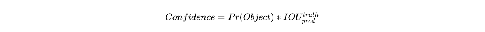
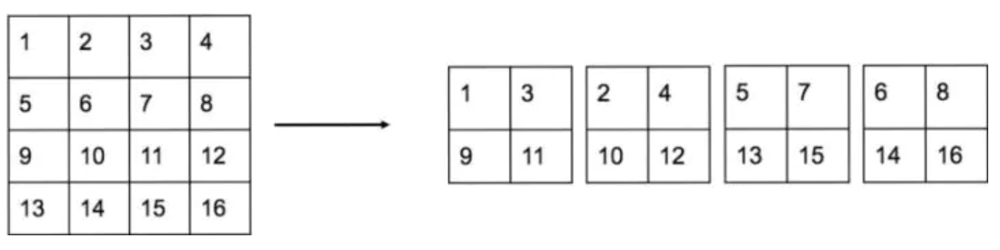

# Yolo系列算法

Yolo系列算法最早是由 Joseph Redmon 等人在 2015 年提出的，并在随后的几篇论文中进行了修订。是一类典型的one-stage目标检测算法，其利用anchor box将分类与目标定位的回归问题结合起来，从而做到了高效、灵活和泛化性能好，所以在工业界也十分受欢迎。与R-CNN类似，从YoloV12015，YoloV22016，YoloV32018，YoloV42020、YoloV52020，YoloV62022，YoloV72022，YoloV82023，Yolo系列也在不断的进化发展。

>学习⽬标
>
>YoloV1⽹络架构和输⼊输出[知道]
>
>YoloV1模型的训练样本构建的⽅法[知道]
>
>YoloV1模型的损失函数[了解]
>
>YoloV2模型的改进⽅法[知道]
>
>YoloV3的多尺度检测⽅法[知道]
>
>YoloV3模型的⽹络结构及⽹络输出[知道]
>
>YoloV3模型先验框设计的⽅法[了解]
>
>YoloV3模型为什么适⽤于多标签的⽬标分类[知道]
>
>YoloV4模型[了解]

## YoloV1

paper：https://arxiv.org/abs/1506.02640

Yolo算法采用一个单独的CNN模型实现end-to-end（端对端）的目标检测，核心思想就是利用整张图作为网络的输入，直接在输出层回归 bounding box（边界框） 的位置及其所属的类别，整个系统如下图所示：

首先将输入图片resize到**448x448**，然后送入CNN网络，最后处理网络预测结果得到检测的目标。相比R-CNN算法，其是一个统一的框架，其速度更快。

Yolo算法相比Faster R-CNN具有两大优势：

+ **速度快**：每秒45帧的检测速率，可用在**实时视频检测**中，在更小的模型上甚至达到155帧；
+ **通用性好**：在真实图像数据上训练的网络，可以用在虚构的绘画作品上。

### Yolo算法思想

在介绍Yolo算法之前，我们回忆下RCNN模型，RCNN模型提出了候选区(Region Proposals)的方法，先从图片中搜索出一些可能存在对象的候选区（Selective Search），大概2000个左右，然后对每个候选区进行对象识别，但处理速度较慢。

Yolo意思是You Only Look Once（你只需要看一次），它并没有真正的去掉候选区域，而是创造性的将候选区和目标分类合二为一，看一眼图片就能知道有哪些对象以及它们的位置。

**Yolo模型采用预定义预测区域的方法来完成目标检测，具体而言是将原始图像划分为 7x7=49 个网格（grid），每个网格允许预测出2个边框（bounding box，包含某个对象的矩形框），总共 49x2=98 个bounding box。我们将其理解为98个预测区，很粗略的覆盖了图片的整个区域，就在这98个预测区中进行目标检测。**

只要得到这98个区域的目标分类和回归结果，再进行NMS就可以得到最终的目标检测结果。那具体要怎样实现呢？

### Yolo的网络结构

Yolo的结构非常简单，就是单纯的卷积、池化最后加了两层全连接，从网络结构上看，与前面介绍的CNN分类网络没有本质的区别，最大的差异是**输出层用线性函数做激活函数**，因为需要预测bounding box的位置（数值型），而不仅仅是对象的概率。所以粗略来说，Yolo的整个结构就是输入图片经过神经网络的变换得到一个输出的张量，如下图所示：

网络结构比较简单，重点是我们要理解网络输入与输出之间的关系。

#### 网络输入

网络的输入是原始图像，**唯一的要求是缩放到448x448的大小**。主要是因为Yolo的网络中，卷积层最后接了两个全连接层，全连接层是要求固定大小的向量作为输入，所以Yolo的输入图像的大小固定为448x448。

#### 网络输出

网络的输出就是一个7x7x30 的张量（tensor）。那这个输出结果我们要怎么理解那？

30维与使用的训练集有关，因为是使用pascal voc训练集，所以有20个数值关于列表的。如果回头使用coco训练集，则输出结果的维度则应该是90，80个物品分类+5+5。

##### 7X7网格

根据Yolo的设计，输入图像被划分为 7x7 的网格（grid），输出张量中的 7x7 就对应着输入图像的 7x7 网格。或者我们把 7x7x30 的张量看作 7x7=49个30维的向量，也就是输入图像中的每个网格对应输出一个30维的向量。如下图所示，比如输入图像左上角的网格对应到输出张量中左上角的向量。

##### 30维向量

30维的向量包含：2个bbox的位置和置信度以及该网格属于20个类别的概率。

+ **2个bounding box的位置** 每个bounding box需要4个数值来表示其位置，(Center_x,Center_y,width,height)，即(bounding box的中心点的x坐标，y坐标，bounding box的宽度，高度)，2个bounding box共需要8个数值来表示其位置。

+ **2个bounding box的置信度** bounding box的置信度 = 该bounding box内存在对象的概率 * 该bounding box与该对象实际bounding box的IOU，用公式表示就是：

  

  Pr(Object)是bounding box内存在对象的概率。

+ **20个对象分类的概率** Yolo支持识别20种不同的对象（人、鸟、猫、汽车、椅子等），所以这里有20个值表示该网格位置存在任一种对象的概率。

### Yolo模型的训练

在进行模型训练时，我们需要构造训练样本和设计损失函数，才能利用梯度下降对网络进行训练。

#### 训练样本的构建

将一幅图片输入到Yolo模型中，对应的输出是一个7x7x30张量，构建标签label时对于原图像中的每一个网格grid都需要构建一个30维的向量。对照下图我们来构建目标向量：

+ **20个对象分类的概率** 对于输入图像中的每个对象，先找到其中心点。比如上图中自行车，其中心点在黄色圆点位置，中心点落在黄色网格内，所以这个黄色网格对应的30维向量中，自行车的概率Pr(object)是1，其它对象的概率是0。所有其它48个网格的30维向量中，该自行车的概率都是0。这就是所谓的"**对象目标框的中心点所在的网格对预测该对象负责**"。狗和汽车的分类概率也是同样的方法填写

+ **2个bounding box的位置**  训练样本的bbox位置应该填写对象真实的位置bbox，但一个对象对应了2个bounding box，该填哪一个呢？需要根据网络输出的bbox与对象实际bbox的IOU来选择，所以要在训练过程中**动态决定**到底填哪一个bbox。

  选择最大IoU值的bbox进行。所谓的动态决定就是当前一轮训练的最大IoU所在的bbox可以跟上一轮最大IoU所在的bbox不一样。

+ **2个bounding box的置信度**  预测置信度的公式为：

  

IOUpredtruth利用网络输出的2个bounding box与对象真实bounding box计算出来。然后看这2个bounding box的IOU，哪个比较大，就由哪个bounding box来负责预测该对象是否存在，即该bounding box的置信度目标值为1，同时对象真实bounding box的位置也就填入该bounding box。另一个不负责预测的bounding box的置信度目标值为0。

上图中自行车所在的网格grid对应的30维向量结果如下图所示：

#### 损失函数

损失就是网络实际输出值与样本标签值之间的偏差：

Yolo给出的损失函数：

注：其中1iobj表示目标是否出现在网格单元i中，1ijobj表示单元格i中的第j个边界框预测器负责该预测，Yolo设置 λcoord=5 来调高位置误差的权重， λnoobj=0.5 即调低不存在对象的bounding box的置信度误差的权重。

另：在YoloV2以后，边框宽、高误差计算不再使用值开方计算，而是直接使用值进行计算。

#### 模型训练

YoloV1先使用ImageNet数据集对前20层卷积网络进行预训练，然后使用完整的网络，在PASCAL VOC数据集上进行对象识别和定位的训练。

**Yolo的最后一层采用线性激活函数，其它层都是Leaky ReLU。**

**训练中采用了drop out和数据增强（data augmentation）来防止过拟合。**

### 模型预测

将输入图片resize成448x448的大小，送入到Yolo网络中，输出一个 7x7x30 的张量（tensor）来表示图片中所有网格包含的对象（概率）以及该对象可能的2个位置（bounding box）和可信程度（置信度）。在**采用NMS（Non-maximal suppression，非极大值抑制）算法选出最有可能是目标的结果**。

### 总结

Yolo的优点

- 速度非常快，处理速度可以达到45fps，其快速版本（网络较小）甚至可以达到155fps。
- 训练和预测可以端到端的进行，非常简便。

Yolo的缺点

- 准确率会打折扣
- 对于小目标和靠的很近的目标检测效果并不好。

## YoloV2

YoloV2相对v1版本，在继续保持处理速度的基础上，从预测**更准**确（Better），速度**更快**（Faster），识别对象**更多**（Stronger）这三个方面进行了改进。其中识别更多对象也就是扩展到能够检测9000种不同对象，称之为Yolo9000。 下面看下YoloV2的都做了哪些改进？

### 预测更准确（better）

#### batch normalization

**批标准化有助于解决反向传播过程中的梯度消失和梯度爆炸问题，降低对一些超参数的敏感性，并且每个batch分别进行归一化的时候，起到了一定的正则化效果，从而能够获得更好的收敛速度和收敛效果**。在YoloV2中卷积后全部加入Batch Normalization，网络会提升2%的mAP。

#### 使用高分辨率图像微调分类模型

Yolo v1使用ImageNet的图像分类样本采用 224x224 作为输入，来训练CNN卷积层。然后在训练对象检测时，检测用的图像样本采用更高分辨率的 448x448 的图像作为输入。但这样切换对模型性能有一定影响。

YoloV2在采用 224x224 图像进行分类模型预训练后，再**采用 448x448 的高分辨率样本对分类模型进行微调（10个epoch），使网络特征逐渐适应 448x448 的分辨率**。然后再使用 448x448 的检测样本进行训练，缓解了分辨率突然切换造成的影响。使用该技巧后网络的mAP提升了约4%。

#### 采用Anchor Boxes

YoloV1并没有采用先验框（Anchor Boxes），并且每个grid（网格）只预测两个bounding box，整个图像共98个bounding box。Yolo2改成了每个grid采用5个先验框，总共有13x13x5=845个先验框。通过引入anchor boxes，使得预测的box数量更多（13x13xn）。

#### 聚类提取anchor尺度

Faster-rcnn选择的anchor比例都是手动指定的，但是不一定完全适合数据集。YoloV2尝试统计出更符合样本中对象尺寸的先验框，这样就可以减少网络微调先验框到实际位置的难度。Yolo2的做法是对训练集中标注的边框进行聚类分析，以寻找尽可能匹配样本的边框尺寸。

YoloV2选择了聚类的五种尺寸最为anchor box。

#### 边框位置的预测

Yolov2中将边框的结果约束在特定的网格中：

其中，bx，by，bw，bh是调整后的预测边框的中心和宽高。 Pr(object) ∗ IOU(b, object) 是调整后预测边框的置信度，YoloV1是直接预测置信度的值，这里对预测参数to进行σ变换后作为置信度的值。cx，cy是当前网格左上角到图像左上角的距离，要先将网格大小归一化，即令一个网格的宽=1，高=1。 pw，ph是先验框的宽和高。 σ是sigmoid函数。tx，ty，tw，th，to是要学习的参数，分别用于预测边框的中心和宽高，以及置信度。如下图所示：

由于σ函数将tx，ty约束在(0,1)范围内，预测边框的蓝色中心点被约束在蓝色背景的网格内。约束边框位置使得模型更容易学习，且预测更为稳定。

假设网络预测值为：

anchor框为：

则目标在特征图中的位置：

在原图像中的位置：

#### 细粒度特征融合

图像中对象会有大有小，输入图像经过多层网络提取特征，最后输出的特征图中，较小的对象的特征已经不明显甚至被忽略掉了。为了更好的检测出一些比较小的对象，最后输出的特征图需要保留一些更细节的信息。

Yolo2引入一种称为passthrough层的方法在特征图中保留一些细节信息。具体来说，就是在最后一个pooling之前，特征图的大小是26x26x512，将其1拆4，直接传递（passthrough）到pooling后（并且又经过一组卷积）的特征图，两者叠加到一起作为输出的特征图。concat

具体的拆分方法如下所示：（隔行隔列进行特征图拆分）

YoloV2模型结构：

#### 多尺度训练

Yolo2中没有全连接层，可以输入任何尺寸的图像。因为整个网络下采样倍数是32，采用了{320,352,…,608}等10种输入图像的尺寸，这些尺寸的输入图像对应输出的特征图宽和高是{10,11,…19}。训练时每10个batch就随机更换一种尺寸，使网络能够适应各种大小的对象检测。

### 速度更快（Faster）

YoloV2提出了Darknet-19（有19个卷积层和5个MaxPooling层）网络结构作为Backone躯干模型，用于特征提取。DarkNet-19比VGG-16小一些，精度不弱于VGG-16，但**浮点运算量减少到约⅕，以保证更快的运算速度**。

YoloV2的网络中只有卷积+pooling，从416x416x3 变换到 13x13x5x25。增加了batch normalization，增加了一个passthrough层，去掉了全连接层，以及采用了5个先验框,网络的输出如下图所示：

输入图像不一定是416x416，只要是32的倍数的图像大小都可以，只是因为作者在训练过程中得到的统计结论发现416x416的表现更好，所以推荐使用416x416。

### 识别对象更多

VOC数据集可以检测20种对象，但实际上对象的种类非常多，只是缺少相应的用于对象检测的训练样本。**Yolo2尝试利用ImageNet非常大量的分类样本，联合COCO的对象检测数据集一起训练**，使得Yolo2即使没有学过很多对象的检测样本，也能检测出这些对象。

## YoloV3

YoloV3以V1，V2为基础进行的改进，主要有：**利用多尺度特征进行目标检测；先验框（5→3x3）更丰富；调整了网络结构（Darknet19→Darknet53-1FC）；对象分类使用logistic代替了softmax，更适用于多标签分类任务**。

### 算法简介

YoloV3相比之前的算法，尤其是针对小目标，精度有显著提升。

YoloV3的流程如下图所示，对于每一幅输入图像，YoloV3会**预测三个不同尺度的输出，目的是检测出不同大小的目标**。

### 多尺度检测

通常一幅图像包含各种不同的物体，并且有大有小。比较理想的是一次就可以将所有大小的物体同时检测出来。因此，网络必须具备能够“看到”不同大小的物体的能力。因为网络越深，特征图就会越小，所以网络越深小的物体也就越难检测出来。

在实际的feature map中，随着网络深度的加深，浅层的feature map中主要包含低级的信息（物体边缘，颜色，初级位置信息等），深层的feature map中包含高等信息（例如物体的语义信息：狗，猫，汽车等等）。因此在不同级别的feature map对应不同的scale，所以我们可以在不同级别的特征图中进行目标检测。如下图展示了多种scale变换的经典方法。

**(a)** 这种方法首先建立图像金字塔，不同尺度的金字塔图像被输入到对应的网络当中，用于不同scale物体的检测。但这样做的结果就是每个级别的金字塔都需要进行一次处理，速度很慢。

**(b)** 检测只在最后一层feature map阶段进行，这个结构无法检测不同大小的物体

**(c)** 对不同深度的feature map分别进行目标检测。SSD中采用的便是这样的结构。这样小的物体会在浅层的feature map中被检测出来，而大的物体会在深层的feature map被检测出来，从而达到对应不同scale的物体的目的，缺点是每一个feature map获得的信息仅来源于之前的层，之后的层的特征信息无法获取并加以利用。

**(d)** 与(c)很接近，但不同的是，当前层的feature map会对未来层的feature map进行上采样，并加以利用。因为有了这样一个结构，当前的feature map就可以获得“未来”层的信息，这样的话低阶特征与高阶特征就有机融合起来了，提升检测精度。在YoloV3中，就是采用这种方式来实现目标多尺度的变换的。这也是之前Faster R-CNN的FPN网络。

### 网络模型结构

在基本的图像特征提取方面，YoloV3采用了Darknet-53的网络结构（含有53个卷积层）作为Backone躯干模型，它借鉴了残差网络ResNet的做法，在层之间设置了shortcut（短连接），来解决深层网络梯度的问题，shortcut如下图所示：包含两个卷积层和一个shortcut connections。

YoloV3的模型结构如下所示：整个v3结构里面，没有池化层和全连接层，**网络的下采样是通过设置卷积的stride为2来达到的**，每当通过这个卷积层之后**图像的尺寸就会减小到一半**。

下面我们看下网络结构：

- **基本组件：蓝色方框内部分**

  1、CBL：YoloV3网络结构中的最小组件，由Conv+Bn+Leaky_relu激活函数三者组成。 

  2、Res unit（残差组件）：借鉴Resnet网络中的残差结构，让网络可以构建的更深。 

  3、ResX：由一个CBL和X个残差组件构成，是YoloV3中的大组件。**每个Res模块前面的CBL都起到下采样的作用**，因此经过5次Res模块后，得到的特征图是416->208->104->52->26->13大小。

- **其他基础操作**：

  1、Concat：张量拼接，会扩充两个张量的维度，例如26×26×256和26×26×512两个张量拼接，结果是26×26×768。

  2、Add：张量相加，张量直接相加，不会扩充维度，例如104×104×128和104×104×128相加，结果还是104×104×128。

- **Backbone中卷积层的数量**：

  每个ResX中包含1+2×X个卷积层，因此整个主干网络Backbone中一共包含1+(1+2×1)+(1+2×2)+(1+2×8)+(1+2×8)+(1+2×4)=52，再加上一个FC全连接层，即可以组成一个Darknet53分类网络。不过在目标检测YoloV3中，去掉FC层，仍然把YoloV3的躯干网络叫做Darknet53结构。

### 先验框

YoloV3采用K-means聚类得到先验框的尺寸，为每种尺度设定3种先验框，总共聚类出9种尺寸的先验框。

在COCO数据集这9个先验框是：(10x13)，(16x30)，(33x23)，(30x61)，(62x45)，(59x119)，(116x90)，(156x198)，(373x326)。在最小的(13x13)特征图上（有最大的感受野）应用较大的先验框(116x90)，(156x198)，(373x326)，**适合检测较大的对象**。中等的(26x26)特征图上（中等感受野）应用中等的先验框(30x61)，(62x45)，(59x119)，**适合检测中等大小的对象**。较大的(52x52)特征图上（较小的感受野）应用,其中较小的先验框(10x13)，(16x30)，(33x23)，**适合检测较小的对象**。

直观上感受9种先验框的尺寸，下图中蓝色框为聚类得到的先验框。黄色框式ground truth，红框是对象中心点所在的网格。

### logistic回归

预测对象类别时不使用softmax，而是被替换为一个1x1的卷积层+logistic激活函数的结构。使用softmax层的时候其实已经假设每个输出仅对应某一个单个的class，但是在某些class存在重叠情况（例如woman和person）的数据集中，使用softmax就不能使网络对数据进行很好的预测。

为了方便识别单个对象存在多个目标值（标签值）的情况。

### YoloV3模型的输入与输出

YoloV3的输入输出形式如下图所示：

输入416×416×3的图像，通过darknet53网络得到三种不同尺度的预测结果，每个尺度都对应N个通道，包含着预测的信息；

每个网格每个尺寸的anchors的预测结果。

YoloV3共有13×13×3+26×26×3+52×52×3个预测 。每个预测对应85维，分别是4（坐标值）、1（置信度分数）、80（coco类别概率）。

## YoloV4

Yolo之父(Joseph Redmon)在2020年初宣布退出CV界，之后的Yolo系列算法并不是原作者所研发。Yolo v4是Yolo系列一个重大的更新，其在COCO数据集上的平均精度(AP)和帧率精度(FPS)分别提高了10% 和12%，并得到了Joseph Redmon的官方认可，被认为是当前最强的实时对象检测模型之一。

YoloV4总结了大部分检测技巧，然后经过筛选，排列组合，挨个实验（ablation study）哪些方法有效，总体来说，**YoloV4并没有创造新的改进，而是使用了大量的目标检测的技巧**。在这里我们主要给大家看下它的网络架构：

YoloV4的结构图和YoloV3是相似的，不过使用各种新的算法思想对各个子结构都进行了改进。 先整理下YoloV4的结构组件：

基本组件：

+ CBM：YoloV4网络结构中的最小组件，由Conv+Bn+Mish激活函数三者组成。
+ CBL：由Conv+Bn+Leaky_relu激活函数三者组成。
+ Res unit：借鉴Resnet网络中的残差结构，让网络可以构建的更深。
+ CSPX：由三个卷积层CBL和X个Res unint模块Concat组成。
+ SPP：采用1×1，5×5，9×9，13×13的最大池化的方式，进行多尺度融合。

其他基础操作：

+ Concat：张量拼接，维度会扩充，和YoloV3中的解释一样，对应于cfg文件中的route操作。
+ Add：张量相加，不会扩充维度，对应于cfg文件中的shortcut操作。
+ Backbone中卷积层的数量： 每个CSPX中包含3+2×X个卷积层，因此整个主干网络Backbone中一共包含2+(3+2×1)+2+(3+2×2)+2+(3+2×8)+2+(3+2×8)+2+(3+2×4)+1=72。

> 注意：
>
> 网络的输入大小不是固定的，在YoloV3中输入默认是416×416，在YoloV4中默认是608×608，在实际项目中也可以根据需要修改，比如320×320，一般是32的倍数。 输入图像的大小和最后的三个特征图的大小也是对应的，比如416×416的输入，最后的三个特征图大小是13×13，26×26，52×52， 如果是608×608，最后的三个特征图大小则是19×19，38×38，76×76。

## 总结

+ 知道Yolo网络架构，理解其输入输出
  Yolo的整个结构就是输入图片经过神经网络的变换得到一个输出的张量。
+ 知道Yolo模型的训练样本构建的方法
  对于原图像中的每一个网格grid都需要构建一个30维的向量：分类，置信度，回归的目标值。
+ 理解Yolo模型的损失函数
  损失函数分为3部分：分类损失，回归损失，置信度损失。
+ 知道YoloV2模型的改进方法
  每个卷积都使用了BN层，高分辨率训练，采用Anchorbox，聚类得到anchorbox的尺寸，改进边界框预测的方法，特征融合，多尺度训练，网络模型使用darknet19，利用imagenet数据集识别更多的目标。
+ YoloV3的多尺度检测方法
  在YoloV3中采用FPN结构来提高对应多尺度目标检测的精度，当前的feature map利用“未来”层的信息，将低阶特征与高阶特征进行融合，提升检测精度。
+ YoloV3模型的网络结构
  以darknet-53为基础，借鉴resnet的思想，在网络中加入了残差模块，利于解决深层次网络的梯度问题。
  整个v3结构里面，没有池化层和全连接层，只有卷积层。
  网络的下采样是通过设置卷积的stride为2来达到的。
+ YoloV3模型先验框设计的方法
  采用K-means聚类得到先验框的尺寸，为每种尺度设定3种先验框，总共聚类出9种尺寸的先验框。
+ YoloV3模型为什么适用于多标签的目标分类
  预测对象类别时不使用softmax，而是使用logistic的输出进行预测。
+ YoloV3模型的输入输出
  对于416×416×3的输入图像，在每个尺度的特征图的每个网格设置3个先验框，总共有 13×13×3 + 26×26×3 + 52×52×3 = 10647 个预测。每一个预测是一个(4+1+80)=85维向量，这个85维向量包含边框坐标（4个数值），边框置信度（1个数值），对象类别的概率（对于COCO数据集，有80种对象）。

