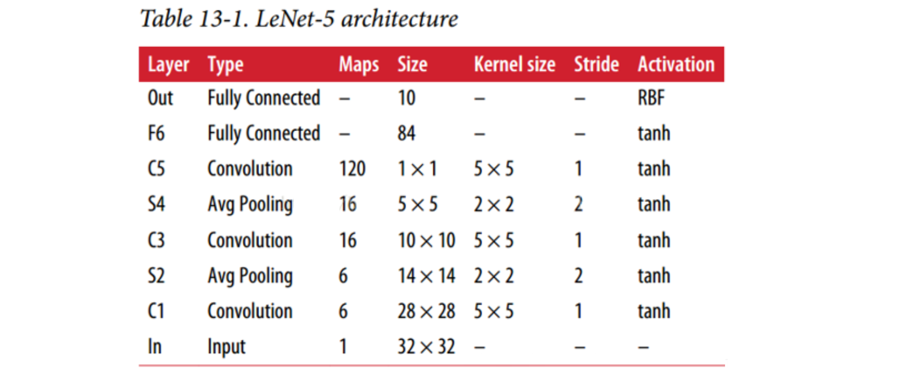
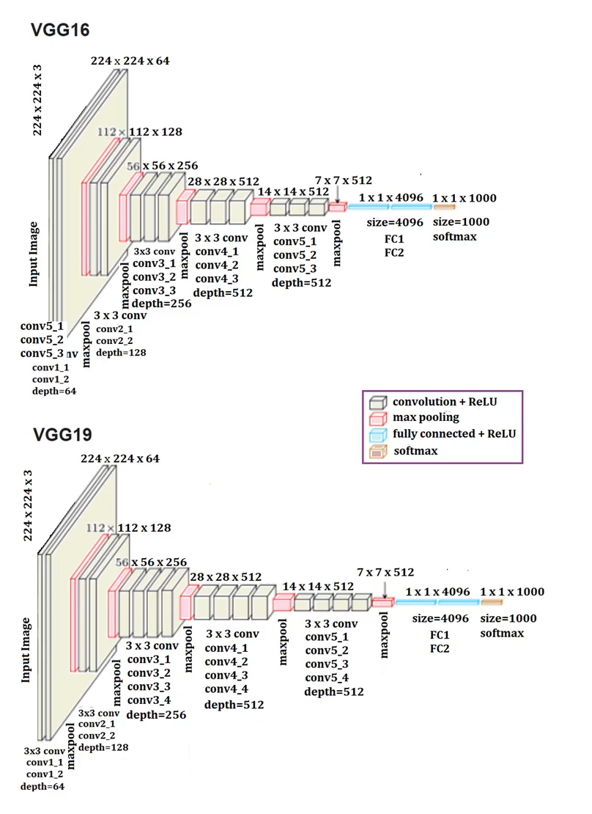

# 深度学习

#### 介绍：

深度学习（Deep Learning），也称为深度结构学习【Deep Structured Learning】、层次学习【Hierarchical Learning】或者是深度机器学习【Deep Machine Learning】）。

深度学习方法是依赖算法自动提取特征，不需要人工设计特征。深度学习模仿人类大脑的运行方式，从经验中学习获取知识。这也是深度学习被看做**黑盒子**，**可解释性差**的原因。

#### 应用领域：

智能手机、语音识别、机器翻译、拍照翻译、自动驾驶、银行风控、网络安防、智能零售、智能家居、智慧医疗、智能推荐、情绪分析、智慧问答、AIGC（生成类AI，chatgpt）等等。

## TensorFlow

目前最主流的深度框架有 TensorFlow、Pytorch 以及 Keras。

**官方网站**：https://www.tensorflow.org/?hl=zh-cn

**GitHub仓库**：https://github.com/tensorflow/tensorflow

**中文站点**：https://tensorflow.google.cn/install?hl=zh-cn

**版本号**：

```bash
版本格式： 大版本号.小版本号.修订号
大版本号：一般不改动，除非内核（内部核心的类库代码）发生了重大改变。
小版本号：代码功能的增减，都会调整版本。
修订号：功能没有变动，出现bug了修复以后会增加修订号，所以修订号也叫bug版本号。
```

```bash
1.TF托管在github平台，有google groups和contributors共同维护。
2.TF提供了丰富的深度学习相关的API，支持Python和C/C++接口。
3.TF提供了可视化分析工具Tensorboard，方便分析和调整模型。
4.TF支持Linux平台，Windows平台，Mac平台，甚至手机移动设备等各种平台。
```

#### 工作流程：

```bash
1.使用 tf.data 加载数据。
2.模型的建立与调试。
3.模型的训练。
4.预训练模型调用。
5.模型的部署。
```

#### 框架安装

文档：https://tensorflow.google.cn/install/pip?hl=zh-cn

建议使用anaconda来创建虚拟环境去安装，安装命令如下：

```bash
pip install tensorflow -i https://pypi.tuna.tsinghua.edu.cn/simple
# 如果上面安装不成功，使用下面命令安装，如果你已经安装了anaconda的话。
# conda install  tensorflow
```

## 张量Tensor

张量是一个多维数组。 与NumPy ndarray对象类似，tf.Tensor对象也具有数据类型(dtype)和形状(shape)，并且tf.Tensors可以保留在GPU中，Numpy中的ndarray是不能使用在GPU中的。

#### 导包

```python
import tensorflow as tf
import numpy as np
```

#### 创建基础的张量

##### 创建0维张量，即标量

```python
# 创建int32类型的0维张量，即标量
rank_0_tensor = tf.constant(4)
print(rank_0_tensor)  
# tf.Tensor(4, shape=(), dtype=int32)
```

##### 创建1维张量

```python
# 创建float32类型的1维张量
rank_1_tensor = tf.constant([2.0, 3.0, 4.0])
print(rank_1_tensor)  
# tf.Tensor([2. 3. 4.], shape=(3,), dtype=float32)
```

##### 创建二维张量

```python
# 创建float16类型的二维张量
rank_2_tensor = tf.constant([[1, 2], [3, 4], [5, 6]], dtype=tf.float16)
print(rank_2_tensor)
"""
tf.Tensor(
[[1 2]
 [3 4]
 [5 6]], shape=(3, 2), dtype=int32)
"""
```

##### 创建三维张量

```python
# 创建3维int32类型的张量
rank_3_tensor = tf.constant([
    [
        [0, 1, 2, 3, 4],
        [5, 6, 7, 8, 9]
    ],
    [
        [10, 11, 12, 13, 14],
        [15, 16, 17, 18, 19]
    ],
    [
        [20, 21, 22, 23, 24],
        [25, 26, 27, 28, 29]
    ],
])

print(rank_3_tensor)
"""
tf.Tensor(
[[[ 0  1  2  3  4]
  [ 5  6  7  8  9]]

 [[10 11 12 13 14]
  [15 16 17 18 19]]

 [[20 21 22 23 24]
  [25 26 27 28 29]]], shape=(3, 2, 5), dtype=int32)
"""
```

#### 将张量转换为numpy中的ndarray的形式

##### np.array

```python
np.array(rank_2_tensor)
```

##### tensor.numpy()

```python
rank_2_tensor.numpy()
```

#### 张量的基本的数学运算：

```python
# 定义张量a和b
a = tf.constant([
    [1, 2],
    [3, 4]
])
b = tf.constant([
    [1, 2],
    [3, 4]
])
```

##### add（加法）

```python
tf.add(a, b)
"""
tf.Tensor(
[[2 4]
 [6 8]], shape=(2, 2), dtype=int32) 
"""
```

##### multiply（元素乘法）

```python
tf.multiply(a, b)
""" 
tf.Tensor(
[[ 1  4]
 [ 9 16]], shape=(2, 2), dtype=int32)  
"""
```

##### matmul（矩阵乘法）

```python
tf.matmul(a, b)
"""
tf.Tensor(
[[ 7 10]
 [15 22]], shape=(2, 2), dtype=int32) 
"""
```

#### 聚合函数运算

| 聚合函数         | 描述               |
| ---------------- | ------------------ |
| tf.reduce_sum()  | 求和               |
| tf.reduce_mean() | 平均值             |
| tf.reduce_max()  | 最大值             |
| tf.reduce_min()  | 最小值             |
| tf.argmax()      | 最大值的索引(下标) |
| tf.argmin()      | 最小值的索引(下标) |

```python
c = tf.constant([[4.0, 5.0], [10.0, 1.0]])
# 最大值
print(tf.reduce_max(c))
# 最大值索引
print(tf.argmax(c))
# 计算均值
print(tf.reduce_mean(c))

"""
tf.Tensor(10.0, shape=(), dtype=float32)
tf.Tensor([1 0], shape=(2,), dtype=int64)
tf.Tensor(5.0, shape=(), dtype=float32)
"""

# 三维的张量的最大值：比较方式，从外到内，同列比较。
d = tf.constant([
    [
        [45,32,200], [30,100, 11]
    ],
    [
        [32,12, 5],  [22,10, 12]
    ],
])
# ret = tf.reduce_max(d)
# print(ret)
ret = tf.argmax(d)  # 0 0 2
print(ret)

# 三维获取最小值下标的获取方式，从外到内，同列找最小。
```

#### 变量

形状不可变，可以更改变量的值

```python
# 定义一个变量
my_variable = tf.Variable([[1.0, 2.0], [3.0, 4.0]])
```

```python
variable = tf.Variable([
    [1, 2], 
    [3, 4]
])

print("形状: ", variable.shape)
print("类型: ", variable.dtype)
print("转换: ", variable.numpy())

"""
形状:  (2, 2)
类型:  <dtype: 'int32'>
转换:  [[1 2]
 [3 4]]
"""
```

```python
# 修改变量的值，是不能修改形状的
my_variable = tf.Variable([1,2,3])
print(my_variable)
print(id(my_variable)) # id查看变量保存在内存中的地址，原始的内存地址是一个16进制的地址，经过id函数的处理会变成十进制数值

# 使用assign方法修改变量的值
my_variable.assign([3,5,65])
print(my_variable) # 修改后的变量
print(id(my_variable))  # 修改后的变量的内存地址，发现是没有变化的。

# 这种修改，是不会影响到原来的内存地址，也就是说还是保存在原来的同一片内存中。
```

## tf.keras

##### 导入tf.keras

```python
import tensorflow as tf
from tensorflow import keras
```

##### 数据输入

对于小的数据集，可以直接使用numpy格式的数据进行训练、评估模型，对于大型数据集或者要进行跨设备训练时使用tf.data.datasets来进行数据输入。

##### 模型构建

- 简单模型使用Sequential进行构建
- 复杂模型使用函数式编程来构建 
- 自定义layers

##### 训练与评估

```python
# 配置优化方法，损失函数和评价指标
model.compile(
    optimizer=tf.train.AdamOptimizer(0.001),
    loss='categorical_crossentropy',
    metrics=['accuracy']
)

# 指明训练数据集，训练epoch,批次大小和验证集数据
model.fit/fit_generator(
    dataset, 
    epochs=10,   # 迭代的次数，
    batch_size=3,  # 训练集的批次
    validation_data=val_dataset,
)

# 指明评估数据集和批次大小
model.evaluate(x, y, batch_size=32)

# 对新的样本进行预测
model.predict(x, batch_size=32)
```

#### 模型的保存和恢复

只保存参数

```python
# 只保存模型的权重【保存】
model.save_weights('./my_model')
# 加载模型的权重【恢复】
model.load_weights('my_model')
```

保存整个模型

```python
# 保存模型架构与权重在h5文件中【保存】
model.save('my_model.h5')
# 加载模型：包括架构和对应的权重【恢复】
model = keras.models.load_model('my_model.h5')
```

## 快速入门模型

使用鸢尾花数据集，用 tf.keras 实现模型构建

```python
# 导包
# 绘图
import seaborn as sns
# 数值计算
import numpy as np
# sklearn中的相关工具
# 划分训练集和测试集
from sklearn.model_selection import train_test_split
# 逻辑回归
from sklearn.linear_model import LogisticRegressionCV
# tf.keras中使用的相关工具
# 用于模型搭建
from tensorflow.keras.models import Sequential
# 构建模型的层和激活方法
from tensorflow.keras.layers import Dense, Activation
# 数据处理的辅助工具
from tensorflow.keras import utils

# 数据展示和划分
# 读取记载数据集，还是鸢尾花数据集，
iris = sns.load_dataset("iris")
# 展示数据的前五行
iris.head()

# 将数据之间的关系进行可视化
sns.pairplot(iris, hue='species')

# 花瓣和花萼的数据
X = iris.values[:, :4]
# 标签值
y = iris.values[:, 4]

# 将数据集划分为训练集和测试集
train_X, test_X, train_y, test_y = train_test_split(X, y, train_size=0.5, test_size=0.5, random_state=0)

# sklearn实现
# 实例化分类器
lr = LogisticRegressionCV()
# 训练
lr.fit(train_X, train_y)

# 计算准确率并进行打印
print(f"Accuracy = {lr.score(test_X, test_y):.2f}")

# print("Accuracy = {:.2f}".format(lr.score(test_X, test_y)))

# tf.keras实现
# 进行热编码
def one_hot_encode_object_array(arr):
    # 去重获取全部的类别
    uniques, ids = np.unique(arr, return_inverse=True)
    # 返回热编码的结果
    return utils.to_categorical(ids, len(uniques))

# 数据处理
# 训练集热编码
train_y_ohe = one_hot_encode_object_array(train_y)
# 测试集热编码
test_y_ohe = one_hot_encode_object_array(test_y)

# 模型搭建
# 利用sequential方式构建模型
model = Sequential([
  # 隐藏层1，激活函数是relu，输入大小有input_shape指定
  Dense(10, activation="relu", input_shape=(4,)),
  # 隐藏层2，激活函数是relu
  Dense(10, activation="relu"),
  # 输出层
  Dense(3,activation="softmax")  # softmax 是激活函数，用于调到神经元，只用于输出层，可以保证概念总和必须是1，
])

# 通过model.summary()可以查看模型的架构：
Model: "sequential_2"
    
# 模型训练和预测
# 设置模型的相关参数：优化器，损失函数和评价指标
model.compile(optimizer='adam', loss='categorical_crossentropy', metrics=["accuracy"])

# 分别调用fit和predict方法进行预测
# 进行训练之前，把训练集的数据类型转换为正确的张量类型。
train_X = tf.constant(train_X, dtype="float32")

# 模型训练：epochs,训练样本送入到网络中的次数，batch_size:每次训练的送入到网络中的样本个数
model.fit(train_X, train_y_ohe, epochs=10, batch_size=1, verbose=1)

# 对测试集进行格式转换
test_X = tf.constant(test_X, dtype="float32")
# 计算模型的损失和准确率
loss, accuracy = model.evaluate(test_X, test_y_ohe, verbose=1)
print("Accuracy = {:.2f}".format(accuracy))
```

keras的训练流程：

- 数据处理
  - 需要使用 utils.to_categorical 对数据集（训练集和测试集）进行热编码处理 
- 模型搭建
  - Sequential
- 模型训练
  - 设置训练相关参数：model.compile
  - 训练方法 model.fit
- 评估模型
  - model.evaluate

## Seaborn

Seaborn是基于Matplotlib核心库进行了更高级的API封装的绘图模块。

Seaborn库提供了对单变量和双变量分布的绘制函数，如 **displot()函数、 jointplot()函数**。


```python
# 使用前，要导入模块
import seaborn as sns
```

通过 displot() 函数绘制直方图

```python
import numpy as np

sns.set()
np.random.seed(0)  # 确定随机数生成器的种子,如果不使用每次生成图形不一样
data = np.random.randn(100)  # 生成随机数组

ax = sns.displot(data, bins=10, kde=True,  rug=True)  # 绘制直方图
# ax = sns.histplot(data, bins=10, kde=True, color="red")  # 也可以使用直方图绘制方法来绘制直方图
```

通过 distplot()函数绘制核密度估计曲线

```python
# 创建包含500个位于[0，100]之间整数的随机数组
array_random = np.random.randint(0, 100, 500)
# 绘制核密度估计曲线
ax = sns.displot(array_random, kind="kde", rug=True)  # kind 绘制的图形效果，默认kind就是hist，其他的参数值就kde和ecdf两种不同的曲线。
```

jointplot()函数的语法：

```python
seaborn.jointplot(
    data=None,
    x=None,
    y=None,
    kind='scatter', 
    stat_func=None, 
    color=None, 
    ratio=5, 
    space=0.2, 
    dropna=True
)
```

调用 seaborn.jointplot()函数绘制散点图

```python
import pandas as pd
# 创建DataFrame对象
data = pd.DataFrame({"x": np.random.randn(500),"y": np.random.randn(500)})
# 绘制散布图
ax = sns.jointplot(x="x", y="y", data=data)
```

调用 jointplot()函数，传入kind="hex"，绘制二维直方图

```python
# 绘制二维直方图
ax = sns.jointplot(x="x", y="y", data=data, kind="hex")
```

调用jointplot()函数，传入kind="kde"，绘制核密度估计图形

```python
sns.jointplot(x="x", y="y", data=darta, kind="kde")
```

通过pairplot()函数绘制成对的双变量分布

```python
# 加载seaborn中的数据集，通过鸢尾花数据集去展示，需要网络，如果慢的话，换个好点的网络即可。
dataset = sns.load_dataset("iris")
dataset.head()

# 绘制多个成对的双变量分布
sns.pairplot(dataset)
```

# 深度神经网络基础

**人工神经网络**（英语：Artificial Neural Network，**ANN**），简称 **神经网络**（Neural Network，NN）或 **类神经网络**，是一种模仿生物神经网络（动物的中枢神经系统，特别是大脑）的结构和功能的**计算模型**。

常用的神经网络，包括：

- 卷积神经网络**(Convolutional Neural Network，CNN)**
- 循环神经网络**(Recurrent Neural Network，RNN)**
- ⽣成对抗网络**(Generative Adversarial Networks，GAN )**
- 深度强化学习**(Deep Reinforcement Learning，DRL )**

##### 神经元

**M-P神经元模型**


## 激活函数

常用的激活函数有：sigmoid、**tanh**、**relu**、leaky_relu、**softmax**等等

### Sigmoid/logistics函数

```python
# 导⼊相应的工具包
import tensorflow as tf
import tensorflow.keras as keras
import matplotlib.pyplot as plt
import numpy as np

# 定义x的取值范围
x = np.linspace(-10, 10, 100)
# 直接使用tensorflow实现
# 所有的激活函数都在tf.nn 神经网络激活函数模块中，每一个激活函数都是一个方法，直接调用传递数据即可。
y = tf.nn.sigmoid(x)
# 绘图
plt.plot(x,y)
plt.grid()
```

### tanh(双曲正切曲线)

```python
# 导⼊相应的工具包
import tensorflow as tf
import tensorflow.keras as keras
import matplotlib.pyplot as plt
import numpy as np
# 定义x的取值范围
x = np.linspace(-10, 10, 100)
# 直接使用tensorflow实现
y = tf.nn.tanh(x)
# 绘图
plt.plot(x,y)
plt.grid()
```

### ReLU

```python
# 导⼊相应的工具包
import tensorflow as tf
import tensorflow.keras as keras
import matplotlib.pyplot as plt
import numpy as np
# 定义x的取值范围
x = np.linspace(-10, 10, 100)
# 直接使用tensorflow实现
y = tf.nn.relu(x)
# 绘图
plt.plot(x,y)
plt.grid()
```

### Leaky_ReLU(是对RELU的改进)

```python
# 导⼊相应的工具包
import tensorflow as tf
import tensorflow.keras as keras
import matplotlib.pyplot as plt
import numpy as np
# 定义x的取值范围
x = np.linspace(-10, 10, 100)
# 直接使用tensorflow实现
y = tf.nn.leaky_relu(x)
# 绘图
plt.plot(x,y)
plt.grid()
```

### swish(ReLU的改进版本函数)

```python
# 导⼊相应的工具包
import tensorflow as tf
import tensorflow.keras as keras
import matplotlib.pyplot as plt
import numpy as np
# 定义x的取值范围
x = np.linspace(-10, 10, 100)
# 直接使用tensorflow实现
y = tf.nn.swish(x)
# 绘图
plt.plot(x,y)
plt.grid()
```

### SoftMax

```python
# 导⼊相应的工具包
import tensorflow as tf
import tensorflow.keras as keras
import matplotlib.pyplot as plt
import numpy as np
# 数字中的score
x = tf.constant([0.2,0.02,0.15,1.3,0.5,0.06,1.1,0.05,3.75])
# 将其送⼊到softmax中计算分类结果
y = tf.nn.softmax(x)
# 将分类结果进⾏打印
print(y)
"""
tf.Tensor(
[0.02167152 0.01810157 0.02061459 0.06510484 0.02925349 0.01884031
 0.05330333 0.01865285 0.7544575 ], shape=(9,), dtype=float32)
"""
```

## 参数初始化

### 随机初始化

从**均值为0，标准差是1的⾼斯分布**中取样，使⽤⼀些很⼩的值对参数W进⾏初始化。


### 标准初始化

从**区间均匀随机取值**。即在**(-1/d,1/√d)均匀分布中**⽣成当前神经元的权重，其中d为每个神经元的输⼊数量。


### Xavier初始化

#### 正态化Xavier初始化

从**以 0为中⼼，标准差为 `stddev = sqrt(2 / (fan_in + fan_out)) `的正态分布中抽取样本， 其中 fan_in 是输⼊神经元的个数， fan_out是输出的神经元个数**。

这里的fan_in 就是当前隐藏层的神经元的个数。

```python
# 导⼊模块
import tensorflow as tf
# 实例化Glorot正态分布初始化器
initializer = tf.keras.initializers.glorot_normal()   # 实际使用中，我们只需要在构建模型层的时候，设置使用哪一种初始化器，"glorot_normal"
# 采样得到权重值
values = initializer(shape=(9, 1))
# 打印结果
print(values)
```

#### 标准化Xavier初始化

从 `[-limit, limit]` 中的均匀分布中抽取样本，其中limit是 `sqrt(6/(fan_in+fan_out))` ， 其中 fan_in 是输⼊神经元的个数，fan_out 是输出的神经元个数。

```python
# 导⼊模块
import tensorflow as tf
# 实例化Glorot均匀分布初始化器
initializer = tf.keras.initializers.glorot_uniform()
# 采样得到权重值，使用初始化器对象，不需要管 输入和输出的神经元个数的，初始化器会自己根据模型的设置自动获取输入和输出的神经元个数，自动进行计算。
values = initializer(shape=(9, 1))  # 形状(9,1)代表的当前训练集的数据形状，这里只是举例，实际使用要根据实际情况来填写。
# 打印结果
print(values)
```

### He初始化

#### 正态化的he初始化[最常用]

He正态分布初始化

以 0 为中⼼，标准差为`stddev=sqrt(2/fan_in)`的截断正态分布中抽取样本， 其中 fan_in 是输⼊神经元的个数，在tf.keras中的实现方法为：

```python
# 导⼊模块
import tensorflow as tf
# 进⾏实例化
initializer = tf.keras.initializers.he_normal()   # he_normal 最常用的初始化器  "he_normal"
# 采样得到权重值
values = initializer(shape=(9, 1))
# 打印结果
print(values)
```

#### 标准化的he初始化

He 均匀方差缩放初始化器

从`[-limit, limit]`中的均匀分布中抽取样本， 其中limit 是`sqrt(6 / fan_in)`， 其中 fan_in 输⼊神经元的个数。

```python
# 导⼊工具包
import tensorflow as tf
# 进⾏实例化
initializer = tf.keras.initializers.he_uniform()
# 采样得到权重值
values = initializer(shape=(9, 1))
# 打印结果
print(values)
```

## 神经网络的搭建

tf.Keras中构建模型有两种方式，⼀种是通过Sequential构建，⼀种是**通过Model类构建**。

### 通过Sequential构建

```python
# 导⼊相关的工具包
import tensorflow as tf
from tensorflow import keras
from tensorflow.keras import layers

# 定义⼀个Sequential模型，包含3层
model = keras.Sequential(
    # 层列表，层是有序的，所以第一层是需要设置输入数据的形状的。
    [
        # 第1层：激活函数为relu,权重初始化为he_normal，如果作为第一层对接输入层，需要声明input_shape参数设置当前数据的形状。name表示隐藏层的唯一标记，不能重复。
        layers.Dense(3, activation="relu", kernel_initializer="he_normal", name="layer1", input_shape=(3,)),
        # 第2层~第：激活函数为relu,权重初始化为he_normal
        layers.Dense(2, activation="relu", kernel_initializer="he_normal", name="layer2"),
         # 最后一层（输出层）：激活函数为sigmoid,权重初始化为he_norma
        layers.Dense(2, activation="relu", kernel_initializer="he_normal", name="layer3"),
    ],
    "my_Sequential"
)

# 展示模型结果
model.summary()
```

### 利⽤function API构建

将层作为可调⽤的对象并返回张量，并将输⼊向量和输出向量提供给tf.keras.Model 的 inputs 和 outputs 参数

```python
# 导⼊工具包
import tensorflow as tf
# 定义模型的输⼊
inputs = tf.keras.Input(shape=(3,),name = "input")
# 第⼀层：激活函数为relu，其他默认
x = tf.keras.layers.Dense(3, activation="relu",name = "layer1")(inputs)
# 第⼆层：激活函数为relu，其他默认
x = tf.keras.layers.Dense(2, activation="relu",name = "layer2")(x)
# 第三层（输出层）：激活函数为sigmoid
outputs = tf.keras.layers.Dense(2, activation="sigmoid",name = "layer3")(x)
# 使⽤Model来创建模型，指明输⼊和输出
model = tf.keras.Model(inputs=inputs, outputs=outputs,name="my_model")

# 展示模型结果
model.summary()
```

### 通过keras.Model的子类构建

通过model的⼦类构建模型，此时需要在`__init__()`中定义神经网络的层，在call()方法中定义网络的前向传播过程

```python
# 导⼊相关的工具包
import tensorflow as tf

class MyModel(tf.keras.Model):
    def __init__(self):  # 这里的__init__前后是2个英文的下划线的
        """定义层"""
        # 先完成父类的初始化，因为当前这个模型是我们自定义的，所以并没有实现模型的训练，评估等方法，所以我们使用前，先让当前类的父类进行初始化，
        # 因为父类已经声明了这些操作了。
        super(MyModel, self).__init__()
        # 定义模型层
        # 第一层：激活函数为relu,权重初始化为he_normal
        self.layer1 = tf.keras.layers.Dense(3, activation="relu", kernel_initializer="he_normal", name="layer1",input_shape=(3,))
        # 第二层：激活函数为relu,权重初始化为he_normal
        self.layer2 = tf.keras.layers.Dense(2, activation="relu", kernel_initializer="he_normal", name="layer2")
        # 第三层（输出层）：激活函数为sigmoid,权重初始化为he_normal
        self.layer3 =tf.keras.layers.Dense(2, activation="sigmoid", kernel_initializer="he_normal", name="layer3")

    def call(self, inputs):
        """
        这里的call方法，将来被会Model类中的__call__()方法进行调用，
        当前模型被当成函数来调用时，会自动执行这个Model类的__call__()方法。
        __call__()方法会直接调用我们定义call方法，所以这个方法名必须叫call
        """
        x1 = self.layer1(inputs)
        x2 = self.layer2(x1)
        return self.layer3(x2)
        
# 创建对象
model = MyModel() # 这里会自动执行__init__方法中所有的代码操作，
# 把对象当成函数来调用，就会自动执行这个对象的类的内部的__call__方法了。这是python的基础语法

# 需要设置一个输入对象[必须张量类型]，调用模型，否则无法使用model.summay()来查看模型
inputs = tf.ones((1, 3))

model(inputs)

print(model.summary())
```


## 神经网络的优缺点

优点

- 精度⾼，性能优于其他的机器学习方法，甚⾄在某些领域超过了人类
- 可以近似任意的非线性函数
- 随着计算机硬件的发展，近年来在学界和业界受到了热捧，有大量的框架和库可供调⽤

缺点

- 黑箱，很难解释模型是怎么工作的
- 训练时间长，需要大量的计算力
- 网络结构复杂，需要调整超参数
- ⼩数据集上表现不佳，容易发⽣过拟合

## 常见的损失函数

### 分类任务

#### 多分类任务

在tf.keras中使用CategoricalCrossentropy实现：

```python
#导入相应的包
importtensorflowastf
#设置真实值和预测值
y_true=[[0,1,0],[0,0,1]]
y_pred=[[0.05,0.95,0],[0.1,0.8,0.1]]
#实例化交叉熵损失
cce=tf.keras.losses.CategoricalCrossentropy()
#计算损失结果
cce(y_true,y_pred).numpy()#1.1769392
```

#### 二分类任务

在tf.keras中实现时使用BinaryCrossentropy()实现：

```python
#导入相应的包
importtensorflowastf
#设置真实值和预测值
y_true=[[0],[1]]
y_pred=[[0.4],[0.6]]
#实例化⼆分类交叉熵损失
bce=tf.keras.losses.BinaryCrossentropy()
#计算损失结果
bce(y_true,y_pred).numpy()  #0.5108254
```

### 回归任务

#### MAE损失函数

在tf.keras中使用MeanAbsoluteError实现

```python
#导入相应的包
importtensorflowastf
#设置真实值和预测值
y_true=[[0.],[0.]]
y_pred=[[1.],[1.]]
#实例化MAE损失
mae=tf.keras.losses.MeanAbsoluteError()
#计算损失结果
mae(y_true,y_pred).numpy()  #1.0
```

#### MSE损失函数

在tf.keras中通过MeanSquaredError实现

```python
#导入相应的包
importtensorflowastf
#设置真实值和预测值
y_true=[[0.],[1.]]
y_pred=[[1.],[1.]]
#实例化MSE损失
mse=tf.keras.losses.MeanSquaredError()
#计算损失结果
mse(y_true,y_pred).numpy()  #0.5
```

#### smoothL1损失

在tf.keras中使用Huber计算该损失

```python
#导入相应的包
importtensorflowastf
#设置真实值和预测值
y_true=[[0],[1]]
y_pred=[[0.6],[0.4]]
#实例化smoothL1损失
h=tf.keras.losses.Huber()
#计算损失结果
h(y_true,y_pred).numpy()  #0.18
```

## 深度学习的优化方法

### 梯度下降算法

梯度下降算法分为三类：

​	BGD（批量梯度下降）

​	SGD（随机梯度下降）

​	MBGD（小批量梯度下降）


实际中使用较多的是**小批量的梯度下降算法（MBGD）**


```python
#导入相应的工具包
importtensorflowastf
#实例化优化方法：SGD，学习率一般在0.1-0.01之间
opt=tf.keras.optimizers.SGD(learning_rate=0.1)
#定义要调整的参数
var=tf.Variable(1.0)
#定义损失函数：无参但有返回值
loss=lambda:(var**2)/2.0
#计算梯度，并对参数进行更新，步长为`-learning_rate*grad`
opt.minimize(loss,[var]).numpy()
#展示参数更新结果
var.numpy()   #0.9
```

### 梯度下降优化方法

#### 动量梯度下降算法

在tf.keras中使用Momentum算法仍使用功能SGD方法，但要设置momentum参数

```python
# 导入相应的工具包
import tensorflow as tf
# 实例化优化方法：SGD 指定参数 learning_rate 学习率为0.1，momentum 动量为0.9
opt = tf.keras.optimizers.SGD(learning_rate=0.1, momentum=0.9)
# 定义要调整的参数，初始值
var = tf.Variable(1.0)
val0 = var.value()
# 定义L2损失函数
loss = lambda: (var ** 2)/2.0
# 第一次更新：计算梯度，并对参数进行更新，步长为 `- learning_rate * grad`
opt.minimize(loss, [var])
val1 = var.value()
# 第二次更新：计算梯度，并对参数进行更新，因为加入了momentum,步长会增加
opt.minimize(loss, [var])
val2 = var.value()
# 打印两次更新的步长
print(f"第一次更新步长={(val0 - val1).numpy()}")
print(f"第二次更新步长={(val1 - val2).numpy()}")

"""
第一次更新步长=0.10000002384185791
第二次更新步长=0.18000000715255737
"""
```

#### Nesterov加速梯度

Nesterov加速梯度（Nersterov Accelerated Gradient，NAG）也称为Nesterov动量优化

```python
# 导入相应的工具包
import tensorflow as tf
# 实例化优化方法：NAG依然使用SGD对象，指定参数 momentum=0.9，nesterov=True
opt = tf.keras.optimizers.SGD(learning_rate=0.1, momentum=0.9, nesterov=True)

# 定义要调整的参数，初始值
var = tf.Variable(1.0)
val0 = var.value()
# 定义损失函数
loss = lambda: (var ** 2)/2.0         
#第一次更新：计算梯度，并对参数进行更新，步长为 `- learning_rate * grad`
opt.minimize(loss, [var])
val1 = var.value()
# 第二次更新：计算梯度，并对参数进行更新，因为加入了momentum,步长会增加
opt.minimize(loss, [var])
val2 = var.value()
# 打印两次更新的步长
print(f"第一次更新步长={(val0 - val1).numpy()}")
print(f"第二次更新步长={(val1 - val2).numpy()}")

"""
第一次更新步长=0.1899999976158142
第二次更新步长=0.23489999771118164
"""
```

#### AdaGrad

```python
# 导入相应的工具包
import tensorflow as tf
# 实例化优化方法：Adagrad
opt = tf.keras.optimizers.Adagrad(
    learning_rate=0.1, initial_accumulator_value=0.1, epsilon=1e-07
)
# 定义要调整的参数
var = tf.Variable(1.0)
# 定义损失函数：无参但有返回值
loss = lambda: (var ** 2)/2.0
"""
def loss():
    # L2损失函数
    return var**2/2.0
"""
# 计算梯度，并对参数进行更新，
opt.minimize(loss, [var])
# 展示参数更新结果
var.numpy()  # 0.9046537
```

#### RMSprop

```python
opt = tf.keras.optimizers.RMSprop(learning_rate=0.1)
# 定义要进行梯度下降的参数初始值，将来可以是偏置，权重进行momentum动量处理
var = tf.Variable(1.0)
val0 = var.value() # 最初的参数值
# 定义一个损失函数 L2
loss = lambda: (var**2) / 2

opt.minimize(loss, [var]) # 第二个参数必须是列表，因为实际开发中，肯定数据集中多个数据传入
# 展示参数更新结果
val1 = var.numpy()
print(val1)
opt.minimize(loss, [var])
val2 = var.numpy()  # 
print(val2)
print(f"第一次更新步长={(val0 - val1).numpy()}")
print(f"第二次更新步长={(val1 - val2)}")
```

#### Adam【最常用】

```python
# 实例化Adam方法，设置学习率假设为0.1
opt = tf.keras.optimizers.Adam(learning_rate=0.1)
# 最初的参数值
var = tf.Variable(1.0)
val0 = var.value() 
# 定义一个损失函数 L2
loss = lambda: (var**2) / 2

opt.minimize(loss, [var]) # 第二个参数必须是列表，因为实际开发中，肯定数据集中多个数据传入
# 展示参数更新结果
val1 = var.numpy()
print(val1)
opt.minimize(loss, [var])
val2 = var.numpy()  # 
print(val2)
print(f"第一次更新步长={(val0 - val1).numpy()}")
print(f"第二次更新步长={(val1 - val2)}")
```


### 反向传播算法（BP算法）

## 学习率退火

### 分段常数衰减

```python
#例如，对于前100000步，学习率为0.5，对于接下来的100000-110000步，学习率为0.1，之后的步骤学习率为0.05。

# 设置的分段的step值
boundaries = [100000, 110000]
# 不同的step对应的学习率
values = [0.5, 0.1, 0.05]
# 实例化进行学习的更新，返回值是一个退火函数，将来作为参数项，进行调用。
learning_rate_fn = keras.optimizers.schedules.PiecewiseConstantDecay(boundaries, values)
```

### 指数衰减

```python
# 假设k=0.1，初始学习率为0.1，底1e-07
tf.keras.optimizers.schedules.ExponentialDecay(
    initial_learning_rate=0.1,   # 初始学习率，α0
    decay_steps=0.1,  # k值
    decay_rate=1e-07   # 指数的底
)
```

### 1/t衰减

```python
# 假设k=0.1，初始学习率为0.1，底1e-07
tf.keras.optimizers.schedules.InverseTimeDecay(
    initial_learning_rate=0.1,   # 初始学习率，α0
    decay_steps=0.1,  # k值
    decay_rate=1e-07   # 指数的底
)
```

## 深度学习的正则化

### L1 L2正则化

#### L1正则化

```python
tf.keras.regularizers.L1(l1=0.01)
```

#### L2正则化

```python
tf.keras.regularizers.L2(l2=0.01)
```

#### L1 L2正则化

```python
tf.keras.regularizers.L1L2(l1=0.1, l2=0.1)
```

代码实现：

```python
# 导入相应的工具包
import tensorflow as tf
from tensorflow.keras import regularizers
# 创建空模型
model = tf.keras.models.Sequential()
# L2正则化，lambda为0.001，这里的数值是举例数值
model.add(tf.keras.layers.Dense(16, kernel_regularizer=regularizers.l2(l2=0.001), activation='relu', input_shape=(10,)))
# L1正则化，lambda为0.001，这里的数值是举例数值
model.add(tf.keras.layers.Dense(16, kernel_regularizer=regularizers.l1(l1=0.001), activation='relu'))
# L1L2正则化，lambda1为0.001,lambda2为0.01，这里的数值是举例数值
model.add(tf.keras.layers.Dense(16, kernel_regularizer=regularizers.L1L2(l1=0.001, l2=0.01), activation='relu'))

"""
model = tf.keras.models.Sequential([
    tf.keras.layers.Dense(16, kernel_regularizer=regularizers.l2(0.001), activation='relu', input_shape=(10,)),
    tf.keras.layers.Dense(16, kernel_regularizer=regularizers.l1(0.001), activation='relu'),
    tf.keras.layers.Dense(16, kernel_regularizer=regularizers.L1L2(0.001, 0.01), activation='relu')
])
"""
```

### Dropout正则化

```python
# 导入相应的库
import numpy as np
import tensorflow as tf
# 定义dropout层,每一个神经元有0.2的概率被失活，未被失活的输入将按1 /（1-rate）放大
layer = tf.keras.layers.Dropout(0.2, input_shape=(2,))
# 定义五个批次的数据
data = np.arange(1,11).reshape(5, 2).astype(np.float32)
# 原始数据进行打印
print(data)
# 进行随机失活：在training模式中，返回应用dropout后的输出；或者在非training模式下，正常返回输出（没有dropout）
outputs = layer(data,training=True)
# 打印失活后的结果
print(outputs)
```

### 提前停止

```python
# 导入相应的工具包
import tensorflow as tf
import numpy as np

# 模拟训练集的数据
x_train = np.arange(100).reshape(5, 20)
y_train = np.array([0,1,2,1,2])
# 定义提前停止的回调函数，监控的是loss，连续5次迭代训练没有更优解则自动停止训练
callback = tf.keras.callbacks.EarlyStopping(monitor="loss", patience=5)

# 定义只有一层的神经网络
model = tf.keras.models.Sequential([
    tf.keras.layers.Dense(10)
])

# 设置损失函数和梯度下降算法
model.compile(tf.keras.optimizers.SGD(), loss='mse')
model.fit(x_train, y_train, epochs=10, batch_size=1, callbacks=[callback], verbose=1)
```

### 批标准化

```python
# 直接将其放入构建神经网络的结构中即可
tf.keras.layers.BatchNormalization(
    epsilon=0.001, center=True, scale=True,
    beta_initializer='zeros', gamma_initializer='ones',
)

# BN层是神经网络的正则化项，不是一个隐藏层这样的网络层概念，仅仅是对输出结果进行归一化处理。BN层经常使用在卷积神经网络（CNN）中的卷积层中。
model = tf.keras.models.Sequential()

model.add(keras.layers.Dense(128, activation="relu"), input_shape=(28,28))
model.add(keras.layers.Dropout(0.1)) # 失活层，仅仅是正则化项，不是网络层。让部分的神经元失活，去掉前向和后向的连接
model.add(keras.layers.BatchNormalization())  # BN层，对批量数据进行归一化处理，不是网络层。让输出数据处于同分布状态

model.add(keras.layers.Dense(128))
model.add(keras.layers.BatchNormalization()) # BN层也可以写在激活函数的前面
model.add(keras.layers.Aactivation("relu")) # 激活函数层，也不是一个网络层， 而是对前面的网络层数据进行加工处理而已。
model.add(keras.layers.Dense(128, activation="softmax"))
```

## 案例-识别手写数字图片

```python
# 加载数据集
(x_train, y_train), (x_test, y_test) = mnist.load_data()
# 打印输出数据集的维度
print("训练样本初始维度", x_train.shape)
print("目标值的初始维度", y_train.shape)

# 数据展示：将数据集的前九个数据集进行展示
for i in range(9):
    plt.subplot(3,3,i+1)
    # 以灰度图显示，不进行插值
    plt.imshow(x_train[i], cmap='gray', interpolation='none')
    # 设置图片的标题：对应的类别
    plt.title("数字{}".format(y_train[i]))
    
 # 调整数据维度：每一个数字转换成一个向量   28*28 = 784
x_train = x_train.reshape(60000, 784)
x_test = x_test.reshape(10000, 784)
# 格式转换
x_train = x_train.astype('float32')
x_test = x_test.astype('float32')
# 归一化
x_train /= 255
x_test /= 255
# 维度调整后的结果
print("训练集：", x_train.shape)
print("测试集：", x_test.shape)

# 进行独热编码
def one_hot_encode_object_array(arr):
    # 去重获取全部的类别
    uniques, ids = np.unique(arr, return_inverse=True)
    # 返回热编码的结果
    return tf.keras.utils.to_categorical(ids, len(uniques))

# 将训练集和测试集标签都进行独热码转化
y_train = one_hot_encode_object_array(y_train)
y_test = one_hot_encode_object_array(y_test)

# 利用序列模型来构建模型
model = Sequential()
# 全连接层，共512个神经元，输入维度大小为784
model.add(Dense(512, input_shape=(784,)))
# 激活函数使用relu
model.add(Activation('relu'))
# 使用正则化方法drouout                           
model.add(Dropout(0.2))  
# 全连接层，共512个神经元,并加入L2正则化
model.add(Dense(512, kernel_regularizer=regularizers.l2(0.001)))
# BN层
model.add(BatchNormalization())
# 激活函数
model.add(Activation('relu'))
model.add(Dropout(0.2))
# 全连接层，输出层共10个神经元
model.add(Dense(10))
# softmax将神经网络输出的score转换为概率值
model.add(Activation('softmax')) 

# 打印模型
model.summary()

# 模型编译，指明损失函数和优化器，评估指标
model.compile(loss='categorical_crossentropy', optimizer='adam', metrics=['accuracy'])

# batch_size是每次送入模型中样本个数，epochs是所有样本的迭代次数，并指明验证数据集
train_history = model.fit(x_train, y_train, batch_size=128, epochs=4, verbose=1, validation_data=(x_test, y_test))

# 绘制损失函数的变化曲线
plt.figure()
# 训练集损失函数变换
plt.plot(train_history.history["loss"], label="train_loss")
# 验证集损失函数变化
plt.plot(train_history.history["val_loss"], label="val_loss")
plt.legend()
plt.grid()

# 绘制准确率的变化曲线
plt.figure()
# 训练集准确率
plt.plot(train_history.history["accuracy"], label="train_acc")
# 验证集准确率
plt.plot(train_history.history["val_accuracy"], label="val_acc")
plt.legend()
plt.grid()

# 添加tensoboard观察
tensorboard = tf.keras.callbacks.TensorBoard(log_dir='./graph', histogram_freq=1, write_graph=True, write_images=True)

# 训练
history = model.fit(x_train, y_train, batch_size=128, epochs=4,verbose=1,callbacks=[tensorboard], validation_data=(x_test, y_test))

# 模型测试
score = model.evaluate(x_test, y_test, verbose=1)
# 打印结果
print('测试集准确率:', score)

# 保存模型架构与权重在h5文件中
model.save('mnist_model.h5')

# 加载模型：包括架构和对应的权重
model = tf.keras.models.load_model('mnist_model.h5')
```

# 卷积神经网络(CNN) 基础

**CNN网络主要有三部分构成：卷积层（convolution layer）、池化层（pooling layer）和全连接层（full-connection layer）构成**

**卷积层负责提取图像中的局部特征；**

**池化层用来大幅降低参数量级(降维)；**

**全连接层类似人工神经网络的部分，用来输出想要的结果。**

https://gitee.com/mooluo_admin/rg2309a_p3.git


#### 卷积层

卷积的计算过程

​	滤波器，也叫卷积核，感受野。

​	单通道卷积、多通道卷积、多滤波器卷积（多卷积核卷积）

stride 步长

padding  填充，让输入数据和特征图的形状保持一致。

#### 池化层

##### 最大池化（MaxPooling）

取窗口内的最大值作为输出

```python
tf.keras.layers.MaxPool2D(
    pool_size=(2,2), # 池化窗口的大小
    strides=1, # 窗口移动的步长，默认为1
    padding='valid' # 是否进行填充，默认是不进行填充的
)
```


##### 平均池化（AvgPooling）

取窗口内的所有值的均值作为输出

```python
tf.keras.layers.AveragePooling2D(
    pool_size=(2,2), # 池化窗口的大小
    strides=1, # 窗口移动的步长，默认为1
    padding='valid' # 是否进行填充，默认是不进行填充的
)
```

#### 全连接层

### 常用的卷积神经网络模型

LeNet、AlexNet、VGG net、GoogLeNet、Resnet和MobileNet 。

## 构建卷积神经网络

LeNet-5：2层卷积层和池化层，全连接层


### 导入模块

```python
import tensorflow as tf
from PIL import Image
import numpy as np
import matplotlib.pyplot as plt
```


### 数据加载 load_data()

以手写数字图片数据集为例：

```python
(x_train,y_train), (x_test,y_test) = tf.keras.datasets.mnist.load_data()

print(x_train.shape)
print(y_train.shape)
print(x_test.shape)
print(y_test.shape)
```

### 数据处理   归一化

```python
#数据处理：图片数量Num, 图片高度Height, 图片宽度Width, 图片的颜色通道Channel
#训练集数据转换形状，加上通道的1
x_train = tf.reshape(x_train, (x_train.shape[0], x_train.shape[1],x_train.shape[2], 1))
# x_train=tf.reshape(x_train, (60000, 28, 28, 1))
print(x_train.shape)
#测试集数据
x_test =tf.reshape(x_test,(x_test.shape[0],x_test.shape[1],x_test.shape[2],1))
# x_test=tf.reshape(x_test, (10000, 28, 28, 1))
print(x_test.shape)
```

### 网络模型搭建   ---（LeNet-5模型）

LeNet-5：2层卷积层和池化层，全连接层


```python
# 空模型
net = tf.keras.models.Sequential()
# C1，卷积层，6个5x5的滤波器
net.add(tf.keras.layers.Conv2D(filters=6, kernel_size=5, activation="sigmoid", kernel_initializer="he_normal", input_shape=(28, 28, 1)))
# P2，池化层，最大池化，窗口为2x2，步长为1
net.add(tf.keras.layers.MaxPool2D(pool_size=2, strides=1))
# C3，卷积层 16个5x5的滤波器
net.add(tf.keras.layers.Conv2D(filters=16, kernel_size=5, activation='sigmoid', kernel_initializer="he_normal",))
# P4 池化层，最大池化，窗口为2x2，步长为1
net.add(tf.keras.layers.MaxPool2D(pool_size=2,strides=1))

# F5，压平层，如果后面没有更多的卷积层和池化层了，在使用全连接成之前，可以使用压平层。
net.add(tf.keras.layers.Flatten())

# D6，全连接层，激活sigmoid
net.add(tf.keras.layers.Dense(120,activation='sigmoid', kernel_initializer="he_normal",))
# D7，全连接层，激活sigmoid
net.add(tf.keras.layers.Dense(84,activation='sigmoid', kernel_initializer="he_normal",))
net.add(tf.keras.layers.Dropout(0.2))
# D8，全连接层，激活softmax
net.add(tf.keras.layers.Dense(10,activation='softmax'))

# 通过net.summary()查看网络结构
net.summary()

```

### 模型编译  compile

```python
# 优化器，SGD 随机梯度下降
optimizer=tf.keras.optimizers.SGD(learning_rate=0.9)
#模型编译：损失函数，优化器和评价指标
net.compile(optimizer=optimizer, loss='sparse_categorical_crossentropy', metrics=['accuracy'])
```

### 模型训练  fit

```python
#模型训练
train_history = net.fit(x_train,y_train, epochs=10, validation_split=0.2)
```

### 绘制准确率的变化曲线

```python
plt.figure()
# 训练集准确率
plt.plot(train_history.history["accuracy"], label="train_acc")
# 验证集准确率
plt.plot(train_history.history["val_accuracy"], label="val_acc")
plt.legend()
plt.grid()
```

### 模型评估   evaluate

```python
#模型评估
score=net.evaluate(x_test,y_test, verbose=1)
print('Testaccuracy:',score[1])
```

### 模型保存

```python
net.save("conv2d_mnist_model.h5")
```

重新加载模型，再次评估

```python
# 重新加载模型
model = tf.keras.models.load_model("conv2d_mnist_model.h5")
# 再次评估模型
score=model.evaluate(x_test,y_test, verbose=1)
print('Testaccuracy:',score[1])
```

### 测试模型

```python
def get_local_image(image_path):
    """
    加载本地图片
    image_path: 本地图片地址，如 C:/images/3.png 或者  3.png
    """
    # 读取图片
    img = Image.open(image_path)
    img = img.convert('L').resize((28, 28))
    img_array = np.array(img)
    # 将像素值转换为0-1之间的浮点数
    img_array = img_array.astype('float32') / 255.0
    img_array_result = np.reshape(img_array, (1, 28,28,1))
    return img_array_result
```

加载上面训练完成保存的模型`conv2d_mnist_model.h5`，进行预测 。

```python
def recognition_number_image(image_path, model_path):
    model = tf.keras.models.load_model(model_path)
    img = get_local_image(image_path)
    prediction = model.predict(img)
    prediction_result = np.argmax(prediction)
    return prediction_result

# 注意，3.png，是自己本地保存的灰底或者黑底的图片，与当前模型文件在同一个目录下
recognition_number_image("image/4.png", "conv2d_mnist_model.h5")
```

# 图像分类处理

### 常用数据集

#### mnist（手写数字0-9的集合）

```python
from tensorflow.keras.datasets import mnist
#加载mnist数据集
(train_images,train_labels),(test_images,test_labels)=mnist.load_data()
```

#### FashionMnist

Fashion-MNIST是Zalando的研究论文中提出的一个数据集，由包含60000个实例的训练集和包含10000个实例的测试集组成。每个实例包含一张28x28的灰度服饰图像和对应的类别标记（共有10类服饰，分别是：t-shirt（T恤），trouser（牛仔裤），pullover（套衫），dress（裙子），coat（外套），sandal（凉鞋），shirt（衬衫），sneaker（运动鞋），bag（包），ankleboot（短靴））。


#### CIFAR-10和CIFAR-100

CIFAR-10数据集5万张训练图像、1万张测试图像、10个类别、每个类别有6k个图像，图像大小32×32×3


```python
import tensorflowastf
from tensorflow.keras.datasets import cifar10,cifar100
#加载Cifar10数据集
(train_images,train_labels),(test_images,test_labels)=cifar10.load_data()
#加载Cifar100数据集
(train_images,train_labels),(test_images,test_labels)=cifar100.load_data()
```

#### ImageNet

ImageNet数据集是ImageNet是一个超过15million的图像数据集，大约有22,000类，包含了超过1400万张全尺寸的有标记图片，大约有22000个类别的数据。


## 图像分类模型

### LeNet-5

LeNet-5的模型层结构：




以cifar10数据集为例：

```python
# 导入模块
import tensorflow as tf
import matplotlib.pyplot as plt
import numpy as np

# 加载数据
(x_train, y_train), (x_test, y_test) = tf.keras.datasets.cifar10.load_data()
print(x_train.shape)
print(y_train.shape)
print(x_test.shape)
print(y_test.shape)

# 数据处理
# 归一化
x_train,x_test=tf.cast( x_train/255.0, tf.float32 ), tf.cast( x_test/255.0, tf.float32 )  # 归一化
```

#### 构建 LeNet-5模型

```python
model=tf.keras.Sequential()
# C1卷积层，6个卷积核，大小（5，5），使用填充保持原图像大小，激活函数：sigmoid，输入形状（32,32,3）
model.add(tf.keras.layers.Conv2D(filters=6, kernel_size=(5, 5), padding='same', activation="tanh", input_shape=(32, 32, 3)))
# S2池化层，大小（2，2），步长为2
model.add(tf.keras.layers.MaxPooling2D(pool_size=2, strides=2))
# C3卷积层，16个卷积核，大小（5，5），激活函数：sigmoid
model.add(tf.keras.layers.Conv2D(filters=16, kernel_size=(3,3), activation="tanh"))
model.add(tf.keras.layers.Conv2D(filters=16, kernel_size=(3,3), activation="tanh"))
# S4池化层，大小（2，2），步长为2
model.add(tf.keras.layers.MaxPooling2D(pool_size=2, strides=2))
model.add(tf.keras.layers.Conv2D(filters=120, kernel_size=(5,5), activation="tanh"))
# F6全连接层，84个神经元，激活函数：sigmoid
model.add(tf.keras.layers.Flatten())
model.add(tf.keras.layers.Dense(84, activation='tanh'))
# 输出层
model.add(tf.keras.layers.Dense(10, activation='softmax'))
model.summary()
```


```python
# 模型构建
#优化器，adam优化器
model.compile(optimizer="adam", loss=tf.losses.sparse_categorical_crossentropy, metrics=['accuracy'])
#设置监控训练损失率val_loss，连续7代没有提升或性能下降，则提前停止
callback=tf.keras.callbacks.EarlyStopping(monitor='val_loss', patience=7)

# 模型训练
train_history=model.fit(x_train, y_train, validation_split=0.2, epochs=10, callbacks=[callback])

# 模型评估
# 指定测试数据
model.evaluate(x_test, y_test, verbose=1)
```


### AlexNet

​	AlexNet模型包含8层网络层，有5层卷积层和2层全连接层组成隐藏层，以及1个全连接输出层。

​	AlexNet模型的第一层中的卷积核形状是11x11。第⼆层中的卷积核形状减小到5x5，之后全采用3x3。所有的池化层窗口大小为3x3、步幅为2的最大池化。

AlexNet的模型层结构：


以MNIST数据集为例：

#### 数据读取

```python
import numpy as np
# 获取手写数字数据集
(train_images, train_labels), (test_images, test_labels) = mnist.load_data()
# 训练集数据维度的调整：NHWC
train_images = np.reshape(train_images, (train_images.shape[0], train_images.shape[1], train_images.shape[2], 1))
# 测试集数据维度的调整：NHWC
test_images = np.reshape(test_images, (test_images.shape[0], test_images.shape[1], test_images.shape[2], 1))
```

#### 图片填充

读取数据时将图像高和宽扩大到AlexNet使用的图像高和宽为227x227。这个通过`tf.image.resize_with_pad`可以实现图片的填充。

```python
# 把图片填充到227
def get_resize_data(datas, labels, size, w, h):
    """
    从数据集中获取调整形状够的指定数量的样本
    @param datas  特征数据
    @param labels 目标数据
    @param size   随机取样的数量
    @param w      调整后的图片宽度
    @param h      调整后的图片高度
    """
    # 随机生成要抽样的样本的索引
    index = np.random.randint(0, np.shape(datas)[0], size)
    # 将这些数据resize成227*227大小
    resized_images = tf.image.resize_with_pad(datas[index], w, h)
    return resized_images.numpy(), labels[index]
```

#### 划分训练样本和测试样本

```python
# 获取训练样本和测试样本
train_images, train_labels=get_resize_data(train_images, train_labels, 256,224,224)
test_images, test_labels=get_resize_data(test_images, test_labels, 128,224,224)
```

#### 数据展示

```python
# 数据展示：将数据集的前九个数据集进行展示
for i in range(9):
    plt.subplot(3,3,i+1)
    # 以灰度图显示，不进行插值
    plt.imshow(train_images[i].astype(np.int8).squeeze(), cmap='gray', interpolation='none')
    # 设置图片的标题：对应的类别
    plt.title("数字{}".format(train_labels[i]))
```

#### 构建AlexNet模型

```python
# 构建AlexNet模型
net = tf.keras.models.Sequential([
    # 卷积层：96个滤波器，滤波器为11*11，步长为4，激活函数relu
    tf.keras.layers.Conv2D(filters=96, kernel_size=11, strides=4, activation='relu', input_shape=(227,227,1)),
    # 池化:窗口大小为3*3、步幅为2
    tf.keras.layers.MaxPool2D(pool_size=3, strides=2),
    # 卷积层：256个滤波器，滤波器为5*5，步长为1，padding为same，激活函数relu
    tf.keras.layers.Conv2D(filters=256, kernel_size=5, padding='same', activation='relu'),
    # 池化:窗口大小为3*3、步幅为2
    tf.keras.layers.MaxPool2D(pool_size=3, strides=2),
    # 卷积层：384个滤波器，滤波器为3*3，步幅为1，padding为same，激活函数relu
    tf.keras.layers.Conv2D(filters=384, kernel_size=3, padding='same', activation='relu'),
    # 卷积层：384个滤波器，滤波器为3*3，步幅为1，padding为same，激活函数relu
    tf.keras.layers.Conv2D(filters=384, kernel_size=3, padding='same', activation='relu'),
    # 卷积层：256个滤波器，滤波器为3*3，步幅为1，padding为same，激活函数relu
    tf.keras.layers.Conv2D(filters=256, kernel_size=3, padding='same', activation='relu'),
    # 池化:窗口大小为3*3、步幅为2
    tf.keras.layers.MaxPool2D(pool_size=3, strides=2),
    # 伸展为1维向量
    tf.keras.layers.Flatten(),
    # 全连接层:4096个神经元，激活函数relu
    tf.keras.layers.Dense(4096, activation='relu'),
    # 随机失活
    tf.keras.layers.Dropout(0.5),
    # 全链接层：4096个神经元，激活函数relu
    tf.keras.layers.Dense(4096, activation='relu'),
    # 随机失活
    tf.keras.layers.Dropout(0.5),
    # 输出层：10个神经元，激活函数softmax
    tf.keras.layers.Dense(10, activation='softmax')
])

net.summary()
```

#### 模型编译

```python
# 指定优化器，损失函数和评价指标
net.compile(optimizer="adam", loss='sparse_categorical_crossentropy', metrics=['accuracy'])
```


#### 模型训练

```python
# 模型训练：指定训练数据，batchsize,epoch,验证集
net.fit(train_images, train_labels, batch_size=128, epochs=3, verbose=1, validation_split=0.1)
```

#### 模型评估

```python
# 指定测试数据
net.evaluate(test_images, test_labels, verbose=1)
```

#### 模型保存

```python
net.save("alexnet_mnist_model.h5")
```

### VGG

VGG有两种结构，分别是VGG16和VGG19。

VGG16包含了16个隐藏层（13个卷积层和3个全连接层）

VGG19包含了19个隐藏层（16个卷积层和3个全连接层）


VGG16与VGG19的模型结构如下：




VGG19的网络结构：


